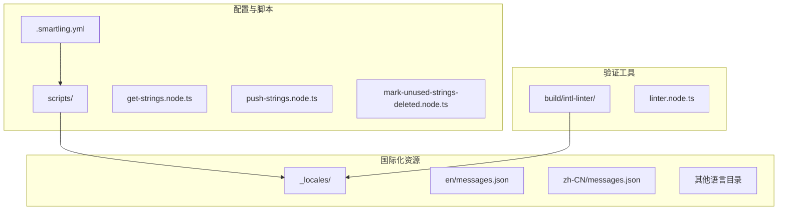

# 验证规则

<cite>
**本文档中引用的文件**   
- [.smartling.yml](file://.smartling.yml)
- [_locales/en/messages.json](file://_locales/en/messages.json)
- [_locales/zh-CN/messages.json](file://_locales/zh-CN/messages.json)
- [build/intl-linter/linter.node.ts](file://build/intl-linter/linter.node.ts)
- [ts/scripts/get-strings.node.ts](file://ts/scripts/get-strings.node.ts)
- [ts/scripts/push-strings.node.ts](file://ts/scripts/push-strings.node.ts)
- [ts/scripts/mark-unused-strings-deleted.node.ts](file://ts/scripts/mark-unused-strings-deleted.node.ts)
- [ts/util/smartling.node.ts](file://ts/util/smartling.node.ts)
</cite>

## 目录
1. [简介](#简介)
2. [项目结构](#项目结构)
3. [核心验证规则](#核心验证规则)
4. [技术实现机制](#技术实现机制)
5. [违规案例分析](#违规案例分析)
6. [语言特性定制策略](#语言特性定制策略)
7. [配置示例](#配置示例)
8. [结论](#结论)

## 简介
Signal-Desktop项目使用Smartling平台进行多语言翻译管理，通过.smartling.yml配置文件定义了严格的质量保证规则。这些规则确保了翻译内容的准确性、一致性和技术合规性。本文件详细解析了在.smartling.yml中定义的验证规则，包括拼写检查、术语一致性、字符限制、占位符验证和上下文匹配等关键方面。通过深入分析这些规则的技术实现机制，我们可以理解如何检测HTML标签完整性、变量占位符（如{count}）的正确使用以及特殊字符编码规范。这些规则有效防止了翻译中的常见错误，如截断、格式错乱和语义偏差。

**Section sources**
- [.smartling.yml](file://.smartling.yml#L1-L8)
- [README.md](file://README.md#L1-L46)

## 项目结构
Signal-Desktop项目的国际化资源存储在_locales目录下，每个语言都有独立的子目录，如af-ZA、ar、zh-CN等，每个子目录包含messages.json文件。这些文件使用ICU（International Components for Unicode）消息格式，支持复杂的语言结构和变量替换。项目根目录下的.smartling.yml文件定义了与Smartling平台集成的配置，包括账户ID、项目ID以及翻译路径的映射规则。scripts目录包含用于与Smartling API交互的脚本，如get-strings.node.ts用于获取最新翻译，push-strings.node.ts用于推送源字符串，mark-unused-strings-deleted.node.ts用于标记未使用的字符串。



**Diagram sources **
- [.smartling.yml](file://.smartling.yml#L1-L8)
- [_locales](file://_locales)
- [scripts](file://scripts)

**Section sources**
- [.smartling.yml](file://.smartling.yml#L1-L8)
- [_locales](file://_locales)
- [scripts](file://scripts)

## 核心验证规则
Signal-Desktop的翻译验证规则主要通过build/intl-linter/linter.node.ts中的静态分析工具实现。这些规则在代码提交时自动执行，确保所有翻译字符串符合预定义的质量标准。核心规则包括：

- **icuPrefix规则**：确保所有消息ID以"icu:"为前缀，这有助于在代码中统一识别和引用国际化字符串。
- **wrapEmoji规则**：要求所有表情符号必须包裹在<emojify>标签中，以确保在不同平台和设备上正确渲染。
- **noLegacyVariables规则**：禁止使用旧式的$variable$占位符语法，强制使用ICU标准的{variable}语法，提高一致性和可维护性。
- **noNestedChoice规则**：禁止嵌套选择格式（如select或plural），避免复杂且难以维护的翻译逻辑。
- **noOffset规则**：禁止在复数格式中使用offset，简化复数逻辑并减少错误。
- **noOneChoice规则**：要求复数格式必须包含"one"选项，确保单数情况得到正确处理。
- **noOrdinal规则**：禁止使用序数复数格式，因为其在不同语言中的实现差异较大。
- **onePlural规则**：限制每个消息中只能有一个复数格式，避免过度复杂的语言结构。
- **pluralPound规则**：要求复数格式中的"#"符号必须正确使用，确保数值替换的准确性。

这些规则共同构成了一个严格的验证框架，确保了翻译内容的技术正确性和一致性。

**Section sources**
- [build/intl-linter/linter.node.ts](file://build/intl-linter/linter.node.ts#L1-L222)
- [_locales/en/messages.json](file://_locales/en/messages.json#L1-L800)

## 技术实现机制
验证规则的技术实现主要依赖于对ICU消息格式的解析和静态分析。linter.node.ts脚本使用@formatjs/icu-messageformat-parser库解析messages.json文件中的messageformat字段，生成抽象语法树（AST）。然后，通过遍历AST，应用一系列预定义的规则来检查消息结构。

例如，noLegacyVariables规则通过搜索$variable$模式来检测旧式占位符；wrapEmoji规则检查消息中是否包含未包裹的表情符号；noNestedChoice规则通过分析AST的嵌套深度来检测嵌套的选择格式。这些规则在开发过程中作为linting步骤运行，任何违反规则的字符串都会导致构建失败，从而强制开发者修复问题。

此外，项目使用Smartling平台进行翻译管理，.smartling.yml文件中的配置指定了翻译路径和占位符格式。get-strings.node.ts和push-strings.node.ts脚本通过Smartling API与平台交互，自动化地推送源字符串和拉取翻译结果。mark-unused-strings-deleted.node.ts脚本定期扫描代码库，标记未使用的字符串，帮助维护翻译资源的整洁性。

**Section sources**
- [build/intl-linter/linter.node.ts](file://build/intl-linter/linter.node.ts#L1-L222)
- [ts/scripts/get-strings.node.ts](file://ts/scripts/get-strings.node.ts#L1-L153)
- [ts/scripts/push-strings.node.ts](file://ts/scripts/push-strings.node.ts#L1-L72)
- [ts/scripts/mark-unused-strings-deleted.node.ts](file://ts/scripts/mark-unused-strings-deleted.node.ts#L1-L77)

## 违规案例分析
以下是一些常见的违规案例及其分析：

- **嵌套选择格式**：消息"{a, plural, one {a} other {{b, plural, one {b} other {bs}}}}"违反了noNestedChoice和onePlural规则。这种结构难以翻译且容易出错，应重构为更简单的形式。
- **缺少单数选项**：消息"{a, plural, other {a}}"违反了noOneChoice规则。在英语中，"one"和"other"是必需的，缺少"one"会导致单数情况处理错误。
- **使用序数复数**：消息"{a, selectordinal, one {a} other {as}}"违反了noOrdinal规则。序数复数在不同语言中的规则差异很大，应避免使用。
- **旧式占位符**：消息"$a$"违反了noLegacyVariables规则。应改为"{a}"以符合ICU标准。
- **未包裹的表情符号**：消息"👩"违反了wrapEmoji规则。应改为"<emojify>👩</emojify>"以确保正确渲染。

这些案例展示了验证规则如何捕捉潜在的翻译问题，确保最终用户看到的文本是准确和一致的。

**Section sources**
- [build/intl-linter/linter.node.ts](file://build/intl-linter/linter.node.ts#L44-L95)
- [_locales/en/messages.json](file://_locales/en/messages.json#L1-L800)

## 语言特性定制策略
对于不同语言的特性，Signal-Desktop采用了一些定制化的策略。例如，在get-strings.node.ts脚本中，通过RENAMES映射处理了Smartling平台的错误语言标签，如将"zh-YU"重命名为"yue"，将"zh-TW"重命名为"zh-Hant"。这确保了语言标签的正确性和一致性。

对于从右到左（RTL）的语言，如阿拉伯语（ar），项目依赖于ICU库的内置支持来处理文本方向和布局。对于多字节字符的语言，如中文（zh-CN），项目通过ICU的复数和选择格式来处理复杂的语言结构。此外，通过gen-locales-config.node.ts脚本，项目使用@formatjs/intl-localematcher库来匹配和验证语言环境，确保用户界面显示正确的语言版本。

**Section sources**
- [ts/scripts/get-strings.node.ts](file://ts/scripts/get-strings.node.ts#L15-L31)
- [ts/scripts/gen-locales-config.node.ts](file://ts/scripts/gen-locales-config.node.ts#L1-L41)

## 配置示例
以下是一个典型的.smartling.yml配置示例：

```yaml
account_id: '92ff14ad'
project_id: 'ef62d1ebb'
```

以及messages.json中的消息格式示例：

```json
{
  "smartling": {
    "placeholder_format_custom": "(\\$.+?\\$)",
    "string_format_paths": "icu: [*/messageformat]",
    "translate_paths": [
      {
        "path": "*/messageformat",
        "key": "{*}/messageformat",
        "instruction": "*/description"
      },
      {
        "key": "{*}/message",
        "path": "*/message",
        "instruction": "*/description"
      }
    ]
  },
  "icu:AddUserToAnotherGroupModal__title": {
    "messageformat": "Add to a group",
    "description": "Shown as the title of the dialog that allows you to add a contact to an group"
  }
}
```

这些配置定义了与Smartling平台的集成方式和翻译内容的结构。

**Section sources**
- [.smartling.yml](file://.smartling.yml#L1-L8)
- [_locales/en/messages.json](file://_locales/en/messages.json#L1-L20)

## 结论
Signal-Desktop项目通过一套严格的翻译验证规则，确保了多语言支持的高质量和一致性。这些规则涵盖了从技术实现到语言特性的各个方面，有效防止了常见的翻译错误。通过自动化工具和静态分析，项目能够在开发过程中及时发现和修复问题，提高了软件的可靠性和用户体验。未来，可以进一步扩展这些规则，以支持更多语言特性和更复杂的翻译场景。