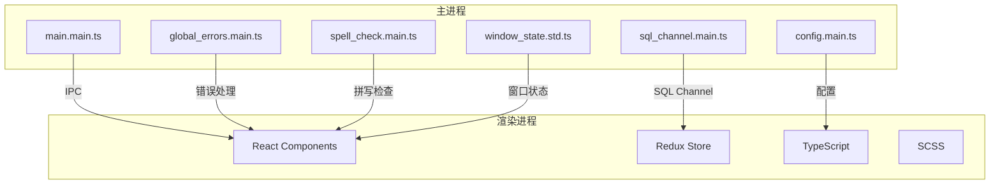

# 开发者指南

<cite>
**本文档中引用的文件**   
- [README.md](file://README.md)
- [CONTRIBUTING.md](file://CONTRIBUTING.md)
- [package.json](file://package.json)
- [pnpm-workspace.yaml](file://pnpm-workspace.yaml)
- [tsconfig.json](file://tsconfig.json)
- [app/main.main.ts](file://app/main.main.ts)
- [preload.wrapper.ts](file://preload.wrapper.ts)
- [config/default.json](file://config/default.json)
- [scripts/esbuild.js](file://scripts/esbuild.js)
- [dangerfile.js](file://dangerfile.js)
- [test/setup-test-node.js](file://test/setup-test-node.js)
- [scripts/prepare_alpha_build.js](file://scripts/prepare_alpha_build.js)
</cite>

## 目录
1. [简介](#简介)
2. [开发环境设置](#开发环境设置)
3. [运行和调试应用](#运行和调试应用)
4. [代码风格和提交规范](#代码风格和提交规范)
5. [贡献流程](#贡献流程)
6. [构建和发布](#构建和发布)
7. [测试策略](#测试策略)
8. [架构概述](#架构概述)
9. [常见问题和故障排除](#常见问题和故障排除)
10. [最佳实践](#最佳实践)

## 简介

Signal-Desktop 是一个基于 Electron 的桌面应用程序，为 Signal 移动应用提供桌面端消息功能。本指南旨在为开发者提供全面的开发环境设置、调试技巧和贡献指南，帮助新贡献者快速上手并有效参与项目开发。

该项目采用 TypeScript 和 React 技术栈，使用 pnpm 作为包管理器，esbuild 作为构建工具。应用程序遵循严格的代码质量和安全标准，所有贡献都需要通过全面的测试套件和代码审查流程。

**Section sources**
- [README.md](file://README.md#L1-L46)
- [CONTRIBUTING.md](file://CONTRIBUTING.md#L1-L325)

## 开发环境设置

### 基础依赖

要开始开发 Signal-Desktop，您需要安装以下基础依赖：

1. **Node.js**: 项目需要特定版本的 Node.js，您可以在 `.nvmrc` 文件中找到当前版本。推荐使用 nvm (Node Version Manager) 来管理 Node.js 版本。
2. **Git**: 用于代码版本控制和项目克隆。
3. **pnpm**: 项目使用的包管理器。

### 平台特定设置

#### macOS
安装 Xcode 命令行工具：
```bash
xcode-select --install
```

#### Windows
1. 下载并安装 Visual Studio 2022 Community Edition，包含 "使用 C++ 的桌面开发" 选项。
2. 安装 Python 3.6 或更高版本。

#### Linux
安装必要的构建工具：
```bash
# Ubuntu/Debian
sudo apt-get install python3 gcc g++ make

# Fedora/RHEL
sudo dnf install python3 gcc gcc-c++ make
```

### 项目设置

完成基础依赖安装后，按照以下步骤设置项目：

```bash
# 克隆仓库
git clone https://github.com/signalapp/Signal-Desktop.git
cd Signal-Desktop

# 安装 pnpm 并安装依赖
npm install -g pnpm
pnpm install

# 生成最终的 JS 和 CSS 资源
pnpm run generate

# 运行测试确保一切正常
pnpm test

# 启动 Signal 应用
pnpm start
```

### 开发模式

为了在开发过程中自动重新编译更改的文件，可以运行以下命令：

```bash
# 监听 .ts 文件更改并重新编译
pnpm run dev:transpile

# 监听 .scss 文件更改并重新编译
pnpm run dev:styles
```

这些命令可以在单独的终端实例中运行，它们会持续运行直到您停止它们，自动处理文件更改。

**Section sources**
- [CONTRIBUTING.md](file://CONTRIBUTING.md#L20-L77)
- [package.json](file://package.json#L18-L27)

## 运行和调试应用

### 启动应用

使用以下命令启动 Signal-Desktop 应用：

```bash
pnpm start
```

由于没有自动重启机制，您需要定期重启应用程序以查看更改。或者，您可以保持开发者工具打开，然后按以下快捷键重新加载：

- macOS: `Cmd + R`
- Windows & Linux: `Ctrl + R`

### 调试主进程

主进程的代码位于 `app/` 目录下，使用 TypeScript 编写。主进程负责管理应用程序的生命周期、窗口创建和系统集成。

要调试主进程，您可以：

1. 在代码中添加 `console.log` 语句
2. 使用 Electron 的调试功能
3. 查看应用程序日志

主进程的入口文件是 `app/main.main.ts`，它初始化了应用程序并创建主窗口。

### 调试渲染进程

渲染进程运行在 Electron 的渲染器上下文中，使用 React 和 TypeScript 构建用户界面。渲染进程的代码主要位于 `ts/` 目录下。

要调试渲染进程：

1. 打开开发者工具 (`View > Toggle Developer Tools`)
2. 使用浏览器开发者工具的标准功能进行调试
3. 利用 React DevTools 进行组件调试

### 环境配置

Signal-Desktop 使用不同的配置文件来管理不同环境的设置。主要配置文件位于 `config/` 目录下：

- `default.json`: 默认配置，通常指向 staging 服务器
- `development.json`: 开发环境配置
- `production.json`: 生产环境配置
- `staging.json`: 预发布环境配置

您可以通过创建 `local-development.json` 文件来覆盖默认配置，例如连接到生产服务器进行测试。

### 开发服务器

对于使用 webpack 的应用部分（如贴纸创建器），您可以运行开发服务器：

```bash
pnpm run dev
```

要使应用能够向开发服务器发出请求，需要设置 `SIGNAL_ENABLE_HTTP` 环境变量：

```bash
SIGNAL_ENABLE_HTTP=1 pnpm start
```

**Section sources**
- [CONTRIBUTING.md](file://CONTRIBUTING.md#L59-L135)
- [app/main.main.ts](file://app/main.main.ts#L1-L800)
- [config/default.json](file://config/default.json#L1-L36)

## 代码风格和提交规范

### 代码风格指南

Signal-Desktop 遵循严格的代码风格指南，确保代码的一致性和可维护性：

1. **TypeScript**: 项目使用 TypeScript 5.6.3，配置在 `tsconfig.json` 中
2. **ESLint**: 使用 ESLint 进行代码质量检查，配置在 `.eslintrc.js` 中
3. **Prettier**: 使用 Prettier 进行代码格式化，配置在 `.prettierrc.js` 中
4. **Stylelint**: 使用 Stylelint 检查 SCSS 文件，配置在 `.stylelintrc.js` 中

### 提交规范

为了保持提交历史的清晰和一致性，项目遵循以下提交规范：

1. **提交消息格式**: 遵循 [Conventional Commits](https://www.conventionalcommits.org/) 规范
2. **提交内容**: 每个提交应该包含单一、明确的功能或修复
3. **代码注释**: 添加必要的注释来解释复杂的逻辑或决策

### 贡献流程

1. **小规模更改**: 提交的 PR 越小，越容易审查和合并
2. **沟通**: 在开始工作前，先在相关 issue 中讨论您的想法
3. **分支管理**: 基于 `main` 分支创建功能分支
4. **代码审查**: 所有贡献都需要通过代码审查

### 拉取请求指南

提交拉取请求时，请遵守以下指南：

- 确保 `pnpm run ready` 命令通过
- 不要提交翻译修复的 PR
- 不要在源代码中直接使用字符串，而是从 `messages.json` 中提取
- 将更改基于最新的 `main` 分支进行变基
- 添加并运行测试
- 确保差异只包含实现功能或修复 bug 所需的最小更改集
- 避免无意义或过于细粒度的提交
- 提供格式良好的提交消息，包括：
  - 您更改了什么
  - 为什么进行此更改
  - 任何相关的技术细节或实现选择

**Section sources**
- [CONTRIBUTING.md](file://CONTRIBUTING.md#L220-L257)
- [package.json](file://package.json#L57-L63)
- [tsconfig.json](file://tsconfig.json#L1-L242)

## 贡献流程

### 新贡献者建议

对于新贡献者，我们建议：

1. **从小处着手**: 提交小而易于审查的更改，有明确和具体的目的
2. **评估兴趣**: 通过找到相关 issue 或创建新 issue 来评估您工作的兴趣度
3. **沟通意图**: 在 issue 中表明您的意图并获取反馈
4. **讨论方法**: 在规划解决方案后，回到 issue 讨论您的方法

### 设置独立设备

默认情况下，应用程序将连接到 staging 服务器，这意味着您**无法**将其与您的主要移动设备配对。

不用担心！您不需要将应用与手机配对。在二维码屏幕中，您可以从文件菜单中选择"设置为独立设备"，这将像在手机上一样完成注册过程。

注意：您将不会链接到主要手机，这将使测试某些功能变得非常困难（联系人、个人资料和群组均由您的手机单独管理）。

### 使用 staging 环境

默认设置会导致没有联系人和消息历史记录的完全空白的应用程序。但您可以使用生产版 Signal-Desktop 的信息来填充您的测试应用程序！

1. 退出生产和开发应用程序（在 macOS 上 - 完全退出应用程序）
2. 在 [appData](https://www.electronjs.org/docs/latest/api/app#appgetpathname) 目录中找到您的应用程序数据：
   - macOS: `~/Library/Application Support/Signal`
   - Linux: `~/.config/Signal`
   - Windows 10: `C:\Users\<YourName>\AppData\Roaming\Signal`
3. 将此生产数据目录复制到同一目录中（作为 Signal 目录的同级目录），并将其命名为 `Signal-development`
4. 像平常一样启动开发版应用程序，您将看到所有联系人和消息！

您会注意到重新链接的提示，因为您的生产凭据在 staging 上不起作用。单击"重新链接"，然后选择"独立"，验证电话号码并单击"发送短信"。

一旦您输入了发送到您手机的确认码，您就注册为具有正常电话号码的独立 staging 设备，并拥有生产消息历史记录和联系人列表的副本。

### 额外存储配置文件

为了进行适当的测试，您需要额外的电话号码来注册额外的独立设备。您可以通过 [Twilio](https://www.twilio.com/) 或 [Google Voice](https://voice.google.com/) 获取它们。

一旦您有了额外的号码，您可以使用 `NODE_APP_INSTANCE` 环境变量设置额外的存储配置文件并在它们之间切换。

例如，要创建"alice"配置文件，请在项目的 `/config` 子目录中创建一个名为 `local-alice.json` 的文件：

```json
{
  "storageProfile": "aliceProfile"
}
```

然后您可以这样启动应用程序以加载配置文件：

```bash
NODE_APP_INSTANCE=alice pnpm start
```

这会将 `userData` 目录从 `%appData%/Signal` 更改为 `%appData%/Signal-aliceProfile`。

**Section sources**
- [CONTRIBUTING.md](file://CONTRIBUTING.md#L136-L203)
- [package.json](file://package.json#L585-L586)

## 构建和发布

### 构建系统

Signal-Desktop 使用 esbuild 作为主要的构建工具，配置在 `scripts/esbuild.js` 中。构建系统负责：

1. 编译 TypeScript 代码
2. 打包 JavaScript 模块
3. 生成预加载脚本
4. 处理静态资源

主要的构建脚本包括：

- `generate`: 生成最终的 JS 和 CSS 资产
- `build`: 构建生产版本
- `build:release`: 构建可发布的版本

### 构建配置

构建配置在 `package.json` 的 `build` 字段中定义，包括：

- 应用程序 ID
- 平台特定的配置（macOS、Windows、Linux）
- 图标和启动画面
- 发布配置

### 发布流程

要测试构建系统的更改，可以使用以下命令构建发布版本：

```bash
pnpm run generate
pnpm run build
```

然后使用 `pnpm run test-release` 运行测试。

#### 测试 macOS 构建

macOS 需要使用 Apple 证书对应用程序进行代码签名。要测试开发构建，您可以对打包的应用程序进行临时签名，以便在本地运行：

1. 在 `package.json` 中移除 macOS 签名脚本：`"sign": "./ts/scripts/sign-macos.node.js",`
2. 构建应用程序并对应用程序包进行临时签名：

```bash
pnpm run generate
pnpm run build
cd release
# 选择所需的应用程序包：mac、mac-arm64 或 mac-universal
cd mac-arm64
codesign --force --deep --sign - Signal.app
```

3. 现在您可以在本地运行应用程序。

### 版本准备脚本

项目包含多个脚本用于准备不同类型的构建：

- `prepare_alpha_build.js`: 准备 alpha 版本构建
- `prepare_beta_build.js`: 准备 beta 版本构建
- `prepare_staging_build.js`: 准备 staging 版本构建
- `prepare_linux_build.js`: 准备 Linux 版本构建

这些脚本会修改 `package.json` 中的字段，以支持并排安装不同版本的应用程序。

**Section sources**
- [scripts/esbuild.js](file://scripts/esbuild.js#L1-L233)
- [package.json](file://package.json#L429-L708)
- [scripts/prepare_alpha_build.js](file://scripts/prepare_alpha_build.js#L1-L82)

## 测试策略

### 测试框架

Signal-Desktop 使用以下测试框架：

- **Mocha**: 主要的测试框架
- **Chai**: 断言库
- **Electron-Mocha**: 用于 Electron 应用的测试运行器

### 测试类型

项目包含多种类型的测试：

1. **单元测试**: 测试单个函数或类的行为
2. **集成测试**: 测试多个组件之间的交互
3. **端到端测试**: 测试整个应用程序的工作流程
4. **性能测试**: 测试关键功能的性能

### 运行测试

您可以使用以下命令运行测试：

```bash
# 运行所有测试
pnpm test

# 运行节点测试
pnpm run test-node

# 运行 Electron 测试
pnpm run test-electron

# 运行 ESLint 检查
pnpm run test-eslint

# 运行国际化检查
pnpm run test-lint-intl
```

### 测试设置

测试设置文件 `test/setup-test-node.js` 配置了测试环境，包括：

- 设置测试环境变量
- 模拟全局对象（如 `window` 和 `navigator`）
- 配置测试特定的依赖项

### 测试最佳实践

1. **编写测试**: 请为您的更改编写测试！
2. **测试覆盖率**: 确保关键路径有足够的测试覆盖
3. **可重现性**: 确保测试在不同环境中可重现
4. **性能**: 避免过于耗时的测试

### 持续集成

项目的持续集成服务器会执行与 `pnpm run ready` 类似的测试，包括：

- 代码风格检查
- 类型检查
- 单元测试
- 集成测试

**Section sources**
- [CONTRIBUTING.md](file://CONTRIBUTING.md#L208-L217)
- [package.json](file://package.json#L49-L56)
- [test/setup-test-node.js](file://test/setup-test-node.js#L1-L54)

## 架构概述

### 项目结构

Signal-Desktop 的项目结构组织良好，主要目录包括：

- `_locales/`: 国际化消息文件
- `app/`: Electron 主进程代码
- `components/`: 第三方组件
- `config/`: 应用程序配置
- `danger/`: Danger CI 工具配置
- `fixtures/`: 测试数据
- `js/`: JavaScript 工具和库
- `packages/`: 本地 npm 包
- `patches/`: 依赖项补丁
- `protos/`: Protocol Buffer 定义
- `reproducible-builds/`: 可重现构建配置
- `scripts/`: 构建和工具脚本
- `sticker-creator/`: 贴纸创建器应用
- `stylesheets/`: 样式表
- `test/`: 测试文件
- `ts/`: TypeScript 源代码

### 主进程架构

主进程负责管理应用程序的生命周期和系统集成。主要组件包括：

- `main.main.ts`: 应用程序入口点
- `config.main.ts`: 配置管理
- `global_errors.main.ts`: 全局错误处理
- `spell_check.main.ts`: 拼写检查
- `sql_channel.main.ts`: SQL 通道通信
- `window_state.std.ts`: 窗口状态管理

### 渲染进程架构

渲染进程运行在 Electron 的渲染器上下文中，使用 React 构建用户界面。主要架构特点包括：

- **React**: 用于构建用户界面
- **Redux**: 用于状态管理
- **TypeScript**: 用于类型安全
- **SCSS**: 用于样式设计

### 数据流

应用程序的数据流遵循单向数据流原则：

1. 用户交互触发动作
2. 动作被分派到 Redux store
3. Reducer 处理动作并更新状态
4. 组件根据新状态重新渲染

### 通信机制

主进程和渲染进程之间通过 Electron 的 IPC（进程间通信）机制进行通信：

- `ipcMain`: 主进程中的 IPC 接口
- `ipcRenderer`: 渲染进程中的 IPC 接口
- 自定义通道用于特定功能（如 SQL 通道）



**Diagram sources **
- [app/main.main.ts](file://app/main.main.ts#L1-L800)
- [ts/](file://ts/#L1-L242)

**Section sources**
- [app/main.main.ts](file://app/main.main.ts#L1-L800)
- [ts/](file://ts/#L1-L242)

## 常见问题和故障排除

### 已知问题

#### yarn install 打印错误 'Could not detect abi for version 30.0.6 and runtime electron'

`yarn install` 可能会打印类似以下的错误，但由于整体操作成功，可以忽略：

```
$ ./node_modules/.bin/electron-builder install-app-deps
  • electron-builder  version=24.6.3
  • loaded configuration  file=package.json ("build" field)
  • rebuilding native dependencies  dependencies=@nodert-win10-rs4/windows.data.xml.dom@0.4.4, ...
  • install prebuilt binary  name=mac-screen-capture-permissions version=2.0.0 platform=linux arch=x64 napi=
  • build native dependency from sources  name=mac-screen-capture-permissions
                                          version=2.0.0
                                          platform=linux
                                          arch=x64
                                          napi=
                                          reason=prebuild-install failed with error (run with env DEBUG=electron-builder to get more information)
                                          error=/home/ben/sauce/Signal-Desktop/node_modules/node-abi/index.js:30
      throw new Error('Could not detect abi for version ' + target + ' and runtime ' + runtime + '.  Updating "node-abi" might help solve this issue if it is a new release of ' + runtime)
      ^
    Error: Could not detect abi for version 30.0.6 and runtime electron.  Updating "node-abi" might help solve this issue if it is a new release of electron
```

### 常见错误和解决方案

#### 依赖安装问题

如果遇到依赖安装问题，请尝试：

1. 清理 pnpm 缓存：`pnpm store prune`
2. 删除 `node_modules` 目录并重新安装：`rm -rf node_modules && pnpm install`
3. 确保使用正确的 Node.js 版本

#### 构建问题

如果遇到构建问题，请检查：

1. 确保所有依赖已正确安装
2. 检查 `tsconfig.json` 配置是否正确
3. 确保 esbuild 配置正确

#### 运行时错误

如果遇到运行时错误，请：

1. 检查开发者工具中的控制台输出
2. 查看应用程序日志
3. 确保配置文件正确

### 调试技巧

1. **使用开发者工具**: 打开开发者工具查看控制台输出和网络请求
2. **添加日志**: 在关键位置添加 `console.log` 语句
3. **断点调试**: 使用调试器设置断点
4. **检查网络请求**: 查看 API 调用是否正常

### 性能优化

1. **代码分割**: 使用代码分割减少初始加载时间
2. **懒加载**: 懒加载非关键资源
3. **缓存**: 合理使用缓存
4. **性能监控**: 使用性能监控工具识别瓶颈

**Section sources**
- [CONTRIBUTING.md](file://CONTRIBUTING.md#L79-L116)

## 最佳实践

### 代码质量

1. **类型安全**: 充分利用 TypeScript 的类型系统
2. **代码复用**: 避免重复代码，创建可复用的组件和函数
3. **单一职责**: 每个函数或类应该只有一个职责
4. **可测试性**: 编写易于测试的代码

### 安全性

1. **输入验证**: 始终验证用户输入
2. **XSS 防护**: 防止跨站脚本攻击
3. **CSRF 防护**: 防止跨站请求伪造
4. **安全配置**: 确保安全相关的配置正确

### 性能

1. **优化渲染**: 减少不必要的重新渲染
2. **内存管理**: 避免内存泄漏
3. **异步操作**: 合理使用异步操作
4. **资源管理**: 有效管理资源加载

### 可维护性

1. **文档**: 为复杂的逻辑添加注释和文档
2. **命名**: 使用有意义的变量和函数名
3. **模块化**: 将代码组织成逻辑模块
4. **版本控制**: 合理使用 Git 进行版本控制

### 团队协作

1. **代码审查**: 积极参与代码审查
2. **沟通**: 保持良好的沟通
3. **知识共享**: 分享知识和经验
4. **持续学习**: 不断学习新技术和最佳实践

通过遵循这些最佳实践，您可以帮助确保 Signal-Desktop 保持高质量、安全和可维护性，为用户提供卓越的体验。

**Section sources**
- [CONTRIBUTING.md](file://CONTRIBUTING.md#L220-L257)
- [package.json](file://package.json#L57-L63)
- [tsconfig.json](file://tsconfig.json#L1-L242)