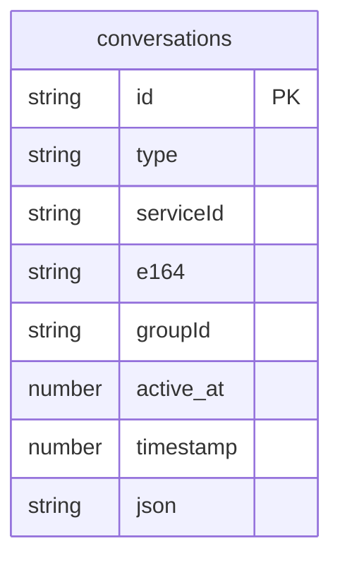

# 会话模型

<cite>
**本文档引用的文件**
- [conversations.preload.ts](file://ts/models/conversations.preload.ts)
- [model-types.d.ts](file://ts/model-types.d.ts)
- [Server.node.ts](file://ts/sql/Server.node.ts)
- [Interface.std.ts](file://ts/sql/Interface.std.ts)
- [1220-blob-sessions.node.ts](file://ts/sql/migrations/1220-blob-sessions.node.ts)
- [sessionTranslation.node.ts](file://ts/util/sessionTranslation.node.ts)
</cite>

## 目录
1. [引言](#引言)
2. [会话实体字段定义](#会话实体字段定义)
3. [数据库模式与约束](#数据库模式与约束)
4. [会话验证规则与业务逻辑](#会话验证规则与业务逻辑)
5. [数据访问模式与性能优化](#数据访问模式与性能优化)
6. [数据生命周期与迁移策略](#数据生命周期与迁移策略)
7. [安全与访问控制](#安全与访问控制)
8. [结论](#结论)

## 引言

Signal-Desktop的会话模型是整个应用的核心数据结构，它不仅代表了用户之间的通信渠道（一对一私聊或群组），还承载了丰富的元数据和业务规则。本文档旨在全面解析会话模型的内部结构、数据关系、业务逻辑以及性能考量，为开发者提供一份详尽的参考。

会话模型在Signal-Desktop中通过`ConversationModel`类实现，该类封装了与会话相关的所有属性和行为。会话数据持久化在SQLite数据库中，其结构设计兼顾了查询效率和数据完整性。会话模型与消息、用户资料、群组管理等多个子系统紧密耦合，是理解Signal应用架构的关键。

**Section sources**
- [conversations.preload.ts](file://ts/models/conversations.preload.ts#L300-L363)
- [model-types.d.ts](file://ts/model-types.d.ts#L349-L528)

## 会话实体字段定义

会话实体（`ConversationAttributesType`）包含了一系列核心属性，这些属性定义了会话的类型、状态、成员信息和配置。

### 核心标识与类型
- **id**: 会话的唯一标识符，一个字符串。
- **type**: 会话类型，枚举值为`private`（私聊）或`group`（群组）。
- **serviceId**: 用户的Service ID，用于标识用户，是`AciString`或`PniString`类型。
- **e164**: 用户的电话号码（E.164格式），用于传统电话号码标识。
- **groupId**: 群组会话的唯一标识符，仅在`type`为`group`时存在。

### 基本信息与元数据
- **name**: 会话名称，对于私聊会话，通常为联系人姓名；对于群组会话，则为群组名称。
- **profileName**: 联系人的个人资料名称。
- **about**: 联系人的个人简介。
- **aboutEmoji**: 与个人简介关联的表情符号。
- **active_at**: 会话最后活跃的时间戳，用于排序。
- **timestamp**: 会话创建的时间戳。
- **version**: 会话数据的版本号，用于数据迁移和同步。

### 私聊会话特有字段
- **serviceId**: 对方用户的Service ID。
- **e164**: 对方用户的电话号码。
- **username**: 对方用户的用户名。
- **profileKey**: 用于加密个人资料的密钥。
- **verified**: 用户身份验证状态。

### 群组会话特有字段
- **groupId**: 群组ID。
- **groupVersion**: 群组版本号，用于追踪群组变更。
- **masterKey**: 群组主密钥，用于派生其他密钥。
- **secretParams** / **publicParams**: 与群组加密相关的参数。
- **revision**: 群组配置的修订版本号。
- **membersV2**: V2群组成员列表，包含成员的Service ID、角色和加入时间。
- **pendingMembersV2**: 待定成员列表（等待管理员批准）。
- **bannedMembersV2**: 被封禁成员列表。
- **accessControl**: 访问控制策略，定义谁可以修改群组信息、添加成员等。
- **announcementsOnly**: 是否为仅管理员可发言的群组。
- **expireTimer**: 消息自动消失计时器的时长（秒）。
- **expireTimerVersion**: 消息自动消失计时器的版本号。

### 状态与计数
- **isArchived**: 会话是否已归档。
- **isPinned**: 会话是否已置顶。
- **unreadCount**: 未读消息数量。
- **messageCount**: 总消息数量。
- **sharedGroupNames**: 共享的群组名称列表。
- **lastMessage**: 最后一条消息的内容摘要。
- **lastMessageReceivedAt**: 最后一条消息的接收时间。
- **lastMessageStatus**: 最后一条消息的发送状态（如“发送中”、“已送达”）。
- **markedUnread**: 会话是否被手动标记为未读。

### 配置与偏好
- **draft**: 当前会话的草稿内容。
- **draftTimestamp**: 草稿最后修改的时间戳。
- **draftBodyRanges**: 草稿中的格式化信息（如加粗、链接）。
- **muteExpiresAt**: 免打扰模式的过期时间戳。
- **dontNotifyForMentionsIfMuted**: 在免打扰模式下是否仍通知提及。
- **storySendMode**: 故事发送模式。
- **color**: 会话的自定义颜色。
- **conversationColor**: 会话颜色类型。
- **customColor**: 自定义颜色值。
- **customColorId**: 自定义颜色ID。

**Section sources**
- [model-types.d.ts](file://ts/model-types.d.ts#L349-L528)

## 数据库模式与约束

### 数据库表结构
会话数据主要存储在名为`conversations`的数据库表中。该表的设计遵循了“宽表”模式，将大部分会话属性序列化为一个JSON字符串存储在`json`列中，同时将一些高频查询的字段（如`id`, `type`, `serviceId`, `groupId`, `active_at`等）作为独立列存储，以优化查询性能。

**Diagram sources**
- [Server.node.ts](file://ts/sql/Server.node.ts#L1992-L1996)
- [Interface.std.ts](file://ts/sql/Interface.std.ts#L310-L314)

### 主键与外键约束
- **主键 (Primary Key)**: `conversations`表的主键是`id`字段，确保了每个会话的唯一性。
- **外键 (Foreign Key)**: 在Signal-Desktop的会话模型中，`conversations`表是核心表，其他表（如`messages`）通过`conversationId`字段引用此表的`id`作为外键，建立消息与会话的关系。

### 索引设计
为了优化查询性能，数据库为`conversations`表创建了多个索引：
- **按会话ID索引**: `PRIMARY KEY (id)`，用于通过ID快速查找会话。
- **按活跃时间索引**: `INDEX (active_at)`，用于按时间顺序获取会话列表（如会话列表排序）。
- **按类型和ID索引**: `INDEX (type, id)`，用于快速筛选特定类型的会话。
- **按Service ID索引**: `INDEX (serviceId)`，用于通过用户Service ID查找其相关的会话。
- **按群组ID索引**: `INDEX (groupId)`，用于通过群组ID查找群组会话。

这些索引确保了在大型数据集上进行常见查询时的高效性。

**Section sources**
- [Server.node.ts](file://ts/sql/Server.node.ts#L1992-L1996)
- [Interface.std.ts](file://ts/sql/Interface.std.ts#L310-L314)

## 会话验证规则与业务逻辑

### 会话验证规则
在创建或更新会话时，系统会执行一系列验证规则以确保数据的完整性和一致性：
- **标识符验证**: `id`必须为非空字符串。`serviceId`和`e164`必须符合各自的格式规范。
- **类型验证**: `type`字段必须是`private`或`group`之一。
- **群组完整性**: 对于群组会话，`groupId`必须存在且唯一。`membersV2`列表中的每个成员都必须有有效的`aci`和`role`。
- **状态一致性**: `expireTimer`和`expireTimerVersion`必须同步更新。当`left`字段为`true`时，用户应从`membersV2`列表中移除。

### 群组管理业务规则
- **成员管理**: 只有管理员可以添加或移除成员。普通成员可以通过链接加入，但需要管理员批准。
- **权限变更**: 群组权限（如`accessControl`）的变更需要管理员权限，并会生成一条群组变更消息。
- **消息消失**: 当`expireTimer`被设置时，所有新消息都会在指定时间后自动消失。该设置会同步到所有成员。
- **仅管理员发言**: 当`announcementsOnly`为`true`时，只有管理员可以发送消息。

### 状态转换逻辑
会话的状态会随着用户操作和系统事件而动态变化：
- **活跃状态**: 当收到新消息或用户发送消息时，`active_at`会被更新为当前时间戳。
- **未读状态**: 当收到新消息且会话未被打开时，`unreadCount`会递增。当用户打开会话时，`unreadCount`会被清零。
- **归档状态**: 用户可以手动归档会话，此时`isArchived`变为`true`，会话会从主列表移至归档列表。
- **免打扰状态**: 用户可以设置免打扰模式，`muteExpiresAt`记录了免打扰的结束时间。

**Section sources**
- [conversations.preload.ts](file://ts/models/conversations.preload.ts#L590-L608)
- [conversations.preload.ts](file://ts/models/conversations.preload.ts#L610-L658)

## 数据访问模式与性能优化

### 增删改查访问模式
- **创建 (Create)**: 通过`ConversationController.getOrCreate()`方法创建新会话。该方法会检查会话是否已存在，若不存在则创建并保存。
- **读取 (Read)**: 通过`DataReader.getConversationById()`或`DataReader.getAllConversations()`从数据库读取会话数据。读取后，数据会被反序列化并用于实例化`ConversationModel`对象。
- **更新 (Update)**: 通过`ConversationModel.set()`方法修改会话属性，然后调用`DataWriter.updateConversation()`将变更持久化到数据库。系统使用批处理（batching）机制来合并短时间内对同一会话的多次更新，减少数据库写入次数。
- **删除 (Delete)**: 通过`DataWriter.removeConversation()`从数据库中删除会话记录。

### 缓存策略
Signal-Desktop在内存中维护了一个`ConversationController`，它充当了会话数据的缓存层。所有对会话的访问都优先通过这个控制器进行，避免了频繁的数据库查询。当数据库中的会话数据发生变化时，控制器会收到通知并更新其缓存。

### 大型会话处理策略
对于成员众多的大型群组会话，Signal-Desktop采取了以下策略来优化性能：
- **惰性加载**: 成员列表（`membersV2`）等大型数据结构不会在每次读取会话时都加载，而是在需要时才从数据库获取。
- **分页查询**: 在获取会话的历史消息时，使用分页机制（如`getOlderMessagesByConversation`），每次只加载固定数量（如30条）的消息，避免一次性加载过多数据导致内存溢出。
- **索引优化**: 如前所述，精心设计的索引确保了在大型会话中查找特定消息或成员的效率。

**Section sources**
- [conversations.preload.ts](file://ts/models/conversations.preload.ts#L515-L518)
- [Server.node.ts](file://ts/sql/Server.node.ts#L2000-L2008)
- [Client.preload.ts](file://ts/sql/Client.preload.ts#L518-L534)

## 数据生命周期与迁移策略

### 数据生命周期与保留策略
会话数据的生命周期与用户账户绑定。只要用户账户存在，其会话数据就会被保留。Signal-Desktop没有自动删除旧会话的策略，用户可以手动删除或归档会话。归档的会话仍然保留在数据库中，但不会显示在主列表中。

### 归档规则
用户可以将不常用的会话归档。归档的会话会被移动到一个专门的“已归档”列表中。当归档的会话收到新消息时，它会自动从归档列表中移出，回到主会话列表。

### 数据迁移路径与版本管理
Signal-Desktop使用基于版本号的数据库迁移系统。每次数据库模式变更都会对应一个迁移脚本（位于`ts/sql/migrations/`目录下）。
- **版本管理**: `conversations`表中的`version`字段记录了每条会话数据的版本。当应用启动时，会检查当前数据库模式版本，并按顺序执行所有未执行的迁移脚本。
- **迁移示例**: 例如，`1220-blob-sessions.node.ts`是一个迁移脚本，它将旧的会话记录（存储为JSON字符串）转换为新的二进制Blob格式，以提高加密和序列化的效率。这个过程涉及读取旧数据、使用`sessionTranslation.node.ts`中的工具函数进行转换，然后写入新格式的数据。
- **向后兼容**: 迁移脚本设计为幂等的，可以安全地重复执行。系统会确保在迁移过程中数据的完整性和一致性。

**Section sources**
- [1220-blob-sessions.node.ts](file://ts/sql/migrations/1220-blob-sessions.node.ts)
- [sessionTranslation.node.ts](file://ts/util/sessionTranslation.node.ts)
- [model-types.d.ts](file://ts/model-types.d.ts#L447)

## 安全与访问控制

### 数据安全
- **端到端加密**: 会话中的所有消息都使用Signal协议进行端到端加密。会话模型本身存储的元数据（如名称、成员列表）也受到保护。
- **本地加密**: 存储在本地设备上的数据库文件是加密的，防止未经授权的物理访问。
- **敏感信息保护**: 如`profileKey`等敏感密钥信息在存储时会进行额外的加密处理。

### 隐私要求
- **最小化数据收集**: Signal-Desktop遵循最小化数据收集原则，会话模型中不存储不必要的用户信息。
- **匿名化**: 在日志记录和错误报告中，会话ID等标识符会被匿名化处理，以保护用户隐私。

### 访问控制机制
- **应用内权限**: 应用内部通过代码逻辑实现访问控制。例如，只有会话的管理员才能修改群组设置。
- **数据库访问**: 数据库文件的访问受到操作系统权限的限制，只有Signal应用本身可以读写。
- **同步服务**: 当与Signal的存储服务同步时，会话数据的同步受到用户账户凭据的保护，确保只有授权设备才能访问数据。

**Section sources**
- [conversations.preload.ts](file://ts/models/conversations.preload.ts#L108-L112)
- [sessionTranslation.node.ts](file://ts/util/sessionTranslation.node.ts#L75-L78)

## 结论

Signal-Desktop的会话模型是一个设计精良、功能丰富的数据结构，它成功地平衡了功能需求、性能要求和安全隐私。通过对会话实体的详细定义、高效的数据库模式、严谨的业务规则和强大的安全机制，Signal为用户提供了一个可靠、快速且私密的通信体验。理解这个模型对于开发、维护和扩展Signal应用至关重要。