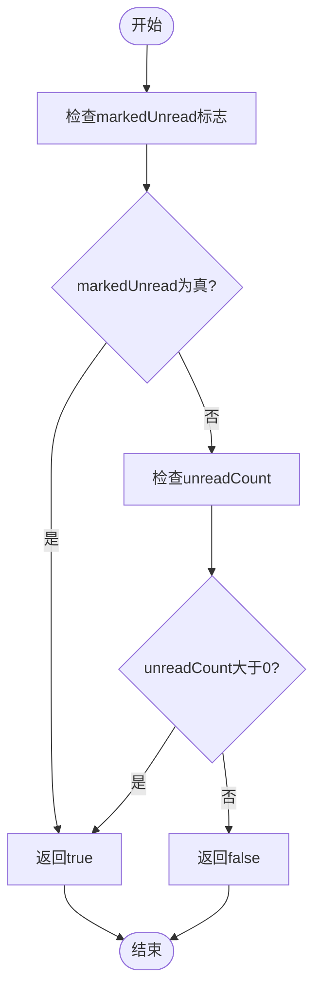
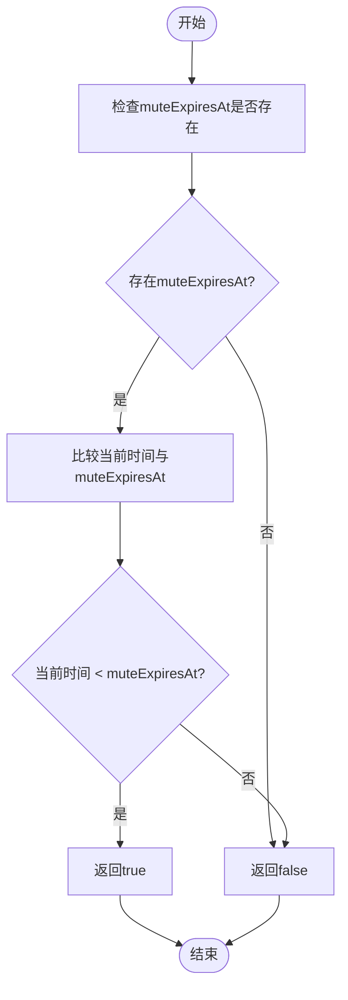
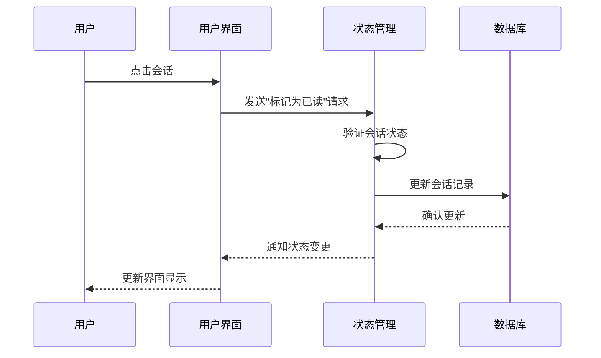
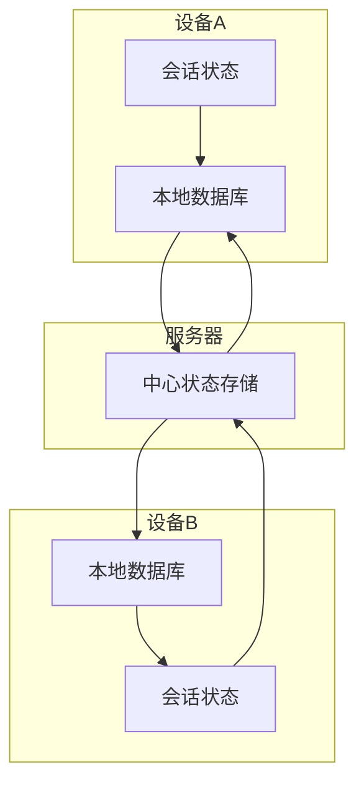

# 会话状态

<cite>
**本文档引用的文件**   
- [conversations.preload.ts](file://ts/state/ducks/conversations.preload.ts)
- [conversationsEnums.std.ts](file://ts/state/ducks/conversationsEnums.std.ts)
- [conversations.preload.ts](file://ts/models/conversations.preload.ts)
- [isConversationUnread.std.ts](file://ts/util/isConversationUnread.std.ts)
- [isConversationMuted.std.ts](file://ts/util/isConversationMuted.std.ts)
- [countUnreadStats.std.ts](file://ts/util/countUnreadStats.std.ts)
- [model-types.d.ts](file://ts/model-types.d.ts)
- [conversations.dom.ts](file://ts/state/selectors/conversations.dom.ts)
</cite>

## 目录
1. [引言](#引言)
2. [会话状态属性定义](#会话状态属性定义)
3. [状态变更处理流程](#状态变更处理流程)
4. [状态同步机制](#状态同步机制)
5. [性能优化策略](#性能优化策略)
6. [查询模式与索引使用](#查询模式与索引使用)
7. [代码示例](#代码示例)
8. [结论](#结论)

## 引言
Signal-Desktop的会话状态管理是整个应用的核心功能之一，负责维护用户与联系人或群组之间的交互状态。本文档全面阐述了会话的各种状态属性、变更处理流程、同步机制以及性能优化策略。会话状态不仅影响用户界面的显示，还决定了消息通知、数据同步等关键功能的行为。通过深入分析核心代码文件，本文档为开发者提供了对会话状态管理机制的全面理解。

**Section sources**
- [conversations.preload.ts](file://ts/state/ducks/conversations.preload.ts#L1-L100)

## 会话状态属性定义
会话状态由多个关键属性组成，这些属性定义了会话的行为和显示特征。核心属性包括未读消息计数、静音状态、置顶状态、归档状态和最后活动时间等。

### 未读消息计数
未读消息计数通过`unreadCount`和`markedUnread`两个字段共同管理。`unreadCount`表示实际未读消息的数量，而`markedUnread`是一个布尔标志，表示会话是否被手动标记为未读状态。判断会话是否未读的逻辑在`isConversationUnread`函数中实现：



**Diagram sources **
- [isConversationUnread.std.ts](file://ts/util/isConversationUnread.std.ts#L8-L15)

### 静音状态
静音状态通过`muteExpiresAt`字段管理，该字段存储一个时间戳，表示静音状态的过期时间。如果当前时间小于`muteExpiresAt`，则会话处于静音状态。`isConversationMuted`函数实现了这一逻辑：



**Diagram sources **
- [isConversationMuted.std.ts](file://ts/util/isConversationMuted.std.ts#L6-L9)

### 置顶状态
置顶状态由`isPinned`布尔字段表示。当`isPinned`为`true`时，会话会在会话列表中置顶显示。置顶会话的数量有限制，最多只能有4个会话被置顶。

### 归档状态
归档状态由`isArchived`布尔字段管理。归档的会话不会显示在主会话列表中，而是被移动到归档列表。归档状态的管理考虑了静音设置，如果用户启用了"保持静音会话归档"选项，则静音会话在被取消归档后会自动重新归档。

### 最后活动时间
最后活动时间由`active_at`字段记录，表示会话中最后一条消息的时间戳。这个时间戳用于会话列表的排序，确保最近活跃的会话显示在前面。

**Section sources**
- [model-types.d.ts](file://ts/model-types.d.ts#L386-L423)
- [conversations.preload.ts](file://ts/state/ducks/conversations.preload.ts#L319-L372)

## 状态变更处理流程
会话状态的变更通过一系列预定义的流程进行处理，确保状态的一致性和正确性。

### 未读计数更新
未读计数的更新通常在以下情况下触发：
- 接收到新消息时
- 用户阅读消息时
- 会话被手动标记为已读或未读时

更新流程首先检查会话是否应该计入未读统计，然后根据消息的读取状态更新计数。`countConversationUnreadStats`函数负责计算单个会话的未读统计信息。

### 静音设置过期处理
静音设置的过期处理是自动进行的。系统会定期检查所有会话的`muteExpiresAt`字段，当发现静音时间已过期时，会自动清除静音状态。这个过程在应用启动时和定期后台任务中执行。

### 状态变更的触发条件
状态变更的触发条件包括：
- 用户交互（如点击会话、标记为已读等）
- 消息接收（新消息到达）
- 定时任务（如静音过期检查）
- 同步事件（从服务器接收状态更新）



**Diagram sources **
- [conversations.preload.ts](file://ts/state/ducks/conversations.preload.ts#L1848-L1900)

**Section sources**
- [countUnreadStats.std.ts](file://ts/util/countUnreadStats.std.ts#L135-L182)
- [canConversationBeUnarchived.preload.ts](file://ts/util/canConversationBeUnarchived.preload.ts#L8-L24)

## 状态同步机制
会话状态在本地数据库和远程服务器之间通过一套复杂的同步机制保持一致。

### 本地与远程同步
同步机制采用双向同步策略：
- 本地变更通过存储服务同步到服务器
- 服务器变更通过同步消息推送到客户端
- 冲突解决策略优先采用服务器状态

### 多设备状态一致性
在多设备环境下，状态一致性通过以下方式保证：
- 使用唯一的会话ID标识每个会话
- 所有状态变更都带有时间戳
- 设备间通过同步消息交换状态变更
- 采用最后写入获胜（Last Write Wins）的冲突解决策略



**Diagram sources **
- [conversations.preload.ts](file://ts/state/ducks/conversations.preload.ts#L1945-L1997)

## 性能优化策略
为了提高会话状态管理的性能，系统采用了多种优化策略。

### 批量状态更新
批量更新通过事务处理实现，将多个状态变更操作合并为一个数据库事务，减少I/O操作次数。`updateConversations`函数支持批量更新多个会话的状态。

### 状态缓存机制
状态缓存机制包括：
- 内存中的会话查找表（conversationLookup）
- Redux状态树中的会话状态缓存
- 防抖和节流技术减少不必要的状态更新

### 查询优化
查询优化策略包括：
- 为常用查询字段创建数据库索引
- 使用预计算的统计信息减少实时计算
- 懒加载非关键状态信息

**Section sources**
- [Server.node.ts](file://ts/sql/Server.node.ts#L1939-L2047)
- [conversations.dom.ts](file://ts/state/selectors/conversations.dom.ts#L487-L511)

## 查询模式与索引使用
会话状态的查询模式设计考虑了性能和功能需求。

### 主要查询模式
主要查询模式包括：
- 按会话ID查询
- 按服务ID查询
- 按群组ID查询
- 按用户名查询
- 按归档状态查询

### 索引使用情况
数据库为以下字段创建了索引以优化查询性能：
- `id` (主键索引)
- `serviceId` (服务ID索引)
- `e164` (电话号码索引)
- `groupId` (群组ID索引)
- `active_at` (活动时间索引)
- `isArchived` (归档状态索引)

这些索引确保了在大型会话列表中能够快速定位特定会话。

**Section sources**
- [conversations.dom.ts](file://ts/state/selectors/conversations.dom.ts#L120-L167)

## 代码示例
以下是会话状态管理的代码示例，展示了如何读取和修改会话状态。

### 读取会话状态
```typescript
// 获取会话对象
const conversation = window.ConversationController.get(conversationId);

// 读取会话状态属性
const isMuted = conversation.get('muteExpiresAt') && Date.now() < conversation.get('muteExpiresAt');
const isUnread = conversation.get('unreadCount') > 0 || conversation.get('markedUnread');
const isPinned = conversation.get('isPinned');
```

### 修改会话状态
```typescript
// 设置静音状态
conversation.setMuteExpiration(Date.now() + 3600000); // 静音1小时

// 标记为已读
conversation.markRead();

// 置顶会话
conversation.set({ isPinned: true });
```

### 监听状态变化
```typescript
// 监听会话状态变化
conversation.on('change', (changedAttributes) => {
  console.log('会话状态变更:', changedAttributes);
  
  // 处理特定状态变更
  if ('muteExpiresAt' in changedAttributes) {
    handleMuteStatusChange();
  }
});
```

**Section sources**
- [conversations.preload.ts](file://ts/models/conversations.preload.ts#L300-L400)
- [conversations.preload.ts](file://ts/state/ducks/conversations.preload.ts#L1860-L1879)

## 结论
Signal-Desktop的会话状态管理是一个复杂而精密的系统，通过精心设计的状态属性、变更流程、同步机制和性能优化策略，确保了用户体验的流畅性和数据的一致性。理解这些机制对于开发和维护Signal应用至关重要。通过本文档的详细说明，开发者可以更好地掌握会话状态管理的核心概念和实现细节，为未来的功能开发和问题排查提供坚实的基础。