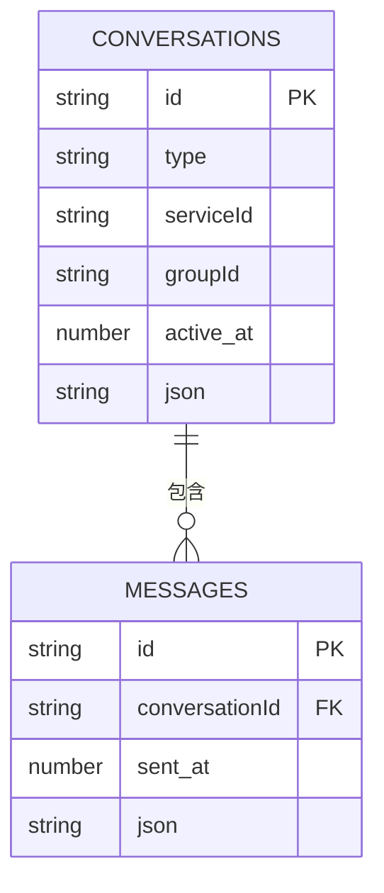
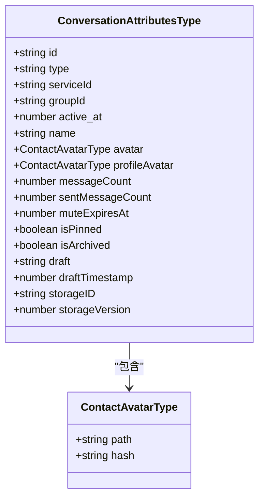
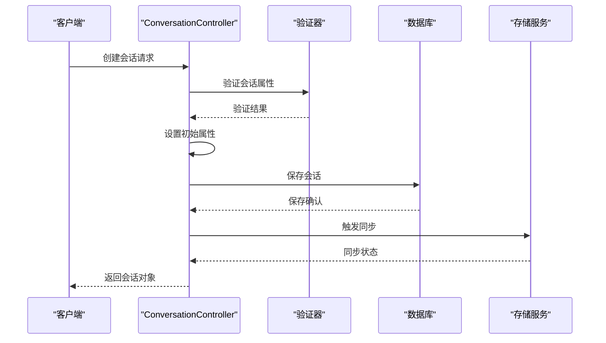
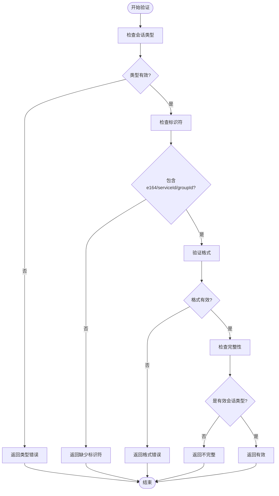

# 会话结构

<cite>
**本文档中引用的文件**  
- [Conversation.node.ts](file://ts/types/Conversation.node.ts)
- [model-types.d.ts](file://ts/model-types.d.ts)
- [ConversationController.preload.ts](file://ts/ConversationController.preload.ts)
- [Server.node.ts](file://ts/sql/Server.node.ts)
- [validateConversation.dom.ts](file://ts/util/validateConversation.dom.ts)
- [43-gv2-uuid.std.ts](file://ts/sql/migrations/43-gv2-uuid.std.ts)
</cite>

## 目录
1. [引言](#引言)
2. [核心字段定义](#核心字段定义)
3. [数据库存储结构](#数据库存储结构)
4. [会话对象数据结构](#会话对象数据结构)
5. [会话创建与更新逻辑](#会话创建与更新逻辑)
6. [序列化与反序列化](#序列化与反序列化)
7. [实际数据示例](#实际数据示例)
8. [数据验证规则](#数据验证规则)
9. [性能优化策略](#性能优化策略)

## 引言
本文档详细解析Signal-Desktop应用中的会话结构，涵盖会话实体的核心字段、数据库存储结构、类型定义、创建更新逻辑以及数据验证规则。通过分析相关源码文件，全面展示会话在系统中的完整生命周期和数据流转过程。

## 核心字段定义
会话实体包含多个核心字段，每个字段都有特定的数据类型和业务含义：

- **会话ID (id)**: 字符串类型，作为会话的唯一标识符
- **会话类型 (type)**: 枚举类型，分为"private"(个人)和"group"(群组)两种
- **名称 (name)**: 字符串类型，存储会话显示名称
- **头像 (avatar)**: 对象类型，包含头像路径和哈希值等信息
- **时间戳 (active_at)**: 数字类型，记录会话最后活动时间
- **消息计数器 (messageCount)**: 数字类型，统计会话中的消息总数
- **已发送消息计数器 (sentMessageCount)**: 数字类型，统计已发送的消息数量
- **服务ID (serviceId)**: 字符串类型，用于标识用户的服务ID
- **群组ID (groupId)**: 字符串类型，仅群组会话使用

**Section sources**
- [model-types.d.ts](file://ts/model-types.d.ts#L327-L528)

## 数据库存储结构
会话在数据库中的存储采用JSON格式存储主要属性，同时保留关键字段作为独立列以支持高效查询。

### 主键设计
- **id**: 作为主键，存储会话的唯一标识符
- **type**: 存储会话类型，支持快速类型过滤
- **serviceId**: 存储服务ID，用于用户标识
- **groupId**: 存储群组ID，仅群组会话使用

### 索引策略
- **按会话ID索引**: 确保会话查找的O(1)时间复杂度
- **按最后活动时间索引**: 支持会话列表按时间排序
- **按服务ID和群组ID索引**: 优化基于用户和群组的查询性能

### 表关系
- **与消息表的关系**: 通过conversationId外键关联，实现会话与消息的连接
- **与成员表的关系**: 群组会话通过members字段存储成员列表
- **与附件表的关系**: 通过附件路径引用实现媒体文件关联



**Diagram sources**
- [43-gv2-uuid.std.ts](file://ts/sql/migrations/43-gv2-uuid.std.ts#L31-L35)
- [Server.node.ts](file://ts/sql/Server.node.ts#L1945-L1978)

## 会话对象数据结构
基于ts/types/Conversation.node.ts和model-types.d.ts中的类型定义，会话对象具有完整的数据结构。



**Diagram sources**
- [model-types.d.ts](file://ts/model-types.d.ts#L349-L528)
- [Conversation.node.ts](file://ts/types/Conversation.node.ts#L12-L108)

## 会话创建与更新逻辑
会话的创建和更新遵循严格的业务逻辑流程，确保数据的一致性和完整性。

### 创建流程
1. 验证会话属性的有效性
2. 设置初始属性值
3. 保存到数据库
4. 触发存储服务同步

### 更新流程
1. 检查变更字段
2. 更新内存中的会话对象
3. 持久化到数据库
4. 处理特殊字段变更（如服务ID变更）



**Diagram sources**
- [ConversationController.preload.ts](file://ts/ConversationController.preload.ts#L566-L607)
- [validateConversation.dom.ts](file://ts/util/validateConversation.dom.ts#L12-L65)

## 序列化与反序列化
会话数据在存储和传输过程中需要进行序列化和反序列化处理。

### 序列化过程
- 将会话对象转换为JSON格式
- 保留关键字段作为独立列
- 处理特殊类型（如附件、头像）的序列化
- 计算并存储数据哈希值

### 反序列化过程
- 从数据库读取JSON数据
- 验证数据完整性
- 恢复会话对象实例
- 建立内存中的引用关系

**Section sources**
- [43-gv2-uuid.std.ts](file://ts/sql/migrations/43-gv2-uuid.std.ts#L398-L405)
- [Server.node.ts](file://ts/sql/Server.node.ts#L1982-L1983)

## 实际数据示例
以下是不同场景下的会话结构示例：

### 个人会话示例
```json
{
  "id": "uuid123:uuid456",
  "type": "private",
  "serviceId": "uuid456",
  "active_at": 1640995200000,
  "messageCount": 42,
  "sentMessageCount": 23,
  "name": "张三",
  "profileName": "San Zhang",
  "avatar": {
    "path": "avatars/abc123.jpg",
    "hash": "e3b0c442"
  },
  "muteExpiresAt": 0,
  "isPinned": false
}
```

### 群组会话示例
```json
{
  "id": "group123",
  "type": "group",
  "groupId": "group123",
  "active_at": 1640995300000,
  "messageCount": 156,
  "sentMessageCount": 89,
  "name": "家庭群聊",
  "avatar": {
    "path": "avatars/group456.jpg",
    "hash": "a1b2c3d4"
  },
  "members": ["uuid1", "uuid2", "uuid3"],
  "groupVersion": 2,
  "revision": 15,
  "isArchived": false
}
```

**Section sources**
- [model-types.d.ts](file://ts/model-types.d.ts#L349-L528)

## 数据验证规则
会话数据在创建和更新时需要通过严格的验证规则。

### 核心验证规则
- **类型验证**: 必须是"private"或"group"
- **标识符验证**: 必须包含e164、serviceId或groupId之一
- **格式验证**: e164必须符合国际电话号码格式
- **服务ID验证**: 必须是有效的服务ID格式
- **完整性验证**: 必须是直接会话、群组V1或群组V2之一

### 验证流程
1. 检查会话类型有效性
2. 验证标识符存在性
3. 格式验证（电话号码、服务ID等）
4. 会话类型完整性验证
5. 返回验证结果或错误信息



**Diagram sources**
- [validateConversation.dom.ts](file://ts/util/validateConversation.dom.ts#L12-L65)

## 性能优化策略
针对大型会话场景，系统采用了多种性能优化策略。

### 查询优化
- **索引优化**: 在关键字段上建立索引
- **分页查询**: 避免一次性加载过多数据
- **缓存机制**: 缓存频繁访问的会话数据

### 内存管理
- **懒加载**: 按需加载会话数据
- **对象池**: 复用会话对象实例
- **垃圾回收**: 及时清理不再使用的会话

### 大型会话处理
- **增量加载**: 逐步加载历史消息
- **数据分片**: 将大数据分割处理
- **异步处理**: 避免阻塞主线程

**Section sources**
- [ConversationController.preload.ts](file://ts/ConversationController.preload.ts#L566-L607)
- [Server.node.ts](file://ts/sql/Server.node.ts#L1939-L1993)