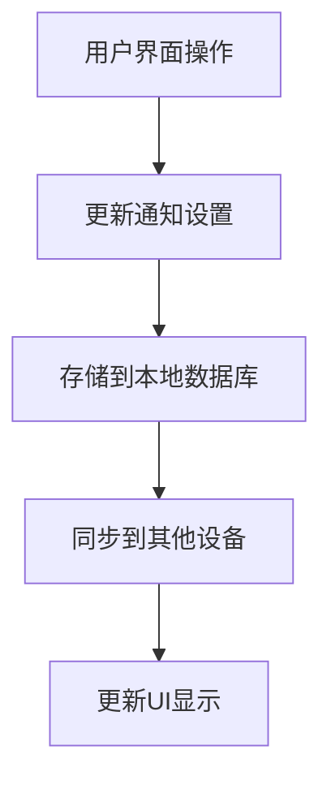
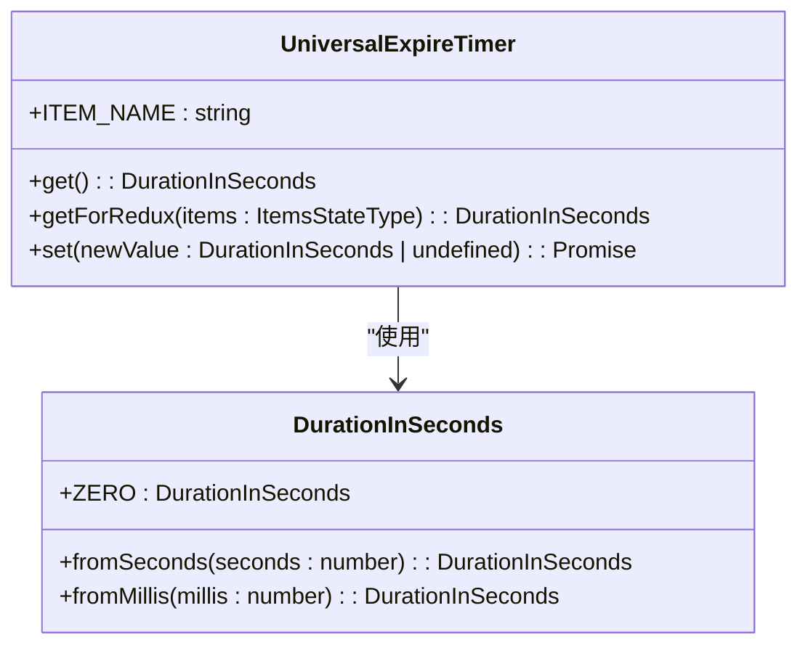
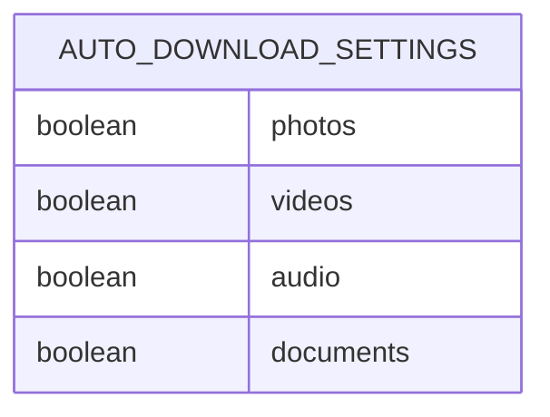
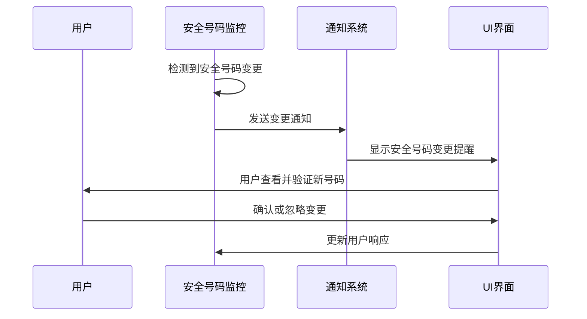
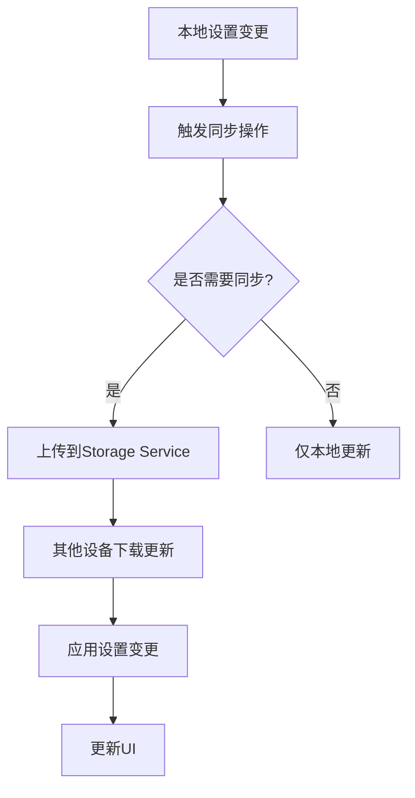
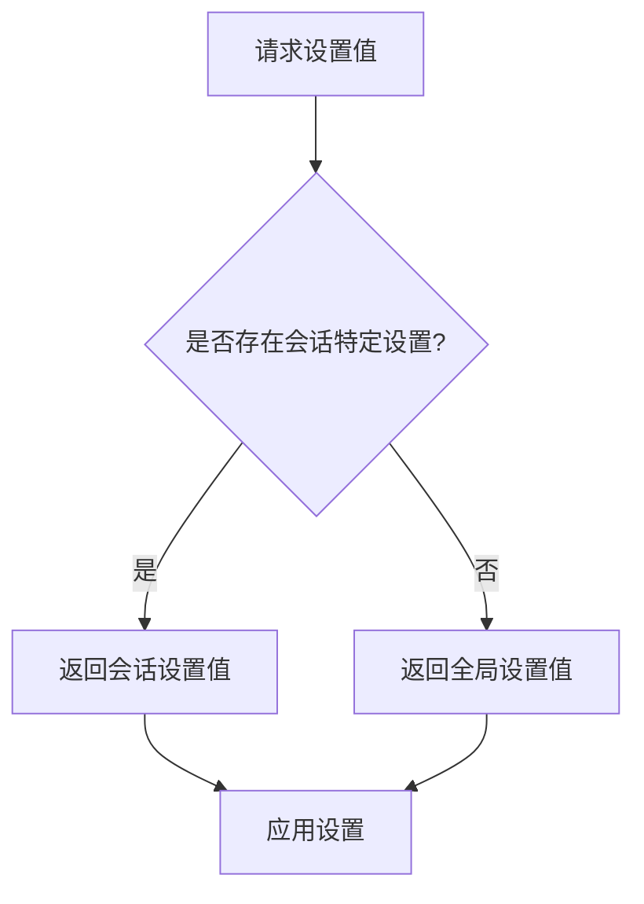
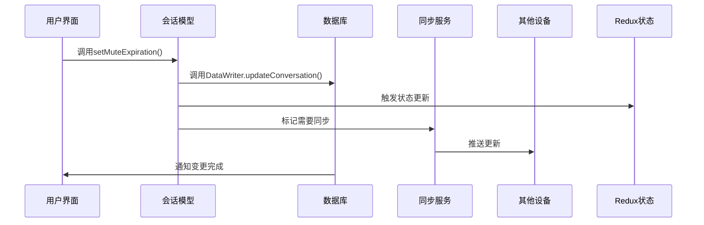
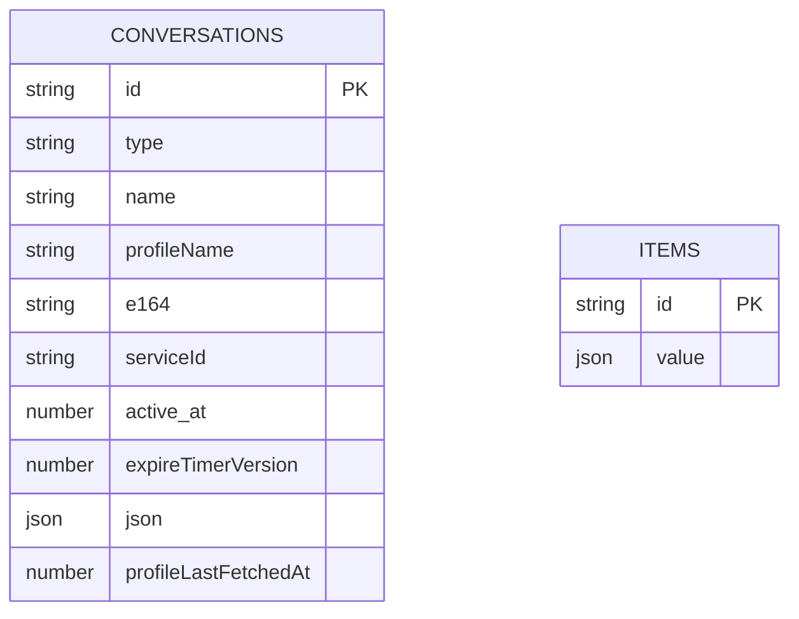
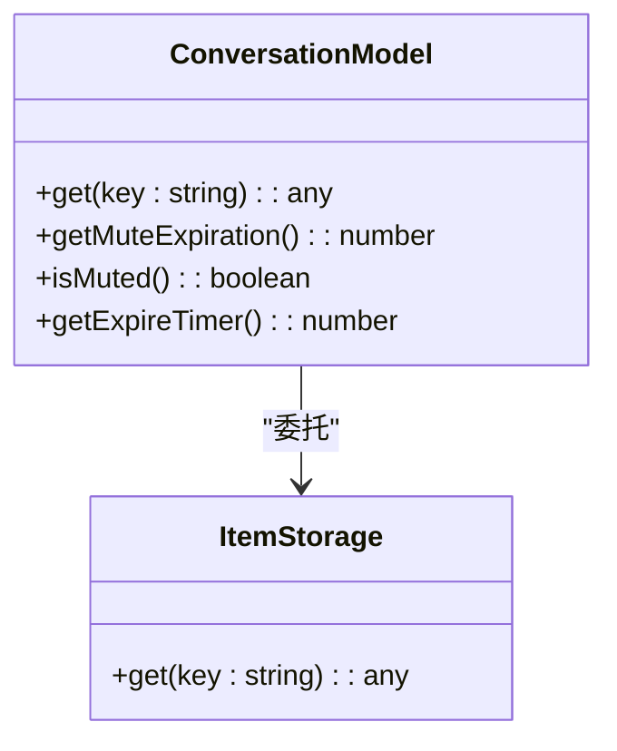
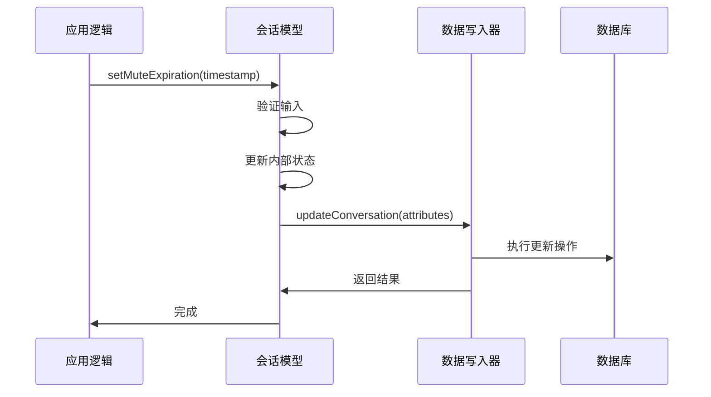

# 会话设置

<cite>
**本文档引用的文件**  
- [Preferences.dom.tsx](file://ts/components/Preferences.dom.tsx)
- [conversations.preload.ts](file://ts/models/conversations.preload.ts)
- [Client.preload.ts](file://ts/sql/Client.preload.ts)
- [Storage.preload.ts](file://ts/textsecure/Storage.preload.ts)
- [settingsChannel.main.ts](file://ts/main/settingsChannel.main.ts)
- [universalExpireTimer.preload.ts](file://ts/util/universalExpireTimer.preload.ts)
- [SafetyNumberChangeDialog.dom.tsx](file://ts/components/SafetyNumberChangeDialog.dom.tsx)
- [SignalConversationMuteToggle.dom.tsx](file://ts/components/conversation/SignalConversationMuteToggle.dom.tsx)
- [storageRecordOps.preload.ts](file://ts/services/storageRecordOps.preload.ts)
</cite>

## 目录
1. [引言](#引言)
2. [会话设置功能概述](#会话设置功能概述)
3. [核心设置属性](#核心设置属性)
4. [设置存储与同步机制](#设置存储与同步机制)
5. [设置优先级与冲突处理](#设置优先级与冲突处理)
6. [设置变更传播与UI更新](#设置变更传播与ui更新)
7. [数据库设计与查询优化](#数据库设计与查询优化)
8. [代码示例与API使用](#代码示例与api使用)
9. [隐私保护与数据安全](#隐私保护与数据安全)
10. [结论](#结论)

## 引言
Signal-Desktop的会话设置功能为用户提供了一套完整的个性化配置体系，允许用户针对每个会话进行精细化的设置管理。这些设置不仅包括消息通知、媒体自动下载等用户体验相关的配置，还涵盖了安全号码变更通知、消息保留期限等安全与隐私相关的功能。本文档将深入分析会话设置的实现机制，包括其数据结构、存储方式、同步逻辑以及与其他系统组件的交互。

## 会话设置功能概述
会话设置功能允许用户在特定会话级别上配置各种行为和偏好，这些设置优先于全局设置，为用户提供更灵活的控制能力。设置功能主要通过用户界面中的"偏好设置"模块进行访问和管理，涵盖了通知、隐私、安全等多个方面。

**Section sources**
- [Preferences.dom.tsx](file://ts/components/Preferences.dom.tsx)

## 核心设置属性
会话设置包含多个关键属性，每个属性都有其特定的用途和管理逻辑。

### 消息通知设置
消息通知设置允许用户控制特定会话的通知行为，包括是否启用通知、通知内容的显示方式（显示姓名和消息、仅显示姓名或仅显示计数）以及是否播放音频通知。这些设置通过`Preferences.dom.tsx`中的UI组件进行管理，并与后端存储系统进行同步。



**Diagram sources**
- [Preferences.dom.tsx](file://ts/components/Preferences.dom.tsx)

### 消息保留期限
消息保留期限设置允许用户配置消息的自动删除时间，支持多种预设时间选项。该功能通过`universalExpireTimer.preload.ts`模块实现，使用`DurationInSeconds`类型来表示时间间隔，并通过`itemStorage`进行持久化存储。



**Diagram sources**
- [universalExpireTimer.preload.ts](file://ts/util/universalExpireTimer.preload.ts)
- [durations/index.std.js](file://ts/util/durations/index.std.js)

### 媒体自动下载设置
媒体自动下载设置允许用户控制不同类型媒体文件的自动下载行为，包括照片、视频、音频和文档。这些设置通过`autoDownloadAttachment`对象进行管理，每个媒体类型都有独立的开关状态。



**Diagram sources**
- [Preferences.dom.tsx](file://ts/components/Preferences.dom.tsx)

### 安全号码变更通知
安全号码变更通知功能在会话中联系人的安全号码发生变化时向用户发出提醒。该功能通过`SafetyNumberChangeDialog.dom.tsx`组件实现，提供了一个对话框界面让用户查看和验证新的安全号码。



**Diagram sources**
- [SafetyNumberChangeDialog.dom.tsx](file://ts/components/SafetyNumberChangeDialog.dom.tsx)
- [SafetyNumberNotification.dom.tsx](file://ts/components/conversation/SafetyNumberNotification.dom.tsx)

**Section sources**
- [SafetyNumberChangeDialog.dom.tsx](file://ts/components/SafetyNumberChangeDialog.dom.tsx)
- [SafetyNumberNotification.dom.tsx](file://ts/components/conversation/SafetyNumberNotification.dom.tsx)

## 设置存储与同步机制
会话设置的存储与同步机制是Signal-Desktop的核心功能之一，确保了用户在多设备间的设置一致性。

### 本地存储实现
会话设置主要通过`itemStorage`进行本地存储，这是一个基于SQL数据库的持久化存储系统。`Storage.preload.ts`文件定义了存储接口，提供了`get`、`put`和`remove`等基本操作。

```mermaid
classDiagram
class Storage {
+get(key : K) : Access[K] | undefined
+put(key : K, value : Access[K]) : Promise<void>
+remove(key : K) : Promise<void>
+fetch() : Promise<void>
+reset() : void
}
class DataWriter {
+createOrUpdateItem(item : { id : string, value : unknown }) : Promise<void>
+removeItemById(id : string) : Promise<void>
}
class DataReader {
+getAllItems() : Promise<AllItemsType>
}
Storage --> DataWriter : "写入"
Storage --> DataReader : "读取"
```

**Diagram sources**
- [Storage.preload.ts](file://ts/textsecure/Storage.preload.ts)
- [Client.preload.ts](file://ts/sql/Client.preload.ts)

### 远程同步机制
会话设置通过Storage Service进行远程同步，确保用户在不同设备间的一致性体验。`storageRecordOps.preload.ts`文件中的同步逻辑负责处理本地与远程设置的合并和冲突解决。



**Diagram sources**
- [storageRecordOps.preload.ts](file://ts/services/storageRecordOps.preload.ts)

**Section sources**
- [Storage.preload.ts](file://ts/textsecure/Storage.preload.ts)
- [storageRecordOps.preload.ts](file://ts/services/storageRecordOps.preload.ts)

## 设置优先级与冲突处理
会话设置与全局设置之间存在明确的优先级关系，系统通过特定的逻辑来处理可能的设置冲突。

### 优先级规则
会话级别的设置优先于全局设置，这意味着用户在特定会话中配置的选项将覆盖全局偏好。这种优先级机制通过在UI渲染时优先读取会话特定设置来实现。



### 冲突处理策略
当本地设置与远程同步的设置发生冲突时，系统会根据时间戳和设备优先级来决定采用哪个版本的设置。`storageRecordOps.preload.ts`中的同步逻辑包含了冲突检测和解决的代码。

**Section sources**
- [storageRecordOps.preload.ts](file://ts/services/storageRecordOps.preload.ts)

## 设置变更传播与UI更新
设置变更的传播路径和UI更新机制确保了用户操作的即时反馈和跨组件的一致性。

### 变更传播路径
当用户修改会话设置时，变更会沿着特定的路径传播到所有相关组件：



**Diagram sources**
- [conversations.preload.ts](file://ts/models/conversations.preload.ts)
- [Client.preload.ts](file://ts/sql/Client.preload.ts)

### UI更新机制
UI更新通过Redux状态管理系统的订阅机制实现，当会话设置发生变化时，相关的UI组件会自动重新渲染以反映最新的设置状态。

**Section sources**
- [conversations.preload.ts](file://ts/models/conversations.preload.ts)
- [SignalConversationMuteToggle.dom.tsx](file://ts/components/conversation/SignalConversationMuteToggle.dom.tsx)

## 数据库设计与查询优化
会话设置的数据库设计采用了高效的结构和查询优化策略，确保了数据访问的性能。

### 数据库表结构
会话设置主要存储在`conversations`表中，该表包含了会话的所有属性，包括设置相关的字段。



**Diagram sources**
- [Server.node.ts](file://ts/sql/Server.node.ts)

### 查询优化策略
系统采用了多种查询优化策略，包括批量查询、缓存机制和索引优化，以提高数据访问效率。

**Section sources**
- [Server.node.ts](file://ts/sql/Server.node.ts)
- [Client.preload.ts](file://ts/sql/Client.preload.ts)

## 代码示例与API使用
以下是一些关键的API使用示例，展示了如何读取、修改和监听会话设置变更。

### 读取会话设置


**Diagram sources**
- [conversations.preload.ts](file://ts/models/conversations.preload.ts)

### 修改会话设置


**Diagram sources**
- [conversations.preload.ts](file://ts/models/conversations.preload.ts)

### 监听设置变更
系统通过事件机制和状态管理系统的订阅功能来监听设置变更，确保UI能够及时响应。

**Section sources**
- [conversations.preload.ts](file://ts/models/conversations.preload.ts)
- [Preferences.dom.tsx](file://ts/components/Preferences.dom.tsx)

## 隐私保护与数据安全
会话设置功能在设计时充分考虑了隐私保护和数据安全的需求。

### 数据加密
所有存储在本地的会话设置数据都经过加密处理，确保即使设备丢失也不会泄露用户隐私。

### 访问控制
系统实施了严格的访问控制机制，只有经过身份验证的组件才能读取或修改会话设置。

### 同步安全
远程同步过程中，所有数据传输都通过端到端加密的通道进行，确保设置信息在传输过程中的安全性。

**Section sources**
- [Crypto.node.ts](file://ts/Crypto.node.ts)
- [AttachmentCrypto.node.ts](file://ts/AttachmentCrypto.node.ts)

## 结论
Signal-Desktop的会话设置功能通过精心设计的架构和实现，为用户提供了一套强大而灵活的个性化配置系统。该系统不仅满足了用户对消息管理、通知控制和隐私保护的需求，还通过高效的存储和同步机制确保了跨设备的一致性体验。通过对核心组件的深入分析，我们可以看到Signal在用户体验和数据安全之间取得了良好的平衡。