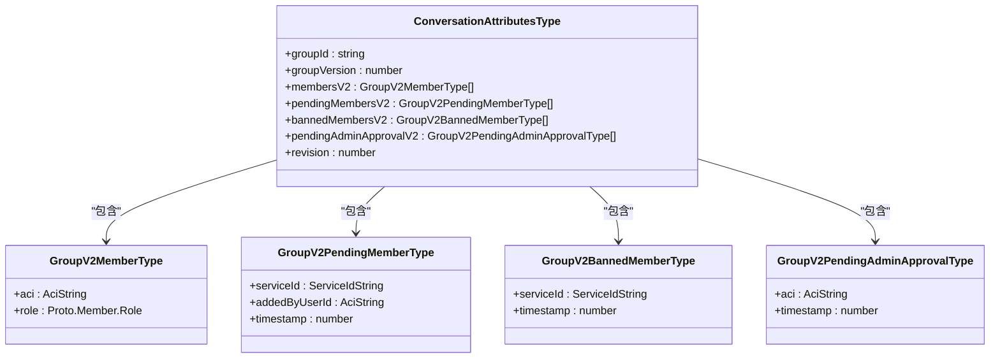
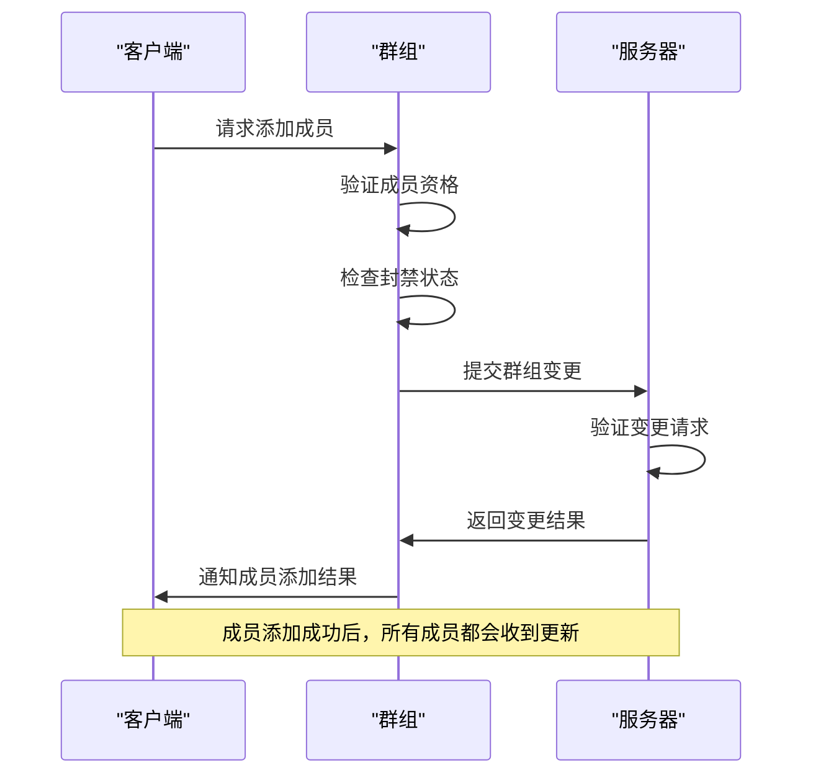
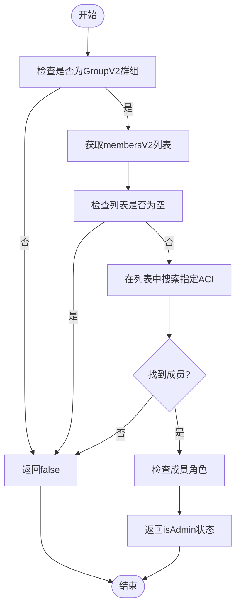
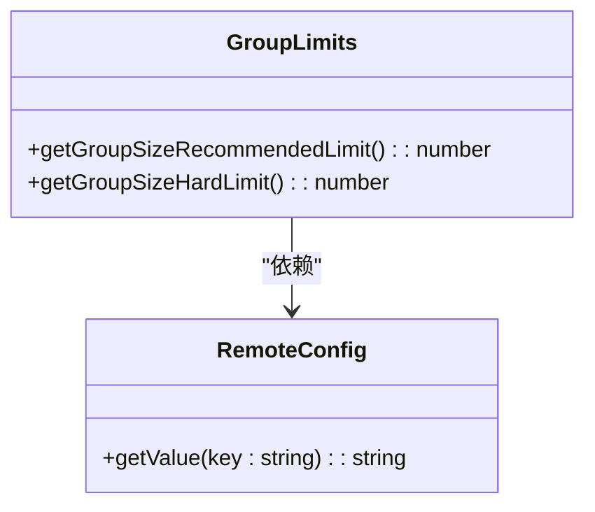
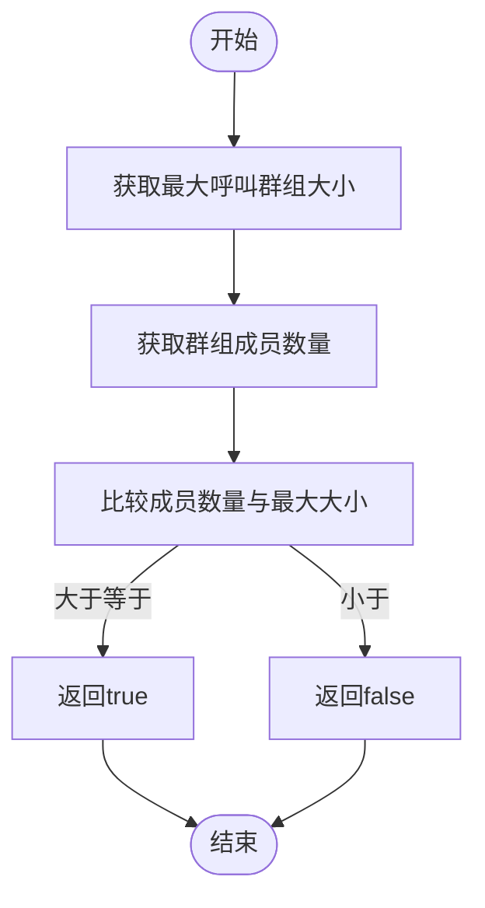
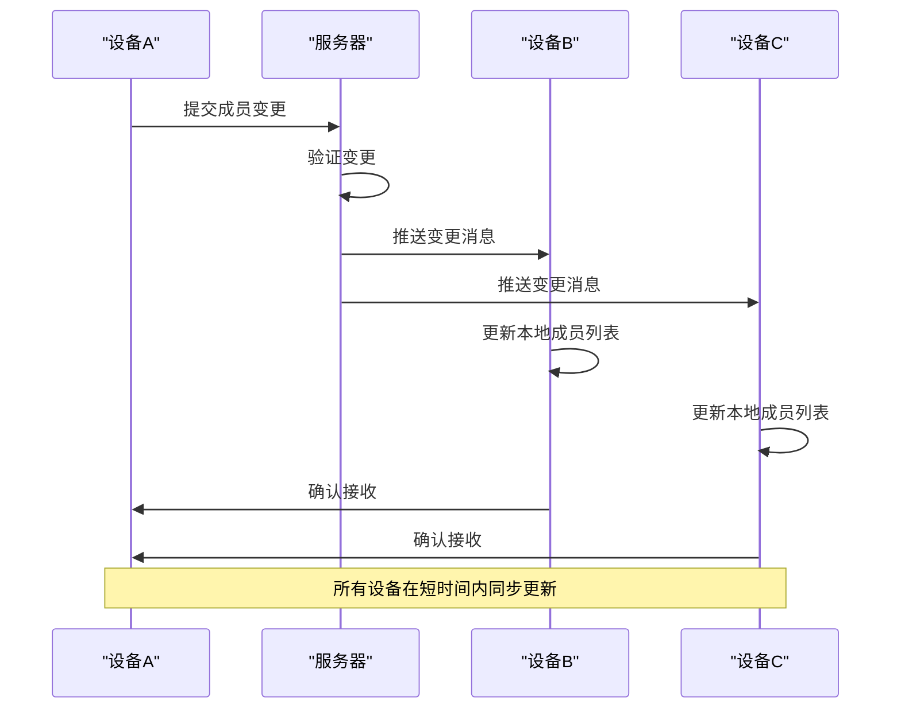
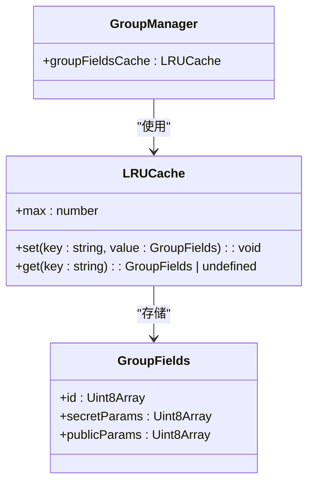

# 成员管理

<cite>
**本文档引用的文件**  
- [memberRepository.std.ts](file://ts/quill/memberRepository.std.ts)
- [isConversationTooBigToRing.dom.ts](file://ts/conversations/isConversationTooBigToRing.dom.ts)
- [limits.dom.ts](file://ts/groups/limits.dom.ts)
- [conversations.preload.ts](file://ts/state/ducks/conversations.preload.ts)
- [groups.preload.ts](file://ts/groups.preload.ts)
- [groupMembershipUtils.preload.ts](file://ts/util/groupMembershipUtils.preload.ts)
- [conversations.preload.ts](file://ts/models/conversations.preload.ts)
</cite>

## 目录
1. [简介](#简介)
2. [核心数据结构与属性](#核心数据结构与属性)
3. [成员列表维护机制](#成员列表维护机制)
4. [成员资格验证](#成员资格验证)
5. [大规模群组处理](#大规模群组处理)
6. [多设备同步与事件传播](#多设备同步与事件传播)
7. [代码示例与安全考虑](#代码示例与安全考虑)
8. [性能优化措施](#性能优化措施)

## 简介
Signal-Desktop的成员管理功能为群组会话提供了完整的成员生命周期管理，包括成员添加、移除、权限变更等操作。系统通过GroupV2协议实现安全的成员管理，确保只有合法成员才能参与会话。成员信息包括成员ID、角色权限、加入时间、成员状态等关键属性，这些信息在多设备间保持同步，并通过加密机制保护成员隐私。

**Section sources**
- [conversations.preload.ts](file://ts/models/conversations.preload.ts#L300-L800)
- [groups.preload.ts](file://ts/groups.preload.ts#L1-L800)

## 核心数据结构与属性

### 成员数据结构
成员管理的核心数据结构定义在`ConversationAttributesType`中，主要包含以下属性：

- **成员ID**：使用ACI（Account Identifier）作为唯一标识符，确保跨设备一致性
- **角色权限**：通过`Proto.Member.Role`枚举定义，包括`DEFAULT`（普通成员）和`ADMINISTRATOR`（管理员）
- **加入时间**：记录成员加入群组的时间戳
- **成员状态**：包括正常成员、待定成员、被封禁成员等多种状态



**Diagram sources**
- [model-types.d.ts](file://ts/model-types.d.ts)
- [groups.preload.ts](file://ts/groups.preload.ts#L34-L38)

### 成员类型定义
系统定义了多种成员类型来表示不同的成员状态：

- **正常成员**：已完全加入群组的成员，存储在`membersV2`数组中
- **待定成员**：已收到邀请但尚未完成加入流程的成员，存储在`pendingMembersV2`数组中
- **被封禁成员**：被管理员封禁的成员，存储在`bannedMembersV2`数组中
- **待批准成员**：请求加入群组但需要管理员批准的成员，存储在`pendingAdminApprovalV2`数组中

**Section sources**
- [groupMembershipUtils.preload.ts](file://ts/util/groupMembershipUtils.preload.ts#L14-L210)
- [conversations.preload.ts](file://ts/models/conversations.preload.ts#L300-L800)

## 成员列表维护机制

### 成员添加流程
成员添加操作通过`buildAddMembersChange`函数实现，主要流程如下：

1. 验证目标成员的合法性
2. 检查是否需要解除封禁状态
3. 创建成员添加操作
4. 提交群组变更请求



**Diagram sources**
- [groups.preload.ts](file://ts/groups.preload.ts#L524-L659)
- [conversations.preload.ts](file://ts/models/conversations.preload.ts#L729-L773)

### 成员移除流程
成员移除操作通过`buildDeleteMemberChange`函数实现，主要流程如下：

1. 验证操作权限（必须是管理员）
2. 创建成员移除操作
3. 提交群组变更请求
4. 更新本地成员列表

### 权限变更流程
权限变更操作通过`buildModifyMemberRoleChange`函数实现，主要流程如下：

1. 验证操作权限（必须是管理员）
2. 创建权限变更操作
3. 提交群组变更请求
4. 更新本地成员权限信息

**Section sources**
- [groups.preload.ts](file://ts/groups.preload.ts#L524-L800)
- [conversations.preload.ts](file://ts/models/conversations.preload.ts#L729-L800)

## 成员资格验证

### 资格验证实现
成员资格验证通过`isMember`函数实现，该函数检查指定成员是否属于群组：



**Diagram sources**
- [groupMembershipUtils.preload.ts](file://ts/util/groupMembershipUtils.preload.ts#L71-L88)
- [conversations.preload.ts](file://ts/models/conversations.preload.ts#L586-L588)

### 验证规则
系统实施以下验证规则：

- 只有GroupV2群组支持成员管理功能
- 成员资格通过ACI进行验证
- 管理员权限通过角色属性进行验证
- 待定成员和被封禁成员不被视为正式成员

**Section sources**
- [groupMembershipUtils.preload.ts](file://ts/util/groupMembershipUtils.preload.ts#L14-L107)

## 大规模群组处理

### 群组大小限制
系统通过`limits.dom.ts`文件定义了群组大小的限制：

- **推荐限制**：由`global.groupsv2.maxGroupSize`配置项定义
- **硬性限制**：由`global.groupsv2.groupSizeHardLimit`配置项定义



**Diagram sources**
- [limits.dom.ts](file://ts/groups/limits.dom.ts#L1-L34)
- [RemoteConfig.dom.js](file://ts/RemoteConfig.dom.js)

### 呼叫限制处理
当群组成员数量过多时，系统会限制群组呼叫功能，通过`isConversationTooBigToRing`函数实现：



**Diagram sources**
- [isConversationTooBigToRing.dom.ts](file://ts/conversations/isConversationTooBigToRing.dom.ts#L1-L15)

**Section sources**
- [isConversationTooBigToRing.dom.ts](file://ts/conversations/isConversationTooBigToRing.dom.ts#L1-L15)
- [limits.dom.ts](file://ts/groups/limits.dom.ts#L1-L34)

## 多设备同步与事件传播

### 同步策略
成员信息在多设备间的同步通过以下机制实现：

- **群组变更日志**：每个群组变更都会生成变更日志
- **增量同步**：设备只同步自上次同步以来的变更
- **加密传输**：所有同步数据都经过端到端加密

### 事件传播机制
成员变更事件通过群组变更消息进行传播：



**Diagram sources**
- [groups.preload.ts](file://ts/groups.preload.ts#L1-L800)
- [conversations.preload.ts](file://ts/models/conversations.preload.ts#L300-L800)

**Section sources**
- [groups.preload.ts](file://ts/groups.preload.ts#L1-L800)
- [conversations.preload.ts](file://ts/models/conversations.preload.ts#L300-L800)

## 代码示例与安全考虑

### 查询成员列表
查询成员列表的代码示例：

```typescript
// 获取群组成员列表
const memberships = getMemberships(conversation.attributes);
const memberCount = getMembersCount(conversation.attributes);
```

### 修改成员权限
修改成员权限的代码示例：

```typescript
// 提升成员为管理员
const actions = buildModifyMemberRoleChange({
  group: conversation.attributes,
  aci: targetMemberAci,
  newRole: Proto.Member.Role.ADMINISTRATOR,
});
```

### 安全考虑
系统实施以下安全措施：

- 所有成员管理操作都需要管理员权限验证
- 成员ID使用加密的ACI，保护用户隐私
- 群组变更需要所有成员的端到端加密验证
- 敏感操作需要二次确认

**Section sources**
- [groups.preload.ts](file://ts/groups.preload.ts#L524-L800)
- [groupMembershipUtils.preload.ts](file://ts/util/groupMembershipUtils.preload.ts#L14-L210)

## 性能优化措施

### 缓存机制
系统使用LRU缓存来优化群组字段的访问：



**Diagram sources**
- [groups.preload.ts](file://ts/groups.preload.ts#L148-L151)

### 批量操作
系统支持批量成员管理操作，减少网络请求次数：

- 批量添加成员
- 批量移除成员
- 批量权限变更

**Section sources**
- [groups.preload.ts](file://ts/groups.preload.ts#L148-L151)
- [conversations.preload.ts](file://ts/models/conversations.preload.ts#L300-L800)