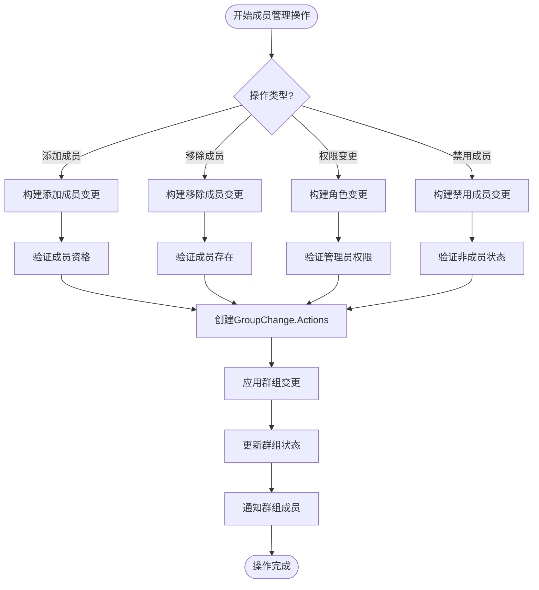
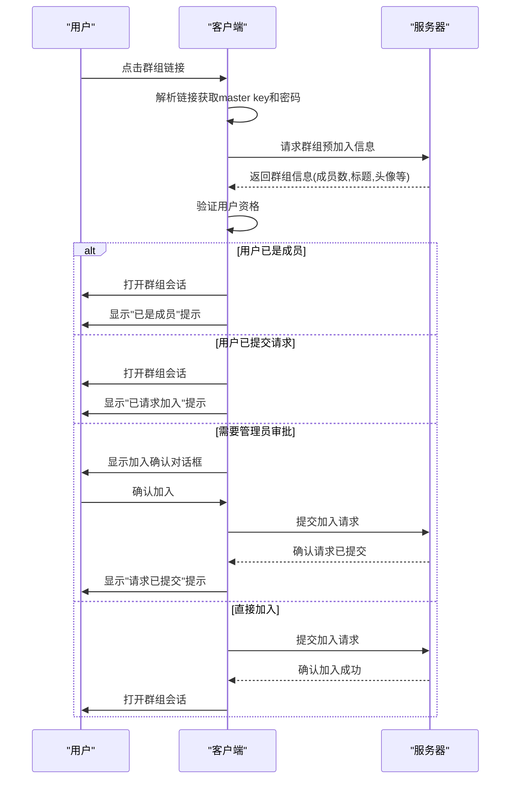
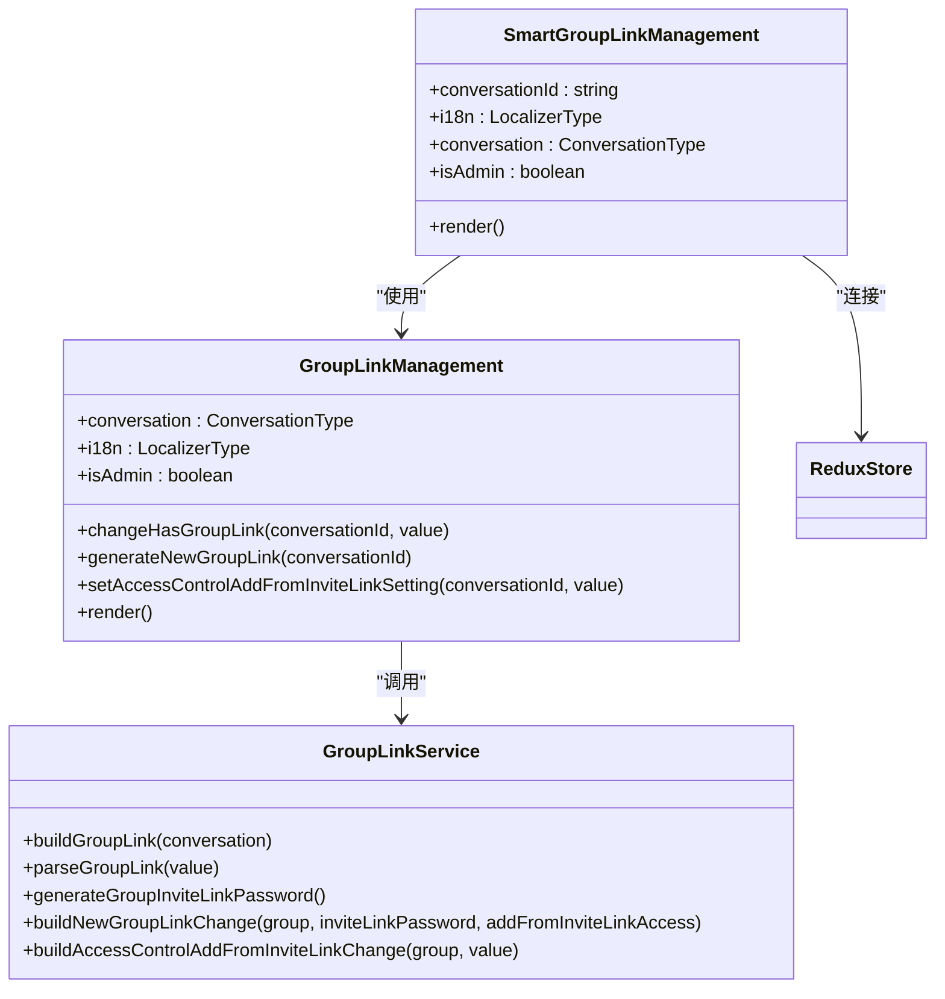
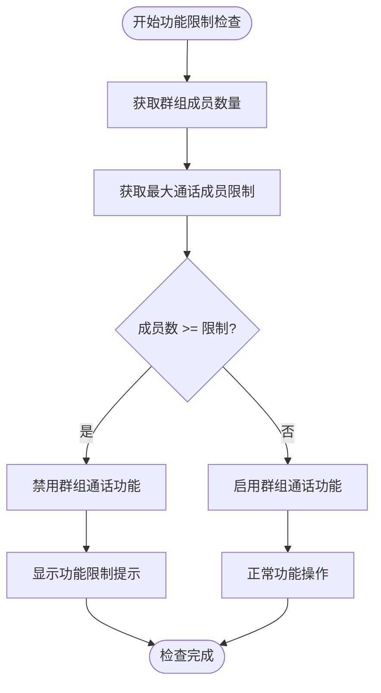
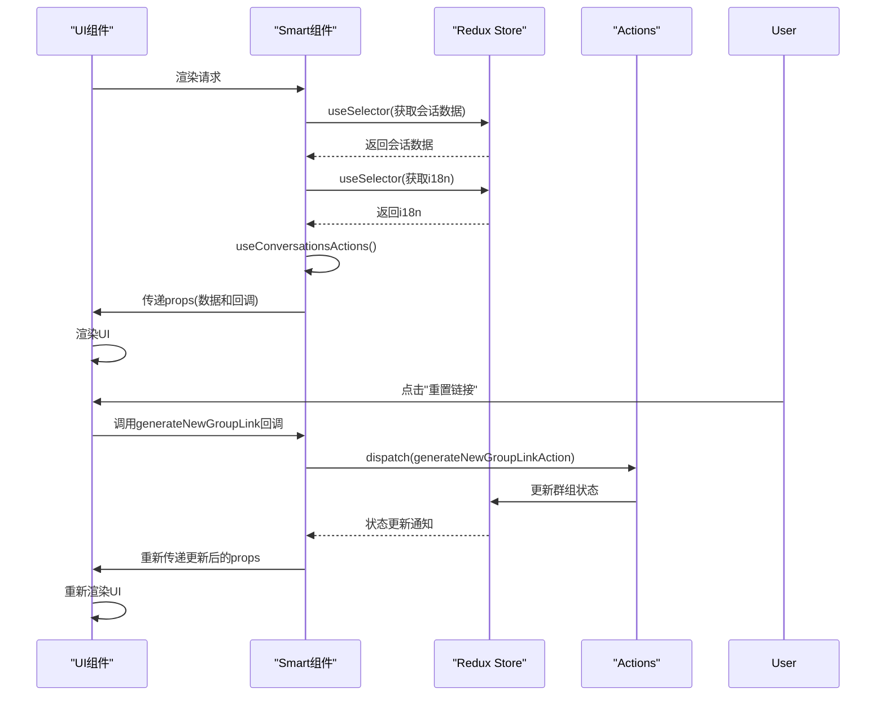

# 成员管理

<cite>
**本文档引用的文件**   
- [GroupLinkManagement.dom.tsx](file://ts/components/conversation/conversation-details/GroupLinkManagement.dom.tsx)
- [SmartGroupLinkManagement.preload.tsx](file://ts/state/smart/GroupLinkManagement.preload.tsx)
- [isConversationTooBigToRing.dom.ts](file://ts/conversations/isConversationTooBigToRing.dom.ts)
- [groups.preload.ts](file://ts/groups.preload.ts)
- [groupChange.std.ts](file://ts/groupChange.std.ts)
- [joinViaLink.preload.ts](file://ts/groups/joinViaLink.preload.ts)
- [limits.dom.ts](file://ts/groups/limits.dom.ts)
- [memberRepository.std.ts](file://ts/quill/memberRepository.std.ts)
- [conversations.preload.ts](file://ts/models/conversations.preload.ts)
</cite>

## 目录
1. [简介](#简介)
2. [成员列表管理逻辑](#成员列表管理逻辑)
3. [成员资格验证流程](#成员资格验证流程)
4. [群组链接管理](#群组链接管理)
5. [大型群组功能限制](#大型群组功能限制)
6. [UI与状态管理数据流](#ui与状态管理数据流)
7. [安全与隐私保护措施](#安全与隐私保护措施)
8. [结论](#结论)

## 简介
Signal-Desktop的群组成员管理功能提供了一套完整的机制来管理群组成员的添加、移除和权限变更。该系统通过加密协议确保成员管理操作的安全性，并支持通过群组链接邀请新成员。管理员可以控制成员加入的审批流程，系统还对大型群组施加了功能限制以保证性能。本文档详细说明了这些功能的实现机制和交互流程。

## 成员列表管理逻辑
群组成员管理的核心逻辑实现在`groups.preload.ts`文件中，通过构建和应用GroupChange.Actions来修改群组状态。成员的添加、移除和权限变更都通过特定的构建函数实现。

成员添加通过`buildAddMembersChange`函数实现，该函数接受群组属性和要添加的成员ID列表，创建相应的添加操作。对于需要profile key的成员，系统会直接添加为正式成员；否则添加为待定成员（pendingMembers）。成员移除通过`buildDeleteMemberChange`函数实现，该函数创建删除成员的操作并更新群组版本号。

权限变更（管理员/普通成员）通过`buildModifyMemberRoleChange`函数实现，该函数创建修改成员角色的操作。系统还实现了成员禁用功能，通过`buildAddBannedMemberChange`函数将成员加入禁用列表，防止其重新加入群组。

**Diagram sources**
- [groups.preload.ts](file://ts/groups.preload.ts#L524-L659)
- [groups.preload.ts](file://ts/groups.preload.ts#L1115-L1155)
- [groups.preload.ts](file://ts/groups.preload.ts#L1197-L1196)

**Section sources**
- [groups.preload.ts](file://ts/groups.preload.ts#L524-L659)
- [groups.preload.ts](file://ts/groups.preload.ts#L1115-L1155)
- [groups.preload.ts](file://ts/groups.preload.ts#L1197-L1196)

## 成员资格验证流程
成员资格验证流程确保只有授权用户才能加入或管理群组。系统通过`memberRepository.std.ts`中的`MemberRepository`类管理成员数据，该类提供成员搜索、查找和过滤功能。

当用户尝试通过群组链接加入时，系统执行以下验证流程：首先解析群组链接获取master key和邀请密码，然后通过`getPreJoinGroupInfo`从服务器获取群组预加入信息。系统验证用户是否已经是群组成员或已提交加入请求，如果是则直接打开会话。

对于需要管理员审批的群组，系统检查用户是否已在待审批列表中。如果用户尚未提交请求，则显示加入确认对话框。验证过程中，系统还会检查群组链接的有效性，包括链接版本、访问权限和是否已被撤销。

**Diagram sources**
- [joinViaLink.preload.ts](file://ts/groups/joinViaLink.preload.ts#L44-L451)
- [memberRepository.std.ts](file://ts/quill/memberRepository.std.ts#L72-L123)

**Section sources**
- [joinViaLink.preload.ts](file://ts/groups/joinViaLink.preload.ts#L44-L451)
- [memberRepository.std.ts](file://ts/quill/memberRepository.std.ts#L72-L123)

## 群组链接管理
群组链接管理功能通过`GroupLinkManagement`组件实现，允许管理员生成、分享和重置群组邀请链接。该功能还支持设置成员加入的审批要求。

`GroupLinkManagement.dom.tsx`组件提供用户界面，显示当前群组链接并提供分享和重置选项。管理员可以启用或禁用群组链接，以及设置是否需要管理员审批才能加入。当用户点击"重置"按钮时，系统会显示确认对话框，防止意外操作。

链接生成通过`buildGroupLink`函数实现，该函数使用群组的master key和邀请链接密码创建加密的邀请链接。链接重置通过`buildNewGroupLinkChange`函数实现，该函数生成新的邀请链接密码并更新群组状态。

**Diagram sources**
- [GroupLinkManagement.dom.tsx](file://ts/components/conversation/conversation-details/GroupLinkManagement.dom.tsx#L1-L209)
- [SmartGroupLinkManagement.preload.tsx](file://ts/state/smart/GroupLinkManagement.preload.tsx#L1-L39)
- [groups.preload.ts](file://ts/groups.preload.ts#L240-L265)

**Section sources**
- [GroupLinkManagement.dom.tsx](file://ts/components/conversation/conversation-details/GroupLinkManagement.dom.tsx#L1-L209)
- [SmartGroupLinkManagement.preload.tsx](file://ts/state/smart/GroupLinkManagement.preload.tsx#L1-L39)
- [groups.preload.ts](file://ts/groups.preload.ts#L240-L265)

## 大型群组功能限制
系统通过`isConversationTooBigToRing.dom.ts`文件中的`isConversationTooBigToRing`函数对大型群组施加功能限制。该函数根据群组成员数量判断是否应禁用某些功能，如群组通话。

`getMaxGroupCallRingSize`函数从远程配置获取最大群组通话成员数限制，默认值为16。`isConversationTooBigToRing`函数比较当前群组成员数与限制值，如果成员数达到或超过限制，则返回true，表示群组太大无法进行通话。

这种限制机制确保了大型群组的性能和稳定性，防止因成员过多导致的通话质量问题。系统还通过`groups/limits.dom.ts`中的`getGroupSizeHardLimit`和`getGroupSizeRecommendedLimit`函数定义了群组大小的硬性限制和推荐限制。

**Diagram sources**
- [isConversationTooBigToRing.dom.ts](file://ts/conversations/isConversationTooBigToRing.dom.ts#L1-L15)
- [limits.dom.ts](file://ts/groups/limits.dom.ts#L1-L34)

**Section sources**
- [isConversationTooBigToRing.dom.ts](file://ts/conversations/isConversationTooBigToRing.dom.ts#L1-L15)
- [limits.dom.ts](file://ts/groups/limits.dom.ts#L1-L34)

## UI与状态管理数据流
UI组件与Redux状态管理之间的数据流通过`SmartGroupLinkManagement`组件实现。该组件作为智能组件，连接Redux store并为`GroupLinkManagement`展示组件提供所需的数据和回调函数。

`SmartGroupLinkManagement`使用`useSelector`从Redux store中选择会话数据和国际化字符串，使用`useConversationsActions`获取会话操作函数。这些数据和函数作为props传递给`GroupLinkManagement`组件，实现单向数据流。

当用户在UI上执行操作时，如点击"重置链接"按钮，事件通过props回调函数传递回智能组件，智能组件调用相应的Redux action，更新store中的状态。状态更新后，组件重新渲染，反映最新的UI状态。

**Diagram sources**
- [SmartGroupLinkManagement.preload.tsx](file://ts/state/smart/GroupLinkManagement.preload.tsx#L1-L39)
- [GroupLinkManagement.dom.tsx](file://ts/components/conversation/conversation-details/GroupLinkManagement.dom.tsx#L1-L209)

**Section sources**
- [SmartGroupLinkManagement.preload.tsx](file://ts/state/smart/GroupLinkManagement.preload.tsx#L1-L39)
- [GroupLinkManagement.dom.tsx](file://ts/components/conversation/conversation-details/GroupLinkManagement.dom.tsx#L1-L209)

## 安全与隐私保护措施
系统实施了多项安全和隐私保护措施来确保群组管理的安全性。当管理员重置群组链接时，系统会显示确认对话框，提醒管理员此操作将使现有链接失效，防止意外重置。

群组链接使用zkgroup库进行加密，包含master key和邀请密码，确保链接的安全性。成员管理操作通过Signal的加密协议传输，所有变更都经过数字签名验证。

对于待审批成员，系统在成员列表中明确标识其状态，管理员可以查看和管理待审批请求。禁用成员功能允许管理员阻止特定用户重新加入群组，保护群组免受骚扰。

系统还实现了权限控制，只有群组管理员才能执行敏感操作，如添加/移除成员、更改群组设置等。所有成员管理操作都会生成系统消息，通知群组成员发生的变更，提高透明度。

**Section sources**
- [GroupLinkManagement.dom.tsx](file://ts/components/conversation/conversation-details/GroupLinkManagement.dom.tsx#L86-L109)
- [groups.preload.ts](file://ts/groups.preload.ts#L219-L238)
- [groupChange.std.ts](file://ts/groupChange.std.ts#L1-L890)

## 结论
Signal-Desktop的群组成员管理功能提供了一套安全、灵活且用户友好的机制来管理群组成员。通过加密协议和权限控制，系统确保了成员管理操作的安全性。群组链接功能简化了成员邀请流程，而审批机制则为管理员提供了对群组成员的控制权。对大型群组的功能限制保证了系统的性能和稳定性。整体设计体现了Signal对用户隐私和安全的重视。