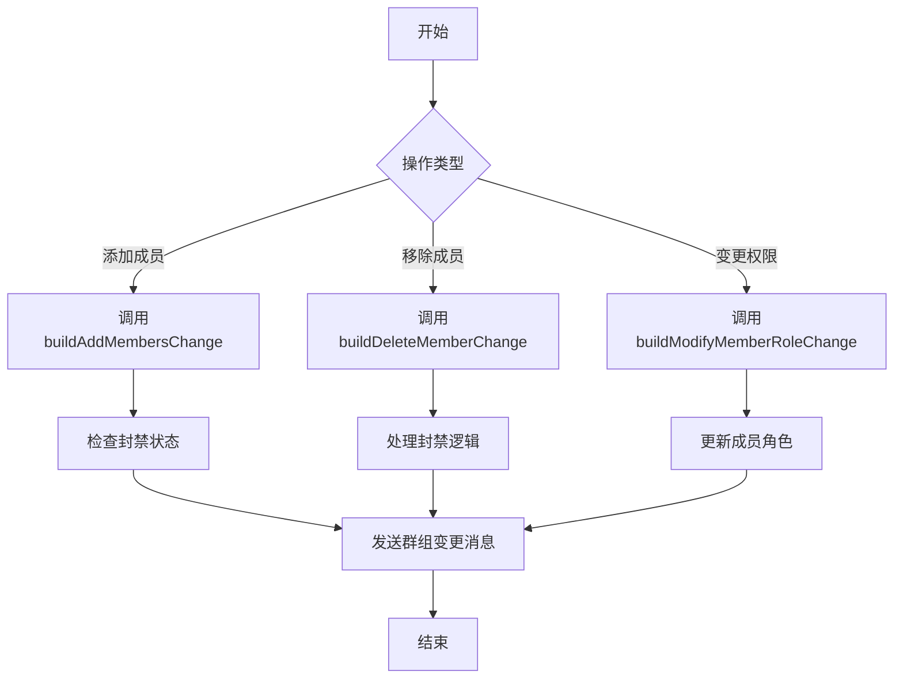
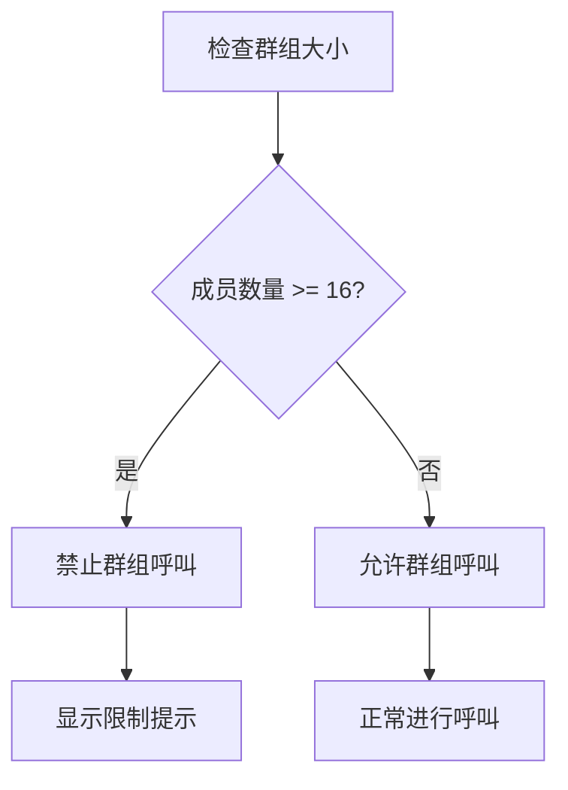

# 群组管理

<cite>
**本文档引用的文件**  
- [groups.preload.ts](file://ts/groups.preload.ts)
- [groupChange.std.ts](file://ts/groupChange.std.ts)
- [isConversationTooBigToRing.dom.ts](file://ts/conversations/isConversationTooBigToRing.dom.ts)
- [GroupV2Permissions.dom.tsx](file://ts/components/conversation/conversation-details/GroupV2Permissions.dom.tsx)
- [limits.dom.ts](file://ts/groups/limits.dom.ts)
- [util.std.ts](file://ts/groups/util.std.ts)
- [groupMembershipUtils.preload.ts](file://ts/util/groupMembershipUtils.preload.ts)
- [conversations.preload.ts](file://ts/models/conversations.preload.ts)
</cite>

## 目录
1. [群组会话属性](#群组会话属性)
2. [群组成员管理](#群组成员管理)
3. [大型群组限制](#大型群组限制)
4. [群组同步协议](#群组同步协议)
5. [群组消息与事件处理](#群组消息与事件处理)
6. [安全与隐私保护](#安全与隐私保护)

## 群组会话属性

Signal-Desktop中的群组会话具有多个特殊属性，这些属性定义了群组的基本特征和行为。群组ID是群组的唯一标识符，通过`deriveGroupID`函数从群组的密钥参数派生而来。群组名称和描述是可选字段，分别用于标识群组和提供群组的详细信息，它们在存储前会经过加密处理，以确保隐私安全。

群组头像通过`uploadAvatar`函数上传，并在群组属性中以URL形式存储。管理员权限通过`accessControl`字段管理，该字段包含`attributes`和`members`两个子字段，分别控制群组信息修改和成员添加的权限。权限级别由`Proto.AccessControl.AccessRequired`枚举定义，包括`ANY`（任何人）、`MEMBER`（成员）和`ADMINISTRATOR`（管理员）。

群组的创建和修改操作通过`buildGroupProto`函数构建群组协议缓冲区，该函数将群组属性转换为网络传输格式。群组的访问控制设置在`GroupV2Permissions`组件中实现，该组件提供了用户界面来修改群组的权限设置。

**Section sources**
- [groups.preload.ts](file://ts/groups.preload.ts#L404-L522)
- [GroupV2Permissions.dom.tsx](file://ts/components/conversation/conversation-details/GroupV2Permissions.dom.tsx#L1-L119)

## 群组成员管理

群组成员的添加、移除和权限变更通过一系列构建函数实现。`buildAddMembersChange`函数用于添加新成员，它会检查成员是否已被封禁，并在必要时解除封禁。`buildDeleteMemberChange`函数用于移除成员，它同样会处理封禁逻辑，确保成员被正确地从群组中移除。

权限变更通过`buildModifyMemberRoleChange`函数实现，该函数允许管理员将成员提升为管理员或降级为普通成员。成员的添加和移除操作需要管理员权限，且操作结果会通过群组变更消息通知所有成员。成员资格验证通过`isMember`、`isMemberPending`等函数实现，这些函数检查成员在群组中的状态。

**Diagram sources**
- [groups.preload.ts](file://ts/groups.preload.ts#L524-L1224)

**Section sources**
- [groups.preload.ts](file://ts/groups.preload.ts#L524-L1224)
- [groupMembershipUtils.preload.ts](file://ts/util/groupMembershipUtils.preload.ts#L71-L210)

## 大型群组限制

Signal-Desktop通过`isConversationTooBigToRing`函数处理大型群组的特殊限制。该函数检查群组成员数量是否超过呼叫限制，限制值通过`global.calling.maxGroupCallRingSize`远程配置获取，默认值为16。如果群组成员数量超过限制，群组将无法进行群组呼叫。

群组大小的推荐限制和硬性限制通过`getGroupSizeRecommendedLimit`和`getGroupSizeHardLimit`函数获取，这些限制值同样通过远程配置定义。当群组成员数量接近推荐限制时，系统会提示用户群组已接近最大推荐大小。

**Diagram sources**
- [isConversationTooBigToRing.dom.ts](file://ts/conversations/isConversationTooBigToRing.dom.ts#L1-L15)
- [limits.dom.ts](file://ts/groups/limits.dom.ts#L1-L34)

**Section sources**
- [isConversationTooBigToRing.dom.ts](file://ts/conversations/isConversationTooBigToRing.dom.ts#L1-L15)
- [limits.dom.ts](file://ts/groups/limits.dom.ts#L1-L34)

## 群组同步协议

群组同步协议确保多设备间群组成员和设置的一致性。`modifyGroupV2`函数负责处理群组的修改操作，它通过`uploadGroupChange`函数将变更上传到服务器，并通过`maybeUpdateGroup`函数在本地应用变更。该函数还处理冲突和重试逻辑，确保变更最终被正确应用。

群组变更消息通过`conversationJobQueue`队列发送，确保消息按顺序处理。群组的同步操作包括获取最新的群组数据、应用变更和更新本地状态。同步过程中，系统会检查成员的配置文件密钥凭证，确保所有成员的凭证都是最新的。

**Section sources**
- [groups.preload.ts](file://ts/groups.preload.ts#L1332-L1540)
- [jobs/helpers/sendGroupUpdate.preload.ts](file://ts/jobs/helpers/sendGroupUpdate.preload.ts#L28-L67)

## 群组消息与事件处理

群组消息的发送策略通过`sendToGroup`函数实现，该函数负责将消息发送给群组的所有成员。成员资格验证通过`getMemberships`函数实现，该函数返回群组中所有成员的ACI和管理员状态。群组事件（如成员变更、群组设置更新）通过`renderChange`函数处理，该函数将群组变更细节转换为用户可读的消息。

群组事件的处理包括创建、成员添加/移除、权限变更等，每种事件类型都有对应的处理逻辑。事件消息通过`GroupChange`协议缓冲区传输，并在接收端解析和显示。群组消息的发送和接收过程确保了群组状态的一致性和实时性。

**Section sources**
- [groupChange.std.ts](file://ts/groupChange.std.ts#L68-L890)
- [jobs/helpers/sendGroupCallUpdate.preload.ts](file://ts/jobs/helpers/sendGroupCallUpdate.preload.ts#L36-L84)

## 安全与隐私保护

Signal-Desktop通过多种机制保护群组的安全和隐私。群组属性（如名称、描述）在存储前经过加密处理，确保数据的机密性。群组成员的ACI（账户标识符）通过`encryptServiceId`函数加密，防止身份泄露。群组的访问控制设置确保只有授权用户才能修改群组信息。

群组的创建和修改操作需要管理员权限，防止未经授权的变更。群组的同步和消息发送过程使用端到端加密，确保通信的安全性。此外，系统还实现了封禁机制，允许管理员封禁恶意成员，维护群组的健康环境。

**Section sources**
- [groups.preload.ts](file://ts/groups.preload.ts#L314-L351)
- [util.std.ts](file://ts/groups/util.std.ts#L1-L16)
- [conversations.preload.ts](file://ts/models/conversations.preload.ts#L4751-L4790)