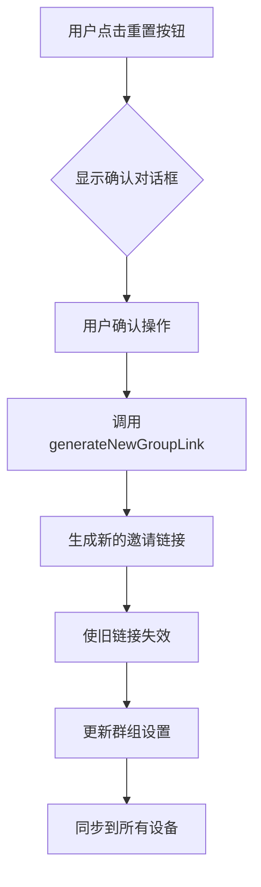
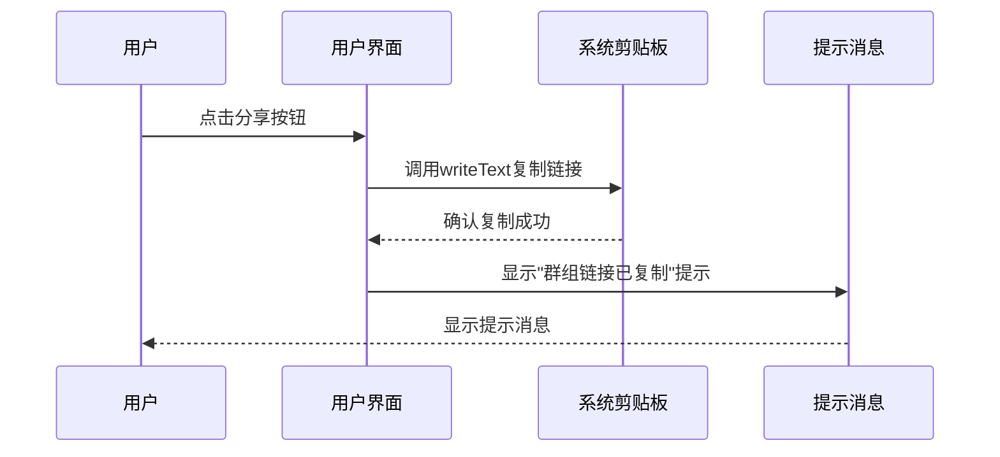
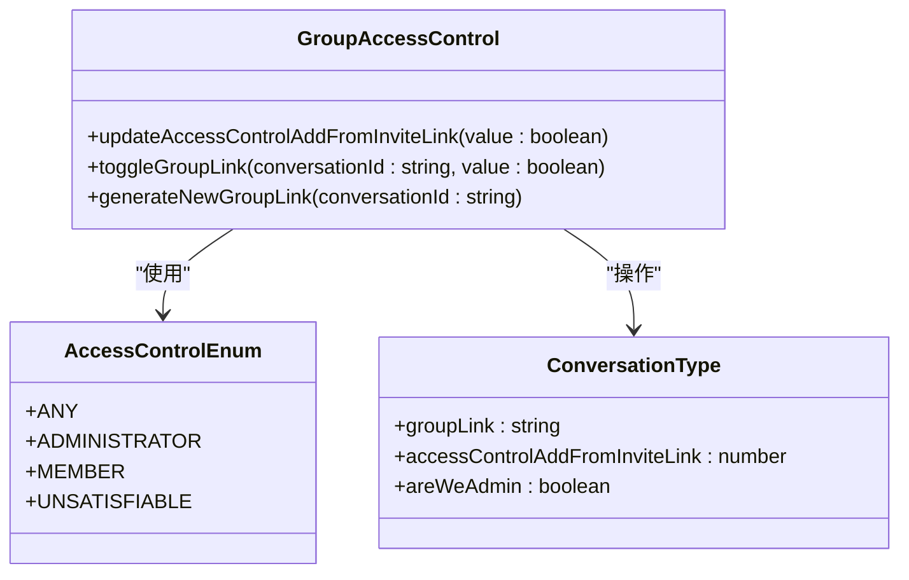
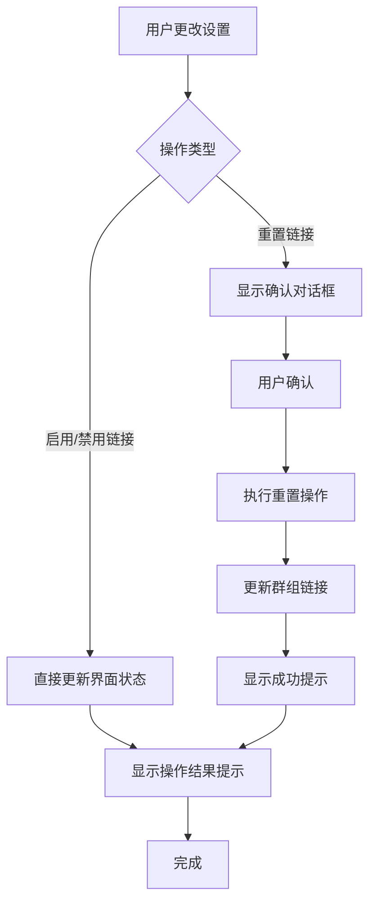
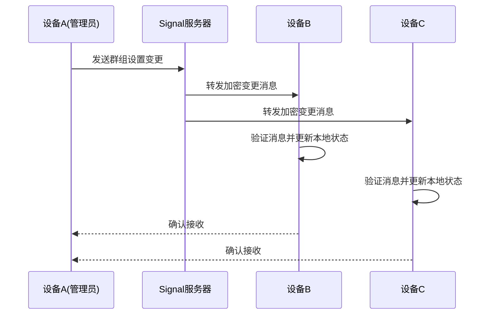
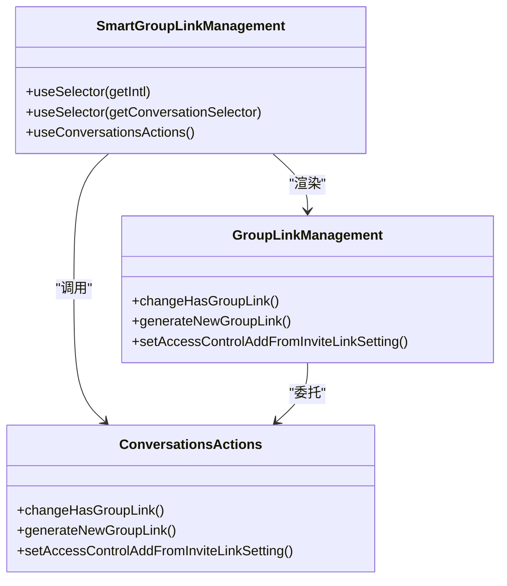

# 群组设置

<cite>
**本文档中引用的文件**  
- [GroupLinkManagement.dom.tsx](file://ts/components/conversation/conversation-details/GroupLinkManagement.dom.tsx)
- [conversations.preload.ts](file://ts/models/conversations.preload.ts)
- [groupChange.std.ts](file://ts/groupChange.std.ts)
- [messages.json](file://_locales/en/messages.json)
- [copyLinksWithToast.dom.ts](file://ts/util/copyLinksWithToast.dom.ts)
- [SmartGroupLinkManagement.preload.tsx](file://ts/state/smart/GroupLinkManagement.preload.tsx)
- [groups.preload.ts](file://ts/groups.preload.ts)
</cite>

## 目录
1. [简介](#简介)
2. [群组链接管理](#群组链接管理)
3. [访问控制设置](#访问控制设置)
4. [系统通知与用户界面反馈](#系统通知与用户界面反馈)
5. [多设备同步机制](#多设备同步机制)
6. [代码示例与状态管理](#代码示例与状态管理)

## 简介
Signal-Desktop的群组设置功能允许管理员通过群组链接管理成员加入权限。本文档详细描述了群组链接的启用/禁用、生成新链接（重置）的操作流程，以及"通过链接加入"的权限管理机制。文档还涵盖了设置变更时的系统通知、用户界面反馈、国际化文本和多设备同步机制。

## 群组链接管理

### 启用与禁用群组链接
群组管理员可以通过设置界面启用或禁用群组链接功能。当管理员切换"群组链接"开关时，系统会更新群组的访问控制策略。

- **启用链接**：当管理员将群组链接设置为"开"时，系统会生成一个唯一的群组邀请链接，允许外部用户通过该链接请求加入群组。
- **禁用链接**：当管理员将群组链接设置为"关"时，现有的群组链接将失效，外部用户无法再通过链接请求加入。

用户界面通过`Select`组件提供开关选项，只有群组管理员才能看到并操作此设置。

### 生成新链接（重置）
群组管理员可以重置群组链接以生成一个新的邀请链接，使旧链接失效。此操作通过确认对话框执行，以防止误操作。

当用户点击"重置"按钮时：
1. 系统显示确认对话框，标题为"确认重置"
2. 用户确认后，调用`generateNewGroupLink`方法生成新链接
3. 系统更新群组的邀请链接密码
4. 所有使用旧链接的加入请求将被拒绝

**Diagram sources**
- [GroupLinkManagement.dom.tsx](file://ts/components/conversation/conversation-details/GroupLinkManagement.dom.tsx#L91-L108)
- [conversations.preload.ts](file://ts/models/conversations.preload.ts#L4579-L4622)

### 复制群组链接
用户可以通过点击"分享"按钮将群组链接复制到剪贴板。系统在成功复制后会显示一个提示消息。

**Diagram sources**
- [GroupLinkManagement.dom.tsx](file://ts/components/conversation/conversation-details/GroupLinkManagement.dom.tsx#L77-L82)
- [copyLinksWithToast.dom.ts](file://ts/util/copyLinksWithToast.dom.ts#L6-L8)

**Section sources**
- [GroupLinkManagement.dom.tsx](file://ts/components/conversation/conversation-details/GroupLinkManagement.dom.tsx#L1-208)
- [copyLinksWithToast.dom.ts](file://ts/util/copyLinksWithToast.dom.ts#L1-L15)

## 访问控制设置

### 权限管理机制
"通过链接加入"的权限管理允许管理员控制谁可以通过链接加入群组。系统提供两种权限选项：

1. **任何人可加入**：任何拥有有效链接的用户都可以直接加入群组
2. **需管理员批准**：用户通过链接请求加入后，需要管理员批准才能成为正式成员

### 业务规则实现
权限设置通过`accessControlAddFromInviteLink`属性实现，该属性基于Protocol Buffer定义的访问控制枚举：

- `ACCESS_ENUM.ANY`：表示任何人可以通过链接加入
- `ACCESS_ENUM.ADMINISTRATOR`：表示需要管理员批准
- `ACCESS_ENUM.UNSATISFIABLE`：表示链接功能被禁用

当管理员更改设置时，系统调用`updateAccessControlAddFromInviteLink`方法更新群组配置。

**Diagram sources**
- [conversations.preload.ts](file://ts/models/conversations.preload.ts#L4624-L4652)
- [GroupLinkManagement.dom.tsx](file://ts/components/conversation/conversation-details/GroupLinkManagement.dom.tsx#L173-L202)

**Section sources**
- [conversations.preload.ts](file://ts/models/conversations.preload.ts#L4579-L4652)
- [GroupLinkManagement.dom.tsx](file://ts/components/conversation/conversation-details/GroupLinkManagement.dom.tsx#L173-L202)

## 系统通知与用户界面反馈

### 国际化提示文本
系统使用国际化文件(messages.json)提供多语言支持。以下是与群组链接相关的提示文本：

- **启用链接（需批准）**："您已启用需管理员批准的群组链接"
- **启用链接（无需批准）**："您已启用无需管理员批准的群组链接"
- **禁用链接**："您已禁用群组链接"
- **重置链接**："您已重置群组链接"
- **链接已复制**："群组链接已复制"

这些文本通过`i18n`函数调用，确保用户界面显示正确的语言版本。

### 用户界面反馈
系统通过多种方式向用户提供操作反馈：

1. **确认对话框**：在执行重置等重要操作前显示确认对话框
2. **提示消息(Toast)**：操作成功后显示短暂的提示消息
3. **状态更新**：实时更新界面显示当前设置状态

**Diagram sources**
- [messages.json](file://_locales/en/messages.json#L4174-L4203)
- [ToastManager.dom.tsx](file://ts/components/ToastManager.dom.tsx#L584-L589)

**Section sources**
- [messages.json](file://_locales/en/messages.json#L4174-L4203)
- [groupChange.std.ts](file://ts/groupChange.std.ts#L788-L826)

## 多设备同步机制

### 同步流程
群组设置变更会在用户的所有设备间同步，确保设置一致性。同步机制通过Signal的端到端加密协议实现。

当管理员在一个设备上更改群组设置时：
1. 设备生成群组变更消息
2. 消息通过Signal服务器发送到其他设备
3. 其他设备接收并应用变更
4. 所有设备更新本地群组状态

### 数据一致性保障
系统通过以下机制确保多设备间的数据一致性：

- **版本控制**：群组设置包含版本号，确保按正确顺序应用变更
- **冲突解决**：当多个设备同时更改设置时，系统使用时间戳和设备优先级解决冲突
- **状态验证**：设备在应用变更前验证消息的完整性和真实性

**Diagram sources**
- [groups.preload.ts](file://ts/groups.preload.ts#L243-L264)
- [conversations.preload.ts](file://ts/models/conversations.preload.ts#L4579-L4622)

**Section sources**
- [groups.preload.ts](file://ts/groups.preload.ts#L243-L292)
- [conversations.preload.ts](file://ts/models/conversations.preload.ts#L4579-L4622)

## 代码示例与状态管理

### 状态管理架构
群组设置功能采用Redux状态管理模式，将UI组件与业务逻辑分离。`SmartGroupLinkManagement`组件负责连接Redux状态，而`GroupLinkManagement`组件专注于UI渲染。

**Diagram sources**
- [SmartGroupLinkManagement.preload.tsx](file://ts/state/smart/GroupLinkManagement.preload.tsx#L1-L38)
- [conversations.preload.ts](file://ts/state/ducks/conversations.preload.ts#L1-L200)

### 事件处理流程
群组设置的事件处理遵循清晰的流程：

1. **UI事件捕获**：用户在界面进行操作
2. **动作分发**：UI组件分发相应的Redux动作
3. **状态更新**：Reducer处理动作并更新状态
4. **副作用执行**：中间件处理网络请求等副作用
5. **界面刷新**：组件重新渲染以反映新状态

这种架构确保了状态变更的可预测性和可追溯性，同时支持多设备间的同步。

**Section sources**
- [SmartGroupLinkManagement.preload.tsx](file://ts/state/smart/GroupLinkManagement.preload.tsx#L1-L38)
- [conversations.preload.ts](file://ts/state/ducks/conversations.preload.ts#L1-L200)