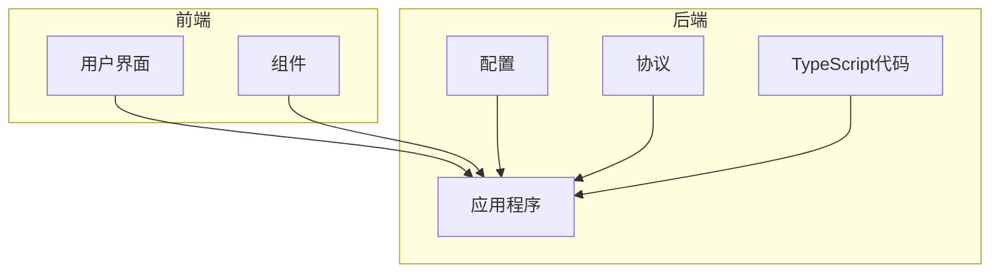
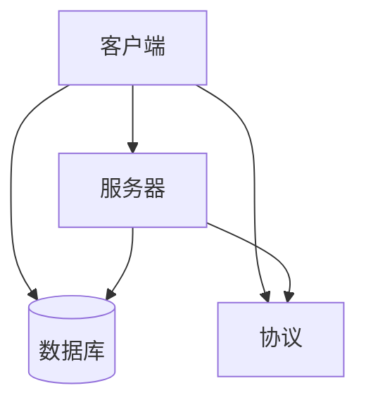
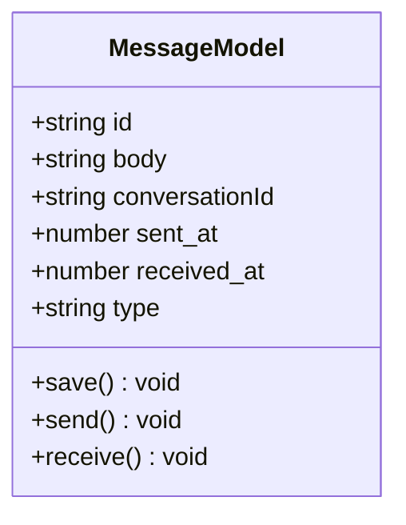
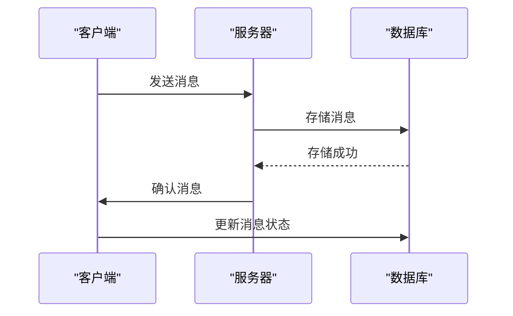
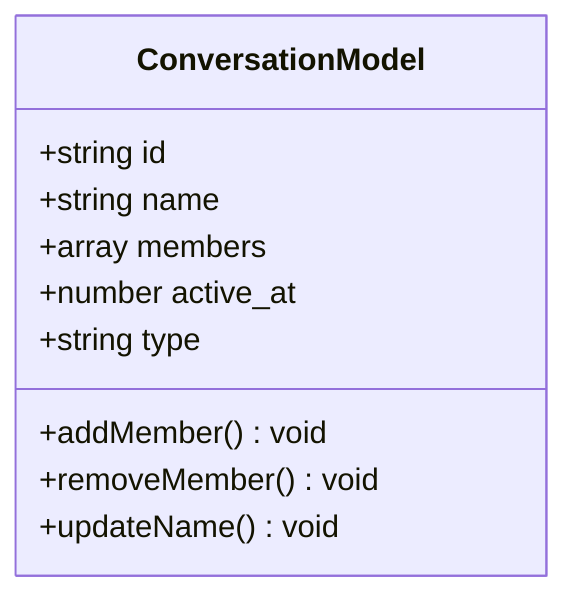
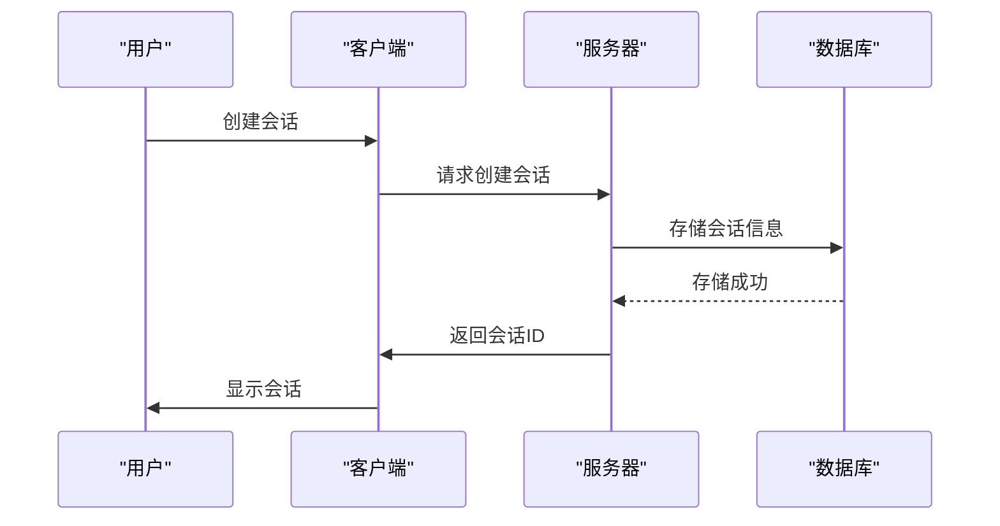
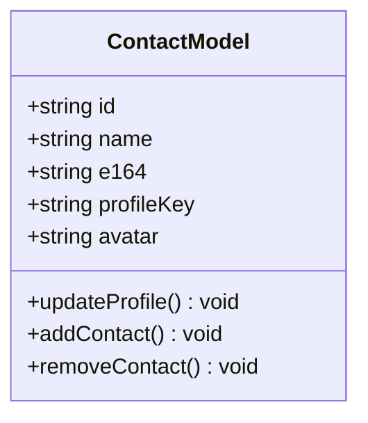
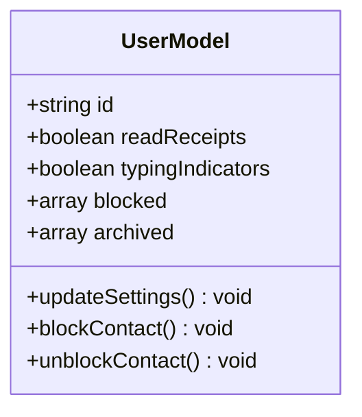
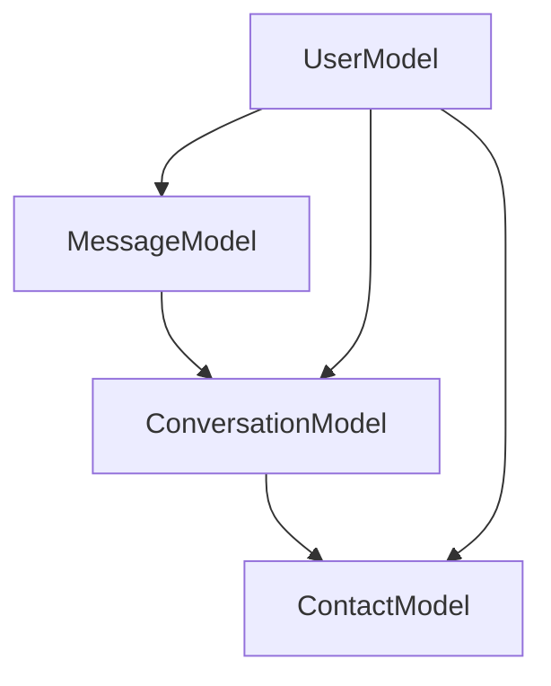

# 数据模型

<cite>
**本文档引用的文件**
- [SignalStorage.proto](file://protos/SignalStorage.proto)
- [SignalService.proto](file://protos/SignalService.proto)
- [conversations.preload.ts](file://ts/models/conversations.preload.ts)
- [messages.preload.ts](file://ts/models/messages.preload.ts)
- [Server.node.ts](file://ts/sql/Server.node.ts)
- [Interface.std.ts](file://ts/sql/Interface.std.ts)
- [model-types.d.ts](file://ts/model-types.d.ts)
- [migrations/index.node.ts](file://ts/sql/migrations/index.node.ts)
</cite>

## 目录
1. [引言](#引言)
2. [项目结构](#项目结构)
3. [核心组件](#核心组件)
4. [架构概述](#架构概述)
5. [详细组件分析](#详细组件分析)
6. [依赖分析](#依赖分析)
7. [性能考虑](#性能考虑)
8. [故障排除指南](#故障排除指南)
9. [结论](#结论)

## 引言
本文档旨在为Signal-Desktop创建全面的数据模型文档，详细说明实体关系、字段定义和数据类型。文档将记录主键/外键、索引和约束，解释数据验证规则和业务规则，并包括数据库模式图和示例数据。此外，文档还将涵盖数据访问模式、缓存策略、性能考虑、数据生命周期、保留策略、归档规则、数据迁移路径和版本管理。特别关注消息、会话、联系人和用户配置等核心数据模型。

## 项目结构
Signal-Desktop的项目结构遵循模块化设计，主要分为以下几个部分：
- `_locales`：包含多语言支持文件
- `app`：应用程序主逻辑
- `components`：UI组件
- `config`：配置文件
- `protos`：协议缓冲区定义
- `ts`：TypeScript源代码
- `stylesheets`：样式表

**图表来源**
- [SignalStorage.proto](file://protos/SignalStorage.proto)
- [SignalService.proto](file://protos/SignalService.proto)

**章节来源**
- [SignalStorage.proto](file://protos/SignalStorage.proto)
- [SignalService.proto](file://protos/SignalService.proto)

## 核心组件
Signal-Desktop的核心组件包括消息、会话、联系人和用户配置等。这些组件通过数据库和协议缓冲区进行数据交换和持久化。

**章节来源**
- [conversations.preload.ts](file://ts/models/conversations.preload.ts)
- [messages.preload.ts](file://ts/models/messages.preload.ts)

## 架构概述
Signal-Desktop的架构基于客户端-服务器模型，使用SQLite数据库进行本地数据存储，并通过协议缓冲区与服务器进行通信。系统的主要组件包括：
- **消息模型**：处理消息的创建、发送和接收
- **会话模型**：管理用户之间的会话
- **联系人模型**：存储和管理联系人信息
- **用户配置模型**：保存用户的个性化设置

**图表来源**
- [Server.node.ts](file://ts/sql/Server.node.ts)
- [Interface.std.ts](file://ts/sql/Interface.std.ts)

## 详细组件分析
### 消息模型分析
消息模型是Signal-Desktop的核心，负责处理所有消息相关的操作。消息模型的主要属性包括：
- `id`：消息的唯一标识符
- `body`：消息正文
- `conversationId`：所属会话的ID
- `sent_at`：发送时间戳
- `received_at`：接收时间戳
- `type`：消息类型（如文本、图片、视频等）

#### 消息模型类图

**图表来源**
- [messages.preload.ts](file://ts/models/messages.preload.ts)

#### 消息处理序列图

**图表来源**
- [Server.node.ts](file://ts/sql/Server.node.ts)
- [messages.preload.ts](file://ts/models/messages.preload.ts)

### 会话模型分析
会话模型管理用户之间的对话，包括一对一聊天和群聊。会话模型的主要属性包括：
- `id`：会话的唯一标识符
- `name`：会话名称
- `members`：成员列表
- `active_at`：最后活跃时间
- `type`：会话类型（私聊或群聊）

#### 会话模型类图

**图表来源**
- [conversations.preload.ts](file://ts/models/conversations.preload.ts)

#### 会话创建序列图

**图表来源**
- [Server.node.ts](file://ts/sql/Server.node.ts)
- [conversations.preload.ts](file://ts/models/conversations.preload.ts)

### 联系人模型分析
联系人模型存储和管理用户的联系人信息，包括姓名、电话号码、头像等。联系人模型的主要属性包括：
- `id`：联系人的唯一标识符
- `name`：联系人姓名
- `e164`：电话号码
- `profileKey`：个人资料密钥
- `avatar`：头像

#### 联系人模型类图

**图表来源**
- [conversations.preload.ts](file://ts/models/conversations.preload.ts)

### 用户配置模型分析
用户配置模型保存用户的个性化设置，如通知偏好、隐私设置等。用户配置模型的主要属性包括：
- `id`：用户的唯一标识符
- `readReceipts`：是否开启已读回执
- `typingIndicators`：是否显示输入指示器
- `blocked`：被屏蔽的联系人列表
- `archived`：归档的会话列表

#### 用户配置模型类图

**图表来源**
- [SignalStorage.proto](file://protos/SignalStorage.proto)

## 依赖分析
Signal-Desktop的各个组件之间存在复杂的依赖关系。消息模型依赖于会话模型来确定消息的归属，会话模型依赖于联系人模型来管理成员，用户配置模型则影响所有其他组件的行为。

**图表来源**
- [conversations.preload.ts](file://ts/models/conversations.preload.ts)
- [messages.preload.ts](file://ts/models/messages.preload.ts)
- [SignalStorage.proto](file://protos/SignalStorage.proto)

**章节来源**
- [conversations.preload.ts](file://ts/models/conversations.preload.ts)
- [messages.preload.ts](file://ts/models/messages.preload.ts)
- [SignalStorage.proto](file://protos/SignalStorage.proto)

## 性能考虑
为了确保Signal-Desktop的高性能，系统采用了多种优化策略：
- **数据库索引**：为常用查询字段创建索引，提高查询速度
- **缓存机制**：使用内存缓存减少数据库访问次数
- **异步处理**：将耗时操作异步化，避免阻塞主线程
- **数据压缩**：对传输的数据进行压缩，减少网络带宽消耗

## 故障排除指南
在使用Signal-Desktop时，可能会遇到一些常见问题。以下是一些故障排除建议：
- **消息发送失败**：检查网络连接，确认服务器地址正确
- **消息接收延迟**：检查设备的推送通知设置，确保应用在后台运行时能接收通知
- **联系人同步问题**：重新启动应用，或手动触发联系人同步
- **性能下降**：清理缓存，关闭不必要的功能

**章节来源**
- [Server.node.ts](file://ts/sql/Server.node.ts)
- [conversations.preload.ts](file://ts/models/conversations.preload.ts)
- [messages.preload.ts](file://ts/models/messages.preload.ts)

## 结论
本文档详细介绍了Signal-Desktop的数据模型，涵盖了消息、会话、联系人和用户配置等核心组件。通过分析这些组件的结构和关系，我们可以更好地理解系统的运作机制，并为未来的开发和维护提供指导。希望这份文档能够帮助开发者和用户更好地使用Signal-Desktop。