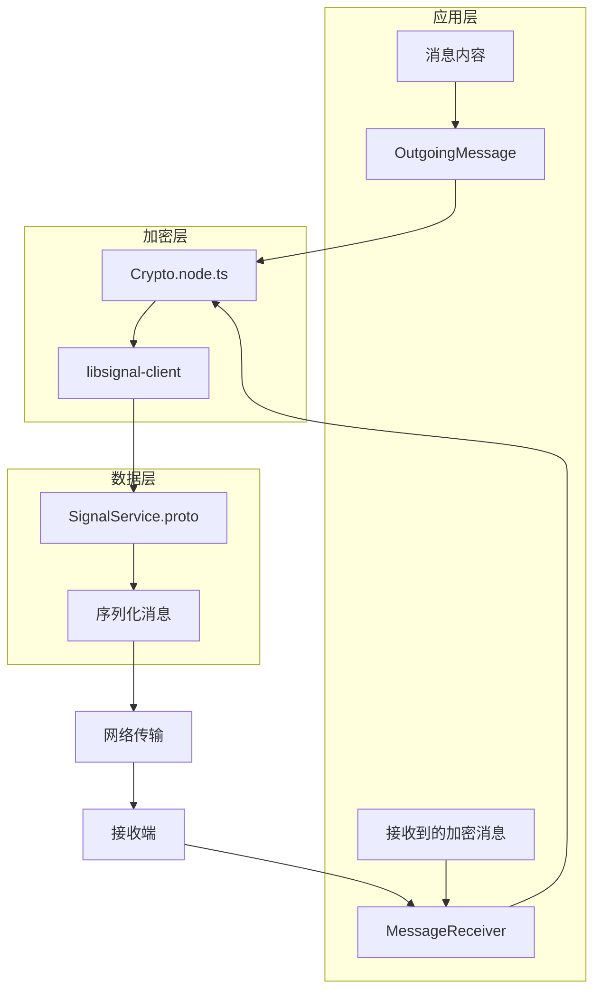
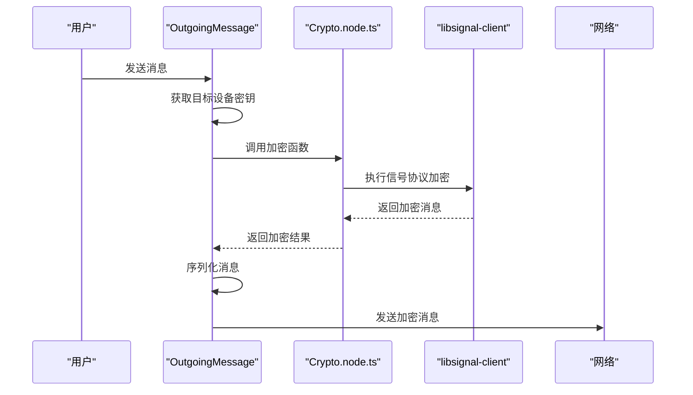
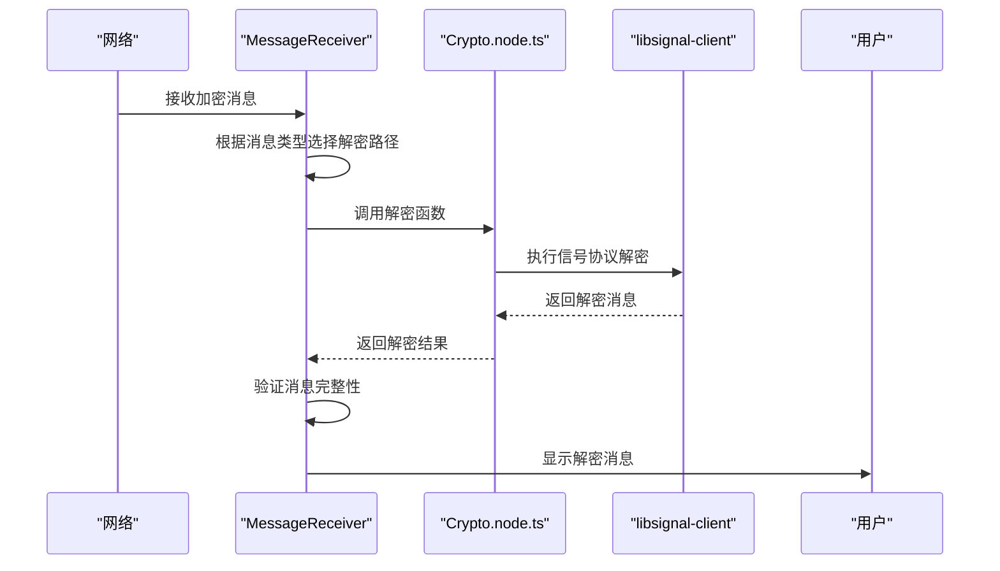

# 加密机制

<cite>
**本文档引用的文件**   
- [Crypto.node.ts](file://ts/Crypto.node.ts)
- [OutgoingMessage.preload.ts](file://ts/textsecure/OutgoingMessage.preload.ts)
- [processDataMessage.preload.ts](file://ts/textsecure/processDataMessage.preload.ts)
- [SignalService.proto](file://protos/SignalService.proto)
- [AttachmentCrypto.node.ts](file://ts/AttachmentCrypto.node.ts)
- [context/Crypto.node.ts](file://ts/context/Crypto.node.ts)
- [types/Crypto.std.ts](file://ts/types/Crypto.std.ts)
- [LibSignalStores.preload.ts](file://ts/LibSignalStores.preload.ts)
</cite>

## 目录
1. [引言](#引言)
2. [端到端加密架构概述](#端到端加密架构概述)
3. [核心加密组件分析](#核心加密组件分析)
4. [消息加密流程](#消息加密流程)
5. [消息解密流程](#消息解密流程)
6. [加密算法与实现细节](#加密算法与实现细节)
7. [协议缓冲区结构与数据序列化](#协议缓冲区结构与数据序列化)
8. [加密上下文管理与错误处理](#加密上下文管理与错误处理)
9. [性能优化策略](#性能优化策略)
10. [结论](#结论)

## 引言
Signal-Desktop 应用程序实现了基于 Signal 协议的端到端加密机制，确保用户通信的最高安全性。本文档深入分析了 Signal-Desktop 的加密实现，重点关注消息加密和解密的完整流程。文档详细说明了会话管理、密钥交换、消息加密/解密的具体实现，以及加密算法的选择和应用。通过分析 OutgoingMessage.preload.ts 中的消息加密处理步骤和 processDataMessage.preload.ts 中的接收到的消息解密过程，本文档提供了对 Signal-Desktop 加密机制的全面理解。此外，文档还解释了加密相关的 Protocol Buffers 结构（SignalService.proto）和数据序列化格式，并通过时序图展示了密钥协商和消息保护的完整流程。

## 端到端加密架构概述
Signal-Desktop 的端到端加密架构基于 Signal 协议，该协议结合了双棘轮算法、前向保密和可否认性等先进安全特性。系统的核心是 libsignal-client 库，它提供了加密原语和协议实现。加密操作主要在 `ts/Crypto.node.ts` 文件中进行封装，该文件提供了对底层加密功能的高级访问。消息的加密和解密流程由 `OutgoingMessage.preload.ts` 和 `processDataMessage.preload.ts` 文件中的类和函数处理，这些组件负责将应用层数据转换为安全的加密消息，并在接收端进行解密。整个架构通过 Protocol Buffers（SignalService.proto）定义了消息的结构和序列化格式，确保了跨平台的一致性和互操作性。

**Diagram sources**
- [OutgoingMessage.preload.ts](file://ts/textsecure/OutgoingMessage.preload.ts)
- [processDataMessage.preload.ts](file://ts/textsecure/processDataMessage.preload.ts)
- [Crypto.node.ts](file://ts/Crypto.node.ts)
- [SignalService.proto](file://protos/SignalService.proto)

## 核心加密组件分析
Signal-Desktop 的加密机制由多个核心组件协同工作，每个组件负责特定的加密任务。`Crypto.node.ts` 是加密功能的主要入口，它封装了对底层加密库的调用，并提供了高级加密操作，如对称加密、非对称加密和哈希计算。`OutgoingMessage.preload.ts` 负责处理消息的发送和加密，它管理会话、生成密钥并执行消息的加密操作。`processDataMessage.preload.ts` 则负责接收和解密消息，它验证消息的完整性并将其转换为可读的格式。`SignalService.proto` 定义了消息的结构和序列化格式，确保了消息在不同平台和设备之间的一致性。

### Crypto.node.ts 分析
`Crypto.node.ts` 文件是 Signal-Desktop 加密功能的核心，它提供了对各种加密操作的封装。该文件定义了 `HashType` 和 `CipherType` 枚举，用于指定哈希算法和加密算法。文件中实现了多种加密函数，包括 `encryptSymmetric` 和 `decryptSymmetric` 用于对称加密，`encryptDeviceName` 和 `decryptDeviceName` 用于设备名称的加密和解密。此外，文件还提供了 `deriveSecrets` 函数，用于从输入密钥派生多个秘密，这在密钥协商和会话建立过程中至关重要。

**Section sources**
- [Crypto.node.ts](file://ts/Crypto.node.ts#L26-L214)

### OutgoingMessage.preload.ts 分析
`OutgoingMessage.preload.ts` 文件中的 `OutgoingMessage` 类负责处理消息的发送和加密。该类在构造时接收消息内容、目标服务ID和发送选项，并在 `doSendMessage` 方法中执行实际的加密和发送操作。类中使用了 `signalEncrypt` 函数来加密消息内容，并根据是否启用了密封发送者（sealed sender）来选择不同的加密模式。`transmitMessage` 方法负责将加密后的消息通过网络发送到目标设备。

**Section sources**
- [OutgoingMessage.preload.ts](file://ts/textsecure/OutgoingMessage.preload.ts#L127-L740)

### processDataMessage.preload.ts 分析
`processDataMessage.preload.ts` 文件中的 `processDataMessage` 函数负责处理接收到的加密消息。该函数首先验证消息的时间戳，然后根据消息类型调用相应的处理函数。对于附件，函数使用 `processAttachment` 进行处理；对于群组消息，使用 `processGroupV2Context` 进行处理。函数还处理了各种消息标志，如会话结束、过期计时器更新和配置文件密钥更新，并确保消息的附件数量不超过最大限制。

**Section sources**
- [processDataMessage.preload.ts](file://ts/textsecure/processDataMessage.preload.ts#L457-L572)

## 消息加密流程
消息加密流程始于用户发送消息时，`OutgoingMessage` 类被实例化并接收消息内容和目标服务ID。首先，系统通过 `getKeysForServiceId` 获取目标设备的公钥和预密钥。然后，`doSendMessage` 方法被调用，该方法根据是否启用了密封发送者来选择加密模式。如果启用了密封发送者，系统使用 `sealedSenderEncrypt` 函数对消息进行加密，该函数结合了发送者证书和目标设备的公钥来生成加密消息。否则，系统使用 `signalEncrypt` 函数进行标准的双棘轮加密。加密后的消息被序列化为 Protocol Buffers 格式，并通过 `transmitMessage` 方法发送到目标设备。

**Diagram sources**
- [OutgoingMessage.preload.ts](file://ts/textsecure/OutgoingMessage.preload.ts#L414-L686)
- [Crypto.node.ts](file://ts/Crypto.node.ts#L405-L412)

## 消息解密流程
消息解密流程始于接收到加密消息时，`MessageReceiver` 类调用 `innerDecrypt` 方法来处理消息。该方法首先根据消息类型（如双棘轮、预密钥或未识别发送者）选择相应的解密路径。对于双棘轮消息，系统使用 `signalDecrypt` 函数进行解密；对于预密钥消息，使用 `signalDecryptPreKey` 函数。解密过程涉及会话管理，系统会从 `signalProtocolStore` 中加载会话记录，并使用会话密钥对消息进行解密。解密后的消息内容被验证时间戳和完整性，然后传递给 `processDataMessage` 函数进行进一步处理。

**Diagram sources**
- [MessageReceiver.preload.ts](file://ts/textsecure/MessageReceiver.preload.ts#L1822-L1946)
- [Crypto.node.ts](file://ts/Crypto.node.ts#L405-L412)

## 加密算法与实现细节
Signal-Desktop 使用了多种加密算法来确保通信的安全性。对称加密主要使用 AES-256 算法，支持 CBC、CTR 和 GCM 模式。非对称加密基于椭圆曲线密码学，使用 Curve25519 进行密钥交换。哈希函数使用 SHA-256 和 SHA-512，用于消息认证码（MAC）和密钥派生。`Crypto.node.ts` 文件中的 `encryptSymmetric` 和 `decryptSymmetric` 函数实现了对称加密，使用 HMAC-SHA256 生成消息认证码以确保消息完整性。`deriveSecrets` 函数使用 HKDF（HMAC-based Key Derivation Function）从输入密钥派生多个秘密，这在密钥协商过程中至关重要。

### 对称加密实现
对称加密在 `Crypto.node.ts` 文件中通过 `encryptSymmetric` 和 `decryptSymmetric` 函数实现。`encryptSymmetric` 函数生成一个随机的16字节nonce，然后使用 HMAC-SHA256 从主密钥和nonce派生出加密密钥和MAC密钥。消息使用 AES-256-CBC 模式加密，然后计算消息的MAC并附加到密文末尾。`decryptSymmetric` 函数首先验证MAC，然后使用相同的密钥和IV解密消息。

**Section sources**
- [Crypto.node.ts](file://ts/Crypto.node.ts#L230-L281)

### 非对称加密与密钥交换
非对称加密和密钥交换在 `OutgoingMessage` 类中实现。当发送消息时，系统使用目标设备的公钥和本地的临时私钥计算共享密钥。这个共享密钥用于生成加密消息的密钥材料。`encryptDeviceName` 函数展示了这一过程，它生成一个临时密钥对，使用目标设备的公钥和本地的临时私钥计算主密钥，然后使用该主密钥派生出加密和认证密钥。

**Section sources**
- [Crypto.node.ts](file://ts/Crypto.node.ts#L112-L159)

### 哈希函数应用
哈希函数在 Signal-Desktop 中有多种应用。`hmacSha256` 函数用于生成消息认证码，确保消息的完整性和真实性。`sha256` 函数用于计算数据的哈希值，用于附件的完整性验证。`computeHash` 函数使用 SHA-512 计算数据的哈希值，用于生成唯一标识符。这些哈希函数在 `Crypto.node.ts` 文件中通过 `sign` 和 `hash` 函数调用底层加密库实现。

**Section sources**
- [Crypto.node.ts](file://ts/Crypto.node.ts#L285-L392)

## 协议缓冲区结构与数据序列化
Signal-Desktop 使用 Protocol Buffers（protobuf）来定义消息的结构和序列化格式。`SignalService.proto` 文件定义了消息的各个组件，包括信封（Envelope）、内容（Content）和数据消息（DataMessage）。信封包含消息的元数据，如类型、源服务ID、目标服务ID和时间戳。内容包含实际的消息数据，可以是文本、附件、联系人等。数据消息结构定义了消息的具体内容，包括正文、附件、引用、预览等字段。这些结构通过 protobuf 编译器生成 TypeScript 代码，用于在应用中序列化和反序列化消息。

### 信封结构
信封结构（Envelope）是消息的顶层容器，它包含消息的元数据。信封类型（Type）字段指定了消息的加密模式，如双棘轮、预密钥或未识别发送者。源服务ID（sourceServiceId）和目标服务ID（destinationServiceId）字段标识了消息的发送者和接收者。客户端时间戳（clientTimestamp）字段记录了消息的发送时间。内容（content）字段包含加密后的消息数据。

**Section sources**
- [SignalService.proto](file://protos/SignalService.proto#L13-L103)

### 内容结构
内容结构（Content）包含实际的消息数据。它可以包含多种类型的消息，如数据消息（dataMessage）、同步消息（syncMessage）、通话消息（callMessage）等。数据消息（DataMessage）是最常见的消息类型，它包含文本、附件、引用、预览等内容。同步消息用于设备之间的同步，包含联系人、配置、密钥等信息。每种消息类型都有其特定的字段和结构，确保了消息的丰富性和灵活性。

**Section sources**
- [SignalService.proto](file://protos/SignalService.proto#L106-L435)

### 数据序列化
数据序列化通过 protobuf 的编码机制实现。消息对象被序列化为二进制格式，然后通过网络传输。在接收端，二进制数据被反序列化为消息对象。`Proto.Content.encode` 和 `Proto.Content.decode` 函数用于序列化和反序列化内容对象。`padMessage` 函数在序列化前对消息进行填充，以防止某些类型的密码分析攻击。

**Section sources**
- [OutgoingMessage.preload.ts](file://ts/textsecure/OutgoingMessage.preload.ts#L117-L125)
- [processDataMessage.preload.ts](file://ts/textsecure/processDataMessage.preload.ts#L496-L527)

## 加密上下文管理与错误处理
Signal-Desktop 的加密上下文管理主要通过 `LibSignalStores.preload.ts` 文件中的类实现。这些类封装了对会话、身份密钥、预密钥等的存储和管理。`Sessions` 类负责管理会话记录，`IdentityKeys` 类管理身份密钥，`PreKeys` 类管理预密钥。这些存储类通过 `signalProtocolStore` 与底层数据库交互，确保加密状态的持久化。

### 会话管理
会话管理是 Signal 协议的核心，它确保了消息的前向保密和可否认性。`Sessions` 类提供了加载、存储和删除会话记录的方法。`loadSession` 方法从数据库加载会话记录，`storeSession` 方法将更新后的会话记录保存到数据库。会话记录包含发送和接收链的状态，用于加密和解密消息。

**Section sources**
- [LibSignalStores.preload.ts](file://ts/LibSignalStores.preload.ts#L1-L1450)

### 错误处理
错误处理在加密流程中至关重要，它确保了系统的健壮性和用户体验。`OutgoingMessage` 类中的 `registerError` 方法用于记录发送过程中的错误，如网络错误、身份密钥不信任等。`processDataMessage` 函数在处理消息时会验证各种条件，如时间戳匹配、附件数量限制等，如果发现错误会抛出相应的异常。这些错误会被上层组件捕获并适当地处理，如重试发送或向用户显示错误信息。

**Section sources**
- [OutgoingMessage.preload.ts](file://ts/textsecure/OutgoingMessage.preload.ts#L256-L275)
- [processDataMessage.preload.ts](file://ts/textsecure/processDataMessage.preload.ts#L471-L482)

## 性能优化策略
Signal-Desktop 在加密实现中采用了多种性能优化策略，以确保在各种设备上都能提供流畅的用户体验。对于大附件的加密和解密，系统使用流式处理，避免将整个文件加载到内存中。`AttachmentCrypto.node.ts` 文件中的 `encryptAttachmentV2ToDisk` 和 `decryptAttachmentV2` 函数实现了流式加密和解密，通过管道（pipeline）将数据从源流传输到目标流，同时进行加密、解密和完整性验证。

### 流式加密
流式加密通过 Node.js 的流（stream）API 实现。`encryptAttachmentV2ToDisk` 函数创建一个写入流到目标文件，然后通过管道将数据从源（文件、流或数据）传输到加密管道。加密管道包括填充、加密、添加MAC等步骤，所有这些步骤都在数据流经管道时实时完成。这种方法大大减少了内存使用，特别适合处理大文件。

**Section sources**
- [AttachmentCrypto.node.ts](file://ts/AttachmentCrypto.node.ts#L118-L236)

### 并行处理
并行处理在多设备消息发送中得到应用。`doSendMessage` 方法使用 `Promise.all` 并行处理多个目标设备的消息加密和发送。这减少了总的发送时间，特别是在目标设备较多的情况下。每个设备的消息加密和发送都在独立的 Promise 中执行，然后通过 `Promise.all` 等待所有操作完成。

**Section sources**
- [OutgoingMessage.preload.ts](file://ts/textsecure/OutgoingMessage.preload.ts#L454-L536)

## 结论
Signal-Desktop 的端到端加密机制是一个复杂而精密的系统，它结合了先进的密码学算法和精心设计的软件架构。通过分析核心组件、加密流程、算法实现和性能优化策略，我们可以看到 Signal-Desktop 如何在保证最高安全性的同时，提供流畅的用户体验。该系统的核心优势在于其模块化设计，每个组件都有明确的职责，使得系统易于维护和扩展。未来的工作可以进一步优化大附件的处理性能，探索新的加密算法以应对未来的安全挑战，并增强系统的可审计性和透明度。