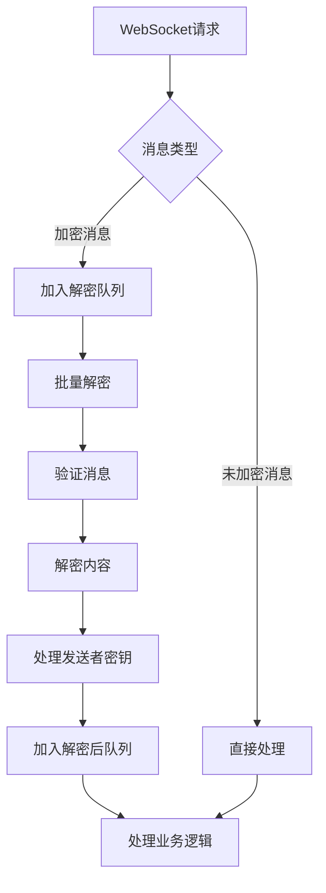
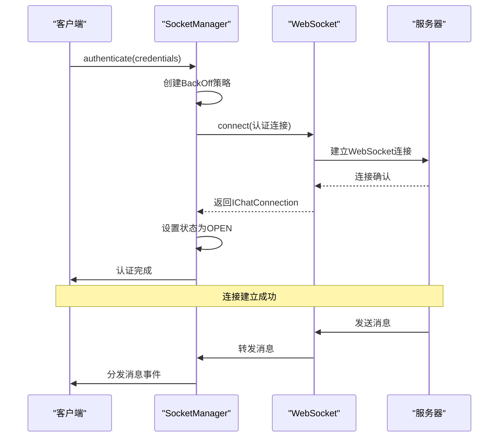
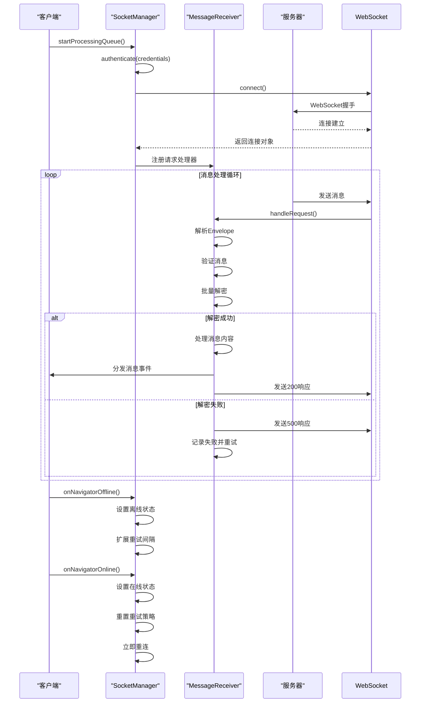

# 协议实现

<cite>
**本文档引用的文件**   
- [SignalService.proto](file://protos/SignalService.proto)
- [MessageReceiver.preload.ts](file://ts/textsecure/MessageReceiver.preload.ts)
- [WebSocket.preload.ts](file://ts/textsecure/WebSocket.preload.ts)
- [SocketManager.preload.ts](file://ts/textsecure/SocketManager.preload.ts)
- [processDataMessage.preload.ts](file://ts/textsecure/processDataMessage.preload.ts)
- [processSyncMessage.node.ts](file://ts/textsecure/processSyncMessage.node.ts)
</cite>

## 目录
1. [协议消息格式](#协议消息格式)
2. [消息接收与路由](#消息接收与路由)
3. [网络通信层实现](#网络通信层实现)
4. [协议版本管理与消息确认](#协议版本管理与消息确认)
5. [协议交互时序图](#协议交互时序图)
6. [协议扩展性与错误恢复](#协议扩展性与错误恢复)

## 协议消息格式

Signal协议基于Protocol Buffers定义了丰富的消息格式，通过`SignalService.proto`文件中的`Envelope`和`Content`消息结构实现。`Envelope`作为外层容器，包含消息类型、时间戳、发送者和接收者等元数据，而`Content`则封装了具体的业务消息内容。

`Envelope`消息定义了多种类型，包括：
- **DOUBLE_RATCHET**: 标准的双棘轮加密消息
- **PREKEY_MESSAGE**: 用于建立新会话的预密钥消息
- **SERVER_DELIVERY_RECEIPT**: 服务器生成的送达回执
- **UNIDENTIFIED_SENDER**: 匿名发送者消息，提供元数据保护
- **PLAINTEXT_CONTENT**: 用于传输加密错误回执的明文消息

`Content`消息通过`oneof`字段包含多种具体消息类型，主要包括：
- **DataMessage**: 文本消息、附件、联系人、贴纸等
- **SyncMessage**: 同步消息，用于设备间数据同步
- **CallMessage**: 通话信令消息
- **ReceiptMessage**: 已读、已送达等回执消息
- **TypingMessage**: 正在输入状态消息

**Section sources**
- [SignalService.proto](file://protos/SignalService.proto#L13-L800)

## 消息接收与路由

`MessageReceiver.preload.ts`实现了消息接收和路由的核心逻辑，采用多队列架构处理消息的解密、缓存和分发。该组件继承自`EventTarget`，通过事件机制将处理后的消息分发给相应的处理器。

消息处理流程如下：
1. 通过`handleRequest`接收WebSocket请求，解析`Envelope`并创建`ProcessedEnvelope`对象
2. 将消息加入`#decryptAndCacheBatcher`批处理队列，进行批量解密和缓存
3. 解密后通过`#queueDecryptedEnvelope`将消息加入解密队列
4. 最终通过`#handleDecryptedEnvelope`处理解密后的消息内容

消息解密过程区分了加密和未加密消息，并支持密封发送者（sealed sender）消息的解密。对于`UNIDENTIFIED_SENDER`类型的消息，使用`sealedSenderDecryptToUsmc`函数进行解密，提取发送者证书和实际消息内容。

**Diagram sources **
- [MessageReceiver.preload.ts](file://ts/textsecure/MessageReceiver.preload.ts#L381-L833)

**Section sources**
- [MessageReceiver.preload.ts](file://ts/textsecure/MessageReceiver.preload.ts#L1-L1599)

## 网络通信层实现

网络通信层由`WebSocket.preload.ts`和`SocketManager.preload.ts`两个核心组件构成，实现了WebSocket连接的建立、维护和管理。

`WebSocket.preload.ts`提供了底层WebSocket连接功能，通过`connect`函数创建连接，支持代理配置、证书验证和连接超时控制。该组件使用`websocket`库建立连接，并通过`AbortableProcess`包装连接过程，支持连接中断。

`SocketManager.preload.ts`作为连接管理器，维护两个独立的WebSocket连接：
- **认证连接**: 用于接收和发送用户消息，需要提供认证凭据
- **非认证连接**: 用于临时请求，定期轮换以增强隐私保护

连接管理器实现了自动重连机制，使用`BackOff`策略进行指数退避重连。当网络状态变化时，通过`onNavigatorOnline`和`onNavigatorOffline`方法调整重连策略。

**Diagram sources **
- [WebSocket.preload.ts](file://ts/textsecure/WebSocket.preload.ts#L1-L149)
- [SocketManager.preload.ts](file://ts/textsecure/SocketManager.preload.ts#L1-L800)

**Section sources**
- [WebSocket.preload.ts](file://ts/textsecure/WebSocket.preload.ts#L1-L149)
- [SocketManager.preload.ts](file://ts/textsecure/SocketManager.preload.ts#L1-L800)

## 协议版本管理与消息确认

协议实现了完善的版本管理和消息确认机制，确保消息的可靠传输和向后兼容性。

在`DataMessage`中定义了`ProtocolVersion`枚举，记录了协议的演进历史：
- INITIAL: 初始版本
- MESSAGE_TIMERS: 消息定时器
- VIEW_ONCE: 一次性查看消息
- REACTIONS: 消息反应功能
- MENTIONS: 提及功能
- PAYMENTS: 支付功能
- POLLS: 投票功能

消息确认机制通过`ReceiptMessage`实现，支持三种回执类型：
- **DELIVERY**: 消息送达回执
- **READ**: 消息已读回执
- **VIEWED**: 消息已查看回执（用于一次性消息）

系统还实现了消息重传策略，通过`#backOff`对象管理重试间隔，使用斐波那契序列进行指数退避。当消息处理失败时，系统会记录失败次数，并在后续重试中逐步增加等待时间。

**Section sources**
- [SignalService.proto](file://protos/SignalService.proto#L357-L369)
- [SocketManager.preload.ts](file://ts/textsecure/SocketManager.preload.ts#L23-L26)

## 协议交互时序图

以下时序图展示了客户端与服务器之间的完整通信流程，包括连接建立、消息发送/接收和连接维护。

**Diagram sources **
- [SocketManager.preload.ts](file://ts/textsecure/SocketManager.preload.ts#L493-L577)
- [MessageReceiver.preload.ts](file://ts/textsecure/MessageReceiver.preload.ts#L381-L488)

## 协议扩展性与错误恢复

Signal协议设计了良好的扩展性机制和错误恢复策略，确保系统的稳定性和向前兼容性。

协议扩展性主要体现在：
- 使用Protocol Buffers的向后兼容性特性，允许在不破坏旧版本的情况下添加新字段
- 通过`requiredProtocolVersion`字段确保消息处理的协议版本兼容性
- 使用`reserved`关键字为未来字段预留位置，避免字段ID冲突

错误恢复机制包括：
- **网络异常处理**: 通过`BackOff`策略实现智能重连，根据网络状态调整重试间隔
- **解密失败处理**: 记录解密失败的消息，支持后续重试，避免消息丢失
- **状态同步**: 通过`SyncMessage`实现设备间的状态同步，确保数据一致性
- **资源清理**: 使用`PQueue`和批处理机制管理资源，避免内存泄漏

系统还实现了详细的日志记录和监控，通过`createLogger`函数创建日志记录器，记录关键操作和错误信息，便于问题排查和性能分析。

**Section sources**
- [SignalService.proto](file://protos/SignalService.proto#L420-L421)
- [SocketManager.preload.ts](file://ts/textsecure/SocketManager.preload.ts#L100-L102)
- [MessageReceiver.preload.ts](file://ts/textsecure/MessageReceiver.preload.ts#L360-L372)