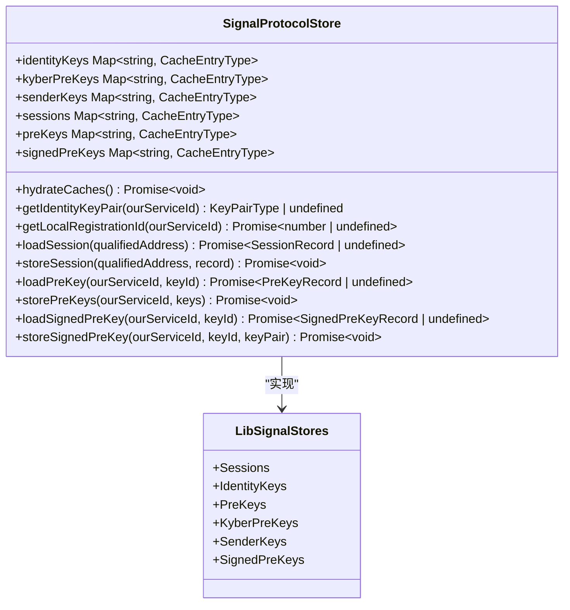
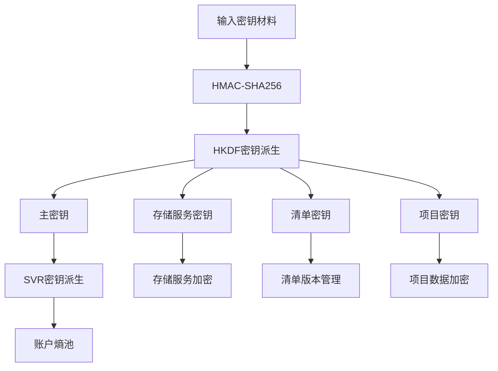
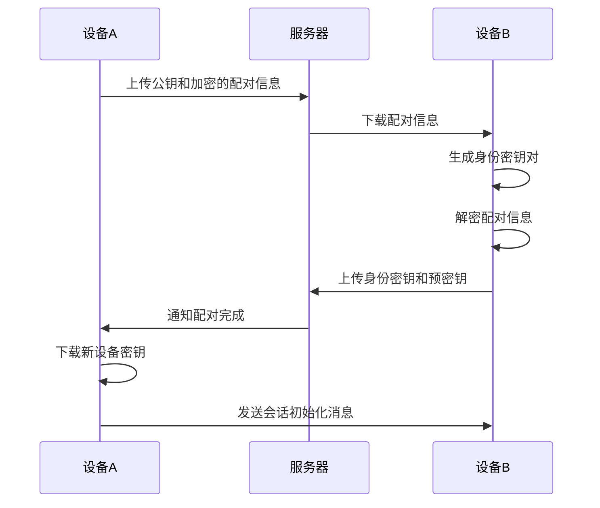
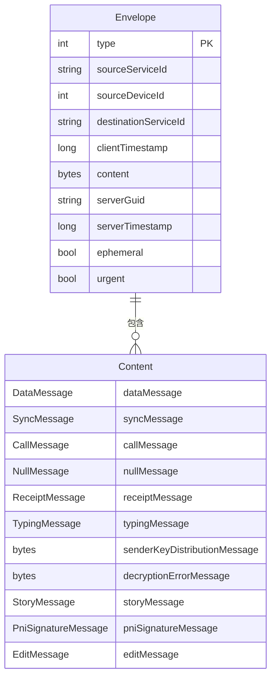
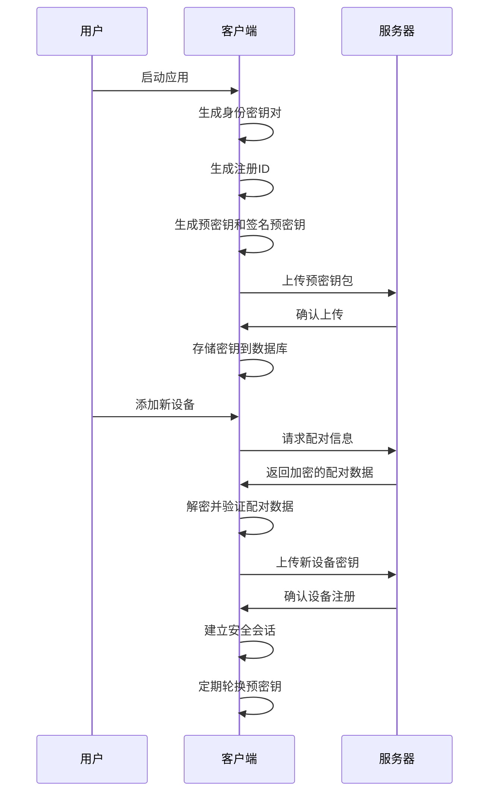

# 密钥管理

<cite>
**本文档引用的文件**  
- [Crypto.node.ts](file://ts/Crypto.node.ts)
- [LibSignalStores.preload.ts](file://ts/LibSignalStores.preload.ts)
- [ProvisioningCipher.node.ts](file://ts/textsecure/ProvisioningCipher.node.ts)
- [SignalService.proto](file://protos/SignalService.proto)
- [SignalProtocolStore.preload.ts](file://ts/SignalProtocolStore.preload.ts)
- [Curve.node.ts](file://ts/Curve.node.ts)
</cite>

## 目录
1. [引言](#引言)
2. [密钥类型与生命周期](#密钥类型与生命周期)
3. [加密原语与密钥派生](#加密原语与密钥派生)
4. [密钥存储机制](#密钥存储机制)
5. [设备配对与密钥协商](#设备配对与密钥协商)
6. [密钥消息格式](#密钥消息格式)
7. [密钥生命周期时序图](#密钥生命周期时序图)
8. [安全最佳实践](#安全最佳实践)

## 引言
Signal-Desktop基于Signal协议实现端到端加密通信，其密钥管理系统是保障通信安全的核心。本文档详细解析Signal-Desktop的密钥管理机制，涵盖密钥生成、存储、交换和轮换的完整流程，重点分析长期身份密钥、短期临时密钥和会话密钥的管理策略。

## 密钥类型与生命周期
Signal-Desktop采用分层密钥体系，包括长期身份密钥、短期预密钥和会话密钥。长期身份密钥（Identity Key）用于设备身份认证，由Curve25519椭圆曲线生成，具有长期有效性。短期预密钥（PreKey）包括一次性预密钥和签名预密钥，用于建立初始安全会话。会话密钥通过双棘轮算法动态生成，确保前向安全和后向安全。

**Section sources**
- [Crypto.node.ts](file://ts/Crypto.node.ts#L45-L47)
- [SignalService.proto](file://protos/SignalService.proto#L13-L80)

## 密钥存储机制
Signal-Desktop通过LibSignalStores.preload.ts实现密钥的持久化存储。该模块提供SessionStore、IdentityKeyStore、PreKeyStore等接口，将密钥数据存储在本地数据库中。身份密钥对使用IdentityKeyStore进行管理，预密钥和签名预密钥通过PreKeyStore和SignedPreKeyStore存储。所有密钥操作都通过事务机制确保数据一致性，并支持缓存优化性能。

**Diagram sources**
- [LibSignalStores.preload.ts](file://ts/LibSignalStores.preload.ts#L57-L331)
- [SignalProtocolStore.preload.ts](file://ts/SignalProtocolStore.preload.ts#L237-L1599)

## 加密原语与密钥派生
Crypto.node.ts模块实现了Signal协议所需的核心加密原语。该模块基于libsignal-client库，提供HMAC-SHA256、AES-256-CBC、AES-256-CTR和AES-256-GCM等加密算法。密钥派生函数deriveSecrets使用HKDF算法从输入密钥材料生成多个密钥，用于不同安全目的。例如，deriveMasterKeyFromGroupV1函数将GroupV1 ID转换为GroupV2的主密钥。

**Diagram sources**
- [Crypto.node.ts](file://ts/Crypto.node.ts#L58-L205)
- [Curve.node.ts](file://ts/Curve.node.ts#L74-L111)

## 设备配对与密钥协商
ProvisioningCipher.node.ts模块处理设备配对时的密钥协商流程。该流程使用临时密钥对和HMAC-SHA256实现安全密钥交换。配对消息包含ACI身份密钥、PNI身份密钥、电话号码、用户代理等信息，所有数据使用AES-256-CBC加密保护。一次性预密钥在使用后立即从服务器移除，确保前向安全性。

**Diagram sources**
- [ProvisioningCipher.node.ts](file://ts/textsecure/ProvisioningCipher.node.ts#L49-L171)
- [SignalService.proto](file://protos/SignalService.proto#L13-L80)

## 密钥消息格式
SignalService.proto定义了密钥相关消息的序列化结构。信封（Envelope）消息包含消息类型、源服务ID、目标服务ID、客户端时间戳和加密内容。内容（Content）消息包含数据消息、同步消息、呼叫消息等。预密钥消息（PREKEY_MESSAGE）用于建立新的Signal会话，包含发送者身份公钥和预密钥标识信息。

**Diagram sources**
- [SignalService.proto](file://protos/SignalService.proto#L13-L118)

## 密钥生命周期时序图

**Diagram sources**
- [Crypto.node.ts](file://ts/Crypto.node.ts#L45-L47)
- [LibSignalStores.preload.ts](file://ts/LibSignalStores.preload.ts#L57-L331)
- [ProvisioningCipher.node.ts](file://ts/textsecure/ProvisioningCipher.node.ts#L49-L171)

## 安全最佳实践
Signal-Desktop采用多重安全措施保护密钥安全。密钥存储使用AES-256-GCM加密，确保机密性和完整性。密钥派生使用HKDF算法，防止密钥材料泄露。所有密钥操作都进行常数时间比较，抵御时序攻击。性能优化方面，采用缓存机制减少数据库访问，批量操作提高效率。密钥泄露应对策略包括立即撤销泄露密钥、生成新密钥对和通知关联设备。

**Section sources**
- [Crypto.node.ts](file://ts/Crypto.node.ts#L230-L281)
- [SignalProtocolStore.preload.ts](file://ts/SignalProtocolStore.preload.ts#L1210-L1313)
- [Curve.node.ts](file://ts/Curve.node.ts#L130-L139)