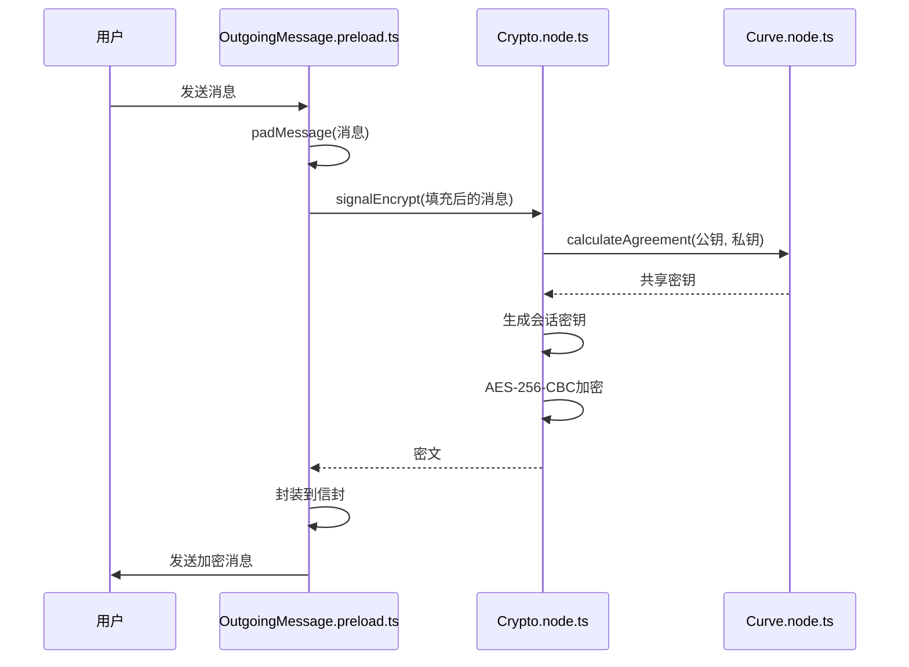
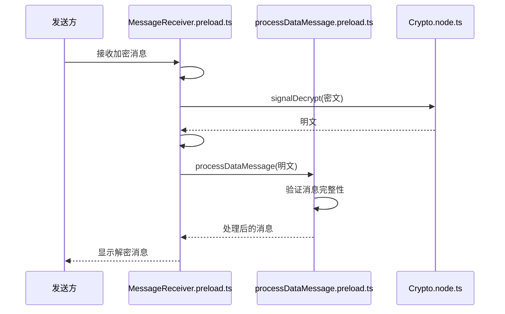
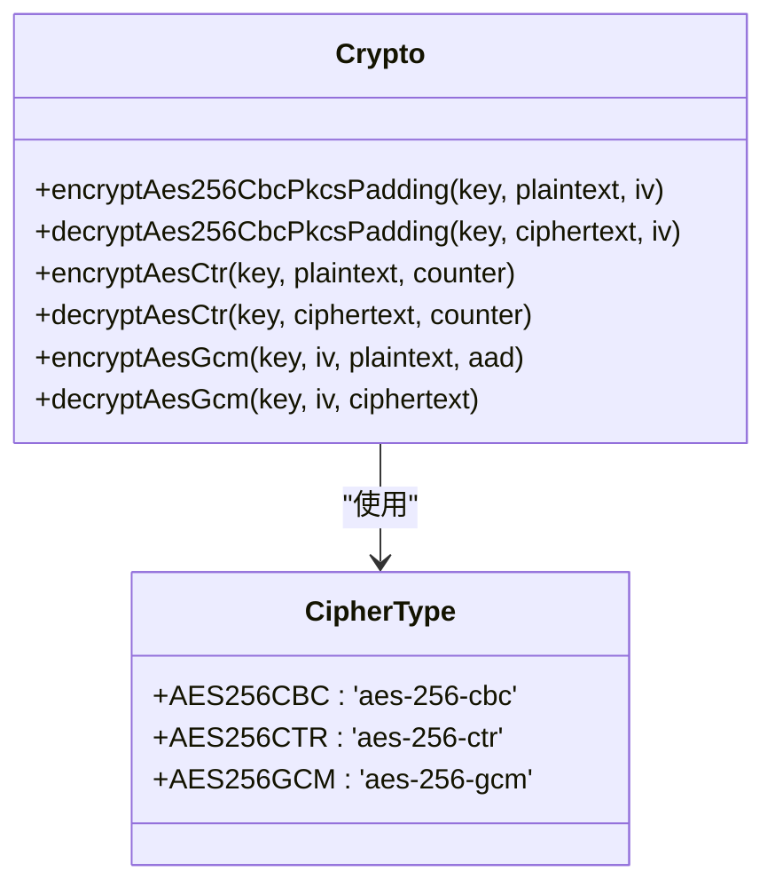
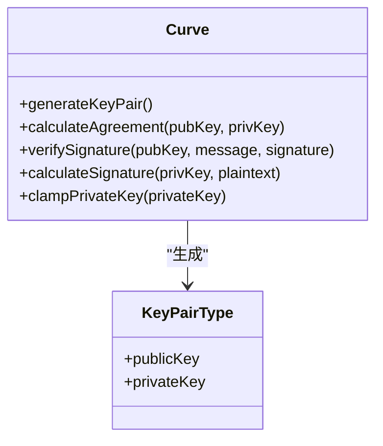
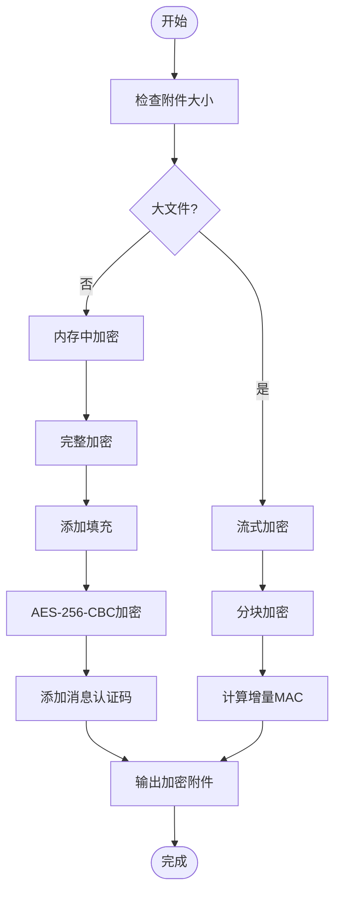
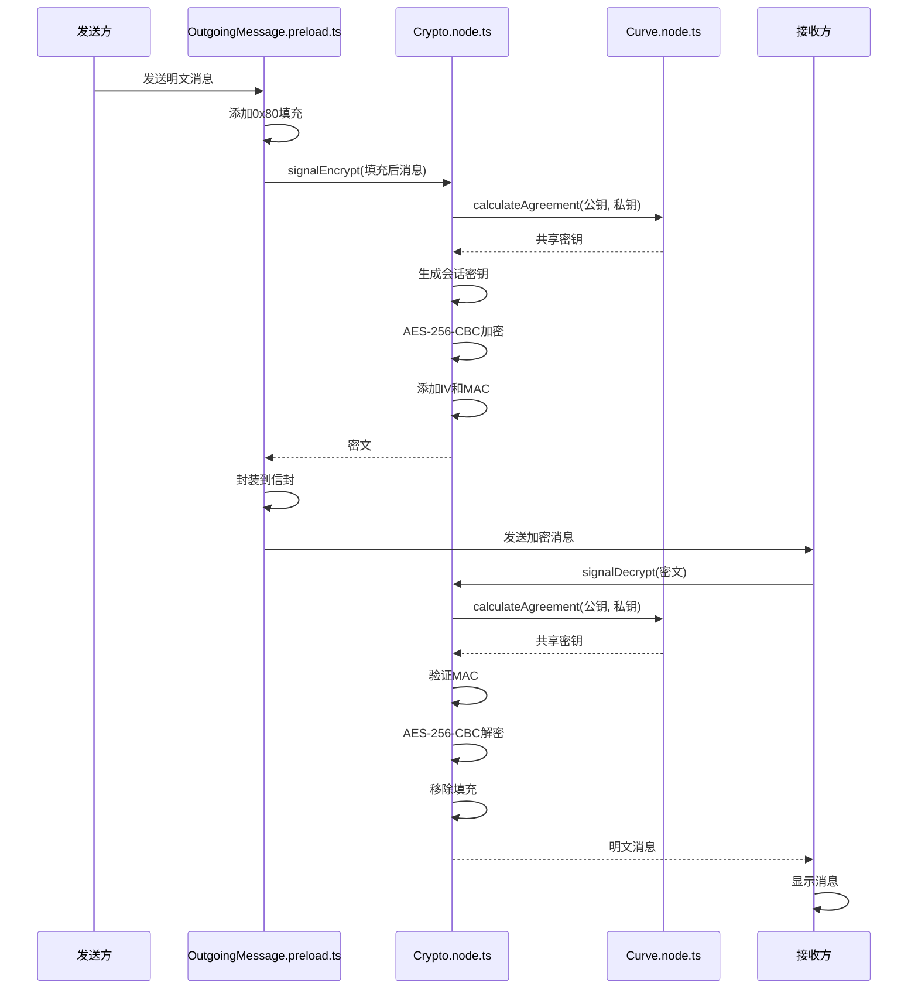
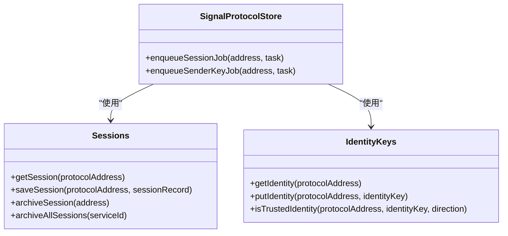
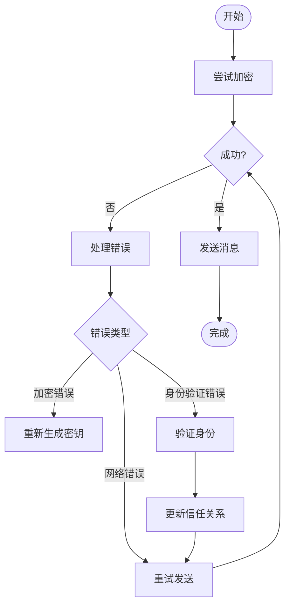
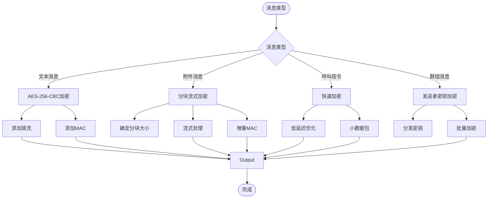
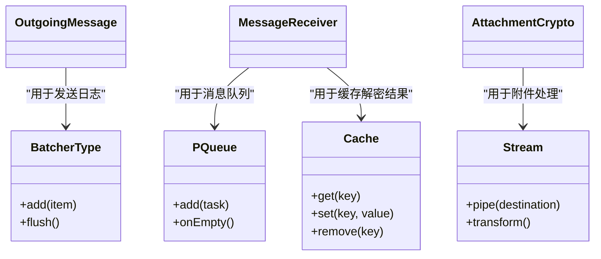

# 消息加密

<cite>
**本文档引用的文件**   
- [OutgoingMessage.preload.ts](file://ts/textsecure/OutgoingMessage.preload.ts)
- [processDataMessage.preload.ts](file://ts/textsecure/processDataMessage.preload.ts)
- [Crypto.node.ts](file://ts/Crypto.node.ts)
- [AttachmentCrypto.node.ts](file://ts/AttachmentCrypto.node.ts)
- [Curve.node.ts](file://ts/Curve.node.ts)
- [MessageReceiver.preload.ts](file://ts/textsecure/MessageReceiver.preload.ts)
- [types/Crypto.std.ts](file://ts/types/Crypto.std.ts)
</cite>

## 目录
1. [引言](#引言)
2. [消息加密流程概述](#消息加密流程概述)
3. [核心加密组件](#核心加密组件)
4. [消息加密封装过程](#消息加密封装过程)
5. [消息解密验证过程](#消息解密验证过程)
6. [对称与非对称加密算法应用](#对称与非对称加密算法应用)
7. [附件加密处理机制](#附件加密处理机制)
8. [加密时序图](#加密时序图)
9. [加密上下文管理与错误处理](#加密上下文管理与错误处理)
10. [性能优化与不同消息类型差异](#性能优化与不同消息类型差异)
11. [结论](#结论)

## 引言
Signal-Desktop 实现了端到端加密消息系统，确保用户通信的隐私和安全。本文档深入分析消息加密的实现细节，包括消息的加密封装、解密验证、加密算法应用、附件加密处理等核心组件。通过分析关键代码文件，揭示Signal-Desktop如何保护用户消息的机密性、完整性和真实性。

## 消息加密流程概述
Signal-Desktop 的消息加密流程分为发送和接收两个主要部分。在发送端，消息通过OutgoingMessage.preload.ts进行加密封装；在接收端，通过processDataMessage.preload.ts进行解密验证。整个流程使用了对称加密算法（如AES）和非对称加密算法（如Curve25519），并针对不同类型的消息（文本、附件、呼叫信令）采用了不同的加密策略。

**Section sources**
- [OutgoingMessage.preload.ts](file://ts/textsecure/OutgoingMessage.preload.ts#L1-L740)
- [processDataMessage.preload.ts](file://ts/textsecure/processDataMessage.preload.ts#L1-L572)

## 核心加密组件

Signal-Desktop 的消息加密系统由多个核心组件构成，包括：

- **OutgoingMessage.preload.ts**: 负责消息的加密封装和发送
- **processDataMessage.preload.ts**: 负责接收消息的解密和验证
- **Crypto.node.ts**: 提供核心加密算法实现
- **AttachmentCrypto.node.ts**: 处理附件的特殊加密需求
- **Curve.node.ts**: 实现Curve25519椭圆曲线加密算法

这些组件协同工作，实现了完整的端到端加密消息系统。

**Section sources**
- [OutgoingMessage.preload.ts](file://ts/textsecure/OutgoingMessage.preload.ts#L1-L740)
- [processDataMessage.preload.ts](file://ts/textsecure/processDataMessage.preload.ts#L1-L572)
- [Crypto.node.ts](file://ts/Crypto.node.ts#L1-L715)
- [AttachmentCrypto.node.ts](file://ts/AttachmentCrypto.node.ts#L1-L747)
- [Curve.node.ts](file://ts/Curve.node.ts#L1-L155)

## 消息加密封装过程

消息的加密封装过程在OutgoingMessage.preload.ts中实现。当用户发送消息时，系统首先对消息内容进行填充，然后使用信号协议进行加密。

**Diagram sources**
- [OutgoingMessage.preload.ts](file://ts/textsecure/OutgoingMessage.preload.ts#L117-L125)
- [Crypto.node.ts](file://ts/Crypto.node.ts#L403-L408)
- [Curve.node.ts](file://ts/Curve.node.ts#L106-L111)

## 消息解密验证过程

接收端的消息解密验证过程在MessageReceiver.preload.ts和processDataMessage.preload.ts中实现。系统首先解密消息，然后验证其完整性和真实性。

**Diagram sources**
- [MessageReceiver.preload.ts](file://ts/textsecure/MessageReceiver.preload.ts#L1809-L1814)
- [processDataMessage.preload.ts](file://ts/textsecure/processDataMessage.preload.ts#L457-L571)
- [Crypto.node.ts](file://ts/Crypto.node.ts#L638-L647)

## 对称与非对称加密算法应用

Signal-Desktop 使用了多种加密算法来保护消息安全。在Crypto.node.ts中实现了对称加密算法（如AES）和非对称加密算法（如Curve25519）的具体应用。

### 对称加密算法
对称加密主要用于消息内容的加密，使用AES-256算法，支持CBC、CTR和GCM模式：

**Diagram sources**
- [Crypto.node.ts](file://ts/Crypto.node.ts#L314-L386)
- [types/Crypto.std.ts](file://ts/types/Crypto.std.ts#L11-L15)

### 非对称加密算法
非对称加密主要用于密钥交换和身份验证，使用Curve25519椭圆曲线算法：

**Diagram sources**
- [Curve.node.ts](file://ts/Curve.node.ts#L75-L111)
- [Crypto.node.ts](file://ts/Crypto.node.ts#L118-L121)

## 附件加密处理机制

附件加密在AttachmentCrypto.node.ts中实现，针对大文件采用了分块加密和流式处理机制，以优化内存使用和性能。

**Diagram sources**
- [AttachmentCrypto.node.ts](file://ts/AttachmentCrypto.node.ts#L144-L274)
- [Crypto.node.ts](file://ts/Crypto.node.ts#L474-L515)

## 加密时序图

以下时序图展示了从明文消息到密文消息的完整转换过程，包括填充、认证和序列化等步骤。

**Diagram sources**
- [OutgoingMessage.preload.ts](file://ts/textsecure/OutgoingMessage.preload.ts#L117-L125)
- [Crypto.node.ts](file://ts/Crypto.node.ts#L403-L408)
- [Curve.node.ts](file://ts/Curve.node.ts#L106-L111)

## 加密上下文管理与错误处理

Signal-Desktop 实现了完善的加密上下文管理和错误处理策略，确保系统的稳定性和安全性。

### 加密上下文管理
系统通过LibSignalStores.preload.js管理加密上下文，包括会话密钥、身份密钥等：

**Diagram sources**
- [LibSignalStores.preload.js](file://ts/LibSignalStores.preload.js)
- [SignalProtocolStore.preload.js](file://ts/SignalProtocolStore.preload.js)

### 错误处理策略
系统实现了多层次的错误处理机制，包括网络错误、加密错误和身份验证错误：

**Diagram sources**
- [OutgoingMessage.preload.ts](file://ts/textsecure/OutgoingMessage.preload.ts#L603-L685)
- [Errors.std.js](file://ts/textsecure/Errors.std.js)

## 性能优化与不同消息类型差异

Signal-Desktop 针对不同消息类型采用了不同的加密策略和性能优化技巧。

### 不同消息类型的加密差异
系统根据消息类型选择最合适的加密方式：

**Diagram sources**
- [OutgoingMessage.preload.ts](file://ts/textsecure/OutgoingMessage.preload.ts)
- [AttachmentCrypto.node.ts](file://ts/AttachmentCrypto.node.ts)
- [sendToGroup.preload.ts](file://ts/util/sendToGroup.preload.ts)

### 性能优化技巧
系统采用了多种性能优化技巧，包括：

- **批量处理**: 使用批处理器减少I/O操作
- **内存优化**: 对大文件采用流式处理
- **缓存机制**: 缓存加密结果减少重复计算
- **并行处理**: 并行处理多个消息

**Diagram sources**
- [MessageReceiver.preload.ts](file://ts/textsecure/MessageReceiver.preload.ts#L314-L315)
- [AttachmentCrypto.node.ts](file://ts/AttachmentCrypto.node.ts#L15-L16)
- [BatcherType](file://ts/types/BatcherType.std.ts)

## 结论
Signal-Desktop 实现了一个安全、高效的消息加密系统。通过分析其核心组件和加密流程，我们可以看到系统如何利用对称和非对称加密算法保护用户消息。系统针对不同类型的消息采用了不同的加密策略，并通过流式处理和分块加密优化了大附件的处理性能。完善的错误处理机制和加密上下文管理确保了系统的稳定性和安全性。这些设计使得Signal-Desktop能够为用户提供可靠的端到端加密通信服务。