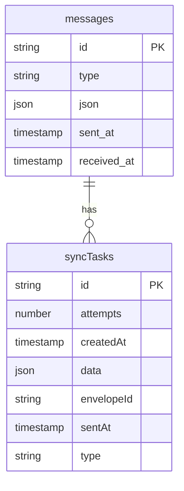
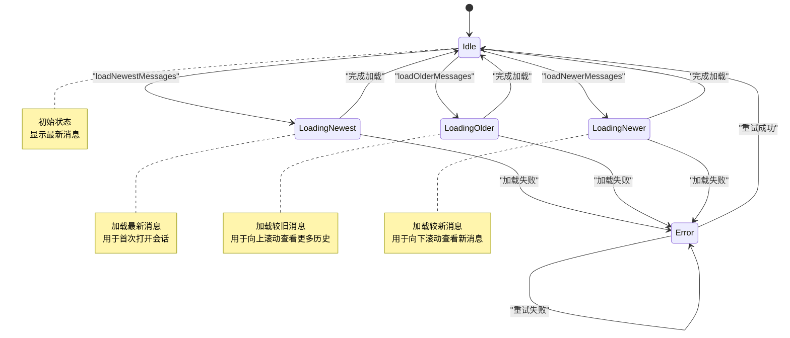

# 同步状态管理

<cite>
**本文档引用的文件**   
- [updateListener.preload.ts](file://ts/services/updateListener.preload.ts)
- [conversations.preload.ts](file://ts/models/conversations.preload.ts)
- [conversations.preload.ts](file://ts/state/ducks/conversations.preload.ts)
- [57-rm-message-history-unsynced.std.ts](file://ts/sql/migrations/57-rm-message-history-unsynced.std.ts)
</cite>

## 目录
1. [同步状态监听机制](#同步状态监听机制)
2. [会话同步状态的Redux状态结构](#会话同步状态的redux状态结构)
3. [未同步消息的数据库迁移策略](#未同步消息的数据库迁移策略)
4. [会话同步进度跟踪与恢复机制](#会话同步进度跟踪与恢复机制)
5. [同步状态管理的状态转换图](#同步状态管理的状态转换图)
6. [同步状态的持久化与跨设备一致性](#同步状态的持久化与跨设备一致性)

## 同步状态监听机制

Signal-Desktop通过`updateListener.preload.ts`文件中的`initializeUpdateListener`函数实现同步状态的监听和更新。该机制基于Electron的`ipcRenderer`模块，监听来自主进程的`show-update-dialog`事件，当检测到需要显示更新对话框时，会触发相应的Redux action来更新UI状态。这种设计实现了主进程与渲染进程之间的通信，确保了同步状态变更能够及时反映在用户界面上。

**Section sources**
- [updateListener.preload.ts](file://ts/services/updateListener.preload.ts#L1-L26)

## 会话同步状态的Redux状态结构

在`conversations.preload.ts`文件中，定义了会话同步状态的Redux状态结构。核心状态包括：
- **同步标记**：通过`acceptedMessageRequest`字段表示会话是否已接受消息请求
- **最后同步时间戳**：通过`lastMessageReceivedAt`和`lastMessageReceivedAtMs`字段记录最后接收消息的时间
- **同步错误状态**：通过`verificationDataByConversation`字段管理会话的验证数据，包括待验证的服务ID和取消验证的时间戳

该状态结构还包含了会话的其他元数据，如消息计数、未读消息数、成员信息等，为UI提供了完整的会话状态视图。

**Section sources**
- [conversations.preload.ts](file://ts/state/ducks/conversations.preload.ts#L264-L651)

## 未同步消息的数据库迁移策略

Signal-Desktop通过数据库迁移脚本`57-rm-message-history-unsynced.std.ts`处理未同步消息。该迁移策略的背景是清理类型为`message-history-unsynced`的过时消息记录。迁移实现非常简洁，通过执行SQL DELETE语句直接从messages表中删除所有类型为`message-history-unsynced`的记录。

**Diagram sources**
- [57-rm-message-history-unsynced.std.ts](file://ts/sql/migrations/57-rm-message-history-unsynced.std.ts#L1-L14)

**Section sources**
- [57-rm-message-history-unsynced.std.ts](file://ts/sql/migrations/57-rm-message-history-unsynced.std.ts#L1-L14)

## 会话同步进度跟踪与恢复机制

客户端通过`ConversationModel`类跟踪和管理每个会话的同步进度。关键机制包括：
- **消息加载状态管理**：使用`TimelineMessageLoadingState`枚举跟踪会话的消息加载状态，包括初始加载、加载较旧消息、加载较新消息等
- **分页加载**：通过`loadNewestMessages`、`loadOlderMessages`和`loadNewerMessages`方法实现消息的分页加载
- **网络中断恢复**：通过`inProgressFetch`字段管理正在进行的获取操作，当网络中断后重新连接时，系统会自动恢复同步过程

这些机制确保了即使在网络不稳定的情况下，用户也能获得流畅的会话体验。

**Section sources**
- [conversations.preload.ts](file://ts/models/conversations.preload.ts#L1715-L1952)

## 同步状态管理的状态转换图

**Diagram sources**
- [conversations.preload.ts](file://ts/models/conversations.preload.ts#L1715-L1952)

## 同步状态的持久化与跨设备一致性

同步状态的持久化策略主要通过以下机制实现：
- **数据库存储**：会话状态和消息数据持久化存储在本地SQLite数据库中
- **同步任务队列**：使用`syncTasks`表存储待处理的同步任务，确保在网络中断后能够恢复同步
- **跨设备一致性**：通过Storage Service同步机制，使用`manifestVersion`跟踪同步状态，确保多设备间的数据一致性

这些策略共同保证了用户数据的安全性和一致性，即使在设备切换或网络中断的情况下，也能保持数据的完整性和同步性。

**Section sources**
- [conversations.preload.ts](file://ts/models/conversations.preload.ts#L1601-L1635)
- [conversations.preload.ts](file://ts/state/ducks/conversations.preload.ts#L2274-L2276)