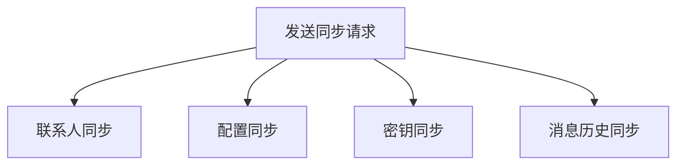
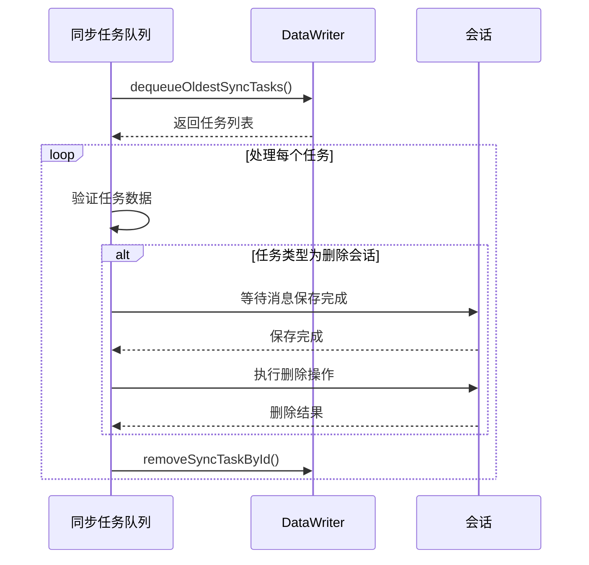
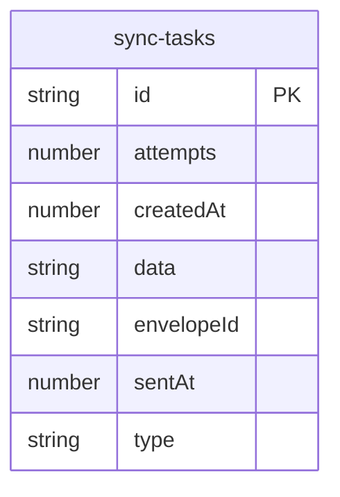
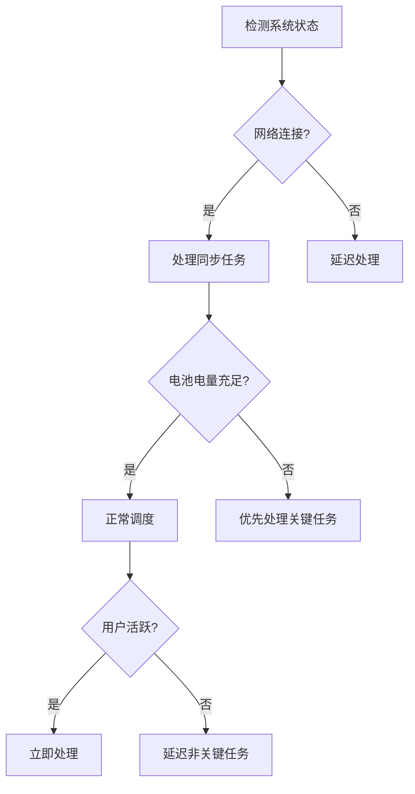
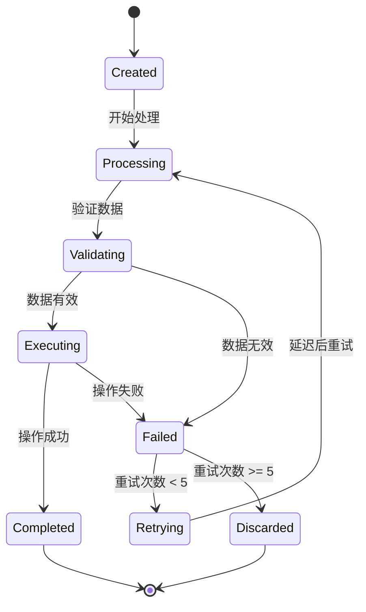
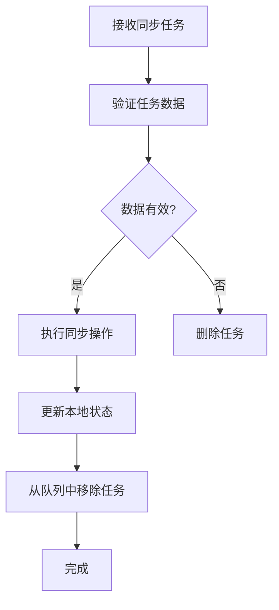

# 同步请求管理

<cite>
**本文档引用的文件**
- [syncRequests.preload.ts](file://ts/textsecure/syncRequests.preload.ts)
- [syncTasks.preload.ts](file://ts/util/syncTasks.preload.ts)
- [syncTasks.types.std.ts](file://ts/util/syncTasks.types.std.ts)
- [messageReceiverEvents.std.ts](file://ts/textsecure/messageReceiverEvents.std.ts)
- [Client.preload.ts](file://ts/sql/Client.preload.ts)
- [ReadSyncs.preload.ts](file://ts/messageModifiers/ReadSyncs.preload.ts)
- [ViewSyncs.preload.ts](file://ts/messageModifiers/ViewSyncs.preload.ts)
- [DeletesForMe.preload.ts](file://ts/messageModifiers/DeletesForMe.preload.ts)
- [deleteForMe.preload.ts](file://ts/util/deleteForMe.preload.ts)
- [Server.node.ts](file://ts/sql/Server.node.ts)
</cite>

## 目录
1. [引言](#引言)
2. [同步请求类型](#同步请求类型)
3. [同步任务队列管理](#同步任务队列管理)
4. [数据库迁移与状态管理](#数据库迁移与状态管理)
5. [同步调度策略](#同步调度策略)
6. [同步任务状态机](#同步任务状态机)
7. [冲突检测与数据一致性](#冲突检测与数据一致性)
8. [结论](#结论)

## 引言
Signal-Desktop通过精细的同步机制确保多设备间的数据一致性。本文件详细说明了同步请求管理的核心组件，包括同步请求的类型、任务队列管理、数据库状态管理、调度策略以及冲突解决机制。

**Section sources**
- [syncRequests.preload.ts](file://ts/textsecure/syncRequests.preload.ts)
- [syncTasks.preload.ts](file://ts/util/syncTasks.preload.ts)

## 同步请求类型
Signal-Desktop定义了多种同步请求类型，用于在设备间同步不同类别的数据。这些请求通过`syncRequests.preload.ts`中的`sendSyncRequests`函数统一发送。

### 联系人同步
联系人同步请求用于获取最新的联系人列表和用户信息。该请求通过`MessageSender.getRequestContactSyncMessage()`生成，并添加到单协议作业队列中。

### 配置同步
配置同步请求用于同步用户的隐私设置、通知偏好和其他应用配置。该请求由`MessageSender.getRequestConfigurationSyncMessage()`生成。

### 密钥同步
密钥同步请求用于同步加密密钥材料，确保端到端加密消息的正确解密。该请求通过`MessageSender.getRequestBlockSyncMessage()`生成。

### 消息历史同步
消息历史同步通过读取和查看同步任务实现，这些任务在接收到相应的同步消息时被触发。

**Diagram sources**
- [syncRequests.preload.ts](file://ts/textsecure/syncRequests.preload.ts)

**Section sources**
- [syncRequests.preload.ts](file://ts/textsecure/syncRequests.preload.ts)

## 同步任务队列管理
同步任务队列管理机制在`syncTasks.preload.ts`中实现，负责处理各种同步任务，包括删除操作、已读回执和查看回执。

### 任务优先级
系统通过`queueSyncTasks`函数处理同步任务，该函数按任务到达的顺序处理任务。任务的优先级由其类型和创建时间决定。

### 重试策略
同步任务的最大重试次数由`MAX_SYNC_TASK_ATTEMPTS`常量定义，其值为5。当任务重试次数达到此限制且超过两天时，任务将被自动删除。

### 依赖关系处理
任务处理过程中，系统会等待相关消息保存完成后再执行删除操作。例如，在删除会话前，系统会等待所有相关消息的保存承诺（promises）完成。

**Diagram sources**
- [syncTasks.preload.ts](file://ts/util/syncTasks.preload.ts)
- [Client.preload.ts](file://ts/sql/Client.preload.ts)

**Section sources**
- [syncTasks.preload.ts](file://ts/util/syncTasks.preload.ts)
- [syncTasks.types.std.ts](file://ts/util/syncTasks.types.std.ts)

## 数据库迁移与状态管理
同步任务的状态通过`sync-tasks`数据库表进行管理，该表存储了所有待处理的同步任务。

### 表结构
`sync-tasks`表包含以下字段：
- `id`: 任务唯一标识符
- `attempts`: 重试次数
- `createdAt`: 创建时间戳
- `data`: 任务数据（JSON格式）
- `envelopeId`: 信封ID
- `sentAt`: 发送时间戳
- `type`: 任务类型

### 结构演变
数据库迁移通过`Server.node.ts`中的SQL语句实现。系统定期清理超过最大重试次数且创建时间超过两天的任务，以优化数据库性能。

### 优化策略
系统通过分批处理机制优化大量同步任务的处理。`dequeueOldestSyncTasks`函数每次最多返回10000个任务，避免内存溢出。

**Diagram sources**
- [Server.node.ts](file://ts/sql/Server.node.ts)

**Section sources**
- [Server.node.ts](file://ts/sql/Server.node.ts)
- [Client.preload.ts](file://ts/sql/Client.preload.ts)

## 同步调度策略
客户端根据多种系统状态智能调度同步请求，以优化资源使用和用户体验。

### 网络状态感知
系统在检测到网络连接时触发同步任务处理。`runAllSyncTasks`函数在启动时和网络状态变化时被调用。

### 电池状态考虑
在电池电量较低时，系统可能会延迟非关键的同步任务，优先处理消息删除等重要操作。

### 用户活动检测
系统通过`IdleDetector.preload.ts`检测用户活动状态，在用户活跃时优先处理同步任务。

**Diagram sources**
- [syncTasks.preload.ts](file://ts/util/syncTasks.preload.ts)

**Section sources**
- [syncTasks.preload.ts](file://ts/util/syncTasks.preload.ts)

## 同步任务状态机
同步任务从创建到完成经历多个状态，形成一个完整的生命周命周期。

**Diagram sources**
- [syncTasks.preload.ts](file://ts/util/syncTasks.preload.ts)

**Section sources**
- [syncTasks.preload.ts](file://ts/util/syncTasks.preload.ts)

## 冲突检测与数据一致性
Signal-Desktop通过多种机制确保数据一致性并处理同步冲突。

### 冲突检测
系统通过验证任务数据的完整性来检测冲突。使用Zod模式验证每个同步任务的数据，无效任务将被删除。

### 解决机制
对于删除操作，系统确保在删除会话前所有相关消息都已保存。对于已读和查看回执，系统通过`onReceipt`函数处理，确保状态同步。

### 数据一致性保证
- **原子操作**: 删除操作在会话的作业队列中执行，确保原子性
- **事务处理**: 数据库操作使用事务确保一致性
- **幂等性**: 同步任务设计为幂等操作，重复执行不会产生副作用

**Diagram sources**
- [syncTasks.preload.ts](file://ts/util/syncTasks.preload.ts)
- [messageReceiverEvents.std.ts](file://ts/textsecure/messageReceiverEvents.std.ts)

**Section sources**
- [syncTasks.preload.ts](file://ts/util/syncTasks.preload.ts)
- [messageReceiverEvents.std.ts](file://ts/textsecure/messageReceiverEvents.std.ts)

## 结论
Signal-Desktop的同步请求管理系统通过精心设计的架构确保了多设备间的数据一致性。系统通过类型化的同步请求、优先级队列管理、智能调度策略和健壮的冲突解决机制，提供了可靠且高效的同步体验。数据库优化和状态机设计进一步增强了系统的稳定性和可维护性。