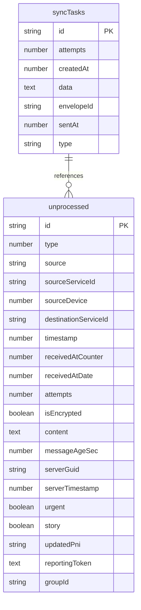
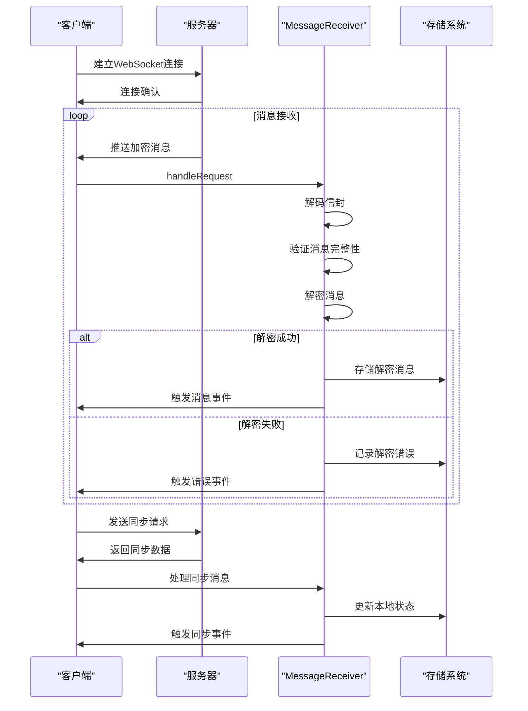

# 消息同步

<cite>
**本文档引用的文件**   
- [MessageReceiver.preload.ts](file://ts\textsecure\MessageReceiver.preload.ts)
- [syncRequests.preload.ts](file://ts\textsecure\syncRequests.preload.ts)
- [Server.node.ts](file://ts\sql\Server.node.ts)
- [43-gv2-uuid.std.ts](file://ts\sql\migrations\43-gv2-uuid.std.ts)
- [migrateMessageData.preload.ts](file://ts\messages\migrateMessageData.preload.ts)
- [background.preload.ts](file://ts\background.preload.ts)
</cite>

## 目录
1. [消息接收与处理流程](#消息接收与处理流程)
2. [同步请求类型与处理逻辑](#同步请求类型与处理逻辑)
3. [数据库迁移与状态管理](#数据库迁移与状态管理)
4. [实时推送与轮询策略](#实时推送与轮询策略)
5. [消息同步序列图](#消息同步序列图)
6. [冲突解决与数据一致性](#冲突解决与数据一致性)

## 消息接收与处理流程

Signal-Desktop的消息接收机制通过MessageReceiver.preload.ts实现，该模块负责从网络接收原始数据包并将其解析为可读消息。系统采用多级队列处理模型，包括incomingQueue、encryptedQueue和decryptedQueue，确保消息处理的有序性和可靠性。当接收到WebSocket请求时，系统首先将原始数据解码为信封(Envelope)结构，然后通过decryptAndCacheBatcher批处理程序进行解密和缓存。

消息处理流程包含多个关键步骤：首先验证信封的完整性，然后根据消息类型进行相应的解密操作。对于密封发送者消息，系统使用sealedSenderDecryptToUsmc进行解密；对于普通加密消息，则根据消息类型选择合适的解密方法。解密成功后，系统会触发SuccessfulDecryptEvent事件，通知上层应用进行后续处理。

在处理过程中，系统会严格验证消息的合法性，包括检查发送者证书的有效性、验证服务器信任根以及确保消息时间戳的合理性。对于无效或损坏的消息，系统会生成DecryptionErrorEvent事件，并将其从缓存中移除。整个处理流程通过事件驱动机制实现，确保了高并发环境下的稳定性和性能。

**Section sources**
- [MessageReceiver.preload.ts](file://ts\textsecure\MessageReceiver.preload.ts#L330-L379)
- [MessageReceiver.preload.ts](file://ts\textsecure\MessageReceiver.preload.ts#L480-L487)
- [MessageReceiver.preload.ts](file://ts\textsecure\MessageReceiver.preload.ts#L989-L1133)

## 同步请求类型与处理逻辑

syncRequests.preload.ts模块定义了多种同步请求类型及其处理逻辑。系统通过sendSyncRequests函数统一发送各类同步请求，包括联系人同步、配置同步和阻塞列表同步。这些请求通过singleProtoJobQueue队列进行管理，确保请求的有序发送和处理。

联系人同步请求通过MessageSender.getRequestContactSyncMessage生成，用于获取最新的联系人信息。配置同步请求通过MessageSender.getRequestConfigurationSyncMessage生成，用于同步用户的隐私设置、通知偏好等配置信息。阻塞列表同步请求通过MessageSender.getRequestBlockSyncMessage生成，用于保持各设备间阻塞列表的一致性。

每种同步请求都有对应的处理逻辑。例如，联系人同步会触发ContactSyncEvent事件，配置同步会触发ConfigurationEvent事件。系统在处理同步响应时，会更新本地存储并通知相关组件进行状态刷新。所有同步操作都经过严格的错误处理，确保在网络异常或服务器错误时能够正确恢复。

**Section sources**
- [syncRequests.preload.ts](file://ts\textsecure\syncRequests.preload.ts#L11-L28)
- [MessageReceiver.preload.ts](file://ts\textsecure\MessageReceiver.preload.ts#L3843-L3958)
- [MessageReceiver.preload.ts](file://ts\textsecure\MessageReceiver.preload.ts#L3166-L3179)

## 数据库迁移与状态管理

消息同步相关的数据库迁移主要通过SQL迁移脚本实现。系统在启动时会检查数据库版本，并执行必要的迁移操作。对于消息数据的迁移，系统使用migrateMessageData.preload.ts模块，该模块通过migrationQueue管理迁移任务，确保迁移过程的原子性和一致性。

未同步消息的处理机制基于syncTasks表实现。系统将需要同步的任务存储在该表中，每个任务包含类型、数据、尝试次数和创建时间等信息。当同步成功时，系统会调用removeSyncTasks函数删除相应的任务记录；当同步失败时，系统会增加尝试次数并在适当延迟后重试。

状态管理通过Storage模块实现，该模块提供了put和get方法用于持久化存储各种状态信息。例如，阻塞列表存储在'blocked'和'blocked-uuids'键下，配置信息存储在'configuration'键下。系统在处理同步消息时会更新相应的存储项，并触发状态变更事件。

**Diagram sources**
- [Server.node.ts](file://ts\sql\Server.node.ts#L2431-L2450)
- [Server.node.ts](file://ts\sql\Server.node.ts#L5911-L5928)

**Section sources**
- [Server.node.ts](file://ts\sql\Server.node.ts#L2431-L2450)
- [43-gv2-uuid.std.ts](file://ts\sql\migrations\43-gv2-uuid.std.ts#L393-L419)
- [migrateMessageData.preload.ts](file://ts\messages\migrateMessageData.preload.ts#L163-L193)

## 实时推送与轮询策略

Signal-Desktop采用实时消息推送和轮询同步的混合策略来平衡实时性和资源消耗。实时推送通过WebSocket连接实现，服务器在有新消息时立即推送给客户端。客户端通过MessageReceiver的handleRequest方法处理推送消息，确保消息的即时处理。

当网络连接不稳定或WebSocket连接断开时，系统会自动切换到轮询模式。轮询间隔通过RETRY_TIMEOUT常量定义，当前设置为2分钟。系统通过maybeScheduleRetryTimeout方法在消息处理队列为空时安排下一次轮询。这种混合策略确保了在网络条件变化时仍能保持消息同步的可靠性。

网络状态变化时的同步行为调整通过networkObserver模块实现。该模块监控网络连接状态，在检测到网络恢复时立即触发同步操作。系统还实现了智能重试机制，对于失败的同步请求，会根据失败次数增加重试间隔，避免对服务器造成过大压力。

**Section sources**
- [MessageReceiver.preload.ts](file://ts\textsecure\MessageReceiver.preload.ts#L958-L972)
- [MessageReceiver.preload.ts](file://ts\textsecure\MessageReceiver.preload.ts#L1945-L1990)
- [networkObserver.preload.ts](file://ts\services\networkObserver.preload.ts#L1-L47)

## 消息同步序列图

**Diagram sources**
- [MessageReceiver.preload.ts](file://ts\textsecure\MessageReceiver.preload.ts#L380-L387)
- [MessageReceiver.preload.ts](file://ts\textsecure\MessageReceiver.preload.ts#L2567-L2624)

## 冲突解决与数据一致性

消息同步的冲突解决策略主要基于时间戳和唯一标识符。每条消息都有全局唯一的timestamp和serverGuid，系统通过比较这些值来确定消息的顺序和唯一性。对于同时编辑的消息，系统采用"最后写入获胜"策略，以时间戳较新的版本为准。

数据一致性保证机制包括多个层面：首先，所有数据库操作都通过事务处理，确保操作的原子性；其次，关键数据在存储前会进行完整性校验；最后，系统定期执行状态同步，确保各设备间的数据一致性。

对于同步冲突，系统提供了详细的日志记录和错误报告机制。当检测到数据不一致时，系统会生成相应的事件并通知用户。在极端情况下，系统支持手动触发全量同步，通过sendSyncRequests函数重新获取所有同步数据，从而恢复数据一致性。

**Section sources**
- [MessageReceiver.preload.ts](file://ts\textsecure\MessageReceiver.preload.ts#L3043-L3054)
- [MessageReceiver.preload.ts](file://ts\textsecure\MessageReceiver.preload.ts#L3166-L3179)
- [background.preload.ts](file://ts\background.preload.ts#L2230-L2236)