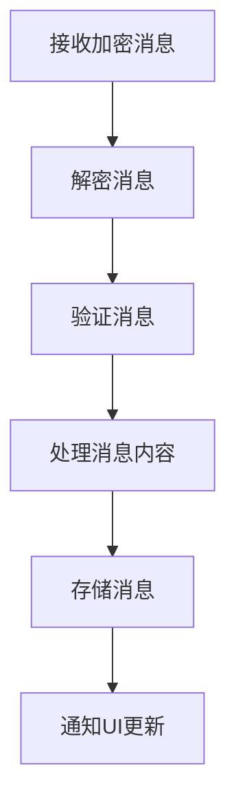
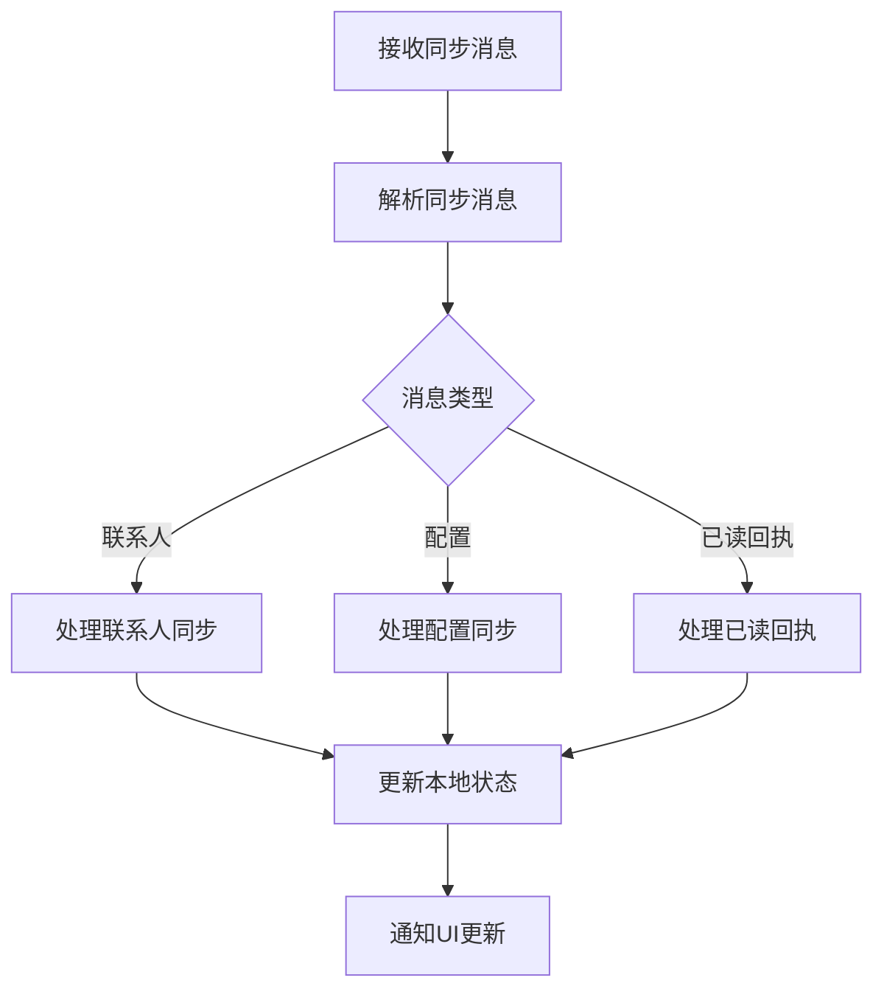
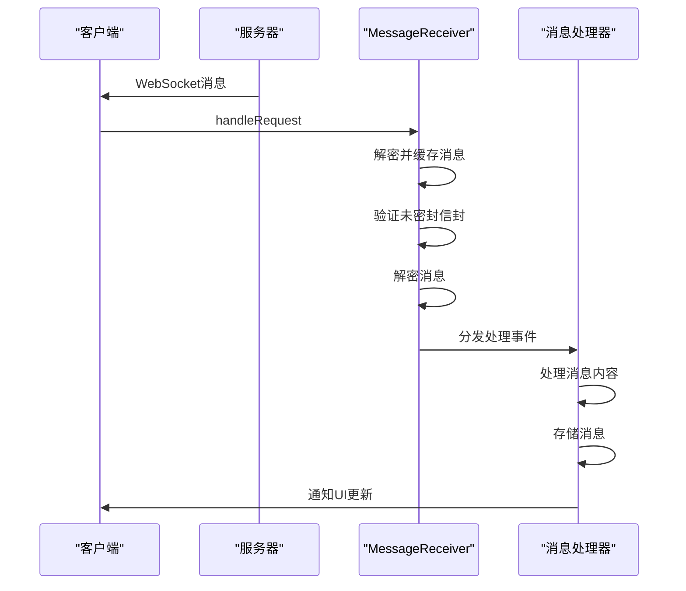

# 消息接收与处理

<cite>
**本文档引用的文件**   
- [MessageReceiver.preload.ts](file://ts\textsecure\MessageReceiver.preload.ts)
- [processDataMessage.preload.ts](file://ts\textsecure\processDataMessage.preload.ts)
- [processSyncMessage.node.ts](file://ts\textsecure\processSyncMessage.node.ts)
</cite>

## 目录
1. [消息接收与处理](#消息接收与处理)
2. [WebSocket连接管理](#websocket连接管理)
3. [数据包解码与消息类型识别](#数据包解码与消息类型识别)
4. [消息处理逻辑](#消息处理逻辑)
5. [同步消息处理](#同步消息处理)
6. [消息接收处理时序图](#消息接收处理时序图)
7. [异常处理机制](#异常处理机制)

## WebSocket连接管理

Signal-Desktop通过WebSocket连接与服务器通信，实现消息的实时接收。`MessageReceiver`类负责管理WebSocket连接，处理来自服务器的请求。当接收到WebSocket请求时，`handleRequest`方法会被调用，根据请求类型进行相应的处理。对于消息请求，会解密并缓存消息；对于队列清空请求，则会触发`onEmpty`事件。

**Section sources**
- [MessageReceiver.preload.ts](file://ts\textsecure\MessageReceiver.preload.ts#L381-L487)

## 数据包解码与消息类型识别

消息接收后，Signal-Desktop会对数据包进行解码和类型识别。`MessageReceiver`类中的`#decryptAndCacheBatch`方法负责批量解密和缓存消息。该方法首先验证未密封信封的有效性，然后根据消息类型进行解密。解密成功后，消息会被添加到解密队列中等待进一步处理。

**Section sources**
- [MessageReceiver.preload.ts](file://ts\textsecure\MessageReceiver.preload.ts#L989-L1155)

## 消息处理逻辑

解密后的消息会进入处理阶段。`processDataMessage`函数负责处理数据消息，包括端到端加密解密、消息验证和存储。该函数会根据消息内容创建`ProcessedDataMessage`对象，并根据消息类型执行相应的处理逻辑。例如，对于包含附件的消息，会调用`processAttachment`函数处理附件；对于群组消息，会调用`processGroupV2Context`函数处理群组上下文。

**Diagram sources **
- [processDataMessage.preload.ts](file://ts\textsecure\processDataMessage.preload.ts#L457-L571)

**Section sources**
- [processDataMessage.preload.ts](file://ts\textsecure\processDataMessage.preload.ts#L457-L571)

## 同步消息处理

同步消息包含客户端状态同步信息，如联系人、配置更新等。`processSyncMessage`函数负责处理同步消息。该函数会根据同步消息的类型调用相应的处理函数。例如，对于联系人同步消息，会调用`#handleContacts`函数；对于配置同步消息，会调用`#handleConfiguration`函数。

**Diagram sources **
- [processSyncMessage.node.ts](file://ts\textsecure\processSyncMessage.node.ts#L68-L75)
- [MessageReceiver.preload.ts](file://ts\textsecure\MessageReceiver.preload.ts#L2935-L3104)

**Section sources**
- [processSyncMessage.node.ts](file://ts\textsecure\processSyncMessage.node.ts#L68-L75)
- [MessageReceiver.preload.ts](file://ts\textsecure\MessageReceiver.preload.ts#L2935-L3104)

## 消息接收处理时序图

**Diagram sources **
- [MessageReceiver.preload.ts](file://ts\textsecure\MessageReceiver.preload.ts#L381-L487)
- [processDataMessage.preload.ts](file://ts\textsecure\processDataMessage.preload.ts#L457-L571)

## 异常处理机制

Signal-Desktop实现了完善的异常处理机制，能够处理网络中断、消息损坏和身份验证失败等情况。当发生解密错误时，会触发`DecryptionErrorEvent`事件；当收到重复消息时，会直接丢弃；当消息来自被阻止的发件人时，也会被丢弃。此外，系统还实现了重试机制，对于处理失败的消息会定期重试。

**Section sources**
- [MessageReceiver.preload.ts](file://ts\textsecure\MessageReceiver.preload.ts#L1982-L2061)