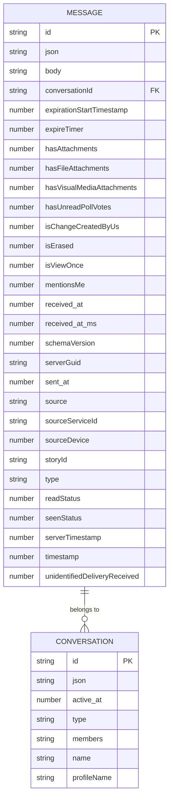

# 消息模型

<cite>
**本文档引用的文件**   
- [messages.preload.ts](file://ts\models\messages.preload.ts)
- [conversations.preload.ts](file://ts\models\conversations.preload.ts)
- [Interface.std.ts](file://ts\sql\Interface.std.ts)
- [migrateMessageData.preload.ts](file://ts\messages\migrateMessageData.preload.ts)
- [model-types.d.ts](file://ts\model-types.d.ts)
- [Message2.preload.ts](file://ts\types\Message2.preload.ts)
- [index.node.ts](file://ts\sql\migrations\index.node.ts)
</cite>

## 目录
1. [介绍](#介绍)
2. [消息实体字段定义](#消息实体字段定义)
3. [数据库模式与索引](#数据库模式与索引)
4. [消息验证规则与业务逻辑](#消息验证规则与业务逻辑)
5. [端到端加密处理流程](#端到端加密处理流程)
6. [数据访问模式与缓存策略](#数据访问模式与缓存策略)
7. [数据生命周期与迁移策略](#数据生命周期与迁移策略)
8. [安全与隐私机制](#安全与隐私机制)
9. [消息创建与同步示例](#消息创建与同步示例)

## 介绍
Signal-Desktop的消息模型是其核心功能的基础，负责管理所有消息的创建、存储、加密和同步。该模型设计为高度安全和隐私保护，采用端到端加密技术确保消息内容在传输和存储过程中的安全性。消息实体包含丰富的属性，支持文本、附件、表情符号等多种消息类型，并通过复杂的业务规则管理消息的编辑、删除和过期机制。数据库模式经过精心设计，优化了按会话和时间的查询性能，同时确保数据的一致性和完整性。

**Section sources**
- [messages.preload.ts](file://ts\models\messages.preload.ts#L1-L75)
- [conversations.preload.ts](file://ts\models\conversations.preload.ts#L1-L800)

## 消息实体字段定义
消息实体由多个核心属性组成，这些属性定义了消息的基本信息、状态和元数据。主要字段包括：

- **id**: 消息的唯一标识符，作为主键使用。
- **body**: 消息的文本内容。
- **conversationId**: 关联的会话ID，作为外键连接到会话表。
- **sent_at**: 消息发送的时间戳。
- **received_at**: 消息接收的时间戳。
- **type**: 消息类型，如"incoming"（接收）、"outgoing"（发送）、"call-history"（通话记录）等。
- **readStatus**: 消息的阅读状态，表示消息是否已被阅读。
- **seenStatus**: 消息的查看状态，用于区分已读和已查看。
- **attachments**: 附件数组，包含消息中的所有附件信息。
- **preview**: 链接预览信息，用于显示链接的缩略图和描述。
- **quote**: 引用消息，包含被引用消息的附件和文本。
- **reactions**: 反应数组，记录用户对消息的反应。
- **expireTimer**: 消息过期计时器，定义消息在多长时间后自动删除。
- **isViewOnce**: 是否为一次性查看消息，此类消息在查看后自动删除。
- **source**: 消息来源的电话号码或服务ID。
- **sourceServiceId**: 消息来源的服务ID。
- **sourceDevice**: 发送设备的ID。
- **serverGuid**: 服务器生成的全局唯一标识符。
- **timestamp**: 消息的时间戳，用于排序和同步。
- **schemaVersion**: 消息的模式版本，用于支持向后兼容的迁移。

这些字段共同构成了消息的完整数据模型，支持Signal应用的各种功能需求。

**Section sources**
- [model-types.d.ts](file://ts\model-types.d.ts#L183-L323)
- [Interface.std.ts](file://ts\sql\Interface.std.ts#L160-L189)

## 数据库模式与索引
消息表的数据库模式设计为高效存储和检索消息数据。表结构包括主键和多个非主键列，确保数据的完整性和查询性能。

**Diagram sources **
- [Interface.std.ts](file://ts\sql\Interface.std.ts#L159-L194)
- [index.node.ts](file://ts\sql\migrations\index.node.ts#L259-L276)

为了优化查询性能，数据库中定义了多个索引：

- **messages_conversation**: 基于`conversationId`和`received_at`的复合索引，用于快速检索特定会话中的消息。
- **messages_without_timer**: 基于`expireTimer`、`expires_at`和`type`的复合索引，用于管理过期消息。
- **messages_unread**: 基于`conversationId`和`unread`的复合索引，用于快速查找未读消息。
- **messages_schemaVersion**: 基于`schemaVersion`的索引，用于支持模式迁移。
- **messages_duplicate_check**: 基于`source`、`sourceDevice`和`sent_at`的复合索引，用于防止重复消息。

这些索引确保了在大规模数据集上的高效查询，同时支持复杂的业务逻辑需求。

**Section sources**
- [Interface.std.ts](file://ts\sql\Interface.std.ts#L190-L201)
- [index.node.ts](file://ts\sql\migrations\index.node.ts#L237-L254)

## 消息验证规则与业务逻辑
消息模型包含严格的验证规则和业务逻辑，确保数据的完整性和一致性。主要规则包括：

- **字段验证**: 所有必填字段必须存在且符合数据类型要求。例如，`id`、`conversationId`、`sent_at`和`received_at`必须为非空字符串或数字。
- **模式版本验证**: 消息的`schemaVersion`必须有效，且在升级过程中保持一致性。`initializeSchemaVersion`函数负责初始化和验证消息的模式版本。
- **附件验证**: 附件必须包含必要的元数据，如`contentType`、`size`和`path`。`upgradeMessageSchema`函数在保存消息前验证和升级附件数据。
- **引用验证**: 引用消息必须包含有效的`authorAci`和`targetTimestamp`，确保引用的准确性。
- **反应验证**: 反应必须包含有效的`emoji`和`fromId`，防止无效或恶意反应。

业务逻辑方面，消息模型支持以下功能：

- **消息编辑**: 用户可以编辑已发送的消息，系统会创建新的编辑历史记录，并更新`editHistory`字段。
- **消息删除**: 支持删除消息，包括删除给自己和删除给所有人。删除操作会更新`deletedForEveryone`字段，并触发相应的同步。
- **消息过期**: 通过`expireTimer`字段实现消息自动过期，过期的消息会被自动删除并从数据库中移除。
- **一次性查看**: 支持一次性查看消息，这类消息在首次查看后自动删除，确保敏感信息的安全。

这些规则和逻辑确保了消息系统的可靠性和用户体验。

**Section sources**
- [Message2.preload.ts](file://ts\types\Message2.preload.ts#L156-L191)
- [migrateMessageData.preload.ts](file://ts\messages\migrateMessageData.preload.ts#L49-L160)

## 端到端加密处理流程
Signal-Desktop采用端到端加密技术，确保消息在传输和存储过程中的安全性。加密处理流程如下：

1. **消息准备**: 在发送消息前，系统会收集所有必要的数据，包括文本内容、附件和元数据。
2. **内容编码**: 消息内容被编码为`Proto.Content`格式，包含所有消息属性。
3. **加密**: 使用Signal协议对消息内容进行加密。对于单个接收者，使用会话密钥进行加密；对于群组消息，使用发送者密钥（Sender Key）进行加密。
4. **封装**: 加密后的内容被封装在`UnidentifiedSenderMessageContent`中，包含发送者证书和内容提示。
5. **多接收者加密**: 对于多个接收者，使用`sealedSenderMultiRecipientEncrypt`函数对消息进行多接收者加密，确保每个接收者只能解密自己的消息。
6. **发送**: 加密后的消息通过网络发送到Signal服务器，服务器将消息转发给所有接收者。

接收端的解密流程类似：

1. **接收**: 接收者从服务器接收加密的消息。
2. **解密**: 使用本地存储的会话密钥或发送者密钥解密消息内容。
3. **验证**: 验证消息的完整性和来源，确保消息未被篡改。
4. **处理**: 解密后的消息被解析并显示给用户。

整个流程确保了消息的机密性和完整性，即使服务器也无法访问消息内容。

**Section sources**
- [OutgoingMessage.preload.ts](file://ts\textsecure\OutgoingMessage.preload.ts#L370-L390)
- [sendToGroup.preload.ts](file://ts\util\sendToGroup.preload.ts#L1121-L1200)

## 数据访问模式与缓存策略
消息模型支持多种数据访问模式，优化了不同场景下的性能。主要访问模式包括：

- **按会话查询**: 通过`conversationId`和`received_at`索引快速检索特定会话中的消息。
- **按时间范围查询**: 支持按时间范围检索消息，用于显示历史消息和搜索功能。
- **未读消息查询**: 通过`messages_unread`索引快速查找未读消息，用于更新UI状态。
- **附件查询**: 支持按附件类型（如图片、视频、文档）检索消息，用于媒体库功能。

缓存策略方面，系统使用`MessageCache`来缓存频繁访问的消息对象，减少数据库查询次数。`MessageCache`在消息创建、更新和删除时自动更新，确保缓存的一致性。此外，系统还使用`ConversationController`来缓存会话对象，优化会话相关的操作。

性能优化考虑包括：

- **批量操作**: 在处理大量消息时，使用批量插入和更新操作，减少数据库事务开销。
- **异步处理**: 将耗时的操作（如附件处理、消息同步）放入后台队列，避免阻塞主线程。
- **内存管理**: 限制缓存大小，定期清理过期的缓存对象，防止内存泄漏。

这些策略确保了在高负载下的稳定性能和响应速度。

**Section sources**
- [Interface.std.ts](file://ts\sql\Interface.std.ts#L780-L799)
- [conversations.preload.ts](file://ts\models\conversations.preload.ts#L300-L363)

## 数据生命周期与迁移策略
消息数据的生命周期从创建到最终删除，经历多个阶段。主要阶段包括：

- **创建**: 消息在用户发送时创建，分配唯一的`id`和时间戳。
- **存储**: 消息被保存到本地数据库，并同步到服务器。
- **传输**: 消息通过加密通道传输到接收者。
- **接收**: 接收者解密并处理消息，更新本地数据库。
- **阅读**: 用户查看消息，更新`readStatus`和`seenStatus`。
- **过期**: 如果设置了`expireTimer`，消息在指定时间后自动删除。
- **删除**: 用户手动删除消息，或系统因过期自动删除。

数据迁移策略用于支持模式升级和数据格式变更。主要迁移步骤包括：

1. **检测需要迁移的消息**: 通过`getMessagesNeedingUpgrade`函数查找模式版本低于当前版本的消息。
2. **升级消息数据**: 使用`upgradeMessageSchema`函数逐个升级消息数据，确保新字段的正确填充。
3. **保存升级后的消息**: 将升级后的消息保存回数据库，更新`schemaVersion`。
4. **处理失败**: 记录迁移失败的消息，避免无限重试。

迁移过程是渐进的，系统在后台持续运行迁移任务，直到所有消息都升级到最新版本。这确保了系统的平滑升级和数据的向后兼容性。

**Section sources**
- [migrateMessageData.preload.ts](file://ts\messages\migrateMessageData.preload.ts#L49-L160)
- [index.node.ts](file://ts\sql\migrations\index.node.ts#L145-L200)

## 安全与隐私机制
Signal-Desktop的消息模型设计了多层次的安全和隐私机制，确保用户数据的保护。主要机制包括：

- **端到端加密**: 所有消息内容在发送前进行端到端加密，只有发送者和接收者能够解密。
- **匿名发送**: 使用密封发送者（Sealed Sender）技术，隐藏发送者的身份，防止元数据泄露。
- **附件加密**: 附件在存储到磁盘前进行加密，确保即使设备被物理访问，附件内容也无法被读取。
- **数据最小化**: 系统只收集必要的元数据，避免存储敏感信息。
- **访问控制**: 通过`SEALED_SENDER`枚举控制消息的可见性，确保只有授权用户能够访问消息。
- **审计日志**: 记录关键操作的日志，用于安全审计和故障排查。

这些机制共同构建了一个安全可靠的消息系统，保护用户的隐私和数据安全。

**Section sources**
- [Message2.preload.ts](file://ts\types\Message2.preload.ts#L112-L114)
- [conversations.preload.ts](file://ts\models\conversations.preload.ts#L478-L481)

## 消息创建与同步示例
以下是一个消息创建和同步的示例流程：

1. **用户输入**: 用户在UI中输入消息内容并点击发送。
2. **消息创建**: 系统创建一个新的`MessageModel`实例，填充`body`、`conversationId`等字段。
3. **附件处理**: 如果消息包含附件，系统将附件数据写入磁盘，生成相对路径并更新附件元数据。
4. **加密**: 使用`encryptForSenderKey`函数对消息内容进行加密，生成加密的`ciphertextMessage`。
5. **封装**: 将加密内容封装在`UnidentifiedSenderMessageContent`中，添加发送者证书和内容提示。
6. **发送**: 通过`sealedSenderMultiRecipientEncrypt`函数对消息进行多接收者加密，然后发送到Signal服务器。
7. **本地存储**: 在发送成功后，消息被保存到本地数据库，更新`sent_at`和`serverGuid`。
8. **同步**: 服务器将消息同步到所有接收者，接收者解密并处理消息，更新本地数据库。
9. **状态更新**: 发送者收到确认，更新消息的`sendStateByConversationId`，反映发送状态。

这个流程确保了消息的可靠传输和一致性，同时提供了良好的用户体验。

**Section sources**
- [messages.preload.ts](file://ts\models\messages.preload.ts#L48-L74)
- [sendToGroup.preload.ts](file://ts\util\sendToGroup.preload.ts#L1121-L1200)