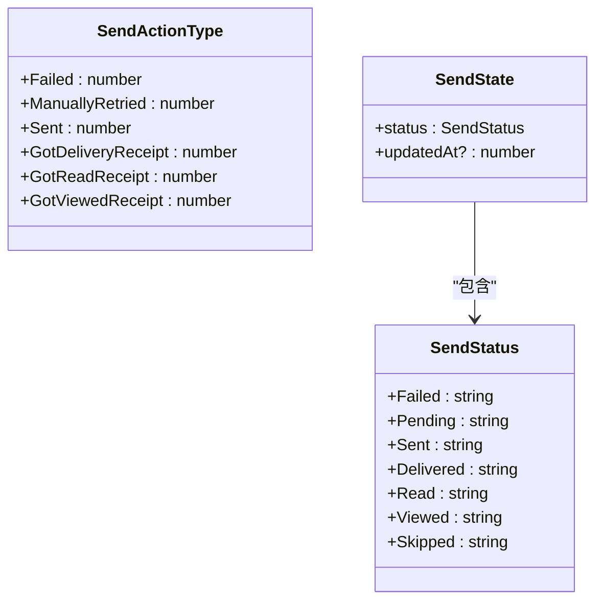
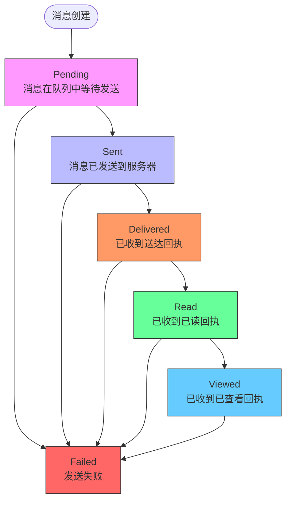
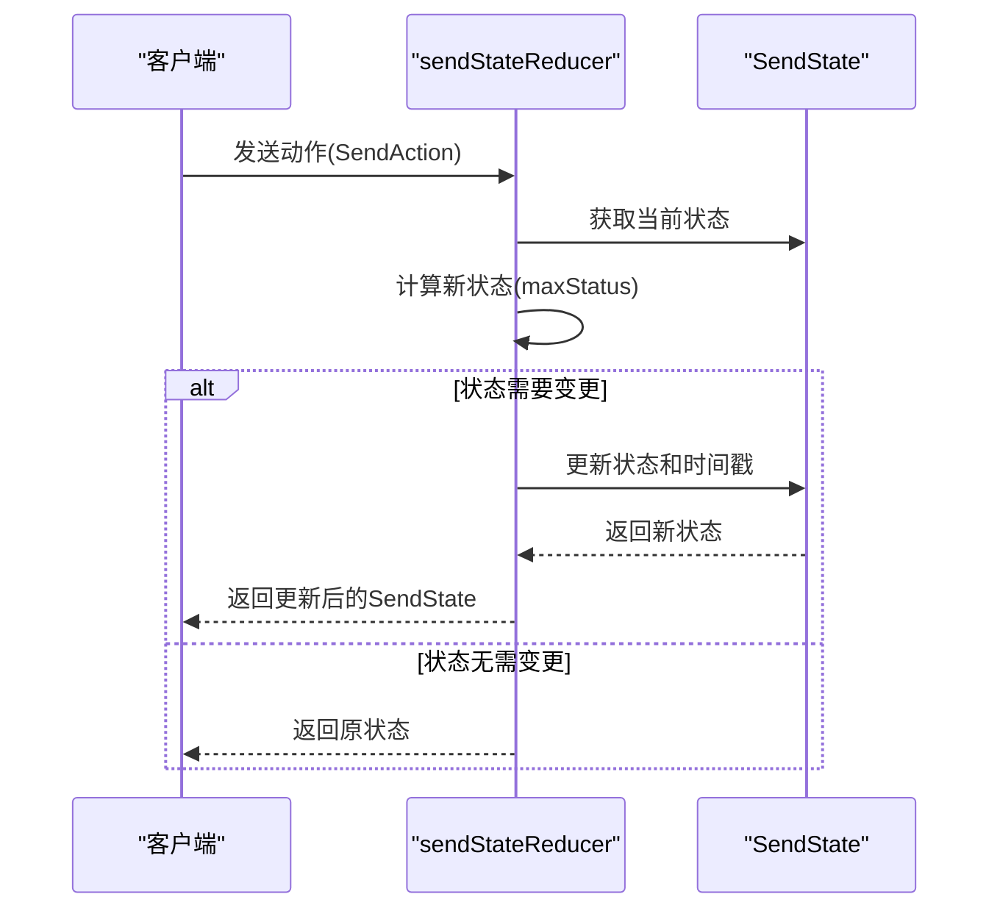
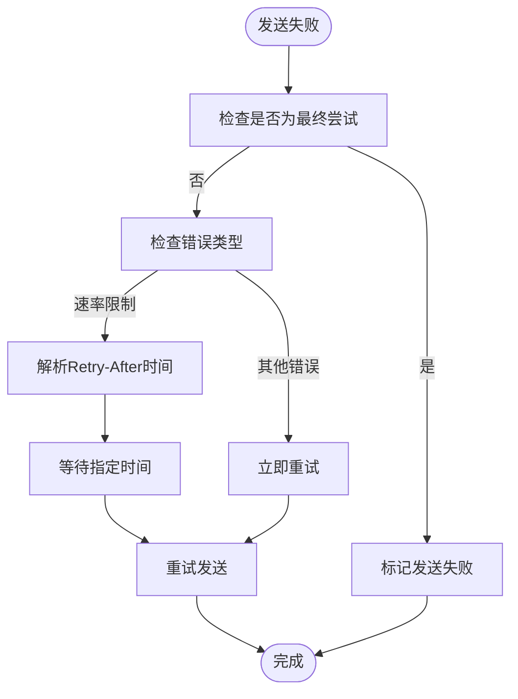
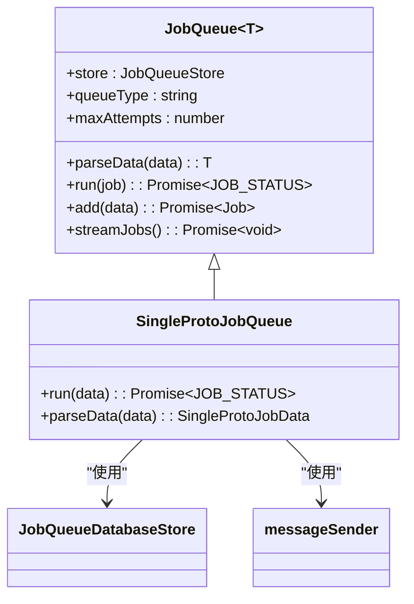
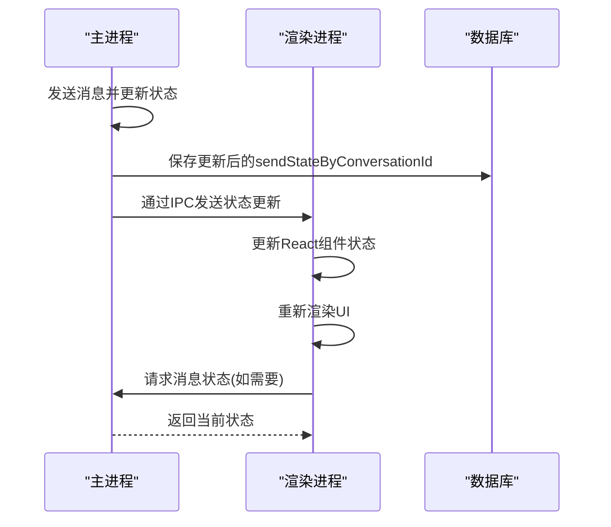
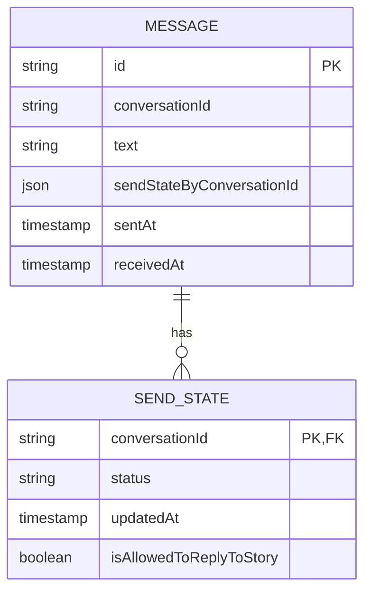
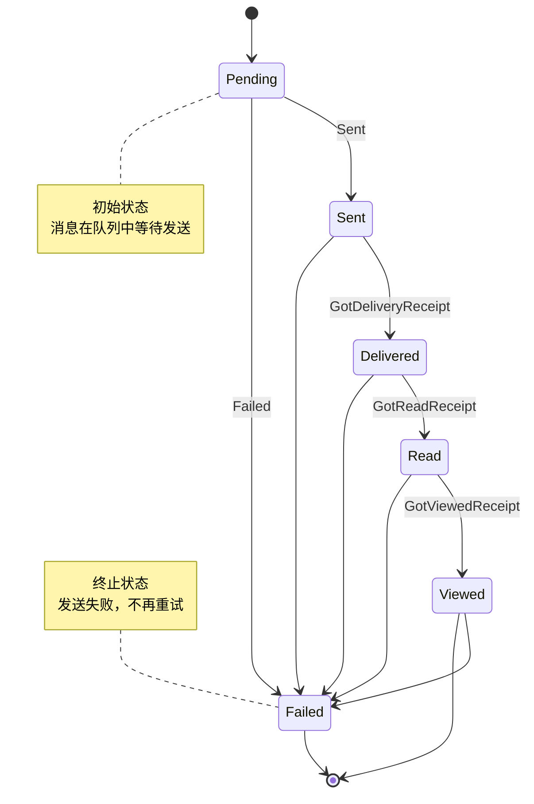
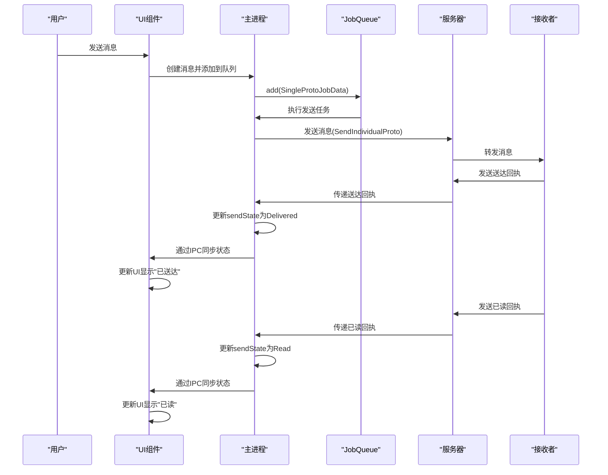

# 消息发送状态

<cite>
**本文档引用的文件**  
- [MessageSendState.std.ts](file://ts/messages/MessageSendState.std.ts)
- [singleProtoJobQueue.preload.ts](file://ts/jobs/singleProtoJobQueue.preload.ts)
- [JobQueue.std.ts](file://ts/jobs/JobQueue.std.ts)
- [message.preload.ts](file://ts/state/selectors/message.preload.ts)
- [MessageMetadata.dom.tsx](file://ts/components/conversation/MessageMetadata.dom.tsx)
- [MessageDetail.dom.stories.tsx](file://ts/components/conversation/MessageDetail.dom.stories.tsx)
- [MessageReceipts_test.preload.ts](file://ts/test-electron/MessageReceipts_test.preload.ts)
- [SendMessage.preload.ts](file://ts/textsecure/SendMessage.preload.ts)
- [handleMultipleSendErrors.std.ts](file://ts/jobs/helpers/handleMultipleSendErrors.std.ts)
- [StoryListItem.scss](file://stylesheets/components/StoryListItem.scss)
</cite>

## 目录
1. [介绍](#介绍)
2. [消息发送状态定义](#消息发送状态定义)
3. [消息发送状态生命周期](#消息发送状态生命周期)
4. [状态变更触发条件与处理逻辑](#状态变更触发条件与处理逻辑)
5. [重试机制与错误处理](#重试机制与错误处理)
6. [与消息队列的集成](#与消息队列的集成)
7. [进程间状态同步](#进程间状态同步)
8. [数据库操作与UI更新](#数据库操作与ui更新)
9. [状态转换图与时序图](#状态转换图与时序图)
10. [结论](#结论)

## 介绍
本文档详细解析Signal-Desktop中消息发送状态（MessageSendState）的实现机制。文档深入分析了`SendStatus`枚举类型中各个状态的定义和业务含义，阐述了消息从创建、排队发送、网络传输到最终确认的完整生命周期。同时，文档记录了消息发送过程中状态变更的触发条件和处理逻辑，包括重试机制、错误处理和超时策略。此外，文档还分析了发送状态与消息队列（JobQueue）的集成关系，以及如何通过IPC机制在主进程和渲染进程间同步状态，并结合实际代码示例展示发送状态更新的实现细节。

**Section sources**
- [MessageSendState.std.ts](file://ts/messages/MessageSendState.std.ts#L7-L27)

## 消息发送状态定义
`SendStatus`枚举类型定义了消息发送到单个接收者的状态。对于发送给多个接收者的消息，每个接收者都有独立的`SendStatus`。状态按正常发送流程的顺序定义如下：

- `Pending`：消息尚未发送，系统会持续尝试发送
- `Sent`：消息已成功发送到服务器
- `Delivered`：已收到送达回执
- `Read`：已收到已读回执（如果接收者禁用了发送此类回执，则不适用）
- `Viewed`：已收到已查看回执（并非所有消息类型都适用，或接收者禁用了发送此类回执）
- `Failed`：表示一个我们不想恢复的错误状态
- `Skipped`：表示该接收者被跳过

这些状态值在代码中是持久化的，因此在修改时需要特别小心。

**Diagram sources**
- [MessageSendState.std.ts](file://ts/messages/MessageSendState.std.ts#L29-L37)

**Section sources**
- [MessageSendState.std.ts](file://ts/messages/MessageSendState.std.ts#L29-L37)

## 消息发送状态生命周期
消息发送状态遵循一个有序的生命周期，通常按以下顺序进行状态转换：`Pending` → `Sent` → `Delivered` → `Read` → `Viewed`。在正常情况下，状态只会向前推进，不会倒退。然而，在某些特殊情况下，可能会跳过中间状态。例如，如果在收到送达回执之前就收到了已读回执，系统可能会直接从`Sent`状态跳转到`Read`状态，跳过`Delivered`状态。

消息的初始状态为`Pending`，表示消息已创建并加入发送队列，等待发送。一旦消息成功发送到服务器，状态将更新为`Sent`。当服务器确认消息已送达接收者设备时，状态变为`Delivered`。如果接收者查看了消息，系统会收到已读回执，状态更新为`Read`。对于某些消息类型（如故事），当接收者实际查看了内容时，会收到已查看回执，状态变为`Viewed`。

**Diagram sources**
- [MessageSendState.std.ts](file://ts/messages/MessageSendState.std.ts#L13-L25)

**Section sources**
- [MessageSendState.std.ts](file://ts/messages/MessageSendState.std.ts#L13-L25)

## 状态变更触发条件与处理逻辑
消息发送状态的变更由特定的动作（`SendAction`）触发。系统通过`sendStateReducer`函数处理状态转换，该函数根据当前状态和触发动作计算出新的状态。`SendActionType`定义了可能触发状态变更的动作：

- `Failed`：发送失败，触发状态变为`Failed`
- `ManuallyRetried`：手动重试，保持`Pending`状态
- `Sent`：成功发送，状态变为`Sent`
- `GotDeliveryReceipt`：收到送达回执，状态变为`Delivered`
- `GotReadReceipt`：收到已读回执，状态变为`Read`
- `GotViewedReceipt`：收到已查看回执，状态变为`Viewed`

`sendStateReducer`函数确保状态只向前推进，不会倒退。例如，如果当前状态是`Delivered`，收到`GotReadReceipt`动作后，状态会变为`Read`；但如果收到`GotDeliveryReceipt`动作，由于`Delivered`已经是更高级的状态，状态将保持不变。

**Diagram sources**
- [MessageSendState.std.ts](file://ts/messages/MessageSendState.std.ts#L112-L135)

**Section sources**
- [MessageSendState.std.ts](file://ts/messages/MessageSendState.std.ts#L112-L135)

## 重试机制与错误处理
当消息发送失败时，系统会根据错误类型和重试策略决定是否进行重试。`handleMultipleSendErrors`函数负责处理发送过程中的多个错误。该函数会检查是否为最终尝试（`isFinalAttempt`），如果是，则标记发送失败；否则，根据错误类型（如HTTP 413或429）中的`Retry-After`头信息进行延迟重试。

系统使用指数退避算法来控制重试间隔，避免对服务器造成过大压力。最大重试时间由`MAX_RETRY_TIME`常量定义，通常为一天。重试次数上限由`MAX_ATTEMPTS`计算得出，基于最大重试时间。对于速率限制错误（429）或请求过大错误（413），系统会解析`Retry-After`头信息，并等待指定时间后重试。

**Diagram sources**
- [handleMultipleSendErrors.std.ts](file://ts/jobs/helpers/handleMultipleSendErrors.std.ts#L22-L38)
- [singleProtoJobQueue.preload.ts](file://ts/jobs/singleProtoJobQueue.preload.ts#L34-L36)

**Section sources**
- [handleMultipleSendErrors.std.ts](file://ts/jobs/helpers/handleMultipleSendErrors.std.ts#L22-L38)

## 与消息队列的集成
消息发送与`JobQueue`系统紧密集成。`SingleProtoJobQueue`是专门用于处理单个协议消息发送的队列实现。当需要发送消息时，系统会创建一个`SingleProtoJobData`对象并将其添加到队列中。`JobQueue`负责管理任务的执行顺序、重试逻辑和错误处理。

`SingleProtoJobQueue`使用`PQueue`库来管理并发任务，`MAX_PARALLEL_JOBS`常量定义了最大并发数（通常为5）。每个任务在执行时会检查会话是否已接受、接收者是否未注册或被阻止，如果条件不满足则拒绝发送。任务执行成功后会从队列中移除，失败则根据重试策略决定是否重新排队。

**Diagram sources**
- [JobQueue.std.ts](file://ts/jobs/JobQueue.std.ts#L59-L388)
- [singleProtoJobQueue.preload.ts](file://ts/jobs/singleProtoJobQueue.preload.ts#L38-L148)

**Section sources**
- [JobQueue.std.ts](file://ts/jobs/JobQueue.std.ts#L59-L388)
- [singleProtoJobQueue.preload.ts](file://ts/jobs/singleProtoJobQueue.preload.ts#L38-L148)

## 进程间状态同步
消息发送状态通过Electron的IPC（进程间通信）机制在主进程和渲染进程之间同步。主进程负责实际的消息发送和状态管理，而渲染进程负责UI展示。当消息状态发生变化时，主进程会通过IPC将更新后的状态发送到渲染进程。

`MessageCache`服务在主进程中缓存消息对象，当状态更新时，它会通知渲染进程。渲染进程通过`useProxySelector`等React Hook订阅状态变化，并在UI中实时更新消息状态图标。这种设计确保了UI状态与实际发送状态的一致性，同时避免了频繁的数据库查询。

**Diagram sources**
- [MessageCache.preload.ts](file://ts/services/MessageCache.preload.ts#L76-L126)
- [message.preload.ts](file://ts/state/selectors/message.preload.ts#L2025-L2071)

**Section sources**
- [MessageCache.preload.ts](file://ts/services/MessageCache.preload.ts#L76-L126)

## 数据库操作与UI更新
消息发送状态通过`sendStateByConversationId`字段持久化存储在数据库中。该字段是一个以会话ID为键、`SendState`对象为值的记录（Record），记录了消息对每个接收者的发送状态。当收到回执时，系统会更新数据库中的相应状态。

在UI层面，`MessageMetadata`组件负责根据`sendStateByConversationId`计算并显示消息的整体状态。例如，如果所有接收者都已读消息，则显示"已读"图标；如果部分发送失败，则显示"部分发送"或"发送失败"状态。`MessageDetail`组件则可以显示每个接收者的具体状态。

**Diagram sources**
- [MessageReceipts_test.preload.ts](file://ts/test-electron/MessageReceipts_test.preload.ts#L88-L129)
- [MessageMetadata.dom.tsx](file://ts/components/conversation/MessageMetadata.dom.tsx#L80-L120)

**Section sources**
- [MessageReceipts_test.preload.ts](file://ts/test-electron/MessageReceipts_test.preload.ts#L88-L129)
- [MessageMetadata.dom.tsx](file://ts/components/conversation/MessageMetadata.dom.tsx#L80-L120)

## 状态转换图与时序图
以下是消息发送状态的完整状态转换图和关键流程的时序图。

**Diagram sources**
- [MessageSendState.std.ts](file://ts/messages/MessageSendState.std.ts#L29-L37)
- [singleProtoJobQueue.preload.ts](file://ts/jobs/singleProtoJobQueue.preload.ts#L55-L139)

**Section sources**
- [MessageSendState.std.ts](file://ts/messages/MessageSendState.std.ts#L29-L37)
- [singleProtoJobQueue.preload.ts](file://ts/jobs/singleProtoJobQueue.preload.ts#L55-L139)

## 结论
Signal-Desktop的消息发送状态系统是一个精心设计的状态机，通过`SendStatus`枚举、`sendStateReducer`函数和`JobQueue`系统的协同工作，实现了可靠的消息传递和状态管理。系统通过有序的状态转换、智能的重试机制和错误处理策略，确保了消息的高可靠送达。同时，通过IPC机制和状态缓存，实现了主进程与渲染进程之间的高效状态同步，为用户提供实时、准确的发送状态反馈。这种分层、模块化的设计使得系统既健壮又易于维护和扩展。