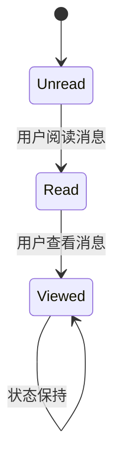
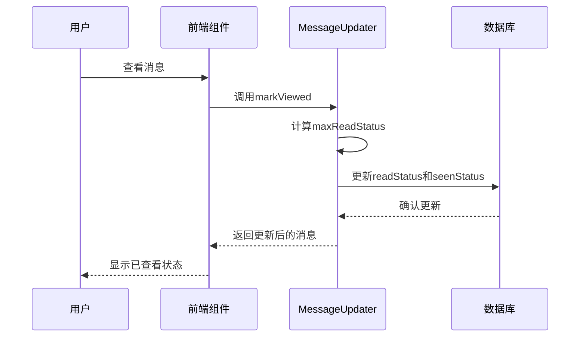
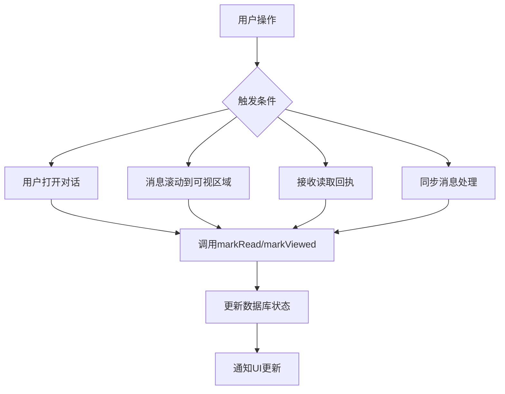
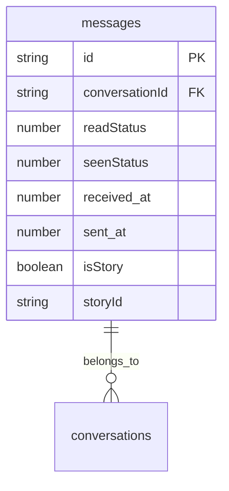
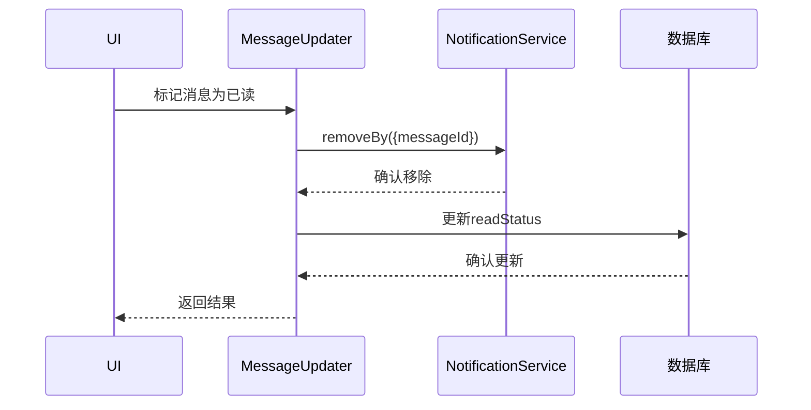
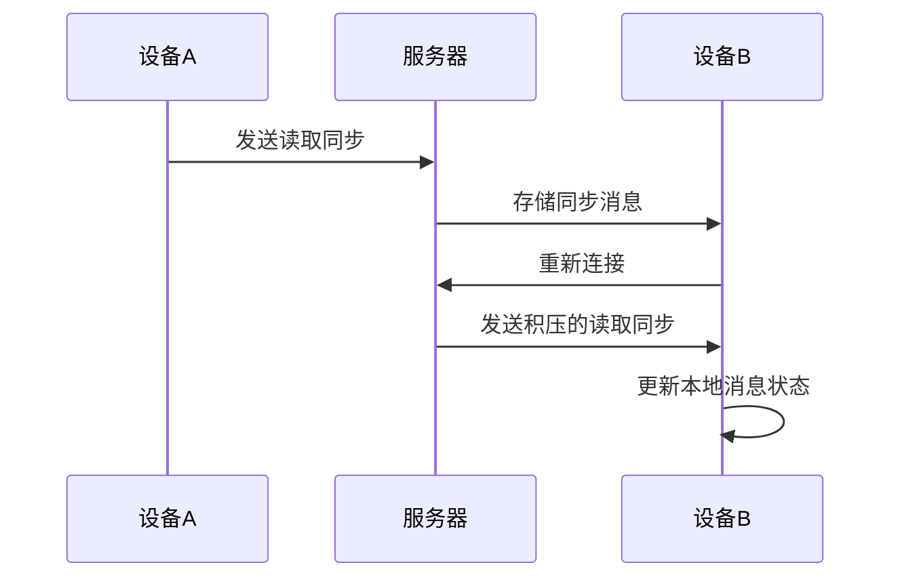
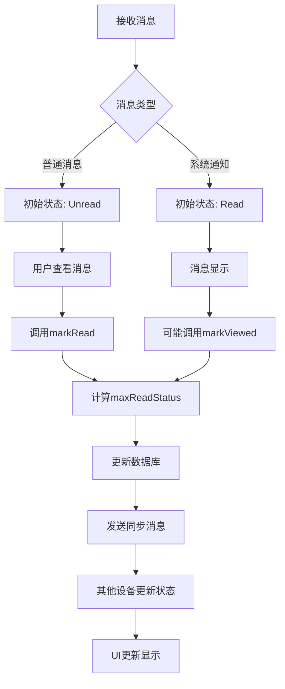

# 消息已读状态

<cite>
**本文档引用的文件**
- [MessageReadStatus.std.ts](file://ts/messages/MessageReadStatus.std.ts)
- [MessageSeenStatus.std.ts](file://ts/MessageSeenStatus.std.ts)
- [MessageSendState.std.ts](file://ts/messages/MessageSendState.std.ts)
- [isMessageUnread.std.ts](file://ts/util/isMessageUnread.std.ts)
- [56-add-unseen-to-message.std.ts](file://ts/sql/migrations/56-add-unseen-to-message.std.ts)
- [50-fix-messages-unread-index.std.ts](file://ts/sql/migrations/50-fix-messages-unread-index.std.ts)
- [MessageUpdater.preload.ts](file://ts/services/MessageUpdater.preload.ts)
- [ViewSyncs.preload.ts](file://ts/messageModifiers/ViewSyncs.preload.ts)
- [migration_1000_test.node.ts](file://ts/test-node/sql/migration_1000_test.node.ts)
- [migrations_test.node.ts](file://ts/test-node/sql/migrations_test.node.ts)
</cite>

## 目录
1. [消息已读状态概述](#消息已读状态概述)
2. [MessageReadStatus枚举类型](#messagereadstatus枚举类型)
3. [消息已读状态管理机制](#消息已读状态管理机制)
4. [已读状态变更触发条件](#已读状态变更触发条件)
5. [数据库操作与索引优化](#数据库操作与索引优化)
6. [已读状态与消息通知系统集成](#已读状态与消息通知系统集成)
7. [离线期间状态同步处理](#离线期间状态同步处理)
8. [状态转换表与处理流程图](#状态转换表与处理流程图)

## 消息已读状态概述

Signal-Desktop中的消息已读状态系统用于跟踪用户对消息的阅读和查看情况。该系统包含多个状态级别，从"未读"到"已读"再到"已查看"，确保消息状态的准确性和一致性。系统设计遵循单向状态转换原则，即状态只能向前推进，不能回退。

**Section sources**
- [MessageReadStatus.std.ts](file://ts/messages/MessageReadStatus.std.ts)
- [MessageSeenStatus.std.ts](file://ts/MessageSeenStatus.std.ts)

## MessageReadStatus枚举类型

`ReadStatus`枚举类型定义了消息的本地读取和查看状态，包含三个主要状态：

- **Unread (未读)**: 值为1，表示消息尚未被阅读
- **Read (已读)**: 值为0，表示消息已被阅读
- **Viewed (已查看)**: 值为2，表示消息已被查看

这些状态遵循单向转换原则：消息从"未读"状态变为"已读"状态，再变为"已查看"状态，永远不会"倒退"。状态值的分配是出于持久化考虑，特别是因为之前存在名为"unread"的字段，所以Unread对应1，Read对应0。

**Diagram sources**
- [MessageReadStatus.std.ts](file://ts/messages/MessageReadStatus.std.ts)

**Section sources**
- [MessageReadStatus.std.ts](file://ts/messages/MessageReadStatus.std.ts)

## 消息已读状态管理机制

消息已读状态的管理通过`markRead`和`markViewed`函数实现，这些函数位于`MessageUpdater.preload.ts`文件中。当用户阅读或查看消息时，系统会调用相应的函数来更新消息状态。

本地会话中的状态更新通过`maxReadStatus`函数确保状态的正确性。该函数比较两个读取状态并返回较高的状态，确保消息状态只能向前推进。跨设备同步通过同步消息机制实现，当一个设备上的消息状态改变时，该状态会同步到用户的其他设备。

**Diagram sources**
- [MessageUpdater.preload.ts](file://ts/services/MessageUpdater.preload.ts)
- [MessageReadStatus.std.ts](file://ts/messages/MessageReadStatus.std.ts)

**Section sources**
- [MessageUpdater.preload.ts](file://ts/services/MessageUpdater.preload.ts)

## 已读状态变更触发条件

已读状态的变更由多种条件触发，主要包括：

1. **用户主动查看消息**: 当用户打开对话并查看消息内容时
2. **消息滚动到可视区域**: 当消息在消息列表中滚动到用户可视范围内时
3. **接收读取回执**: 当系统接收到其他用户对消息的读取回执时
4. **同步消息处理**: 当从其他设备同步读取状态时

在`Timeline.dom.tsx`文件中，通过Intersection Observer API检测消息是否进入可视区域，从而触发状态更新。`ViewSyncs.preload.ts`文件处理来自其他设备的查看同步消息，当接收到查看同步时，会调用`markViewed`函数更新本地状态。

**Diagram sources**
- [Timeline.dom.tsx](file://ts/components/conversation/Timeline.dom.tsx)
- [ViewSyncs.preload.ts](file://ts/messageModifiers/ViewSyncs.preload.ts)

**Section sources**
- [Timeline.dom.tsx](file://ts/components/conversation/Timeline.dom.tsx)
- [ViewSyncs.preload.ts](file://ts/messageModifiers/ViewSyncs.preload.ts)

## 数据库操作与索引优化

消息已读状态在数据库中通过`readStatus`和`seenStatus`字段存储。为了优化大规模消息历史的性能，系统采用了多种索引策略。

在数据库迁移脚本`56-add-unseen-to-message.std.ts`中，添加了`seenStatus`列并创建了两个索引：`messages_unseen_no_story`和`messages_unseen_with_story`。这些索引基于`conversationId`、`seenStatus`、`isStory`等字段，提高了查询未查看消息的效率。

**Diagram sources**
- [56-add-unseen-to-message.std.ts](file://ts/sql/migrations/56-add-unseen-to-message.std.ts)

**Section sources**
- [56-add-unseen-to-message.std.ts](file://ts/sql/migrations/56-add-unseen-to-message.std.ts)
- [50-fix-messages-unread-index.std.ts](file://ts/sql/migrations/50-fix-messages-unread-index.std.ts)

## 已读状态与消息通知系统集成

已读状态与消息通知系统紧密集成，影响通知的显示和管理。当消息状态从"未读"变为"已读"或"已查看"时，系统会移除相应的通知。

在`MessageUpdater.preload.ts`文件中，`markReadOrViewed`函数在更新消息状态时会调用`notificationService.removeBy`方法，根据消息ID移除通知。这种集成确保了用户界面的一致性，避免了已读消息仍然显示通知的情况。

**Diagram sources**
- [MessageUpdater.preload.ts](file://ts/services/MessageUpdater.preload.ts)

**Section sources**
- [MessageUpdater.preload.ts](file://ts/services/MessageUpdater.preload.ts)

## 离线期间状态同步处理

离线期间的状态同步通过读取同步消息（read sync messages）实现。当用户在一个设备上阅读消息时，即使其他设备离线，当这些设备重新上线时，它们会接收读取同步消息并更新本地状态。

在`migrations_test.node.ts`测试文件中，验证了数据库迁移后未读通话历史消息的处理逻辑。系统会将特定类型的消息（如`call-history`、`change-number-notification`等）在迁移过程中标记为已读，确保用户体验的一致性。

**Diagram sources**
- [migrations_test.node.ts](file://ts/test-node/sql/migrations_test.node.ts)
- [migration_1000_test.node.ts](file://ts/test-node/sql/migration_1000_test.node.ts)

**Section sources**
- [migrations_test.node.ts](file://ts/test-node/sql/migrations_test.node.ts)
- [migration_1000_test.node.ts](file://ts/test-node/sql/migration_1000_test.node.ts)

## 状态转换表与处理流程图

以下是消息已读状态的状态转换表：

| 当前状态\新状态 | Unread (未读) | Read (已读) | Viewed (已查看) |
|----------------|--------------|------------|----------------|
| Unread (未读)   | Unread       | Read       | Viewed         |
| Read (已读)     | Read         | Read       | Viewed         |
| Viewed (已查看) | Viewed       | Viewed     | Viewed         |

处理流程图展示了消息状态更新的完整流程：

**Diagram sources**
- [MessageReadStatus.std.ts](file://ts/messages/MessageReadStatus.std.ts)
- [MessageUpdater.preload.ts](file://ts/services/MessageUpdater.preload.ts)

**Section sources**
- [MessageReadStatus.std.ts](file://ts/messages/MessageReadStatus.std.ts)
- [MessageUpdater.preload.ts](file://ts/services/MessageUpdater.preload.ts)