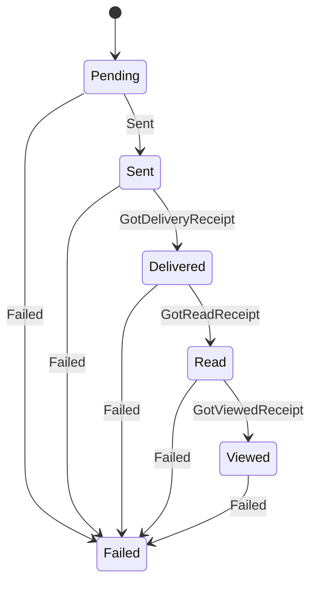
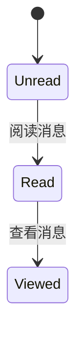
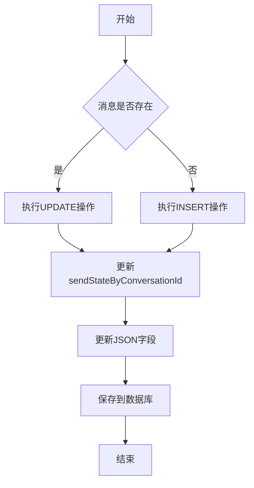
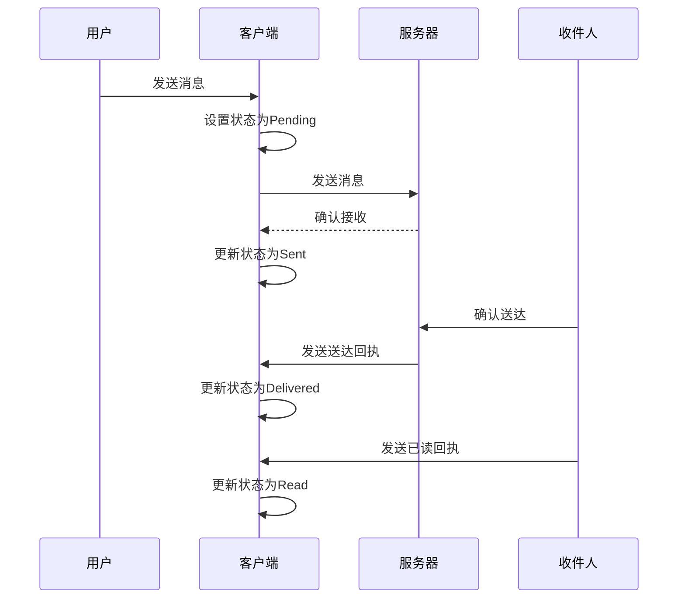

# 消息状态

<cite>
**本文档中引用的文件**  
- [MessageSendState.std.ts](file://ts/messages/MessageSendState.std.ts)
- [MessageReadStatus.std.ts](file://ts/messages/MessageReadStatus.std.ts)
- [MessageSeenStatus.std.ts](file://ts/MessageSeenStatus.std.ts)
- [migrations/index.node.ts](file://ts/sql/migrations/index.node.ts)
- [1000-mark-unread-call-history-messages-as-unseen.std.ts](file://ts/sql/migrations/1000-mark-unread-call-history-messages-as-unseen.std.ts)
- [send.preload.ts](file://ts/messages/send.preload.ts)
- [Server.node.ts](file://ts/sql/Server.node.ts)
- [MessageCache.preload.ts](file://ts/services/MessageCache.preload.ts)
</cite>

## 目录
1. [介绍](#介绍)
2. [消息发送状态](#消息发送状态)
3. [消息已读状态](#消息已读状态)
4. [消息状态机](#消息状态机)
5. [数据库操作与索引优化](#数据库操作与索引优化)
6. [状态同步机制](#状态同步机制)
7. [数据库迁移](#数据库迁移)
8. [时序图与状态转换表](#时序图与状态转换表)
9. [结论](#结论)

## 介绍
本文档详细说明Signal-Desktop应用程序中消息状态管理的实现机制。重点分析消息的发送状态（MessageSendState）和已读状态（MessageReadStatus）的定义、转换规则和持久化策略。文档涵盖了消息状态机的各个阶段，包括发送中、已发送、已送达、已读和已查看等状态的含义和触发条件。同时，文档还记录了消息状态更新的数据库操作、索引优化策略以及状态同步机制。

**Section sources**
- [MessageSendState.std.ts](file://ts/messages/MessageSendState.std.ts#L1-L278)
- [MessageReadStatus.std.ts](file://ts/messages/MessageReadStatus.std.ts#L1-L27)

## 消息发送状态
消息发送状态（SendStatus）表示消息对单个收件人的发送状态。当消息发送给多个收件人时，每个收件人都有独立的发送状态。发送状态遵循一个有序的演进过程：

- **Pending（待发送）**：消息尚未发送，系统正在尝试发送
- **Sent（已发送）**：消息已成功发送到服务器
- **Delivered（已送达）**：已收到送达回执
- **Read（已读）**：已收到已读回执（如果收件人未禁用此功能）
- **Viewed（已查看）**：已收到已查看回执（适用于特定消息类型）
- **Failed（失败）**：发送过程中发生不可恢复的错误
- **Skipped（跳过）**：在特定情况下跳过发送

发送状态的转换通过`sendStateReducer`函数实现，该函数根据接收到的动作类型（SendActionType）更新状态。状态转换遵循单向递进原则，不会回退到之前的低级状态。



**Diagram sources**
- [MessageSendState.std.ts](file://ts/messages/MessageSendState.std.ts#L29-L37)
- [MessageSendState.std.ts](file://ts/messages/MessageSendState.std.ts#L112-L135)

**Section sources**
- [MessageSendState.std.ts](file://ts/messages/MessageSendState.std.ts#L7-L83)

## 消息已读状态
消息已读状态（ReadStatus）表示用户本地对单个入站消息的阅读状态。状态值包括：

- **Unread（未读）**：值为1，表示消息未读
- **Read（已读）**：值为0，表示消息已读
- **Viewed（已查看）**：值为2，表示消息已被查看

值得注意的是，ReadStatus的数值分配是历史遗留问题，其中Unread对应1，Read对应0。状态转换通过`maxReadStatus`函数实现，该函数根据状态数值的大小关系确定最高状态。消息已读状态与会话级别的未读标记不同，后者是更高层次的概念。



**Diagram sources**
- [MessageReadStatus.std.ts](file://ts/messages/MessageReadStatus.std.ts#L13-L17)

**Section sources**
- [MessageReadStatus.std.ts](file://ts/messages/MessageReadStatus.std.ts#L4-L27)

## 消息状态机
消息状态机由发送状态和已读状态共同构成，管理消息的完整生命周期。状态机的核心组件包括：

- **SendState**：结合SendStatus和时间戳的复合类型，用于向用户显示"消息在XX时间送达"等信息
- **SendAction**：触发状态转换的动作，包括Failed、ManuallyRetried、Sent、GotDeliveryReceipt、GotReadReceipt和GotViewedReceipt
- **sendStateReducer**：状态转换函数，根据当前状态和动作类型计算新状态

状态机的实现考虑了多种边缘情况，例如在收到已读回执前收到送达回执的情况。系统通过`STATUS_NUMBERS`映射将状态转换为数值比较，确保状态只能向前演进，不能回退。

**Section sources**
- [MessageSendState.std.ts](file://ts/messages/MessageSendState.std.ts#L85-L135)

## 数据库操作与索引优化
消息状态的持久化通过SQLite数据库实现，相关操作和索引优化策略如下：

### 数据库索引
系统创建了多个索引来优化消息状态查询性能：

- **messages_conversation**：按会话ID和接收时间索引，用于按会话加载消息
- **messages_hasAttachments**：按会话ID、是否有附件和接收时间索引
- **messages_unread**：按会话ID和未读状态索引，用于快速查找未读消息
- **messages_searchOrder**：按接收时间和发送时间索引，用于搜索消息

### 数据库操作
消息状态的更新通过`saveMessage`函数实现，该函数处理消息的插入或更新操作。对于已存在的消息，使用UPDATE语句更新非主键字段；对于新消息，使用INSERT语句插入完整记录。状态更新时，系统会同时更新JSON字段中的状态信息和独立的状态列。



**Diagram sources**
- [migrations/index.node.ts](file://ts/sql/migrations/index.node.ts#L175-L178)
- [Server.node.ts](file://ts/sql/Server.node.ts#L3095-L3121)

**Section sources**
- [migrations/index.node.ts](file://ts/sql/migrations/index.node.ts#L173-L209)
- [Server.node.ts](file://ts/sql/Server.node.ts#L3095-L3150)

## 状态同步机制
消息状态的同步机制包括本地状态更新和远程状态确认两个方面：

### 本地状态更新
当用户发送消息时，系统首先更新本地状态为"发送中"，然后尝试将消息发送到服务器。一旦消息成功发送到服务器，系统会更新状态为"已发送"，并触发`handleMessageSend`回调。在`send.preload.ts`文件中，`sendStateReducer`被调用以更新发送状态。

### 远程状态确认
当收件人设备确认收到消息时，会发送相应的回执：
- **送达回执**：触发GotDeliveryReceipt动作，更新状态为"已送达"
- **已读回执**：触发GotReadReceipt动作，更新状态为"已读"
- **已查看回执**：触发GotViewedReceipt动作，更新状态为"已查看"

系统通过`MessageCache`服务管理消息的缓存，提供`register`和`saveMessage`方法来注册和保存消息状态。`MessageCache`维护了按发送者标识符和发送时间索引的消息映射，确保快速查找和更新。

**Section sources**
- [send.preload.ts](file://ts/messages/send.preload.ts#L400-L482)
- [MessageCache.preload.ts](file://ts/services/MessageCache.preload.ts#L76-L126)

## 数据库迁移
系统通过数据库迁移脚本处理状态字段的变更和数据一致性维护。关键迁移包括：

### 标记未读通话历史消息为未查看
`1000-mark-unread-call-history-messages-as-unseen.std.ts`迁移脚本将未读的通话历史消息标记为"未查看"状态。该脚本遍历所有类型为"call-history"且读取状态为"Unread"的消息，将其读取状态更新为"Read"，同时将查看状态设置为"Unseen"。

```sql
UPDATE messages
SET
  json = JSON_PATCH(json, '{"readStatus": 0, "seenStatus": 1}'),
  readStatus = 0,
  seenStatus = 1
WHERE id = ?
```

此迁移确保了通话历史消息的状态一致性，解决了之前未正确跟踪查看状态的问题。

**Section sources**
- [1000-mark-unread-call-history-messages-as-unseen.std.ts](file://ts/sql/migrations/1000-mark-unread-call-history-messages-as-unseen.std.ts#L1-L44)

## 时序图与状态转换表
### 消息发送时序图


**Diagram sources**
- [MessageSendState.std.ts](file://ts/messages/MessageSendState.std.ts#L11-L25)
- [send.preload.ts](file://ts/messages/send.preload.ts#L400-L482)

### 状态转换表
| 当前状态 | 触发动作 | 新状态 | 说明 |
|---------|---------|-------|------|
| Pending | Sent | Sent | 消息成功发送到服务器 |
| Sent | GotDeliveryReceipt | Delivered | 收到送达回执 |
| Delivered | GotReadReceipt | Read | 收到已读回执 |
| Read | GotViewedReceipt | Viewed | 收到已查看回执 |
| Pending | Failed | Failed | 发送失败 |
| Any | Failed | Failed | 任何状态下发生不可恢复错误 |

**Section sources**
- [MessageSendState.std.ts](file://ts/messages/MessageSendState.std.ts#L159-L166)

## 结论
Signal-Desktop的消息状态管理系统通过精心设计的状态机、高效的数据库索引和可靠的同步机制，确保了消息状态的准确性和一致性。系统采用分层的状态管理策略，将发送状态和已读状态分离处理，同时通过`sendStateReducer`函数确保状态转换的正确性。数据库迁移策略保证了状态字段的向后兼容性，而`MessageCache`服务则提供了高效的本地状态管理。整体设计体现了高可靠性、高性能和良好的可维护性。