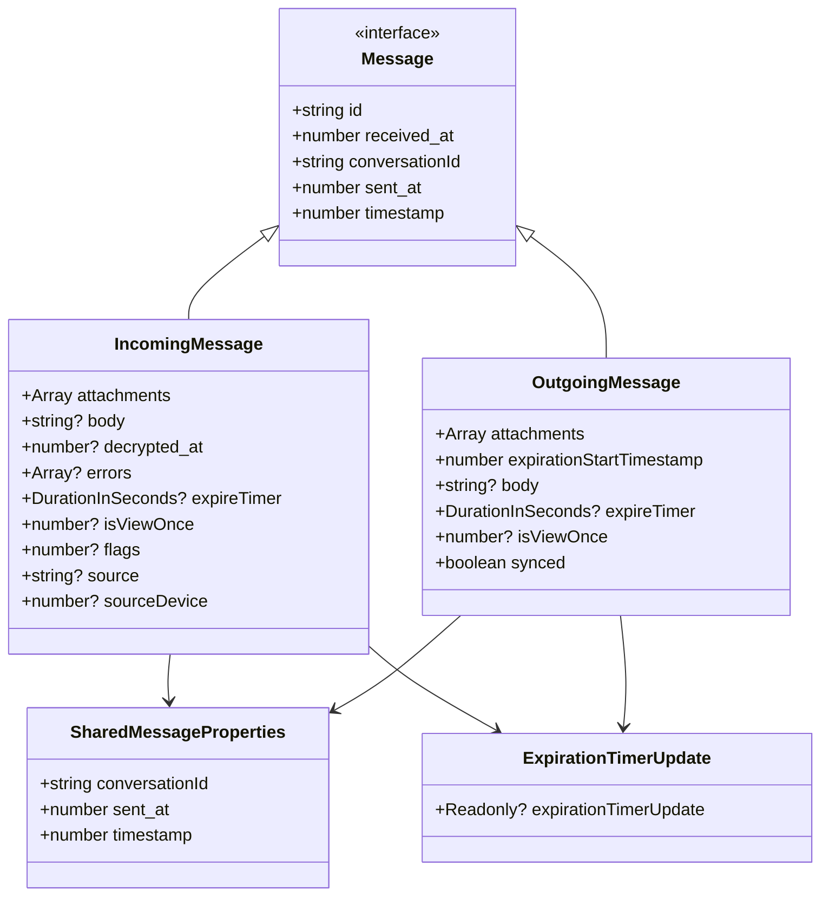
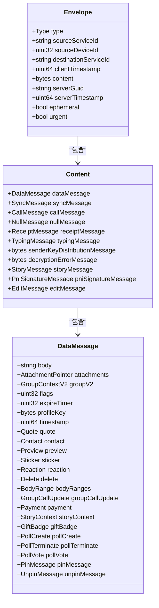
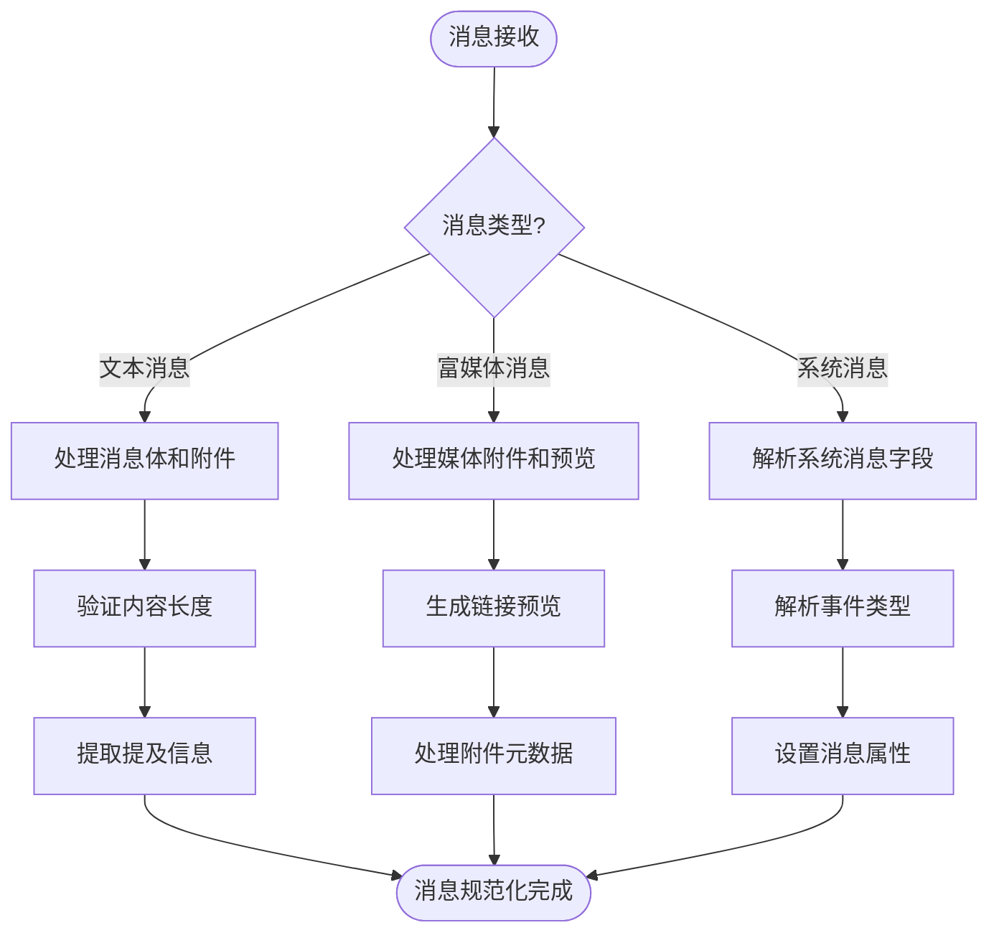
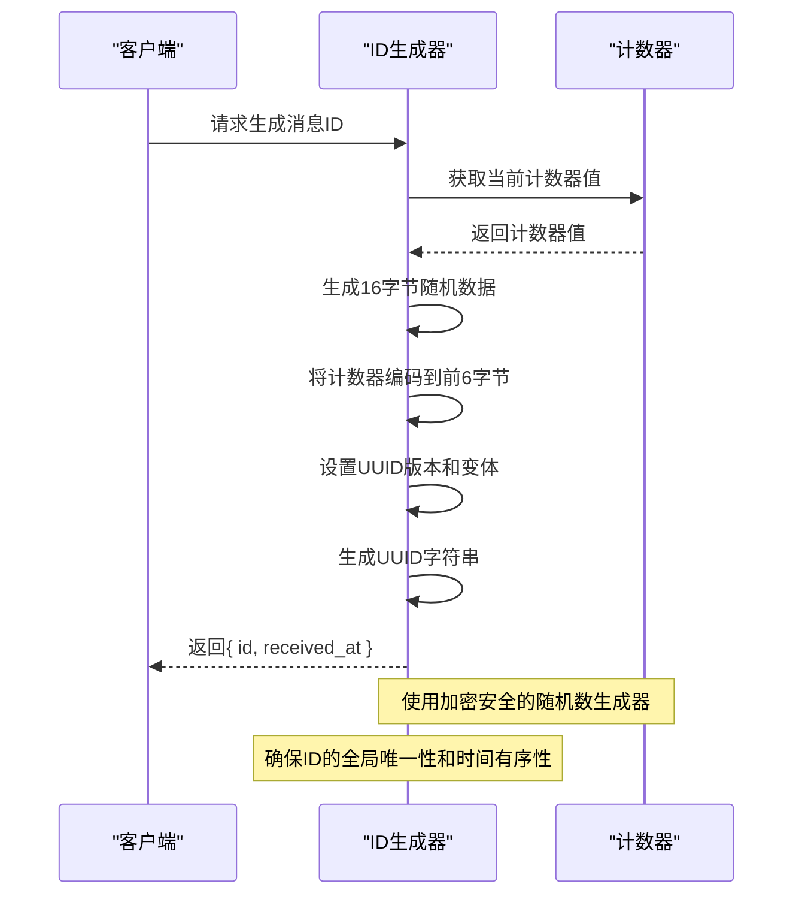
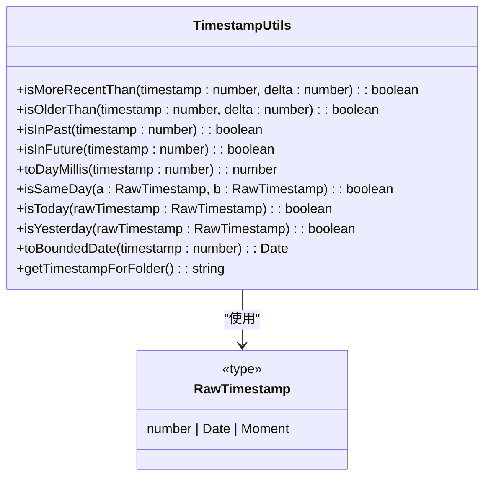
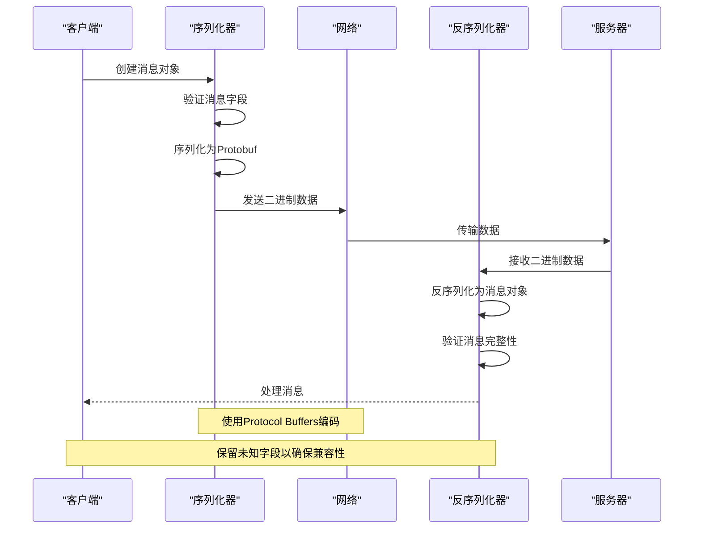

# 消息结构

<cite>
**本文档中引用的文件**   
- [Message.std.ts](file://ts/types/Message.std.ts)
- [SignalService.proto](file://protos/SignalService.proto)
- [generateMessageId.node.ts](file://ts/util/generateMessageId.node.ts)
- [timestamp.std.ts](file://ts/util/timestamp.std.ts)
</cite>

## 目录
1. [消息实体定义](#消息实体定义)
2. [Protocol Buffers序列化格式](#protocol-buffers序列化格式)
3. [消息规范化处理流程](#消息规范化处理流程)
4. [消息ID生成策略](#消息id生成策略)
5. [时间戳处理机制](#时间戳处理机制)
6. [消息创建与序列化示例](#消息创建与序列化示例)

## 消息实体定义

在Signal-Desktop中，消息实体在`Message.std.ts`文件中定义，包含多种消息类型和共享属性。消息类型包括传入消息(IncomingMessage)、传出消息(OutgoingMessage)、验证变更消息(VerifiedChangeMessage)和资料变更通知消息(ProfileChangeNotificationMessage)。

传入消息和传出消息都包含附件数组、ID、接收时间戳等必需字段，以及消息体、解密时间戳、错误信息、过期计时器等可选字段。共享消息属性包括对话ID、发送时间戳和时间戳。消息还包含过期计时器更新信息，包括过期时间、是否来自同步以及来源。

消息实体还定义了在擦除消息内容后需要保留的属性列表，包括ID、时间戳、对话ID、类型、发送时间戳、接收时间戳等。同时定义了需要擦除的属性列表，包括附件、消息体、联系人、预览、引用等。

**Diagram sources**
- [Message.std.ts](file://ts/types/Message.std.ts#L15-L140)

**Section sources**
- [Message.std.ts](file://ts/types/Message.std.ts#L15-L210)

## Protocol Buffers序列化格式

SignalService.proto文件定义了消息的Protocol Buffers序列化格式，包括信封(Envelope)、内容(Content)、数据消息(DataMessage)等核心结构。信封包含消息类型、源服务ID、源设备ID、目标服务ID、客户端时间戳、内容、服务器GUID、服务器时间戳等字段。

内容结构包含数据消息、同步消息、通话消息、空消息、回执消息、输入状态消息等不同类型的消息。数据消息是核心消息类型，包含消息体、附件、群组上下文、标志、过期计时器、资料密钥、时间戳、引用、联系人、预览、贴纸等字段。

数据消息还支持多种扩展功能，包括引用、联系人、预览、贴纸、反应、删除、正文范围、群组通话更新、支付、故事上下文、礼物徽章、投票创建、投票终止、投票投票、固定消息、取消固定消息等。这些功能通过可选字段实现，允许消息包含丰富的多媒体内容和交互功能。

**Diagram sources**
- [SignalService.proto](file://protos/SignalService.proto#L13-L435)

**Section sources**
- [SignalService.proto](file://protos/SignalService.proto#L1-L992)

## 消息规范化处理流程

Signal-Desktop对不同类型的消息采用不同的结构和处理流程。文本消息是最基本的消息类型，主要包含消息体和可选的附件。富媒体消息可以包含图片、视频、音频等附件，并通过预览功能提供链接缩略图。

系统消息用于通知用户各种事件，如资料变更、验证变更、群组更新等。这些消息通过特定的消息类型和结构来表示，不包含普通的消息体，而是通过专门的字段传递信息。

消息的规范化处理包括对消息内容的验证、附件的处理、引用的解析、预览的生成等。对于包含引用的消息，系统会解析引用的消息ID、作者、文本和附件等信息。对于包含预览的消息，系统会提取链接的URL、标题、描述和图片等信息。

消息处理还涉及对特殊字符的处理，如提及(mentions)使用特殊字符\uFFFC表示。系统会识别这些特殊字符并将其转换为相应的提及UI元素。对于包含支付信息的消息，系统会解析支付金额、货币类型、交易凭证等信息。

**Diagram sources**
- [Message.std.ts](file://ts/types/Message.std.ts#L15-L210)
- [SignalService.proto](file://protos/SignalService.proto#L185-L435)

**Section sources**
- [Message.std.ts](file://ts/types/Message.std.ts#L15-L210)
- [SignalService.proto](file://protos/SignalService.proto#L185-L435)

## 消息ID生成策略

消息ID在`generateMessageId.node.ts`文件中生成，采用UUID版本7的格式。UUID版本7结合了时间戳和随机数，确保消息ID的全局唯一性和时间有序性。生成过程使用6个字节的时间戳样式的计数器，确保ID的字典序正确。

消息ID生成函数接受一个计数器参数，该参数通常来自系统时间戳。函数首先生成16字节的随机数据，然后将计数器的值编码到前6个字节中。接着设置UUID的版本号为7，并设置变体为"2"，符合RFC 4122标准。

生成的消息ID包含两个部分：ID字符串和接收时间戳。ID字符串是标准的UUID格式，而接收时间戳是生成ID时的计数器值。这种设计使得消息ID既具有唯一性，又包含时间信息，便于消息的排序和检索。

消息ID生成策略确保了即使在高并发场景下，也能生成不重复的ID。通过使用加密安全的随机数生成器，避免了ID碰撞的风险。同时，时间戳的有序性保证了消息按时间顺序排列。

**Diagram sources**
- [generateMessageId.node.ts](file://ts/util/generateMessageId.node.ts#L1-L47)

**Section sources**
- [generateMessageId.node.ts](file://ts/util/generateMessageId.node.ts#L1-L47)

## 时间戳处理机制

时间戳处理在`timestamp.std.ts`文件中实现，提供了一系列工具函数来处理和比较时间戳。核心功能包括判断时间戳是否比当前时间更近或更早、判断时间戳是否在过去或未来、将时间戳转换为天级精度等。

`isMoreRecentThan`函数检查时间戳是否在指定时间范围内，而`isOlderThan`函数检查时间戳是否超过指定时间范围。`isInPast`和`isInFuture`函数分别检查时间戳是否在过去或未来。`toDayMillis`函数将时间戳截断到天级精度，用于按天分组消息。

文件还提供了日期比较函数，如`isSameDay`、`isToday`和`isYesterday`，用于判断两个时间戳是否在同一天、是否是今天或昨天。这些函数基于moment.js库实现，提供了准确的日期比较功能。

为了防止JavaScript的日期溢出问题，文件定义了`MAX_SAFE_DATE`和`MIN_SAFE_DATE`常量，并提供了`toBoundedDate`函数将时间戳限制在安全范围内。这确保了即使接收到异常的时间戳，系统也能安全处理。

**Diagram sources**
- [timestamp.std.ts](file://ts/util/timestamp.std.ts#L1-L57)

**Section sources**
- [timestamp.std.ts](file://ts/util/timestamp.std.ts#L1-L57)

## 消息创建与序列化示例

消息的创建、序列化和反序列化过程涉及多个步骤和组件。首先，客户端创建消息对象，填充必要的字段如消息体、附件、接收者等。然后，消息通过Protocol Buffers序列化为二进制格式，准备发送。

序列化过程将消息对象转换为紧凑的二进制表示，减少网络传输开销。反序列化过程将接收到的二进制数据转换回消息对象，供客户端处理和显示。整个过程确保了消息的完整性和一致性。

在实际应用中，消息的JSON示例可能包含消息ID、发送者、接收者、时间戳、消息体、附件引用等字段。对应的Protocol Buffers编码示例则显示了这些字段如何编码为二进制格式，包括字段标签、数据类型和值。

消息的序列化还支持未知字段的处理，允许在不破坏兼容性的情况下扩展消息格式。当接收到包含未知字段的消息时，系统会保留这些字段，以便在需要时进行处理或转发。

**Diagram sources**
- [Message.std.ts](file://ts/types/Message.std.ts#L15-L210)
- [SignalService.proto](file://protos/SignalService.proto#L1-L992)
- [generateMessageId.node.ts](file://ts/util/generateMessageId.node.ts#L1-L47)
- [timestamp.std.ts](file://ts/util/timestamp.std.ts#L1-L57)

**Section sources**
- [Message.std.ts](file://ts/types/Message.std.ts#L15-L210)
- [SignalService.proto](file://protos/SignalService.proto#L1-L992)
- [generateMessageId.node.ts](file://ts/util/generateMessageId.node.ts#L1-L47)
- [timestamp.std.ts](file://ts/util/timestamp.std.ts#L1-L57)