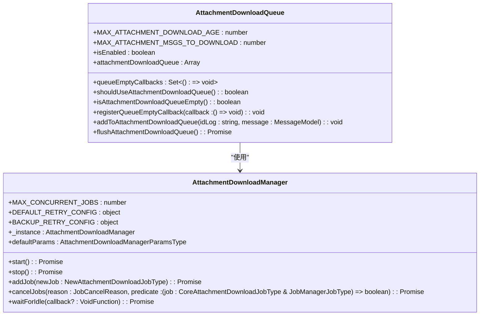
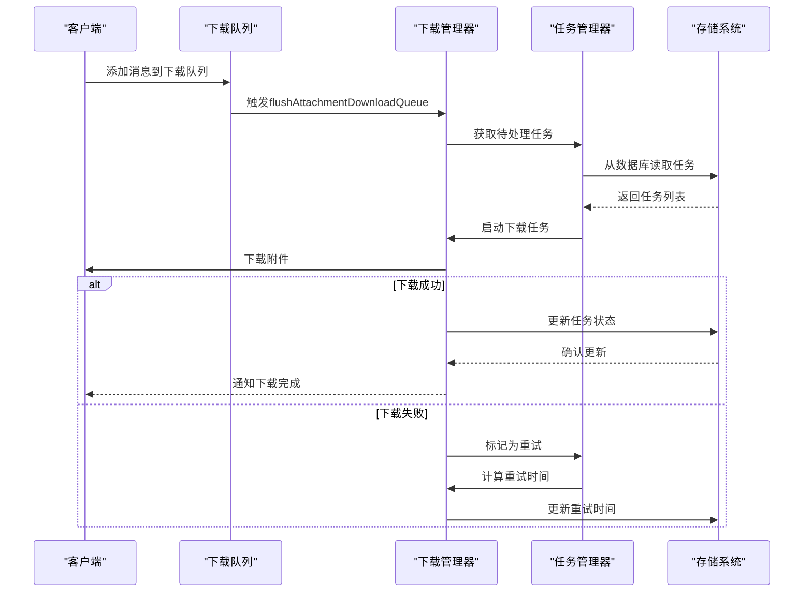
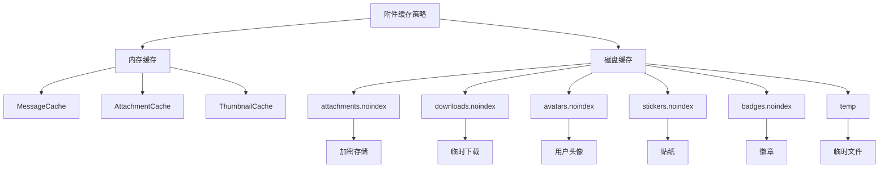
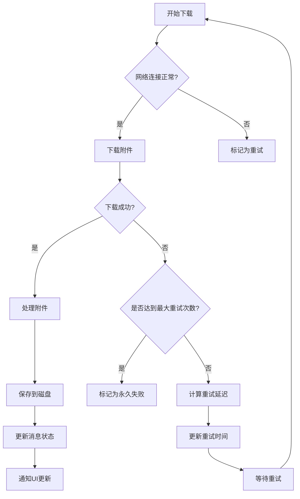
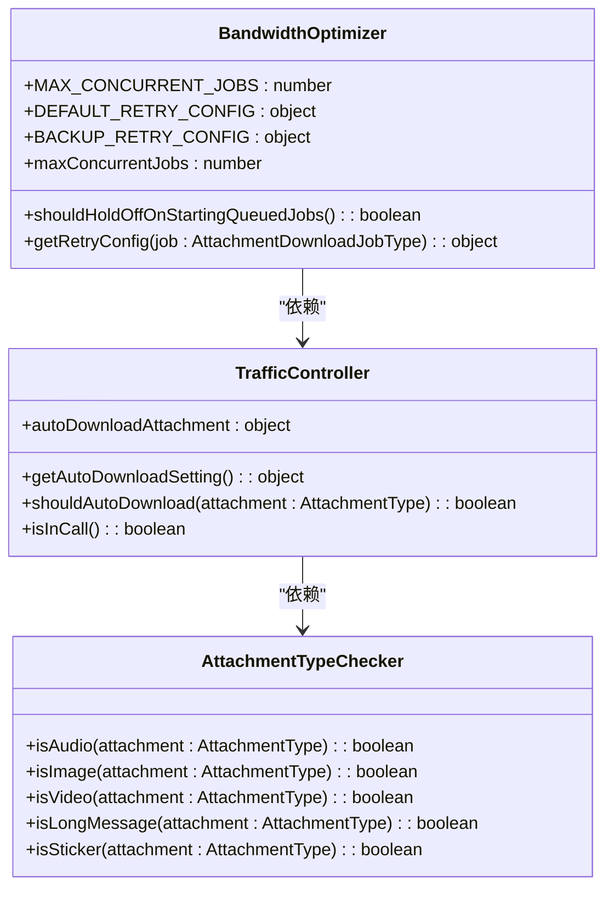
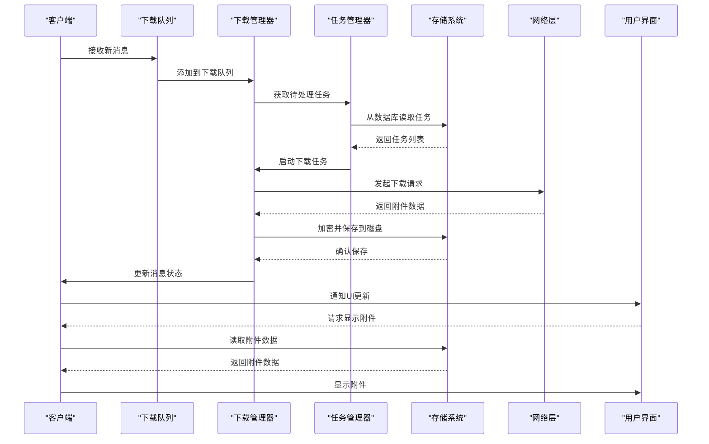
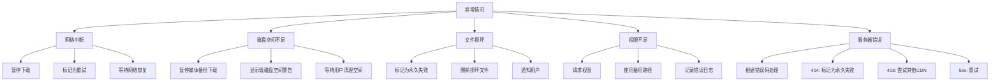

# 附件传输与缓存

<cite>
**本文档引用的文件**   
- [attachmentDownloadQueue.preload.ts](file://ts/util/attachmentDownloadQueue.preload.ts)
- [AttachmentDownloadManager.preload.ts](file://ts/jobs/AttachmentDownloadManager.preload.ts)
- [queueAttachmentDownloads.preload.ts](file://ts/util/queueAttachmentDownloads.preload.ts)
- [downloadAttachment.preload.ts](file://ts/util/downloadAttachment.preload.ts)
- [Attachment.std.ts](file://ts/util/Attachment.std.ts)
- [attachments.node.ts](file://app/attachments.node.ts)
- [attachmentPath.node.ts](file://ts/util/attachmentPath.node.ts)
- [migrations.preload.ts](file://ts/util/migrations.preload.ts)
</cite>

## 目录
1. [引言](#引言)
2. [附件下载队列管理机制](#附件下载队列管理机制)
3. [断点续传与后台下载实现](#断点续传与后台下载实现)
4. [附件缓存策略](#附件缓存策略)
5. [网络传输错误处理与重试机制](#网络传输错误处理与重试机制)
6. [带宽优化与流量控制策略](#带宽优化与流量控制策略)
7. [附件上传、下载与缓存完整流程](#附件上传下载与缓存完整流程)
8. [异常情况处理](#异常情况处理)
9. [结论](#结论)

## 引言
Signal-Desktop的附件传输与缓存系统设计旨在确保用户能够可靠、高效地收发各种类型的文件，同时优化带宽使用并保护用户隐私。该系统通过复杂的队列管理、缓存策略和错误处理机制，实现了断点续传、后台下载和高可靠性传输。本文档深入分析了`attachmentDownloadQueue.preload.ts`等核心文件的实现，详细说明了附件下载队列管理、缓存策略、错误处理和带宽优化等关键功能。

**Section sources**
- [attachmentDownloadQueue.preload.ts](file://ts/util/attachmentDownloadQueue.preload.ts#L1-L145)
- [AttachmentDownloadManager.preload.ts](file://ts/jobs/AttachmentDownloadManager.preload.ts#L1-L1043)

## 附件下载队列管理机制
Signal-Desktop使用一个专门的下载队列来管理附件的下载任务，确保下载操作有序进行并优化用户体验。该机制的核心是`attachmentDownloadQueue`，它是一个存储消息ID的数组，用于跟踪需要下载附件的消息。

**Diagram sources**
- [attachmentDownloadQueue.preload.ts](file://ts/util/attachmentDownloadQueue.preload.ts#L1-L145)
- [AttachmentDownloadManager.preload.ts](file://ts/jobs/AttachmentDownloadManager.preload.ts#L1-L1043)

**Section sources**
- [attachmentDownloadQueue.preload.ts](file://ts/util/attachmentDownloadQueue.preload.ts#L1-L145)
- [AttachmentDownloadManager.preload.ts](file://ts/jobs/AttachmentDownloadManager.preload.ts#L1-L1043)

## 断点续传与后台下载实现
Signal-Desktop通过`AttachmentDownloadManager`类实现了断点续传和后台下载功能。该类继承自`JobManager`，负责管理所有附件下载任务的生命周期。

**Diagram sources**
- [AttachmentDownloadManager.preload.ts](file://ts/jobs/AttachmentDownloadManager.preload.ts#L1-L1043)
- [JobManager.std.ts](file://ts/jobs/JobManager.std.ts#L1-L490)

**Section sources**
- [AttachmentDownloadManager.preload.ts](file://ts/jobs/AttachmentDownloadManager.preload.ts#L1-L1043)
- [JobManager.std.ts](file://ts/jobs/JobManager.std.ts#L1-L490)

## 附件缓存策略
Signal-Desktop实现了多层次的附件缓存策略，包括内存缓存和磁盘缓存，以优化性能和用户体验。

**Diagram sources**
- [attachments.node.ts](file://app/attachments.node.ts#L1-L343)
- [migrations.preload.ts](file://ts/util/migrations.preload.ts#L1-L227)

**Section sources**
- [attachments.node.ts](file://app/attachments.node.ts#L1-L343)
- [migrations.preload.ts](file://ts/util/migrations.preload.ts#L1-L227)

## 网络传输错误处理与重试机制
Signal-Desktop实现了完善的网络传输错误处理和重试机制，确保附件传输的可靠性。

**Diagram sources**
- [downloadAttachment.preload.ts](file://ts/util/downloadAttachment.preload.ts#L1-L212)
- [AttachmentDownloadManager.preload.ts](file://ts/jobs/AttachmentDownloadManager.preload.ts#L1-L1043)

**Section sources**
- [downloadAttachment.preload.ts](file://ts/util/downloadAttachment.preload.ts#L1-L212)
- [AttachmentDownloadManager.preload.ts](file://ts/jobs/AttachmentDownloadManager.preload.ts#L1-L1043)

## 带宽优化与流量控制策略
Signal-Desktop通过多种策略优化带宽使用和流量控制，确保在不同网络条件下都能提供良好的用户体验。

**Diagram sources**
- [AttachmentDownloadManager.preload.ts](file://ts/jobs/AttachmentDownloadManager.preload.ts#L1-L1043)
- [queueAttachmentDownloads.preload.ts](file://ts/util/queueAttachmentDownloads.preload.ts#L1-L852)

**Section sources**
- [AttachmentDownloadManager.preload.ts](file://ts/jobs/AttachmentDownloadManager.preload.ts#L1-L1043)
- [queueAttachmentDownloads.preload.ts](file://ts/util/queueAttachmentDownloads.preload.ts#L1-L852)

## 附件上传下载与缓存完整流程
Signal-Desktop的附件上传、下载和缓存流程是一个复杂的系统，涉及多个组件的协同工作。

**Diagram sources**
- [attachmentDownloadQueue.preload.ts](file://ts/util/attachmentDownloadQueue.preload.ts#L1-L145)
- [AttachmentDownloadManager.preload.ts](file://ts/jobs/AttachmentDownloadManager.preload.ts#L1-L1043)
- [queueAttachmentDownloads.preload.ts](file://ts/util/queueAttachmentDownloads.preload.ts#L1-L852)

**Section sources**
- [attachmentDownloadQueue.preload.ts](file://ts/util/attachmentDownloadQueue.preload.ts#L1-L145)
- [AttachmentDownloadManager.preload.ts](file://ts/jobs/AttachmentDownloadManager.preload.ts#L1-L1043)
- [queueAttachmentDownloads.preload.ts](file://ts/util/queueAttachmentDownloads.preload.ts#L1-L852)

## 异常情况处理
Signal-Desktop对各种异常情况进行了全面的处理，确保系统的稳定性和可靠性。

**Diagram sources**
- [AttachmentDownloadManager.preload.ts](file://ts/jobs/AttachmentDownloadManager.preload.ts#L1-L1043)
- [downloadAttachment.preload.ts](file://ts/util/downloadAttachment.preload.ts#L1-L212)

**Section sources**
- [AttachmentDownloadManager.preload.ts](file://ts/jobs/AttachmentDownloadManager.preload.ts#L1-L1043)
- [downloadAttachment.preload.ts](file://ts/util/downloadAttachment.preload.ts#L1-L212)

## 结论
Signal-Desktop的附件传输与缓存系统是一个高度优化和可靠的系统，通过精心设计的队列管理、缓存策略、错误处理和带宽优化机制，为用户提供了流畅的文件传输体验。该系统不仅实现了断点续传和后台下载等高级功能，还通过多层次的缓存和智能的流量控制，确保在各种网络条件下都能提供最佳性能。通过对`attachmentDownloadQueue.preload.ts`等核心文件的深入分析，我们可以看到Signal团队在用户体验和系统可靠性方面的卓越追求。