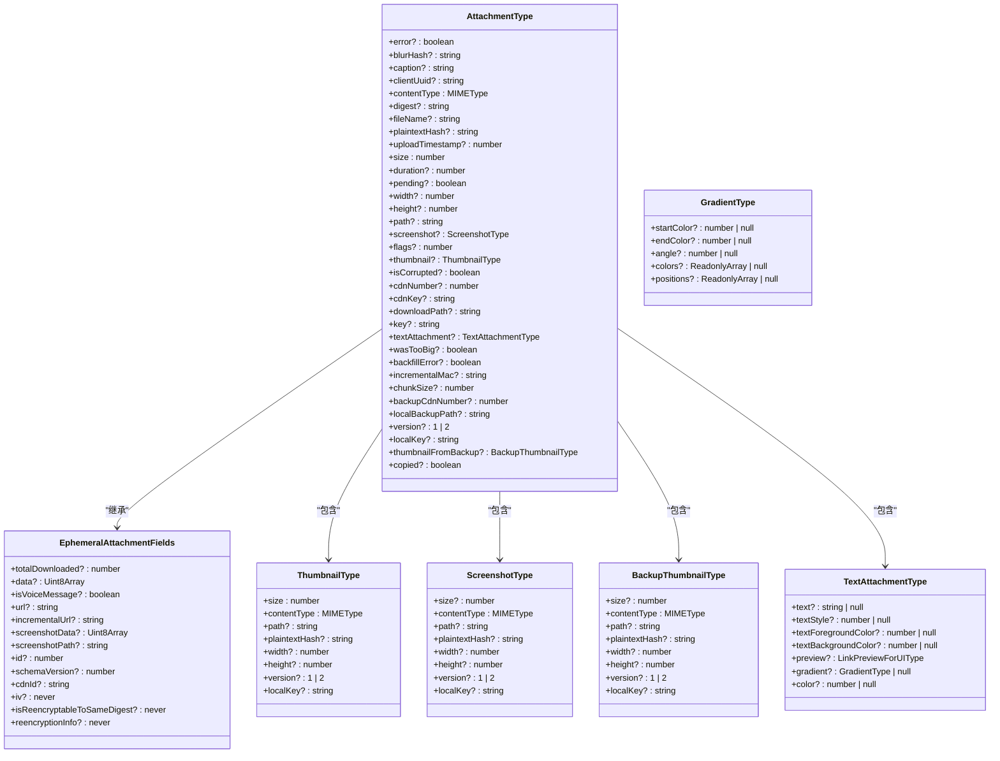
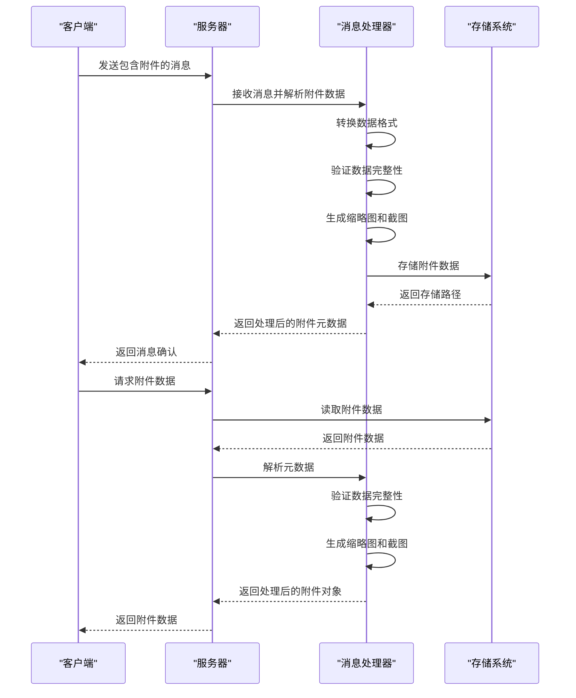
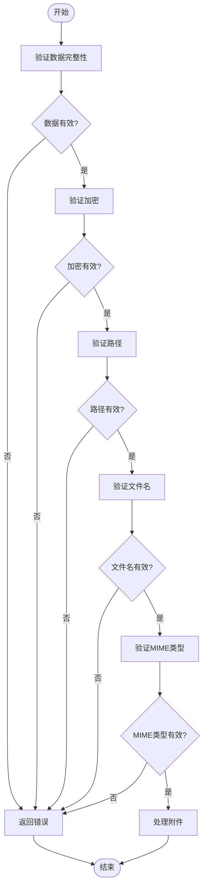

# 附件元数据管理

<cite>
**本文档引用的文件**
- [Attachment.std.ts](file://ts/types/Attachment.std.ts)
- [Attachment.std.ts](file://ts/util/Attachment.std.ts)
- [handleDataMessage.preload.ts](file://ts/messages/handleDataMessage.preload.ts)
- [processDataMessage.preload.ts](file://ts/textsecure/processDataMessage.preload.ts)
- [attachmentPath.node.ts](file://ts/util/attachmentPath.node.ts)
</cite>

## 目录
1. [简介](#简介)
2. [附件实体结构](#附件实体结构)
3. [元数据字段详解](#元数据字段详解)
4. [序列化与反序列化机制](#序列化与反序列化机制)
5. [元数据验证与安全检查](#元数据验证与安全检查)
6. [实际应用示例](#实际应用示例)
7. [结论](#结论)

## 简介

Signal-Desktop中的附件元数据管理是确保消息中文件传输安全、可靠和高效的关键组件。本文档深入分析了`Attachment.std.ts`中定义的附件实体结构，详细说明了每个元数据字段的含义和用途，包括文件名、MIME类型、尺寸、缩略图、加密信息等属性。同时，文档还解释了元数据在消息传输过程中的序列化和反序列化机制，以及如何通过`handleDataMessage.preload.ts`处理附件元数据。此外，文档记录了元数据验证规则和安全检查措施，确保附件信息的完整性和安全性，并提供了实际代码示例展示附件元数据的创建、修改和访问过程，以及元数据与消息体的关联方式。

**Section sources**
- [Attachment.std.ts](file://ts/types/Attachment.std.ts)
- [handleDataMessage.preload.ts](file://ts/messages/handleDataMessage.preload.ts)

## 附件实体结构

在Signal-Desktop中，附件元数据通过`AttachmentType`接口定义，该接口继承自`EphemeralAttachmentFields`，并包含多个可选和必需的字段。`AttachmentType`接口定义了附件的基本属性，如文件名、MIME类型、尺寸、路径等，同时也包含了用于加密和完整性检查的字段，如`key`、`digest`、`plaintextHash`等。此外，`AttachmentType`还支持缩略图、截图、备份缩略图等多种附件变体，以满足不同场景下的需求。



**Diagram sources**
- [Attachment.std.ts](file://ts/types/Attachment.std.ts)

**Section sources**
- [Attachment.std.ts](file://ts/types/Attachment.std.ts)

## 元数据字段详解

### 基本属性

- **fileName**: 附件的文件名，用于在用户界面中显示。
- **contentType**: 附件的MIME类型，用于确定附件的类型（如图像、视频、音频等）。
- **size**: 附件的大小，以字节为单位。
- **path**: 附件在本地文件系统中的路径，用于读取和写入附件数据。
- **url**: 附件的URL，用于在Web环境中显示附件。

### 加密与完整性检查

- **key**: 用于加密附件的密钥，通常是一个Base64编码的字符串。
- **digest**: 附件的摘要，用于验证附件的完整性，通常是一个Base64编码的字符串。
- **plaintextHash**: 附件明文的哈希值，用于进一步验证附件的完整性。
- **localKey**: 本地加密密钥，用于在本地存储附件时进行加密。
- **incrementalMac**: 用于增量消息的MAC（消息认证码），确保消息的完整性和真实性。

### 缩略图与截图

- **thumbnail**: 附件的缩略图，用于在消息列表中快速预览附件内容。
- **screenshot**: 附件的截图，用于在消息详情中显示附件的预览。
- **backupThumbnail**: 备份缩略图，用于在主缩略图不可用时提供替代预览。

### 其他属性

- **duration**: 附件的持续时间，主要用于音频和视频文件。
- **width** 和 **height**: 附件的宽度和高度，主要用于图像和视频文件。
- **flags**: 附件的标志位，用于标记附件的特殊属性，如是否为语音消息。
- **clientUuid**: 客户端生成的UUID，用于唯一标识附件。
- **uploadTimestamp**: 附件上传的时间戳，用于记录附件的上传时间。

**Section sources**
- [Attachment.std.ts](file://ts/types/Attachment.std.ts)

## 序列化与反序列化机制

在Signal-Desktop中，附件元数据的序列化和反序列化主要通过`processDataMessage`函数实现。当接收到一个包含附件的消息时，`processDataMessage`函数会解析消息中的附件数据，并将其转换为`ProcessedAttachment`对象。这个过程包括以下几个步骤：

1. **解析附件数据**: 从消息中提取附件的原始数据，包括文件名、MIME类型、尺寸、路径等。
2. **转换数据格式**: 将原始数据转换为适合存储和传输的格式，如将二进制数据转换为Base64编码的字符串。
3. **验证数据完整性**: 使用`digest`和`plaintextHash`字段验证附件的完整性和真实性。
4. **生成缩略图和截图**: 根据需要生成附件的缩略图和截图，以便在用户界面中快速预览。
5. **存储附件数据**: 将处理后的附件数据存储到本地文件系统中，并更新附件的元数据。

反序列化过程则是将存储在本地文件系统中的附件数据重新转换为`AttachmentType`对象，以便在消息中显示。这个过程包括以下几个步骤：

1. **读取附件数据**: 从本地文件系统中读取附件的原始数据。
2. **解析元数据**: 从附件的元数据中提取文件名、MIME类型、尺寸、路径等信息。
3. **验证数据完整性**: 再次使用`digest`和`plaintextHash`字段验证附件的完整性和真实性。
4. **生成缩略图和截图**: 如果需要，重新生成附件的缩略图和截图。
5. **返回附件对象**: 将处理后的附件数据返回为`AttachmentType`对象，供消息显示使用。



**Diagram sources**
- [processDataMessage.preload.ts](file://ts/textsecure/processDataMessage.preload.ts)
- [Attachment.std.ts](file://ts/util/Attachment.std.ts)

**Section sources**
- [processDataMessage.preload.ts](file://ts/textsecure/processDataMessage.preload.ts)
- [Attachment.std.ts](file://ts/util/Attachment.std.ts)

## 元数据验证与安全检查

为了确保附件信息的完整性和安全性，Signal-Desktop在处理附件元数据时实施了严格的验证和安全检查措施。这些措施主要包括：

1. **数据完整性验证**: 使用`digest`和`plaintextHash`字段验证附件的完整性和真实性。如果附件的`digest`或`plaintextHash`与预期值不匹配，则认为附件已被篡改，应拒绝处理。
2. **加密验证**: 使用`key`字段验证附件的加密密钥。如果附件的`key`无效或缺失，则认为附件无法解密，应拒绝处理。
3. **路径验证**: 验证附件的路径是否合法，防止路径遍历攻击。例如，附件的路径不应包含`..`或`/`等特殊字符。
4. **文件名验证**: 验证附件的文件名是否合法，防止文件名注入攻击。例如，文件名不应包含特殊字符或路径分隔符。
5. **MIME类型验证**: 验证附件的MIME类型是否合法，防止恶意文件上传。例如，只允许上传特定类型的文件，如图像、视频、音频等。



**Diagram sources**
- [Attachment.std.ts](file://ts/util/Attachment.std.ts)

**Section sources**
- [Attachment.std.ts](file://ts/util/Attachment.std.ts)

## 实际应用示例

### 创建附件元数据

```typescript
import { AttachmentType } from '../types/Attachment.std.js';
import { createName } from '../util/attachmentPath.node.js';

const attachment: AttachmentType = {
  fileName: 'example.jpg',
  contentType: 'image/jpeg',
  size: 1024,
  path: createName('.jpg'),
  key: 'base64-encoded-key',
  digest: 'base64-encoded-digest',
  plaintextHash: 'base64-encoded-plaintext-hash',
  width: 800,
  height: 600,
  thumbnail: {
    size: 100,
    contentType: 'image/jpeg',
    path: createName('.thumb.jpg'),
    width: 100,
    height: 100,
  },
};
```

### 修改附件元数据

```typescript
import { AttachmentType } from '../types/Attachment.std.js';

function updateAttachment(attachment: AttachmentType, newFileName: string): AttachmentType {
  return {
    ...attachment,
    fileName: newFileName,
  };
}

const updatedAttachment = updateAttachment(attachment, 'new-example.jpg');
```

### 访问附件元数据

```typescript
import { AttachmentType } from '../types/Attachment.std.js';

function getAttachmentInfo(attachment: AttachmentType): string {
  return `文件名: ${attachment.fileName}, MIME类型: ${attachment.contentType}, 尺寸: ${attachment.size} 字节`;
}

const info = getAttachmentInfo(attachment);
console.log(info);
```

### 关联附件与消息体

```typescript
import { MessageModel } from '../models/messages.preload.js';
import { AttachmentType } from '../types/Attachment.std.js';

function attachToMessage(message: MessageModel, attachment: AttachmentType): void {
  message.set({
    attachments: [attachment],
  });
}

const message = new MessageModel();
attachToMessage(message, attachment);
```

**Section sources**
- [Attachment.std.ts](file://ts/types/Attachment.std.ts)
- [attachmentPath.node.ts](file://ts/util/attachmentPath.node.ts)
- [handleDataMessage.preload.ts](file://ts/messages/handleDataMessage.preload.ts)

## 结论

Signal-Desktop中的附件元数据管理通过详细的字段定义、严格的验证和安全检查措施，确保了附件信息的完整性和安全性。通过`processDataMessage`函数实现的序列化和反序列化机制，使得附件数据能够在客户端和服务器之间高效、可靠地传输。实际应用示例展示了如何创建、修改和访问附件元数据，以及如何将附件与消息体关联。这些功能共同构成了Signal-Desktop中附件管理的核心，为用户提供了一个安全、可靠的文件传输体验。

**Section sources**
- [Attachment.std.ts](file://ts/types/Attachment.std.ts)
- [handleDataMessage.preload.ts](file://ts/messages/handleDataMessage.preload.ts)
- [processDataMessage.preload.ts](file://ts/textsecure/processDataMessage.preload.ts)
- [attachmentPath.node.ts](file://ts/util/attachmentPath.node.ts)