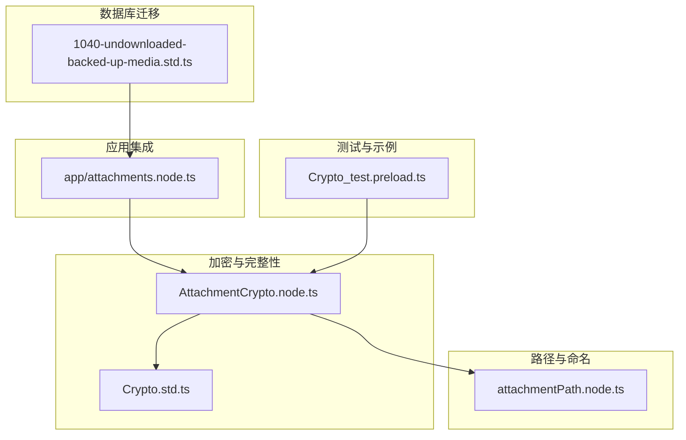
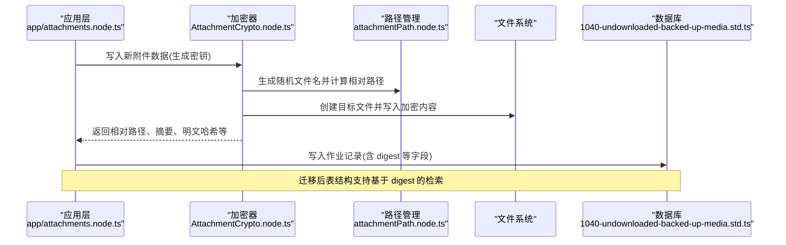
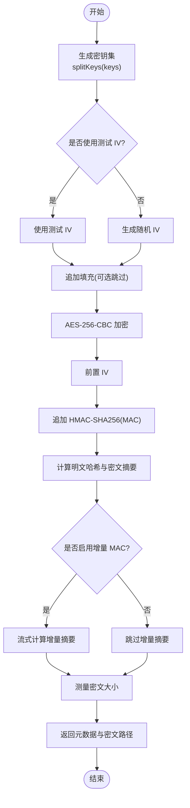
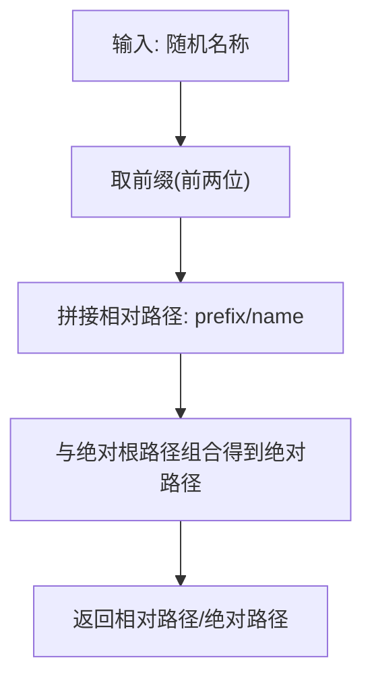
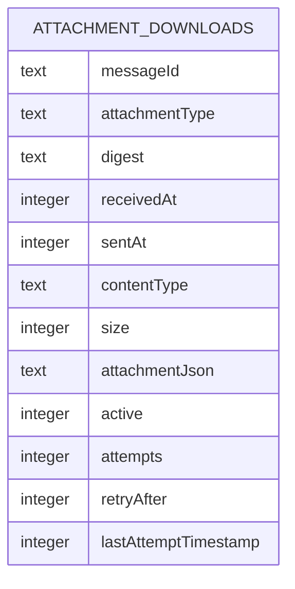
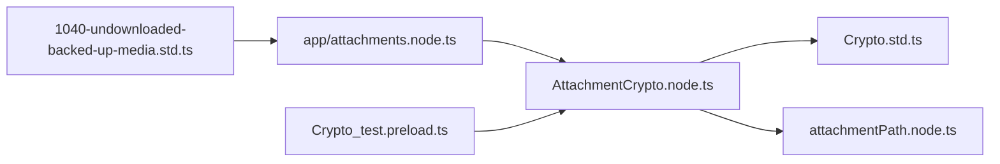
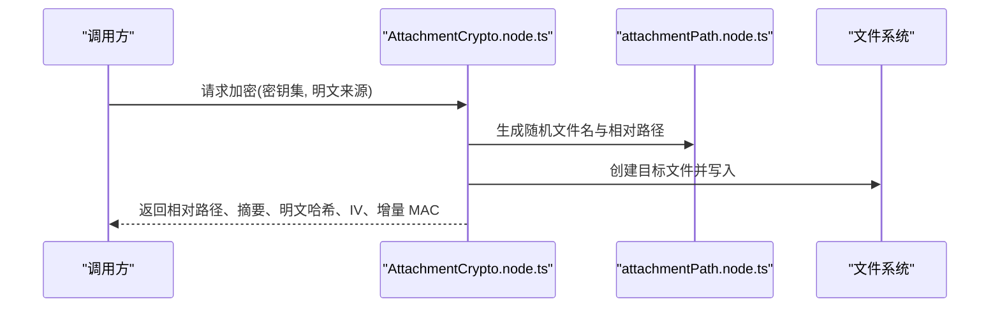
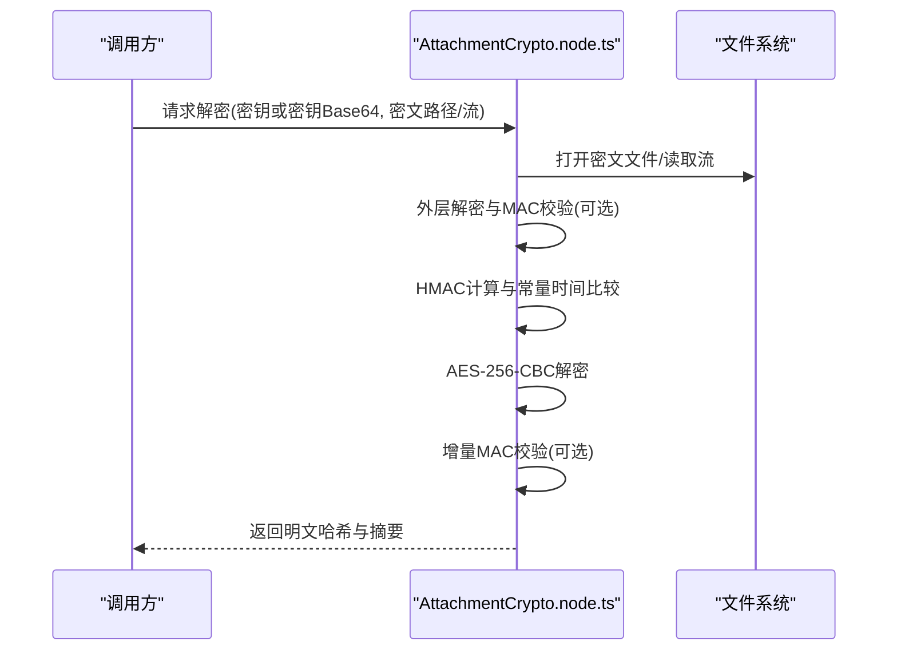
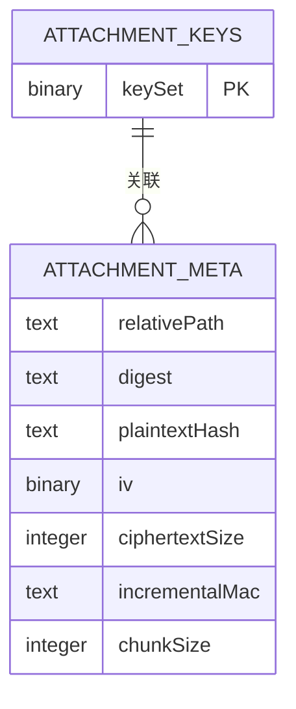

# 附件加密存储

<cite>
**本文引用的文件列表**
- [AttachmentCrypto.node.ts](file://ts/AttachmentCrypto.node.ts)
- [attachmentPath.node.ts](file://ts/util/attachmentPath.node.ts)
- [1040-undownloaded-backed-up-media.std.ts](file://ts/sql/migrations/1040-undownloaded-backed-up-media.std.ts)
- [Crypto.std.ts](file://ts/types/Crypto.std.ts)
- [Crypto.node.ts](file://ts/Crypto.node.ts)
- [attachments.node.ts](file://app/attachments.node.ts)
- [Crypto_test.preload.ts](file://ts/test-electron/Crypto_test.preload.ts)
</cite>

## 目录
1. [简介](#简介)
2. [项目结构与定位](#项目结构与定位)
3. [核心组件](#核心组件)
4. [架构总览](#架构总览)
5. [详细组件分析](#详细组件分析)
6. [依赖关系分析](#依赖关系分析)
7. [性能与安全考量](#性能与安全考量)
8. [故障排查指南](#故障排查指南)
9. [结论](#结论)
10. [附录：关键流程图与数据模型](#附录关键流程图与数据模型)

## 简介
本文件系统性阐述 Signal-Desktop 中附件加密存储机制，重点覆盖以下方面：
- 基于 AES-256-CBC 的附件加密与解密流程
- 本地附件路径管理与命名规则
- 数据库迁移策略对加密附件的支持
- 加密密钥生成、拆分与安全存储建议
- 结合测试用例展示加密、解密与完整性校验的完整流程

## 项目结构与定位
围绕附件加密存储的相关模块分布如下：
- 加密/解密与完整性校验：ts/AttachmentCrypto.node.ts
- 本地路径与命名：ts/util/attachmentPath.node.ts
- 数据库迁移：ts/sql/migrations/1040-undownloaded-backed-up-media.std.ts
- 类型与常量：ts/types/Crypto.std.ts
- 其他工具与示例：ts/Crypto.node.ts、app/attachments.node.ts、ts/test-electron/Crypto_test.preload.ts

图表来源
- [AttachmentCrypto.node.ts](file://ts/AttachmentCrypto.node.ts#L1-L120)
- [attachmentPath.node.ts](file://ts/util/attachmentPath.node.ts#L1-L23)
- [Crypto.std.ts](file://ts/types/Crypto.std.ts#L1-L62)
- [app/attachments.node.ts](file://app/attachments.node.ts#L299-L342)
- [1040-undownloaded-backed-up-media.std.ts](file://ts/sql/migrations/1040-undownloaded-backed-up-media.std.ts#L1-L225)
- [Crypto_test.preload.ts](file://ts/test-electron/Crypto_test.preload.ts#L697-L1145)

章节来源
- [AttachmentCrypto.node.ts](file://ts/AttachmentCrypto.node.ts#L1-L120)
- [attachmentPath.node.ts](file://ts/util/attachmentPath.node.ts#L1-L23)
- [Crypto.std.ts](file://ts/types/Crypto.std.ts#L1-L62)
- [app/attachments.node.ts](file://app/attachments.node.ts#L299-L342)
- [1040-undownloaded-backed-up-media.std.ts](file://ts/sql/migrations/1040-undownloaded-backed-up-media.std.ts#L1-L225)
- [Crypto_test.preload.ts](file://ts/test-electron/Crypto_test.preload.ts#L697-L1145)

## 核心组件
- AES-256-CBC 加密/解密与完整性校验：在加密时对明文追加填充，使用随机 IV 与 HMAC-SHA256 进行认证；解密时先做 MAC 校验，再进行 CBC 解密，并可选进行增量 MAC 校验与完整性检查。
- 本地路径管理：通过随机命名与两级前缀目录组织，避免单目录文件过多；路径由相对路径与绝对路径转换函数配合使用。
- 数据库迁移：为“未下载备份媒体”作业表引入 digest 字段与更严格的列定义，便于后续基于摘要的完整性校验与检索。
- 密钥管理：密钥集包含 AES 密钥与 HMAC 密钥，二者长度固定且按约定拆分；密钥以 Base64 形式在应用层传递或持久化。

章节来源
- [AttachmentCrypto.node.ts](file://ts/AttachmentCrypto.node.ts#L144-L274)
- [AttachmentCrypto.node.ts](file://ts/AttachmentCrypto.node.ts#L366-L556)
- [attachmentPath.node.ts](file://ts/util/attachmentPath.node.ts#L12-L23)
- [1040-undownloaded-backed-up-media.std.ts](file://ts/sql/migrations/1040-undownloaded-backed-up-media.std.ts#L34-L56)
- [Crypto.std.ts](file://ts/types/Crypto.std.ts#L19-L31)

## 架构总览
下图展示了从应用写入到数据库落盘的关键路径，以及加密/解密与完整性校验的交互。

图表来源
- [app/attachments.node.ts](file://app/attachments.node.ts#L319-L342)
- [AttachmentCrypto.node.ts](file://ts/AttachmentCrypto.node.ts#L118-L143)
- [attachmentPath.node.ts](file://ts/util/attachmentPath.node.ts#L12-L23)
- [1040-undownloaded-backed-up-media.std.ts](file://ts/sql/migrations/1040-undownloaded-backed-up-media.std.ts#L76-L132)

## 详细组件分析

### 组件A：AES-256-CBC 加密与解密（AttachmentCrypto.node.ts）
- 加密流程要点
  - 密钥拆分：从 64 字节密钥集中取出 32 字节 AES 密钥与 32 字节 HMAC 密钥。
  - 随机 IV：每次加密生成新的 16 字节 IV。
  - 明文填充：默认追加填充，保证块对齐与隐藏明文长度信息。
  - 认证：在密文前附加 IV 后进行 HMAC-SHA256，得到 32 字节 MAC。
  - 增量 MAC：可选启用，按块大小对密文流式计算增量摘要，用于快速校验。
  - 输出：返回密文大小、摘要、明文哈希、IV、增量 MAC 及其块大小等元数据。
- 解密流程要点
  - 外层加密：当从备份下载的密文可能还被二次加密时，先解密外层并校验其 MAC。
  - 流式校验：对密文流经 HMAC 计算，得到本地 MAC 并与远端 MAC 常量时间比较。
  - CBC 解密：使用 AES-256-CBC 模式解密。
  - 增量 MAC 校验：若提供对方增量 MAC 与块大小，则进行逐块校验。
  - 完整性检查：根据类型选择校验“加密摘要”或“明文哈希”，均采用常量时间比较。
  - 输出：返回明文哈希与摘要字符串形式，以及临时输出文件的相对路径。
- 重加密（本地）
  - 将已加密的密文流式解密后，立即以新密钥重新加密，适合更换密钥或清理备份场景。

图表来源
- [AttachmentCrypto.node.ts](file://ts/AttachmentCrypto.node.ts#L144-L274)

章节来源
- [AttachmentCrypto.node.ts](file://ts/AttachmentCrypto.node.ts#L144-L274)
- [AttachmentCrypto.node.ts](file://ts/AttachmentCrypto.node.ts#L366-L556)
- [AttachmentCrypto.node.ts](file://ts/AttachmentCrypto.node.ts#L558-L612)

### 组件B：本地路径管理（attachmentPath.node.ts）
- 文件命名
  - 使用 32 字节随机字节生成十六进制字符串作为文件名前缀，确保唯一性。
- 目录组织
  - 以文件名前两位字符作为二级目录前缀，形成“xx/name”结构，降低单目录文件数量。
- 路径转换
  - 提供相对路径与绝对路径之间的转换接口，便于加密器与应用层协作。

图表来源
- [attachmentPath.node.ts](file://ts/util/attachmentPath.node.ts#L12-L23)

章节来源
- [attachmentPath.node.ts](file://ts/util/attachmentPath.node.ts#L12-L23)

### 组件C：数据库迁移策略（1040-undownloaded-backed-up-media.std.ts）
- 目标
  - 为“未下载备份媒体”作业表引入 digest 字段与更严格的列定义，优化查询索引。
- 关键变更
  - 新增表结构与索引，提升按 active/receivedAt 与 active/messageId 的查询效率。
  - 迁移旧数据时补充 digest、content-type、size 等字段，保持兼容性。
- 影响
  - 支持基于 digest 的完整性校验与去重/查找，便于恢复与下载任务管理。

图表来源
- [1040-undownloaded-backed-up-media.std.ts](file://ts/sql/migrations/1040-undownloaded-backed-up-media.std.ts#L76-L132)
- [1040-undownloaded-backed-up-media.std.ts](file://ts/sql/migrations/1040-undownloaded-backed-up-media.std.ts#L133-L209)

章节来源
- [1040-undownloaded-backed-up-media.std.ts](file://ts/sql/migrations/1040-undownloaded-backed-up-media.std.ts#L1-L225)

### 组件D：密钥管理与安全存储建议
- 密钥生成与拆分
  - 密钥集长度为 64 字节，前 32 字节为 AES 密钥，后 32 字节为 HMAC 密钥。
  - 通过随机数生成器产生密钥集，确保每份附件独立密钥。
- 密钥传递与存储
  - 应用层通常以 Base64 字符串形式传递密钥，便于序列化与持久化。
  - 建议将密钥与附件元数据分离存储，密钥仅在内存中使用，必要时落盘也应加密。
- 安全实践
  - 不要硬编码密钥；避免在日志中打印密钥。
  - 对密钥进行最小权限访问控制；定期轮换密钥。
  - 在多设备或多会话场景下，确保密钥派生与同步的安全性。

章节来源
- [Crypto.std.ts](file://ts/types/Crypto.std.ts#L19-L31)
- [AttachmentCrypto.node.ts](file://ts/AttachmentCrypto.node.ts#L614-L636)
- [app/attachments.node.ts](file://app/attachments.node.ts#L319-L342)

### 组件E：应用集成与示例（app/attachments.node.ts 与测试用例）
- 应用写入新附件
  - 生成密钥后调用加密器写入磁盘，返回相对路径、明文哈希与大小等信息。
- 测试用例覆盖
  - v2 加密/解密往返测试，包含增量 MAC 校验、双层加密场景与错误处理。
  - 通过修改增量 MAC 或外层密钥导致的 MAC 校验失败，验证安全性。

章节来源
- [app/attachments.node.ts](file://app/attachments.node.ts#L319-L342)
- [Crypto_test.preload.ts](file://ts/test-electron/Crypto_test.preload.ts#L697-L1145)

## 依赖关系分析
- 模块耦合
  - AttachmentCrypto.node.ts 依赖 Crypto.std.ts 中的常量与类型，依赖 attachmentPath.node.ts 生成相对路径。
  - app/attachments.node.ts 依赖 AttachmentCrypto.node.ts 完成加密写入与解密读取。
  - 1040-迁移脚本与数据库层交互，影响作业表结构与查询性能。
- 外部依赖
  - Node.js crypto、stream、fs/promises 等原生模块。
  - libsignal-client 的增量 MAC 工具（用于流式摘要）。

图表来源
- [AttachmentCrypto.node.ts](file://ts/AttachmentCrypto.node.ts#L1-L120)
- [Crypto.std.ts](file://ts/types/Crypto.std.ts#L1-L62)
- [attachmentPath.node.ts](file://ts/util/attachmentPath.node.ts#L1-L23)
- [app/attachments.node.ts](file://app/attachments.node.ts#L299-L342)
- [1040-undownloaded-backed-up-media.std.ts](file://ts/sql/migrations/1040-undownloaded-backed-up-media.std.ts#L1-L225)
- [Crypto_test.preload.ts](file://ts/test-electron/Crypto_test.preload.ts#L697-L1145)

章节来源
- [AttachmentCrypto.node.ts](file://ts/AttachmentCrypto.node.ts#L1-L120)
- [Crypto.std.ts](file://ts/types/Crypto.std.ts#L1-L62)
- [attachmentPath.node.ts](file://ts/util/attachmentPath.node.ts#L1-L23)
- [app/attachments.node.ts](file://app/attachments.node.ts#L299-L342)
- [1040-undownloaded-backed-up-media.std.ts](file://ts/sql/migrations/1040-undownloaded-backed-up-media.std.ts#L1-L225)
- [Crypto_test.preload.ts](file://ts/test-electron/Crypto_test.preload.ts#L697-L1145)

## 性能与安全考量
- 性能
  - 增量 MAC 可显著减少大文件的重复校验成本，提高下载与恢复过程中的吞吐。
  - 流式处理避免一次性加载整个附件到内存，降低内存峰值。
- 安全
  - 使用常量时间比较防止时序攻击。
  - 随机 IV 与 HMAC 分离，确保加密与认证的独立性。
  - 建议在应用层对密钥进行最小暴露与最小持久化，必要时采用平台安全存储。

[本节为通用指导，不直接分析具体文件]

## 故障排查指南
- 常见错误与定位
  - “Bad MAC”：通常由密钥不匹配、篡改或传输损坏引起，需核对密钥与 MAC 计算链路。
  - “Bad outer encryption MAC”：外层加密校验失败，多因密钥或顺序错误。
  - “Failed to decrypt attachment”：底层读写异常或中断，检查文件句柄与流状态。
- 排查步骤
  - 确认密钥长度与格式（Base64/二进制）一致。
  - 若启用增量 MAC，确认块大小与对方提供的 MAC 匹配。
  - 检查文件是否存在、权限是否正确、磁盘空间是否充足。
  - 查看日志中的错误堆栈与参数，定位具体阶段。

章节来源
- [AttachmentCrypto.node.ts](file://ts/AttachmentCrypto.node.ts#L476-L518)
- [AttachmentCrypto.node.ts](file://ts/AttachmentCrypto.node.ts#L523-L541)

## 结论
Signal-Desktop 的附件加密存储机制以 AES-256-CBC 为核心，结合 HMAC-SHA256 实现强认证，并通过增量 MAC 与流式处理提升性能与可靠性。本地路径采用两级前缀目录与随机命名，兼顾可维护性与安全性。数据库迁移为“未下载备份媒体”作业表引入 digest 字段，完善了基于摘要的完整性校验与检索能力。建议在应用层严格遵循密钥最小暴露原则，并结合平台安全存储与定期轮换策略，进一步强化整体安全。

[本节为总结性内容，不直接分析具体文件]

## 附录：关键流程图与数据模型

### 加密流程（序列图）

图表来源
- [AttachmentCrypto.node.ts](file://ts/AttachmentCrypto.node.ts#L118-L143)
- [attachmentPath.node.ts](file://ts/util/attachmentPath.node.ts#L12-L23)

### 解密流程（序列图）

图表来源
- [AttachmentCrypto.node.ts](file://ts/AttachmentCrypto.node.ts#L366-L556)

### 数据模型（摘要与密钥）

图表来源
- [Crypto.std.ts](file://ts/types/Crypto.std.ts#L19-L31)
- [AttachmentCrypto.node.ts](file://ts/AttachmentCrypto.node.ts#L144-L274)