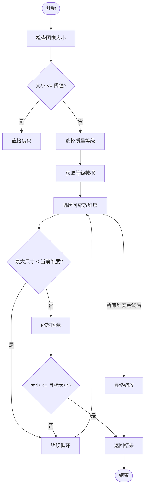
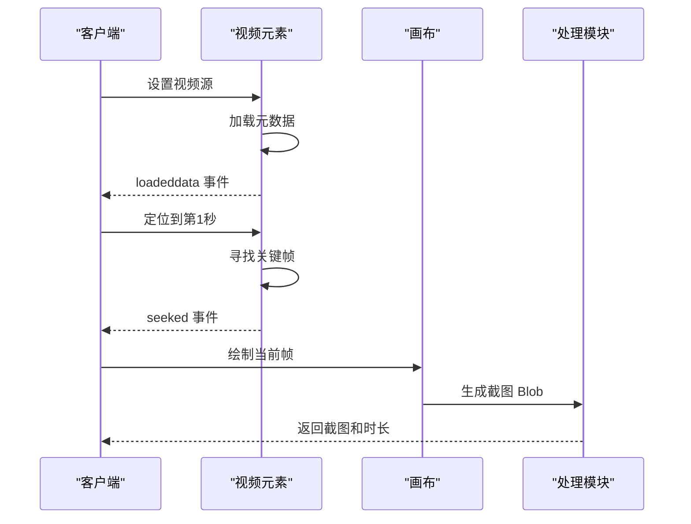
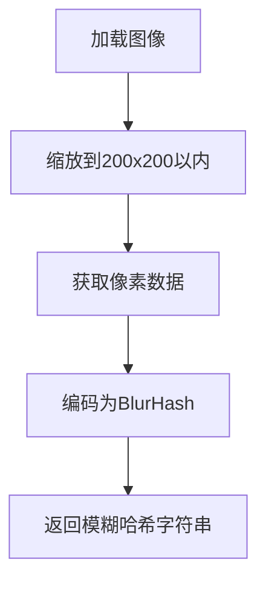
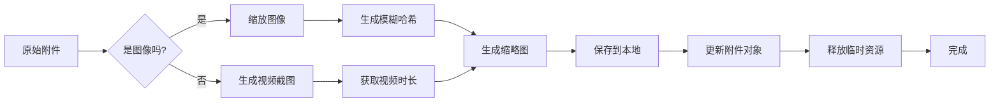

# 附件预览生成

<cite>
**本文档引用的文件**  
- [scaleImageToLevel.preload.ts](file://ts/util/scaleImageToLevel.preload.ts)
- [captureDimensionsAndScreenshot.dom.ts](file://ts/util/captureDimensionsAndScreenshot.dom.ts)
- [imageToBlurHash.dom.ts](file://ts/util/imageToBlurHash.dom.ts)
- [handleImageAttachment.preload.ts](file://ts/util/handleImageAttachment.preload.ts)
- [VisualAttachment.dom.ts](file://ts/types/VisualAttachment.dom.ts)
- [AttachmentBackupManager.preload.ts](file://ts/jobs/AttachmentBackupManager.preload.ts)
- [generate-preload-cache.node.ts](file://ts/scripts/generate-preload-cache.node.ts)
</cite>

## 目录
1. [简介](#简介)
2. [图像缩放处理机制](#图像缩放处理机制)
3. [视频截图生成流程](#视频截图生成流程)
4. [模糊哈希生成算法](#模糊哈希生成算法)
5. [预览图缓存策略与内存管理](#预览图缓存策略与内存管理)
6. [完整处理流程](#完整处理流程)

## 简介
Signal-Desktop 的附件预览生成系统为用户提供快速、安全且高效的媒体预览功能。该系统通过一系列精心设计的模块，实现了从原始附件到最终预览图的完整处理链路，涵盖图像缩放、视频截图、模糊哈希生成以及缓存管理等关键环节。本文档将深入分析这些核心机制，揭示其如何在保证用户体验的同时，平衡性能消耗与资源占用。

**Section sources**
- [scaleImageToLevel.preload.ts](file://ts/util/scaleImageToLevel.preload.ts#L1-L186)
- [captureDimensionsAndScreenshot.dom.ts](file://ts/util/captureDimensionsAndScreenshot.dom.ts#L1-L207)

## 图像缩放处理机制
Signal-Desktop 使用 `scaleImageToLevel.preload.ts` 模块来处理图像的缩放和压缩。该模块根据图像的大小和用户配置的媒体质量等级，动态选择合适的缩放策略。

### 缩放策略
图像缩放策略基于三个质量等级（One、Two、Three），每个等级对应不同的最大尺寸、质量因子和目标大小。系统首先根据用户的国家代码和配置确定质量等级，然后根据图像的原始尺寸和大小，选择最合适的缩放维度。

**Diagram sources**
- [scaleImageToLevel.preload.ts](file://ts/util/scaleImageToLevel.preload.ts#L112-L185)

**Section sources**
- [scaleImageToLevel.preload.ts](file://ts/util/scaleImageToLevel.preload.ts#L112-L185)

## 视频截图生成流程
视频截图生成由 `captureDimensionsAndScreenshot.dom.ts` 模块负责。该模块通过 HTML5 Video 元素和 Canvas API，从视频中提取关键帧作为预览图。

### 关键帧提取
视频截图的生成过程包括以下几个步骤：
1. 创建一个隐藏的 `<video>` 元素，并将其 `src` 设置为视频的本地 URL。
2. 监听 `loadeddata` 事件，确保视频元数据已加载。
3. 将播放头定位到视频的第 1 秒（`currentTime = 1.0`），并监听 `seeked` 事件。
4. 一旦定位完成，使用 `drawImage` 方法将视频当前帧绘制到 `<canvas>` 上。
5. 将 Canvas 内容转换为 Blob，并记录视频的总时长。

**Diagram sources**
- [captureDimensionsAndScreenshot.dom.ts](file://ts/util/captureDimensionsAndScreenshot.dom.ts#L235-L284)

**Section sources**
- [captureDimensionsAndScreenshot.dom.ts](file://ts/util/captureDimensionsAndScreenshot.dom.ts#L235-L284)

## 模糊哈希生成算法
模糊哈希（BlurHash）是一种将图像编码为短字符串的技术，能够在低带宽环境下快速生成模糊的预览效果。Signal-Desktop 使用 `imageToBlurHash.dom.ts` 模块来生成模糊哈希。

### 生成过程
模糊哈希的生成过程如下：
1. 使用 `blueimp-load-image` 库加载图像，并将其缩放到 200x200 像素以内，以减少计算量。
2. 从 Canvas 上获取图像的像素数据（ImageData）。
3. 使用 `blurhash` 库的 `encode` 函数，将像素数据编码为一个短字符串。编码参数为 4 个水平分量和 3 个垂直分量。

**Diagram sources**
- [imageToBlurHash.dom.ts](file://ts/util/imageToBlurHash.dom.ts#L52-L56)

**Section sources**
- [imageToBlurHash.dom.ts](file://ts/util/imageToBlurHash.dom.ts#L52-L56)

## 预览图缓存策略与内存管理
Signal-Desktop 采用多层缓存策略来优化预览图的生成和存储。

### 缓存机制
- **内存缓存**：在预览图生成过程中，使用 `ObjectURL` 来引用临时的 Blob 数据。一旦处理完成，立即调用 `revokeObjectURL` 释放内存。
- **持久化缓存**：生成的缩略图和截图会被保存到本地文件系统，并在数据库中记录其路径。这样，下次加载同一附件时，可以直接使用已生成的预览图，避免重复处理。
- **备份缓存**：在进行本地备份时，系统会为附件生成更小的缩略图（最大 8KiB），并上传到云端，以便在恢复时快速加载。

### 内存管理
- 所有临时创建的 `ObjectURL` 都在 `finally` 块中被撤销，确保不会发生内存泄漏。
- 视频截图生成完成后，会立即重置视频元素的 `src` 并调用 `load()` 方法，停止视频的进一步加载。

**Section sources**
- [captureDimensionsAndScreenshot.dom.ts](file://ts/util/captureDimensionsAndScreenshot.dom.ts#L202-L204)
- [AttachmentBackupManager.preload.ts](file://ts/jobs/AttachmentBackupManager.preload.ts#L354-L444)

## 完整处理流程
从原始附件到最终预览图的完整处理流程如下：

1. **附件处理**：当用户选择一个附件时，`handleImageAttachment.preload.ts` 模块首先检查其类型。
2. **图像缩放**：如果是图像，调用 `scaleImageToLevel` 进行缩放和压缩。
3. **模糊哈希生成**：使用缩放后的图像生成模糊哈希，用于快速预览。
4. **尺寸与截图**：调用 `captureDimensionsAndScreenshot` 获取图像的实际尺寸，或为视频生成截图。
5. **缓存与存储**：将生成的缩略图和截图保存到本地，并更新附件对象。
6. **内存清理**：释放所有临时资源，确保内存使用效率。

**Diagram sources**
- [handleImageAttachment.preload.ts](file://ts/util/handleImageAttachment.preload.ts#L16-L65)
- [captureDimensionsAndScreenshot.dom.ts](file://ts/util/captureDimensionsAndScreenshot.dom.ts#L24-L207)

**Section sources**
- [handleImageAttachment.preload.ts](file://ts/util/handleImageAttachment.preload.ts#L16-L65)
- [captureDimensionsAndScreenshot.dom.ts](file://ts/util/captureDimensionsAndScreenshot.dom.ts#L24-L207)