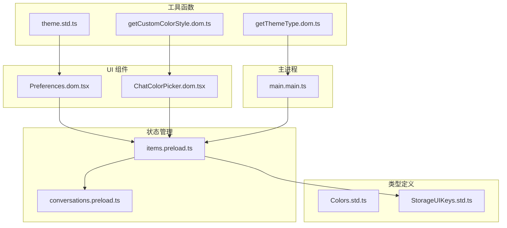
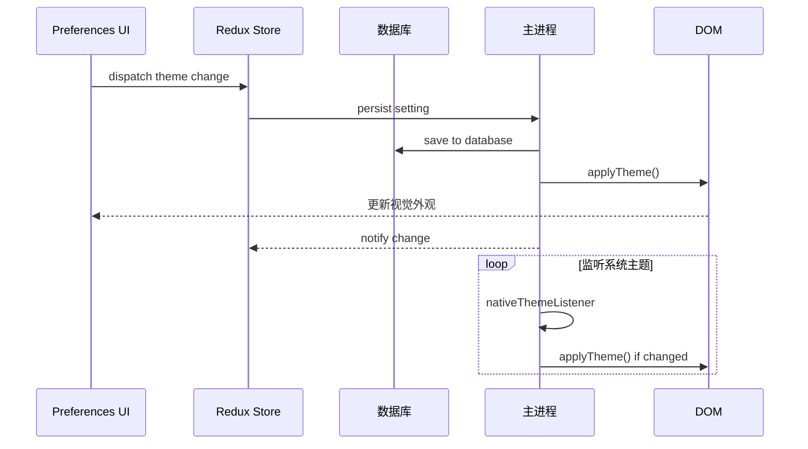
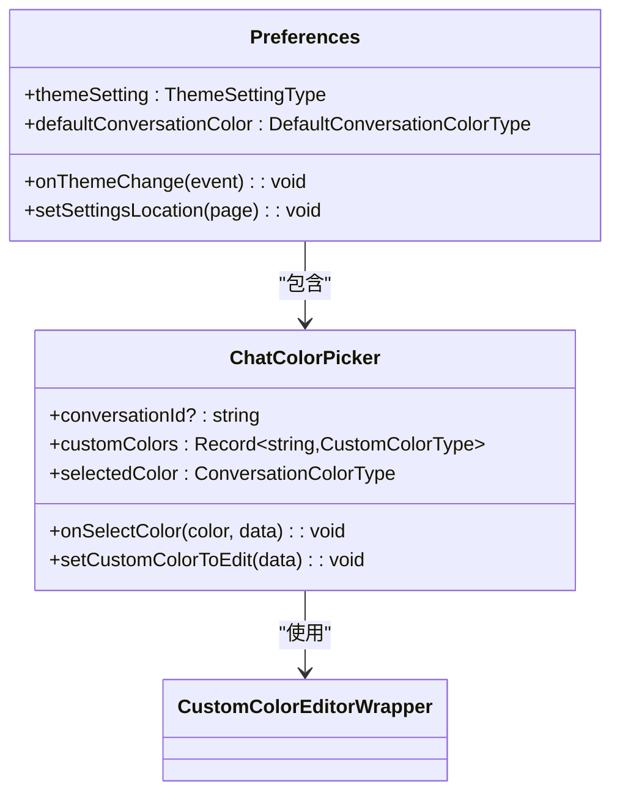
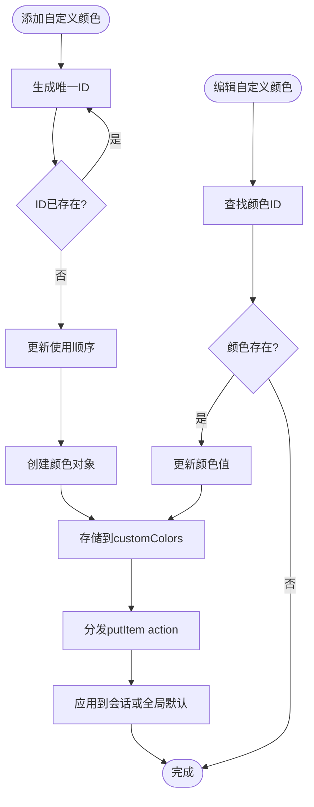
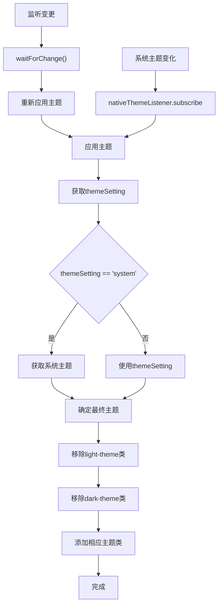
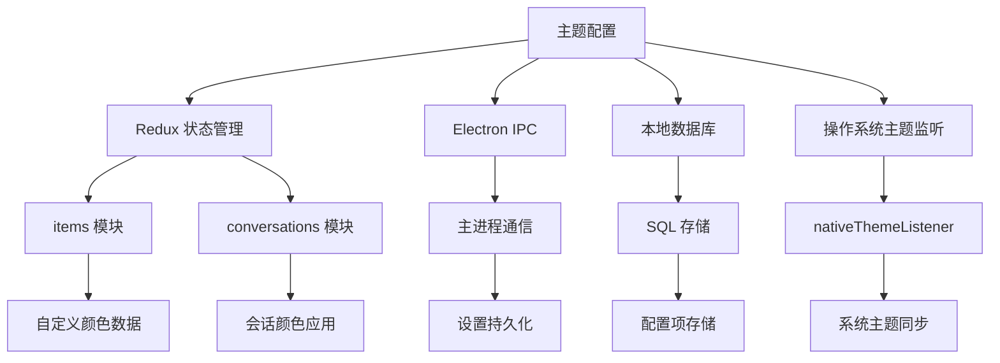

# 主题配置

<cite>
**本文档中引用的文件**  
- [Preferences.dom.tsx](file://ts/components/Preferences.dom.tsx)
- [items.preload.ts](file://ts/state/ducks/items.preload.ts)
- [Colors.std.ts](file://ts/types/Colors.std.ts)
- [StorageUIKeys.std.ts](file://ts/types/StorageUIKeys.std.ts)
- [main.main.ts](file://app/main.main.ts)
- [getThemeType.dom.ts](file://ts/util/getThemeType.dom.ts)
- [theme.std.ts](file://ts/util/theme.std.ts)
- [ChatColorPicker.dom.tsx](file://ts/components/ChatColorPicker.dom.tsx)
- [getCustomColorStyle.dom.ts](file://ts/util/getCustomColorStyle.dom.ts)
- [applyTheme.dom.ts](file://ts/windows/applyTheme.dom.ts)
- [useTheme.dom.ts](file://ts/hooks/useTheme.dom.ts)
- [conversations.preload.ts](file://ts/state/ducks/conversations.preload.ts)
- [createNativeThemeListener.std.ts](file://ts/context/createNativeThemeListener.std.ts)
</cite>

## 目录
1. [介绍](#介绍)
2. [项目结构](#项目结构)
3. [核心组件](#核心组件)
4. [架构概述](#架构概述)
5. [详细组件分析](#详细组件分析)
6. [依赖分析](#依赖分析)
7. [性能考虑](#性能考虑)
8. [故障排除指南](#故障排除指南)
9. [结论](#结论)

## 介绍
Signal-Desktop 的主题配置功能允许用户自定义应用程序的视觉外观，包括深色/浅色模式切换、自定义聊天颜色、字体缩放等。该系统支持三种主题模式：浅色、深色和跟随系统设置。用户可以为单个对话或全局默认设置自定义渐变或纯色背景。主题配置存储在本地数据库中，并通过 Redux 状态管理进行实时更新。系统还实现了对操作系统原生主题变化的监听，确保应用主题与系统设置保持同步。

## 项目结构
主题配置功能分布在 Signal-Desktop 项目的多个目录中，主要集中在 `ts` 和 `app` 目录下。核心逻辑位于 `ts/components`、`ts/state/ducks` 和 `ts/types` 中，而主进程集成位于 `app/main.main.ts`。样式文件位于 `stylesheets` 目录，但主题逻辑主要通过 JavaScript 动态应用。

**Diagram sources**
- [Preferences.dom.tsx](file://ts/components/Preferences.dom.tsx)
- [items.preload.ts](file://ts/state/ducks/items.preload.ts)
- [Colors.std.ts](file://ts/types/Colors.std.ts)
- [StorageUIKeys.std.ts](file://ts/types/StorageUIKeys.std.ts)
- [main.main.ts](file://app/main.main.ts)

**Section sources**
- [Preferences.dom.tsx](file://ts/components/Preferences.dom.tsx)
- [items.preload.ts](file://ts/state/ducks/items.preload.ts)
- [Colors.std.ts](file://ts/types/Colors.std.ts)

## 核心组件
主题配置的核心组件包括主题设置 UI、自定义颜色管理器、状态存储和主题应用逻辑。`Preferences` 组件提供用户界面，`items` 模块管理自定义颜色数据，`main.main.ts` 处理主进程的持久化和系统集成。系统使用 Redux 管理状态，并通过 IPC 通信在渲染进程和主进程之间同步主题设置。

**Section sources**
- [Preferences.dom.tsx](file://ts/components/Preferences.dom.tsx)
- [items.preload.ts](file://ts/state/ducks/items.preload.ts)
- [main.main.ts](file://app/main.main.ts)

## 架构概述
主题配置系统采用分层架构，从用户界面到数据存储形成清晰的调用链。用户在 UI 上更改主题设置后，通过 Redux action 更新状态，触发持久化到数据库，并广播设置变更事件。主进程监听这些事件，更新本地存储并应用相应的 CSS 类。对于自定义颜色，系统维护一个全局颜色库，支持创建、编辑和删除操作，并确保数据一致性。

**Diagram sources**
- [Preferences.dom.tsx](file://ts/components/Preferences.dom.tsx)
- [main.main.ts](file://app/main.main.ts)
- [applyTheme.dom.ts](file://ts/windows/applyTheme.dom.ts)

## 详细组件分析
### 主题设置组件分析
`Preferences` 组件是主题配置的主要用户界面，提供主题模式选择和自定义颜色编辑入口。它通过 Redux 选择器获取当前主题设置和默认聊天颜色，并在用户交互时调度相应的 action。

**Diagram sources**
- [Preferences.dom.tsx](file://ts/components/Preferences.dom.tsx)
- [ChatColorPicker.dom.tsx](file://ts/components/ChatColorPicker.dom.tsx)

**Section sources**
- [Preferences.dom.tsx](file://ts/components/Preferences.dom.tsx#L1019-L2597)
- [ChatColorPicker.dom.tsx](file://ts/components/ChatColorPicker.dom.tsx#L76-L279)

### 自定义颜色管理分析
自定义颜色管理通过 `items` 模块实现，提供添加、编辑和删除自定义颜色的功能。每个自定义颜色都有唯一的 UUID，并存储在 `customColors` 项中。系统维护颜色的使用顺序，确保最近使用的颜色优先显示。

**Diagram sources**
- [items.preload.ts](file://ts/state/ducks/items.preload.ts#L152-L238)
- [Colors.std.ts](file://ts/types/Colors.std.ts#L161-L195)

**Section sources**
- [items.preload.ts](file://ts/state/ducks/items.preload.ts#L145-L250)
- [Colors.std.ts](file://ts/types/Colors.std.ts#L92-L195)

### 主题应用机制分析
主题应用机制通过 `applyTheme.dom.ts` 实现，监听设置变更和系统主题变化，动态更新 DOM 的 CSS 类。系统使用 `light-theme` 和 `dark-theme` 类来控制整体外观，并通过 `waitForChange` 机制实现高效的变更监听。

**Diagram sources**
- [applyTheme.dom.ts](file://ts/windows/applyTheme.dom.ts#L4-L33)
- [createNativeThemeListener.std.ts](file://ts/context/createNativeThemeListener.std.ts#L39-L82)

**Section sources**
- [applyTheme.dom.ts](file://ts/windows/applyTheme.dom.ts#L1-L33)
- [useTheme.dom.ts](file://ts/hooks/useTheme.dom.ts#L1-L58)

## 依赖分析
主题配置系统依赖于多个核心模块和外部服务。主要依赖包括 Redux 状态管理、Electron IPC 通信、本地数据库存储和操作系统原生主题监听。系统通过清晰的接口隔离各层，确保模块间的低耦合。

**Diagram sources**
- [main.main.ts](file://app/main.main.ts#L328-L364)
- [items.preload.ts](file://ts/state/ducks/items.preload.ts)
- [conversations.preload.ts](file://ts/state/ducks/conversations.preload.ts#L7390-L7443)

**Section sources**
- [main.main.ts](file://app/main.main.ts#L317-L412)
- [StorageUIKeys.std.ts](file://ts/types/StorageUIKeys.std.ts#L1-L44)

## 性能考虑
主题配置系统在性能方面进行了多项优化。首先，使用 `waitForChange` 机制避免了轮询，减少了 CPU 占用。其次，主题应用采用增量更新策略，只修改必要的 CSS 类，避免了整个 DOM 的重渲染。对于自定义颜色，系统缓存了颜色样式计算结果，避免重复计算。此外，系统在主进程和渲染进程之间采用异步通信，确保 UI 的响应性。

## 故障排除指南
当主题配置出现问题时，可以按照以下步骤进行排查：首先检查 `theme-setting` 配置项是否正确存储在数据库中；其次验证 `nativeThemeListener` 是否正确订阅了系统主题变化；然后确认 `applyTheme` 函数是否被正确调用；最后检查 DOM 元素是否正确应用了主题类。对于自定义颜色问题，需要验证 `customColors` 数据结构的完整性和 UUID 的唯一性。

**Section sources**
- [main.main.ts](file://app/main.main.ts#L332-L354)
- [applyTheme.dom.ts](file://ts/windows/applyTheme.dom.ts)
- [items.preload.ts](file://ts/state/ducks/items.preload.ts)

## 结论
Signal-Desktop 的主题配置系统是一个功能完整、架构清晰的模块，支持灵活的主题定制和高效的运行性能。系统通过 Redux 管理状态，确保数据一致性，并通过事件驱动机制实现高效的变更响应。未来可以考虑增加更多主题选项，如字体选择、圆角大小等，进一步提升用户体验。