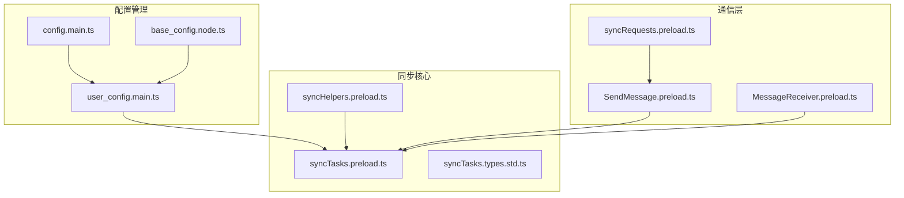
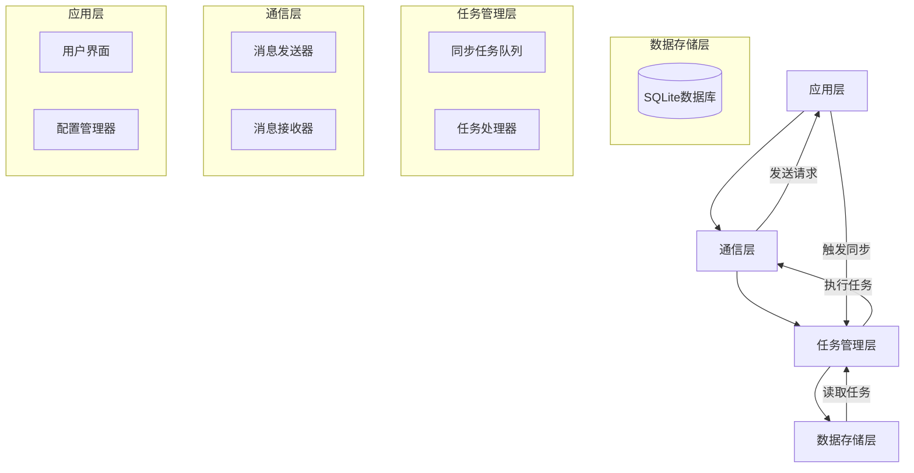
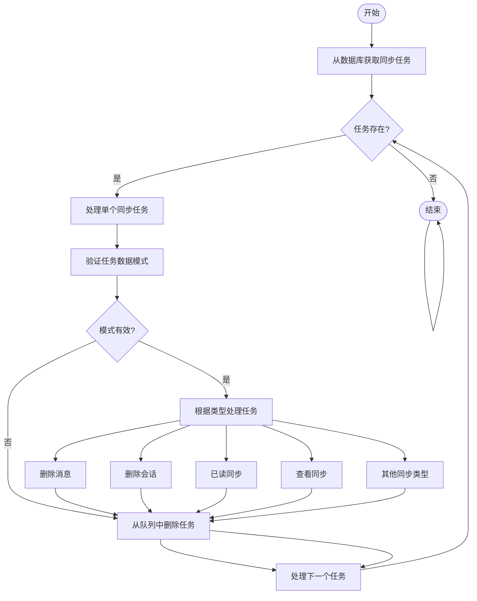
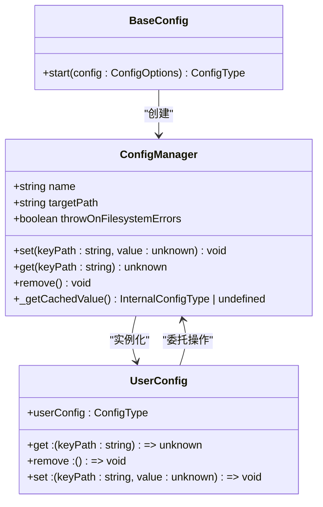
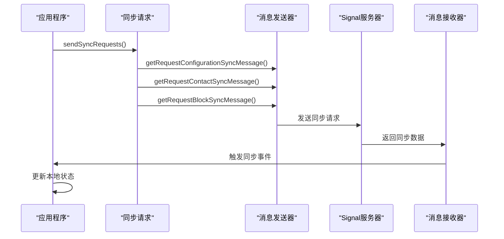
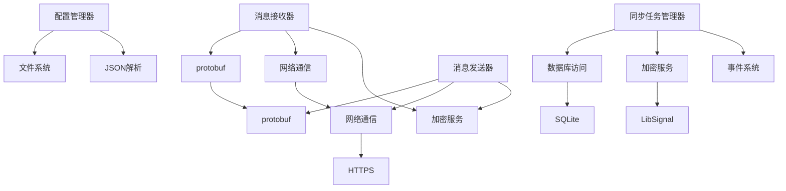

# 同步机制

<cite>
**本文档引用的文件**   
- [syncTasks.preload.ts](file://ts/util/syncTasks.preload.ts)
- [syncRequests.preload.ts](file://ts/textsecure/syncRequests.preload.ts)
- [MessageReceiver.preload.ts](file://ts/textsecure/MessageReceiver.preload.ts)
- [SendMessage.preload.ts](file://ts/textsecure/SendMessage.preload.ts)
- [user_config.main.ts](file://app/user_config.main.ts)
- [config.main.ts](file://app/config.main.ts)
- [syncHelpers.preload.ts](file://ts/jobs/helpers/syncHelpers.preload.ts)
- [syncTasks.types.std.ts](file://ts/util/syncTasks.types.std.ts)
- [base_config.node.ts](file://app/base_config.node.ts)
- [config.preload.ts](file://ts/context/config.preload.ts)
</cite>

## 目录
1. [简介](#简介)
2. [项目结构](#项目结构)
3. [核心组件](#核心组件)
4. [架构概述](#架构概述)
5. [详细组件分析](#详细组件分析)
6. [依赖分析](#依赖分析)
7. [性能考虑](#性能考虑)
8. [故障排除指南](#故障排除指南)
9. [结论](#结论)

## 简介
Signal-Desktop的配置同步机制是多设备间保持用户配置一致性的核心技术。该机制通过安全的加密通信协议，在用户的不同设备间同步配置数据，包括消息已读状态、联系人信息、群组设置等。系统采用基于protobuf的二进制消息格式进行数据传输，确保了高效的数据序列化和反序列化。同步过程由专门的同步任务队列管理，支持断点续传和错误重试机制。配置数据存储在本地SQLite数据库中，并通过ACI（Account Credential Identifier）进行设备身份验证。整个同步流程设计注重隐私保护，所有同步数据均经过端到端加密，确保只有用户自己的设备能够解密和访问同步内容。

## 项目结构
Signal-Desktop的项目结构清晰地划分了不同功能模块，其中同步机制相关的代码主要分布在`ts/util`、`ts/textsecure`和`app`目录下。配置管理相关的文件位于`app`目录，包括用户配置和应用配置的处理逻辑。同步任务的核心实现位于`ts/util`目录下的`syncTasks.preload.ts`文件中，而同步请求的发送和接收逻辑则分布在`ts/textsecure`目录下的多个文件中。这种模块化的结构设计使得同步功能的维护和扩展更加容易。

**图示来源**
- [user_config.main.ts](file://app/user_config.main.ts#L1-L51)
- [config.main.ts](file://app/config.main.ts#L1-L77)
- [base_config.node.ts](file://app/base_config.node.ts#L1-L49)
- [syncTasks.preload.ts](file://ts/util/syncTasks.preload.ts#L1-L263)
- [syncHelpers.preload.ts](file://ts/jobs/helpers/syncHelpers.preload.ts#L1-L181)
- [syncTasks.types.std.ts](file://ts/util/syncTasks.types.std.ts#L1-L5)
- [syncRequests.preload.ts](file://ts/textsecure/syncRequests.preload.ts#L1-L29)
- [SendMessage.preload.ts](file://ts/textsecure/SendMessage.preload.ts#L1570-L1769)
- [MessageReceiver.preload.ts](file://ts/textsecure/MessageReceiver.preload.ts#L3160-L3359)

**本节来源**
- [app](file://app)
- [ts/util](file://ts/util)
- [ts/textsecure](file://ts/textsecure)

## 核心组件
Signal-Desktop的同步机制由多个核心组件构成，包括同步任务管理器、配置管理器、消息接收器和发送器。同步任务管理器负责处理和执行各种类型的同步任务，如消息已读同步、查看同步等。配置管理器负责管理用户的本地配置数据，包括持久化存储和读取。消息接收器负责处理从服务器接收到的同步消息，并将其转换为相应的事件进行处理。消息发送器则负责构建和发送同步请求到服务器。这些组件通过清晰的接口进行交互，形成了一个完整的同步生态系统。

**本节来源**
- [syncTasks.preload.ts](file://ts/util/syncTasks.preload.ts#L1-L263)
- [syncRequests.preload.ts](file://ts/textsecure/syncRequests.preload.ts#L1-L29)
- [MessageReceiver.preload.ts](file://ts/textsecure/MessageReceiver.preload.ts#L3160-L3359)
- [SendMessage.preload.ts](file://ts/textsecure/SendMessage.preload.ts#L1570-L1769)

## 架构概述
Signal-Desktop的同步架构采用分层设计，从下到上分别为数据存储层、任务管理层、通信层和应用层。数据存储层使用SQLite数据库存储同步任务和配置数据。任务管理层负责管理同步任务的生命周期，包括任务的创建、执行、重试和删除。通信层负责与Signal服务器进行安全通信，发送同步请求和接收同步响应。应用层则负责将同步结果应用到用户界面和本地状态。这种分层架构确保了系统的可维护性和可扩展性。

**图示来源**
- [syncTasks.preload.ts](file://ts/util/syncTasks.preload.ts#L234-L262)
- [DataWriter](file://ts/sql/Client.preload.js)
- [SendMessage.preload.ts](file://ts/textsecure/SendMessage.preload.ts#L1570-L1769)
- [MessageReceiver.preload.ts](file://ts/textsecure/MessageReceiver.preload.ts#L3160-L3359)
- [user_config.main.ts](file://app/user_config.main.ts#L1-L51)

## 详细组件分析

### 同步任务管理器分析
同步任务管理器是Signal-Desktop同步机制的核心组件，负责处理各种类型的同步任务。它通过`queueSyncTasks`函数处理从数据库中读取的同步任务，并根据任务类型调用相应的处理函数。任务类型包括消息删除、会话删除、已读同步、查看同步等。每个任务都有一个重试机制，最大重试次数由`MAX_SYNC_TASK_ATTEMPTS`常量定义。任务处理过程中使用了异步队列，确保任务按顺序执行，避免并发问题。

**图示来源**
- [syncTasks.preload.ts](file://ts/util/syncTasks.preload.ts#L75-L227)
- [syncTasks.types.std.ts](file://ts/util/syncTasks.types.std.ts#L4-L5)

**本节来源**
- [syncTasks.preload.ts](file://ts/util/syncTasks.preload.ts#L1-L263)
- [syncTasks.types.std.ts](file://ts/util/syncTasks.types.std.ts#L1-L5)

### 配置管理器分析
配置管理器负责管理用户的本地配置数据，包括用户的偏好设置、应用状态等。它使用`base_config.node.ts`提供的基础配置功能，将配置数据持久化存储在本地文件系统中。配置数据以JSON格式存储在`config.json`文件中，路径由`user_config.main.ts`确定。配置管理器提供了`get`、`set`和`remove`等基本操作接口，供应用程序其他部分使用。在多设备同步场景下，配置管理器会接收来自其他设备的同步更新，并相应地更新本地配置。

**图示来源**
- [base_config.node.ts](file://app/base_config.node.ts#L31-L49)
- [user_config.main.ts](file://app/user_config.main.ts#L42-L51)
- [config.main.ts](file://app/config.main.ts#L53-L75)

**本节来源**
- [base_config.node.ts](file://app/base_config.node.ts#L1-L49)
- [user_config.main.ts](file://app/user_config.main.ts#L1-L51)
- [config.main.ts](file://app/config.main.ts#L1-L77)

### 同步请求处理分析
同步请求处理组件负责向Signal服务器发送同步请求，并处理服务器返回的同步数据。`syncRequests.preload.ts`文件中的`sendSyncRequests`函数是同步请求的入口点，它会并行发送多种类型的同步请求，包括联系人同步、配置同步和阻止列表同步。消息发送器使用protobuf格式构建同步消息，并通过安全通道发送到服务器。消息接收器则负责解析从服务器接收到的同步消息，并将其转换为相应的事件进行处理。

**图示来源**
- [syncRequests.preload.ts](file://ts/textsecure/syncRequests.preload.ts#L11-L28)
- [SendMessage.preload.ts](file://ts/textsecure/SendMessage.preload.ts#L1574-L1616)
- [MessageReceiver.preload.ts](file://ts/textsecure/MessageReceiver.preload.ts#L3166-L3179)

**本节来源**
- [syncRequests.preload.ts](file://ts/textsecure/syncRequests.preload.ts#L1-L29)
- [SendMessage.preload.ts](file://ts/textsecure/SendMessage.preload.ts#L1570-L1769)
- [MessageReceiver.preload.ts](file://ts/textsecure/MessageReceiver.preload.ts#L3160-L3359)

## 依赖分析
Signal-Desktop的同步机制依赖于多个内部和外部组件。内部依赖包括配置管理、数据库访问、加密服务等。外部依赖主要涉及Signal服务器的API接口和protobuf库。同步任务管理器依赖于数据库访问层来持久化存储任务状态，依赖于加密服务来确保同步数据的安全性。配置管理器依赖于文件系统API来读写配置文件。这些依赖关系通过清晰的接口定义，确保了组件间的松耦合。

**图示来源**
- [syncTasks.preload.ts](file://ts/util/syncTasks.preload.ts#L34-L35)
- [user_config.main.ts](file://app/user_config.main.ts#L4-L5)
- [SendMessage.preload.ts](file://ts/textsecure/SendMessage.preload.ts#L4-L5)
- [MessageReceiver.preload.ts](file://ts/textsecure/MessageReceiver.preload.ts#L4-L5)

**本节来源**
- [syncTasks.preload.ts](file://ts/util/syncTasks.preload.ts#L1-L263)
- [user_config.main.ts](file://app/user_config.main.ts#L1-L51)
- [SendMessage.preload.ts](file://ts/textsecure/SendMessage.preload.ts#L1-L2603)
- [MessageReceiver.preload.ts](file://ts/textsecure/MessageReceiver.preload.ts#L1-L4208)

## 性能考虑
Signal-Desktop的同步机制在设计时充分考虑了性能因素。同步任务采用批量处理的方式，通过`dequeueOldestSyncTasks`函数一次性获取多个任务进行处理，减少了数据库访问的次数。对于大量同步数据，系统采用分块处理策略，如在发送已读同步消息时，将同步数据分成每块100个进行发送，避免单次请求过大。同步任务的执行使用异步队列，确保不会阻塞主线程，保持用户界面的响应性。此外，系统还实现了智能重试机制，根据任务失败次数动态调整重试间隔，避免对服务器造成过大压力。

## 故障排除指南
当同步机制出现问题时，可以通过以下步骤进行排查：首先检查网络连接是否正常，确保设备能够访问Signal服务器。其次查看应用日志，特别是以"syncTasks"、"syncRequests"为前缀的日志信息，这些日志记录了同步过程中的关键事件和错误。如果发现同步任务积压，可以检查数据库状态，确认同步任务表是否正常。对于配置同步问题，可以检查`config.json`文件的完整性和权限设置。在极端情况下，可以尝试清除同步任务队列，让系统重新建立同步状态。

**本节来源**
- [syncTasks.preload.ts](file://ts/util/syncTasks.preload.ts#L36-L37)
- [syncRequests.preload.ts](file://ts/textsecure/syncRequests.preload.ts#L9-L10)
- [user_config.main.ts](file://app/user_config.main.ts#L37-L38)

## 结论
Signal-Desktop的配置同步机制是一个复杂而精密的系统，它通过分层架构和模块化设计，实现了多设备间用户配置的安全、可靠同步。该机制充分利用了现代Web技术栈的优势，结合protobuf的高效序列化、SQLite的本地存储和端到端加密的安全保障，为用户提供了一致的跨设备体验。未来的发展方向可能包括优化同步算法以减少带宽消耗，增强冲突解决策略以处理更复杂的多设备并发场景，以及提供更细粒度的同步控制选项，让用户能够更好地管理自己的数据同步行为。