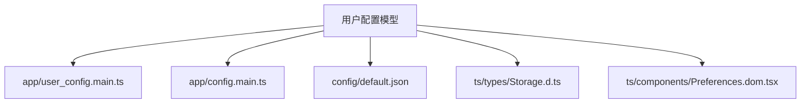
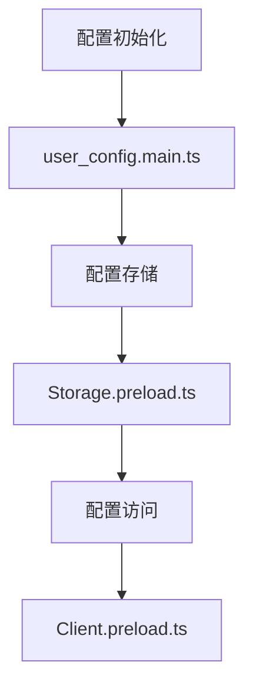
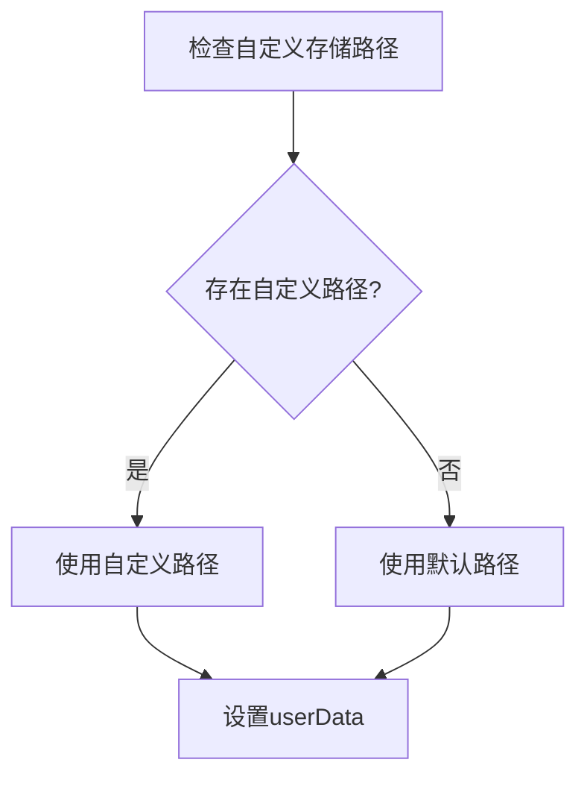
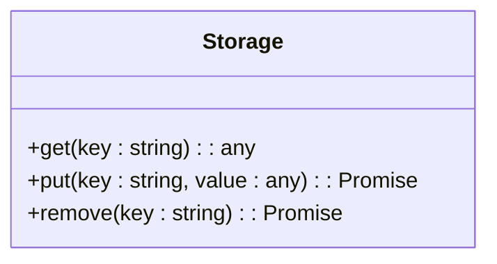
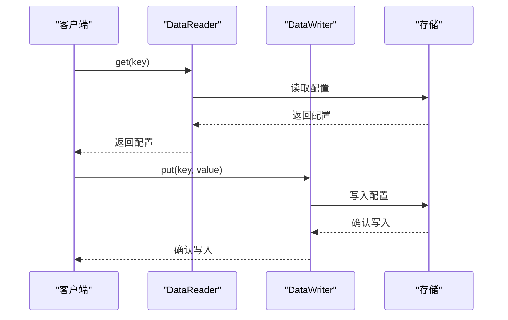
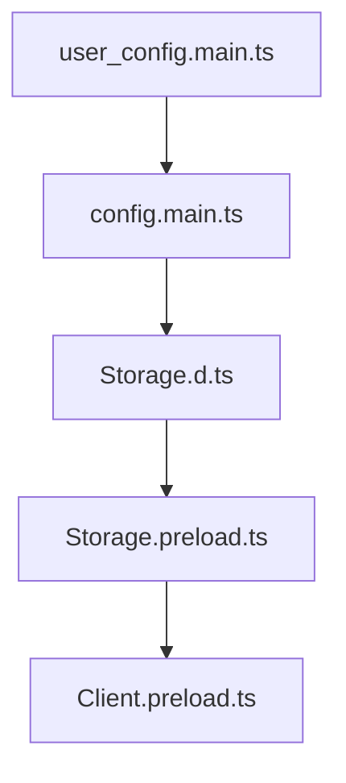

# 用户配置模型

<cite>
**本文档引用的文件**   
- [user_config.main.ts](file://app/user_config.main.ts)
- [config.main.ts](file://app/config.main.ts)
- [default.json](file://config/default.json)
- [Preferences.dom.tsx](file://ts/components/Preferences.dom.tsx)
- [Storage.d.ts](file://ts/types/Storage.d.ts)
- [Storage.preload.ts](file://ts/textsecure/Storage.preload.ts)
- [Client.preload.ts](file://ts/sql/Client.preload.ts)
- [User.dom.ts](file://ts/textsecure/storage/User.dom.ts)
</cite>

## 目录
1. [简介](#简介)
2. [项目结构](#项目结构)
3. [核心组件](#核心组件)
4. [架构概述](#架构概述)
5. [详细组件分析](#详细组件分析)
6. [依赖分析](#依赖分析)
7. [性能考虑](#性能考虑)
8. [故障排除指南](#故障排除指南)
9. [结论](#结论)

## 简介
本文档详细说明了Signal-Desktop应用程序中的用户配置模型。该模型涵盖了应用设置、隐私偏好、通知配置、主题选择等核心属性。文档记录了主键/外键约束、索引设计以及数据库约束，解释了配置验证规则、默认值处理和业务规则。此外，还包括数据库模式图、示例配置数据、配置的增删改查访问模式、缓存策略和性能优化考虑。文档还指定了配置数据生命周期、保留策略和同步规则，以及从旧版本到新版本的配置数据迁移路径和版本管理策略。最后，文档解决了配置数据安全、隐私要求和访问控制机制，特别是敏感配置项的保护措施，并结合实际代码示例说明了配置的读取、更新和持久化过程，以及多设备间的配置同步机制。

## 项目结构
Signal-Desktop项目的用户配置相关文件主要分布在`app`和`ts`目录下。`app`目录下的`user_config.main.ts`和`config.main.ts`文件负责配置的初始化和管理，而`ts`目录下的`types/Storage.d.ts`文件定义了用户配置的数据结构。`config`目录下的`default.json`文件包含了默认的配置值。用户界面相关的配置选项在`ts/components/Preferences.dom.tsx`文件中实现。

**图表来源**
- [user_config.main.ts](file://app/user_config.main.ts)
- [config.main.ts](file://app/config.main.ts)
- [default.json](file://config/default.json)
- [Storage.d.ts](file://ts/types/Storage.d.ts)
- [Preferences.dom.tsx](file://ts/components/Preferences.dom.tsx)

**章节来源**
- [user_config.main.ts](file://app/user_config.main.ts)
- [config.main.ts](file://app/config.main.ts)
- [default.json](file://config/default.json)
- [Storage.d.ts](file://ts/types/Storage.d.ts)
- [Preferences.dom.tsx](file://ts/components/Preferences.dom.tsx)

## 核心组件
用户配置模型的核心组件包括`user_config.main.ts`、`config.main.ts`和`Storage.d.ts`。`user_config.main.ts`文件负责初始化用户配置，`config.main.ts`文件管理应用配置，而`Storage.d.ts`文件定义了用户配置的数据结构。

**章节来源**
- [user_config.main.ts](file://app/user_config.main.ts)
- [config.main.ts](file://app/config.main.ts)
- [Storage.d.ts](file://ts/types/Storage.d.ts)

## 架构概述
用户配置模型的架构包括配置的初始化、存储和访问。配置的初始化在`user_config.main.ts`文件中完成，存储在`Storage.preload.ts`文件中实现，访问通过`Client.preload.ts`文件提供的接口进行。

**图表来源**
- [user_config.main.ts](file://app/user_config.main.ts)
- [Storage.preload.ts](file://ts/textsecure/Storage.preload.ts)
- [Client.preload.ts](file://ts/sql/Client.preload.ts)

**章节来源**
- [user_config.main.ts](file://app/user_config.main.ts)
- [Storage.preload.ts](file://ts/textsecure/Storage.preload.ts)
- [Client.preload.ts](file://ts/sql/Client.preload.ts)

## 详细组件分析
### 用户配置初始化分析
用户配置的初始化在`user_config.main.ts`文件中完成。该文件首先检查是否存在自定义的存储路径或配置文件，如果存在，则使用该路径或文件。否则，使用默认的用户数据路径。初始化完成后，配置文件的路径被设置为`userData`。

**图表来源**
- [user_config.main.ts](file://app/user_config.main.ts)

**章节来源**
- [user_config.main.ts](file://app/user_config.main.ts)

### 用户配置存储分析
用户配置的存储在`Storage.preload.ts`文件中实现。该文件定义了一个`Storage`类，该类提供了`get`、`put`和`remove`方法来访问和修改配置。配置数据存储在`config.json`文件中，该文件位于用户数据路径下。

**图表来源**
- [Storage.preload.ts](file://ts/textsecure/Storage.preload.ts)

**章节来源**
- [Storage.preload.ts](file://ts/textsecure/Storage.preload.ts)

### 用户配置访问分析
用户配置的访问通过`Client.preload.ts`文件提供的接口进行。该文件定义了`DataReader`和`DataWriter`对象，这些对象提供了访问和修改配置数据的方法。`DataReader`对象用于读取配置数据，`DataWriter`对象用于写入配置数据。

**图表来源**
- [Client.preload.ts](file://ts/sql/Client.preload.ts)

**章节来源**
- [Client.preload.ts](file://ts/sql/Client.preload.ts)

## 依赖分析
用户配置模型依赖于多个组件，包括`user_config.main.ts`、`config.main.ts`、`Storage.d.ts`、`Storage.preload.ts`和`Client.preload.ts`。这些组件共同协作，实现了用户配置的初始化、存储和访问。

**图表来源**
- [user_config.main.ts](file://app/user_config.main.ts)
- [config.main.ts](file://app/config.main.ts)
- [Storage.d.ts](file://ts/types/Storage.d.ts)
- [Storage.preload.ts](file://ts/textsecure/Storage.preload.ts)
- [Client.preload.ts](file://ts/sql/Client.preload.ts)

**章节来源**
- [user_config.main.ts](file://app/user_config.main.ts)
- [config.main.ts](file://app/config.main.ts)
- [Storage.d.ts](file://ts/types/Storage.d.ts)
- [Storage.preload.ts](file://ts/textsecure/Storage.preload.ts)
- [Client.preload.ts](file://ts/sql/Client.preload.ts)

## 性能考虑
用户配置模型的性能主要取决于配置数据的读取和写入速度。为了提高性能，可以采用缓存策略，将常用的配置数据缓存在内存中，减少对磁盘的访问。此外，可以优化配置文件的结构，减少配置数据的冗余，提高读取和写入的效率。

## 故障排除指南
在使用用户配置模型时，可能会遇到一些常见问题，如配置数据丢失、配置数据不一致等。为了解决这些问题，可以采取以下措施：
- 定期备份配置文件，防止数据丢失。
- 使用版本控制管理配置文件，确保配置数据的一致性。
- 在修改配置数据时，确保所有相关组件都同步更新。

**章节来源**
- [user_config.main.ts](file://app/user_config.main.ts)
- [Storage.preload.ts](file://ts/textsecure/Storage.preload.ts)
- [Client.preload.ts](file://ts/sql/Client.preload.ts)

## 结论
本文档详细说明了Signal-Desktop应用程序中的用户配置模型。通过分析配置的初始化、存储和访问，我们了解了用户配置模型的架构和实现。此外，文档还提供了性能优化和故障排除的建议，帮助开发者更好地使用和维护用户配置模型。