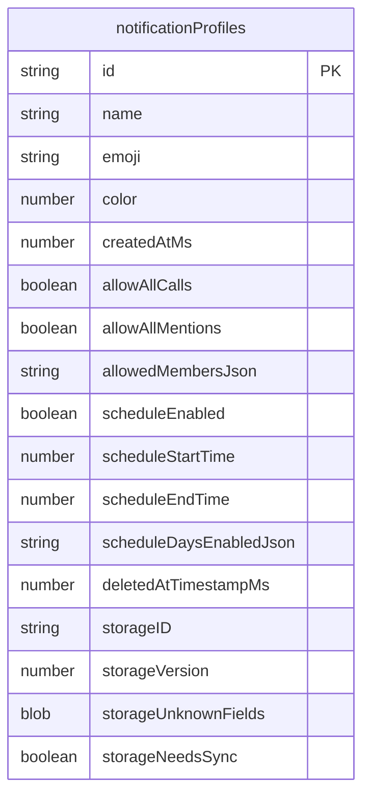
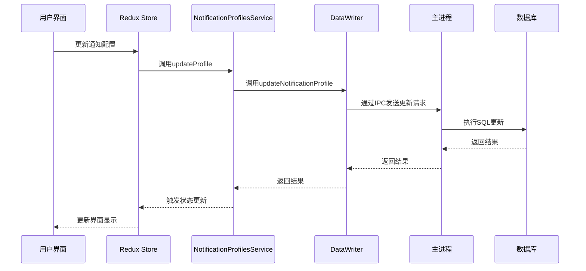
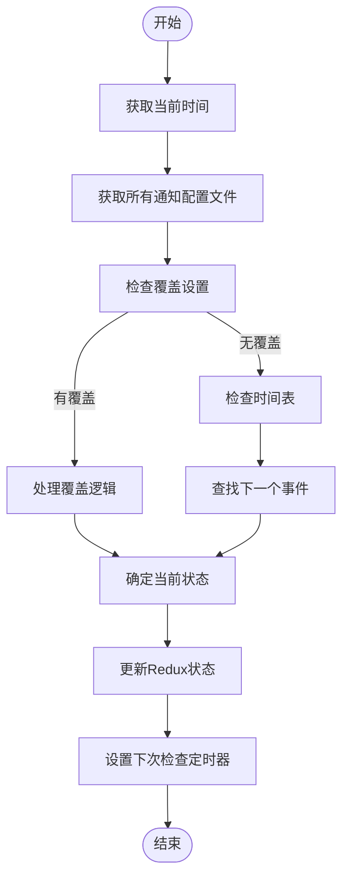
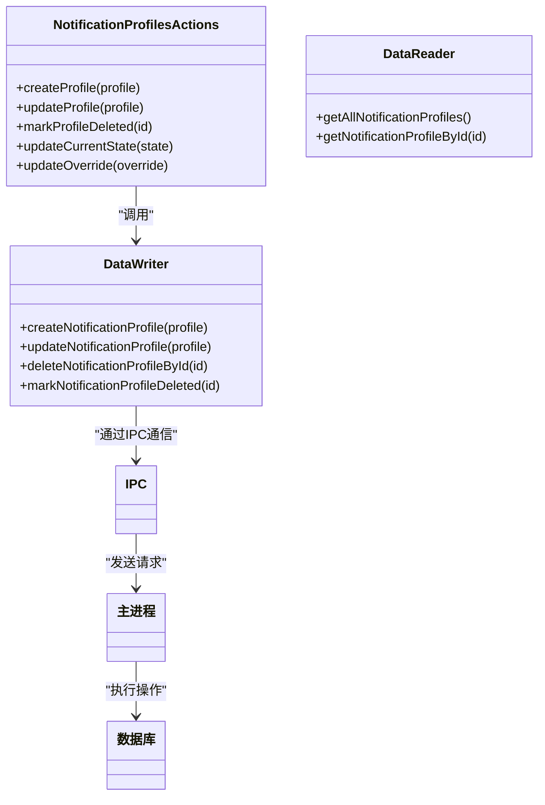

# 通知管理

<cite>
**本文档中引用的文件**  
- [notifications.js](file://ts/services/notifications.js)
- [notificationProfilesService.js](file://ts/services/notificationProfilesService.js)
- [notificationProfilesService.preload.ts](file://ts/services/notificationProfilesService.preload.ts)
- [notificationProfiles.js](file://ts/state/ducks/notificationProfiles.js)
- [notificationProfiles.preload.ts](file://ts/state/ducks/notificationProfiles.preload.ts)
- [NotificationProfile.js](file://ts/types/NotificationProfile.js)
- [Client.js](file://ts/sql/Client.js)
- [Server.node.ts](file://ts/sql/Server.node.ts)
- [1350-notification-profiles.js](file://ts/sql/migrations/1350-notification-profiles.js)
- [Preferences.dom.tsx](file://ts/components/Preferences.dom.tsx)
- [Settings.js](file://ts/types/Settings.js)
</cite>

## 目录
1. [简介](#简介)
2. [通知配置项定义](#通知配置项定义)
3. [存储与同步机制](#存储与同步机制)
4. [通知规则与行为模式](#通知规则与行为模式)
5. [API接口与持久化](#api接口与持久化)
6. [初始化与变更响应](#初始化与变更响应)
7. [JSON模式与配置示例](#json模式与配置示例)

## 简介
Signal-Desktop的通知管理系统提供了一套完整的配置机制，允许用户自定义通知行为。系统支持全局通知设置和基于时间表的个性化通知配置文件。通知配置包括开关控制、声音设置、显示选项等核心属性，并通过Redux状态管理和SQL数据库实现持久化存储。系统还实现了跨设备同步机制，确保用户在不同设备上获得一致的通知体验。

## 通知配置项定义

通知配置系统包含两个主要部分：全局通知设置和通知配置文件。全局设置通过`NotificationSetting`枚举定义，包含四种模式：关闭、仅显示名称、显示名称和消息、仅显示计数。

```mermaid
classDiagram
class NotificationSetting {
+Off : "off"
+NoNameOrMessage : "count"
+NameOnly : "name"
+NameAndMessage : "message"
}
class NotificationProfileType {
+id : string
+name : string
+emoji : string
+color : number
+createdAtMs : number
+allowAllCalls : boolean
+allowAllMentions : boolean
+allowedMembers : Set<string>
+scheduleEnabled : boolean
+scheduleStartTime : number
+scheduleEndTime : number
+scheduleDaysEnabled : Map<DayOfWeek, boolean>
+deletedAtTimestampMs : number
+storageNeedsSync : boolean
}
class NotificationProfileOverride {
+enabled : { profileId : string, endsAtMs? : number }
+disabledAtMs : number
}
```

**图源**  
- [notifications.js](file://ts/services/notifications.js#L60-L66)
- [NotificationProfile.js](file://ts/types/NotificationProfile.js#L22-L41)

通知配置文件（Notification Profile）包含以下核心属性：
- **基础信息**：ID、名称、表情符号、颜色和创建时间
- **权限设置**：是否允许所有来电和提及通知
- **成员白名单**：允许接收通知的会话ID集合
- **时间表设置**：启用状态、开始和结束时间、启用的星期几
- **同步状态**：存储ID、版本和同步需求标志

**节源**  
- [1350-notification-profiles.js](file://ts/sql/migrations/1350-notification-profiles.js#L28-L57)
- [NotificationProfile.js](file://ts/types/NotificationProfile.js#L22-L41)

## 存储与同步机制

通知配置数据存储在本地SQLite数据库中，通过`notificationProfiles`表进行管理。该表在数据库迁移版本1350中创建，包含所有配置文件的结构化数据。



**图源**  
- [1350-notification-profiles.js](file://ts/sql/migrations/1350-notification-profiles.js#L28-L57)
- [Server.node.ts](file://ts/sql/Server.node.ts#L8045-L8052)

数据访问通过`DataReader`和`DataWriter`接口实现，这些接口使用IPC通道与主进程通信，确保数据操作的安全性和一致性。



**图源**  
- [Client.js](file://ts/sql/Client.js#L154-L167)
- [notificationProfilesService.preload.ts](file://ts/services/notificationProfilesService.preload.ts#L41-L43)

当通知配置文件同步被禁用时，系统会为每个配置文件生成本地ID，并设置`storageNeedsSync`标志，以便在同步重新启用时进行处理。

**节源**  
- [storageRecordOps.preload.ts](file://ts/services/storageRecordOps.preload.ts#L2689-L2713)
- [Client.js](file://ts/sql/Client.js#L154-L167)

## 通知规则与行为模式

通知系统通过`NotificationProfilesService`类管理通知规则的评估和执行。该服务定期检查当前时间和配置文件的时间表，确定哪个配置文件应该处于活动状态。



**图源**  
- [notificationProfilesService.preload.ts](file://ts/services/notificationProfilesService.preload.ts#L49-L254)
- [NotificationProfile.js](file://ts/types/NotificationProfile.js#L81-L190)

系统使用`findNextProfileEvent`函数来确定下一个重要的时间点，可能是某个配置文件的启用时间或禁用时间。这个函数考虑了手动覆盖、时间表安排和配置文件的优先级。

通知权限检查通过`shouldNotify`函数实现，该函数根据以下规则决定是否显示通知：
1. 如果没有活动的配置文件，则允许所有通知
2. 如果是来电且配置文件允许所有来电，则允许通知
3. 如果是提及且配置文件允许所有提及，则允许通知
4. 如果会话ID在配置文件的允许成员列表中，则允许通知

**节源**  
- [NotificationProfile.js](file://ts/types/NotificationProfile.js#L60-L78)
- [notificationProfilesService.preload.ts](file://ts/services/notificationProfilesService.preload.ts#L137-L143)

## API接口与持久化

通知系统提供了一组API接口用于读取、更新和持久化配置。这些接口通过Redux动作和数据写入器实现。



**图源**  
- [notificationProfiles.js](file://ts/state/ducks/notificationProfiles.js#L44-L53)
- [Client.js](file://ts/sql/Client.js#L154-L167)

配置的持久化流程如下：
1. 用户在UI中修改通知设置
2. 组件触发相应的Redux动作
3. Redux reducer更新状态
4. 中间件调用`DataWriter`方法
5. 通过IPC通道将数据写入主进程
6. 主进程执行SQL操作并更新数据库
7. 状态变更传播回UI

全局通知设置（如是否启用通知、通知内容级别等）存储在`window.storage`中，而复杂的配置文件数据则存储在SQL数据库中。

**节源**  
- [notificationProfiles.js](file://ts/state/ducks/notificationProfiles.js#L91-L98)
- [notifications.js](file://ts/services/notifications.js#L348-L352)

## 初始化与变更响应

通知管理系统在应用启动时进行初始化，建立必要的监听器和定时器。`NotificationProfilesService`负责管理配置文件的生命周期和状态变更。

```mermaid
sequenceDiagram
participant App as 应用
participant Service as NotificationProfilesService
participant Redux as Redux Store
participant Timer as 定时器
App->>Service : initialize()
Service->>Service : 创建实例
Service->>Service : 加载缓存的配置文件
Service->>Service : 调用update()
Service->>Service : #refreshNextEvent()
Service->>Redux : 获取当前状态
Redux-->>Service : 返回状态
Service->>Service : 计算下一个事件
Service->>Redux : 更新当前状态
Service->>Timer : 设置下次检查定时器
Timer->>Service : 定时器触发
Service->>#refreshNextEvent() : 执行检查
```

**图源**  
- [notificationProfilesService.preload.ts](file://ts/services/notificationProfilesService.preload.ts#L257-L263)
- [notificationProfilesService.js](file://ts/services/notificationProfilesService.js#L46-L48)

当配置发生变化时，系统通过以下机制响应：
1. 调用`update()`方法触发去抖动的刷新
2. 执行`#refreshNextEvent()`计算新的状态
3. 如果状态发生变化，更新Redux store
4. 显示相应的Toast通知给用户
5. 设置新的定时器用于下一次检查

系统还处理配置文件的删除逻辑，将删除操作标记为软删除，并在一段时间后从数据库中永久移除。

**节源**  
- [notificationProfilesService.preload.ts](file://ts/services/notificationProfilesService.preload.ts#L72-L91)
- [notificationProfiles.js](file://ts/state/ducks/notificationProfiles.js#L74-L80)

## JSON模式与配置示例

通知配置文件的JSON模式定义了数据结构和验证规则。以下是一个完整的配置文件示例：

```json
{
  "id": "abc123def456ghi7",
  "name": "工作时间",
  "emoji": "💼",
  "color": 4293125118,
  "createdAtMs": 1640995200000,
  "allowAllCalls": false,
  "allowAllMentions": true,
  "allowedMembers": ["user1", "user2", "group1"],
  "scheduleEnabled": true,
  "scheduleStartTime": 540, // 09:00
  "scheduleEndTime": 1080, // 18:00
  "scheduleDaysEnabled": {
    "1": true, // 周一
    "2": true, // 周二
    "3": true, // 周三
    "4": true, // 周四
    "5": true, // 周五
    "6": false, // 周六
    "7": false  // 周日
  },
  "deletedAtTimestampMs": null,
  "storageNeedsSync": true
}
```

通知覆盖设置的JSON模式如下：

```json
{
  "enabled": {
    "profileId": "abc123def456ghi7",
    "endsAtMs": 1641081600000
  },
  "disabledAtMs": null
}
```

全局通知设置存储在`window.storage`中，包含以下键值：

```json
{
  "has-notifications": true,
  "notification-setting": "message",
  "has-call-notifications": true,
  "has-notification-attention": false,
  "has-count-muted-conversations": true,
  "audio-notification": true,
  "message-audio": true
}
```

**节源**  
- [Preferences.dom.tsx](file://ts/components/Preferences.dom.tsx#L1481-L1587)
- [Settings.js](file://ts/types/Settings.js#L32-L43)
- [notificationProfilesService.preload.ts](file://ts/services/notificationProfilesService.preload.ts#L106-L108)