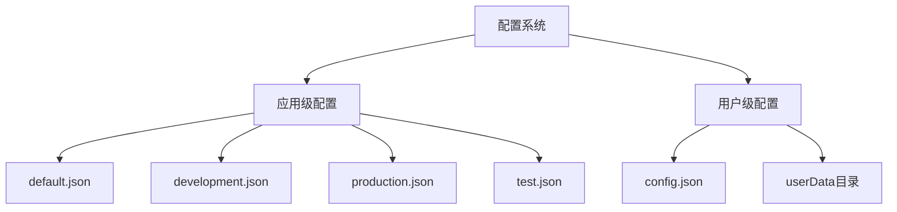
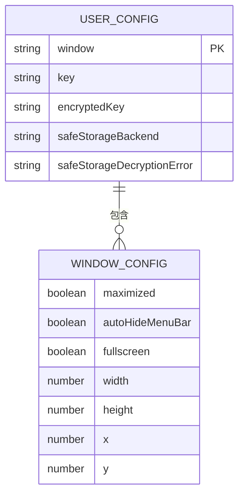
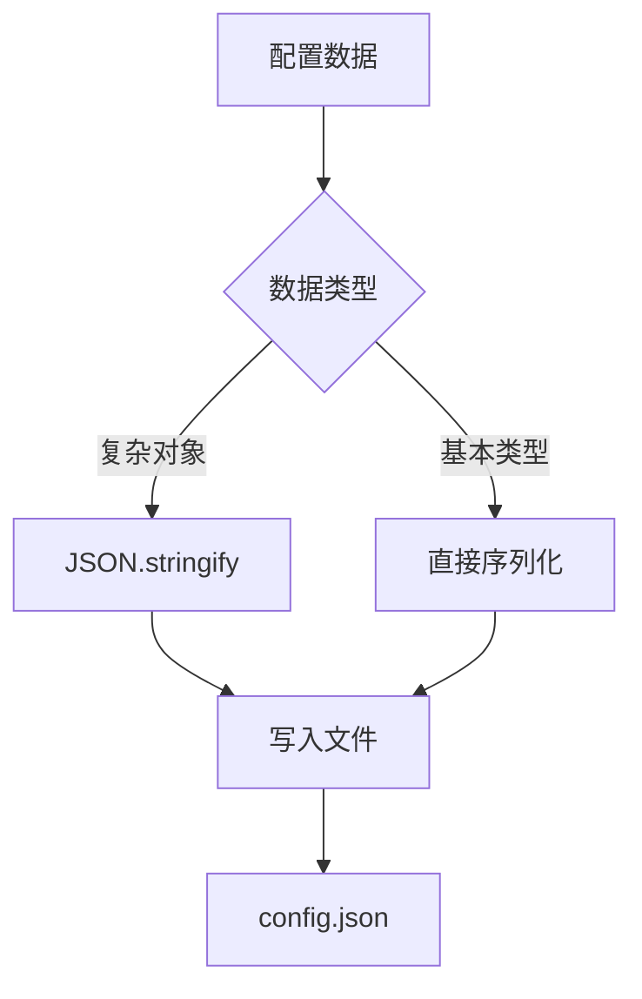
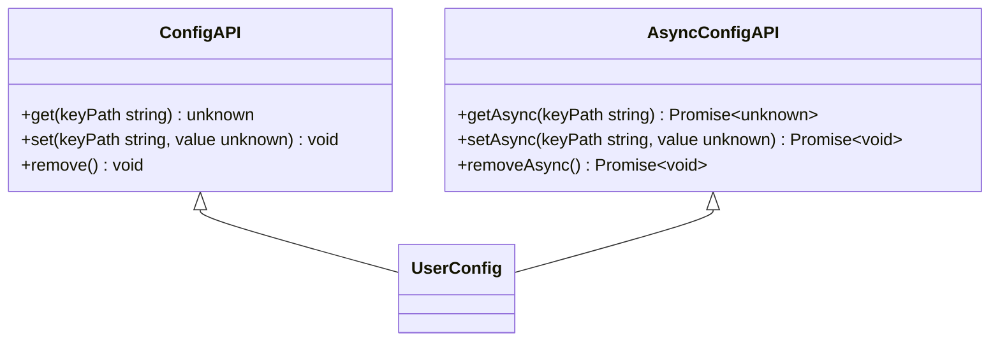
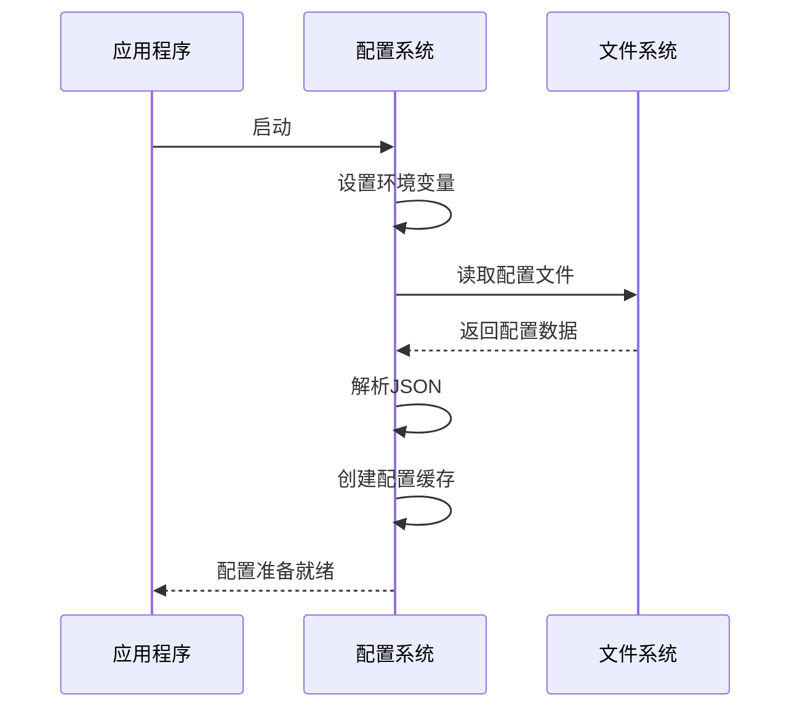
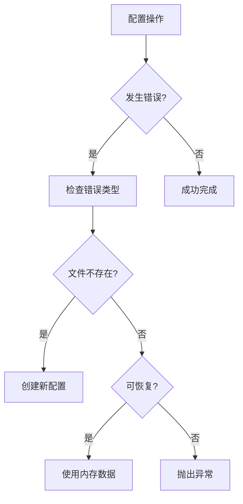
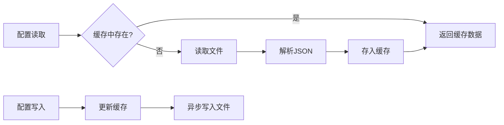

# 配置结构

<cite>
**本文档中引用的文件**  
- [default.json](file://config/default.json)
- [development.json](file://config/development.json)
- [production.json](file://config/production.json)
- [test.json](file://config/test.json)
- [config.main.ts](file://app/config.main.ts)
- [user_config.main.ts](file://app/user_config.main.ts)
- [base_config.node.ts](file://app/base_config.node.ts)
- [main.main.ts](file://app/main.main.ts)
- [environment.std.ts](file://ts/environment.std.ts)
</cite>

## 目录
1. [项目结构](#项目结构)
2. [核心配置组件](#核心配置组件)
3. [配置层次结构与字段定义](#配置层次结构与字段定义)
4. [配置存储与序列化](#配置存储与序列化)
5. [配置管理API](#配置管理api)
6. [配置初始化与生命周期](#配置初始化与生命周期)
7. [错误处理与验证](#错误处理与验证)
8. [性能优化策略](#性能优化策略)

## 项目结构

Signal-Desktop的配置系统由多个层次组成，包括应用级配置和用户级配置。应用级配置存储在`config/`目录中，包含不同环境的配置文件，而用户级配置存储在用户数据目录中。



**Diagram sources**
- [default.json](file://config/default.json)
- [development.json](file://config/development.json)
- [production.json](file://config/production.json)
- [test.json](file://config/test.json)

**Section sources**
- [config](file://config)
- [app](file://app)

## 核心配置组件

Signal-Desktop的配置系统由几个核心组件构成，包括配置管理器、用户配置处理器和基础配置服务。这些组件协同工作以提供完整的配置管理功能。

```mermaid
classDiagram
class ConfigManager {
+getEnvironment() Environment
+setEnvironment(env Environment, isMock boolean)
+parseEnvironment(env string) Environment
}
class UserConfig {
+get(keyPath string) unknown
+set(keyPath string, value unknown)
+remove()
+_getCachedValue() InternalConfigType
}
class BaseConfig {
+start(configOptions ConfigOptions) ConfigType
}
ConfigManager --> BaseConfig : "使用"
UserConfig --> BaseConfig : "继承"
BaseConfig --> "config.json" : "持久化"
```

**Diagram sources**
- [config.main.ts](file://app/config.main.ts)
- [user_config.main.ts](file://app/user_config.main.ts)
- [base_config.node.ts](file://app/base_config.node.ts)

**Section sources**
- [config.main.ts](file://app/config.main.ts#L1-L77)
- [user_config.main.ts](file://app/user_config.main.ts#L1-L51)
- [base_config.node.ts](file://app/base_config.node.ts#L1-L127)

## 配置层次结构与字段定义

Signal-Desktop的配置系统分为两个主要层次：应用配置和用户配置。应用配置包含服务器URL、CDN设置、安全参数等全局设置，而用户配置包含用户特定的偏好设置。

### 应用配置结构

应用配置定义了应用程序的全局行为和连接参数。主要配置文件包括：

- **default.json**: 默认配置，包含所有环境共享的设置
- **development.json**: 开发环境特定配置
- **production.json**: 生产环境特定配置
- **test.json**: 测试环境特定配置

```json
{
  "serverUrl": "https://chat.staging.signal.org",
  "storageUrl": "https://storage-staging.signal.org",
  "directoryUrl": "https://cdsi.staging.signal.org",
  "cdn": {
    "0": "https://cdn-staging.signal.org",
    "2": "https://cdn2-staging.signal.org",
    "3": "https://cdn3-staging.signal.org"
  },
  "updatesEnabled": false,
  "openDevTools": false
}
```

### 用户配置结构

用户配置存储在用户数据目录的`config.json`文件中，包含用户特定的设置，如窗口位置、账户信息和设备偏好。



**Section sources**
- [default.json](file://config/default.json#L1-L36)
- [production.json](file://config/production.json#L1-L24)
- [user_config.main.ts](file://app/user_config.main.ts#L39-L46)

## 配置存储与序列化

Signal-Desktop的配置系统采用JSON格式进行序列化和持久化存储。配置数据存储在两个主要位置：应用配置目录和用户数据目录。

### 存储位置

- **应用配置**: `config/` 目录下的JSON文件
- **用户配置**: 用户数据目录下的`config.json`文件

### 序列化格式

所有配置数据都以标准JSON格式存储，确保跨平台兼容性和可读性。



**Diagram sources**
- [base_config.node.ts](file://app/base_config.node.ts#L83-L86)
- [user_config.main.ts](file://app/user_config.main.ts#L40-L41)

**Section sources**
- [base_config.node.ts](file://app/base_config.node.ts#L1-L127)
- [user_config.main.ts](file://app/user_config.main.ts#L1-L51)

## 配置管理API

Signal-Desktop提供了完整的配置管理API，支持配置的读取、更新和持久化操作。

### API接口



### 同步与异步操作

配置管理支持同步和异步两种操作模式：

- **同步操作**: 用于启动时的配置读取和简单更新
- **异步操作**: 用于需要等待文件I/O完成的场景

```typescript
// 同步操作示例
const windowConfig = userConfig.get('window');
userConfig.set('window', newConfig);
userConfig.remove();

// 异步操作示例（通过IPC）
await window.Events.setZoomFactor(value);
await window.IPC.setMediaPermissions(value);
```

**Section sources**
- [base_config.node.ts](file://app/base_config.node.ts#L23-L26)
- [main.main.ts](file://app/main.main.ts#L411-L416)
- [Preferences.preload.tsx](file://ts/state/smart/Preferences.preload.tsx#L544-L559)

## 配置初始化与生命周期

Signal-Desktop的配置系统在应用程序启动时进行初始化，并在整个应用生命周期中管理配置状态。

### 初始化流程



### 生命周期管理

配置系统在应用程序的整个生命周期中持续管理配置状态：

1. **启动阶段**: 读取并解析配置文件
2. **运行阶段**: 处理配置变更并持久化
3. **关闭阶段**: 确保所有配置变更已保存

```typescript
// 配置初始化示例
export function start({
  name,
  targetPath,
  throwOnFilesystemErrors,
}: Readonly<{
  name: string;
  targetPath: string;
  throwOnFilesystemErrors: boolean;
}>): ConfigType {
  let cachedValue: InternalConfigType = Object.create(null);
  
  try {
    const incomingJson = readFileSync(targetPath, ENCODING);
    cachedValue = incomingJson ? JSON.parse(incomingJson) : undefined;
  } catch (error) {
    // 处理文件系统错误
    cachedValue = Object.create(null);
  }
  
  return {
    set: ourSet,
    get: ourGet,
    remove,
    _getCachedValue: () => cachedValue,
  };
}
```

**Diagram sources**
- [config.main.ts](file://app/config.main.ts#L19-L46)
- [user_config.main.ts](file://app/user_config.main.ts#L15-L34)

**Section sources**
- [config.main.ts](file://app/config.main.ts#L1-L77)
- [user_config.main.ts](file://app/user_config.main.ts#L1-L51)
- [main.main.ts](file://app/main.main.ts#L425-L450)

## 错误处理与验证

Signal-Desktop的配置系统包含完善的错误处理和验证机制，确保配置数据的完整性和可靠性。

### 错误处理策略



### 数据完整性约束

配置系统实施了多种数据完整性约束：

- **类型验证**: 确保配置值的类型正确
- **范围检查**: 验证数值在有效范围内
- **格式验证**: 确保字符串符合预期格式

```typescript
// 配置验证示例
export const windowConfigSchema = z.object({
  maximized: z.boolean().optional(),
  autoHideMenuBar: z.boolean().optional(),
  fullscreen: z.boolean().optional(),
  width: z.number(),
  height: z.number(),
  x: z.number(),
  y: z.number(),
});
```

**Section sources**
- [base_config.node.ts](file://app/base_config.node.ts#L54-L69)
- [main.main.ts](file://app/main.main.ts#L437-L445)

## 性能优化策略

Signal-Desktop的配置系统采用了多种性能优化策略，以提高配置管理的效率。

### 配置缓存策略

配置系统使用内存缓存来减少文件I/O操作：

- **读取缓存**: 配置数据在首次读取后缓存在内存中
- **写入缓冲**: 配置变更先更新内存缓存，再异步写入文件



### 惰性加载技术

配置系统采用惰性加载技术，只在需要时加载特定配置：

- **按需加载**: 只在首次访问时加载配置数据
- **延迟初始化**: 推迟配置系统的完全初始化直到必要时刻

```typescript
// 惰性加载示例
let windowConfig: WindowConfigType | undefined;
const windowConfigParsed = safeParseUnknown(
  windowConfigSchema,
  windowFromEphemeral || windowFromUserConfig
);
if (windowConfigParsed.success) {
  windowConfig = windowConfigParsed.data;
}
```

**Section sources**
- [base_config.node.ts](file://app/base_config.node.ts#L40-L41)
- [main.main.ts](file://app/main.main.ts#L438-L445)