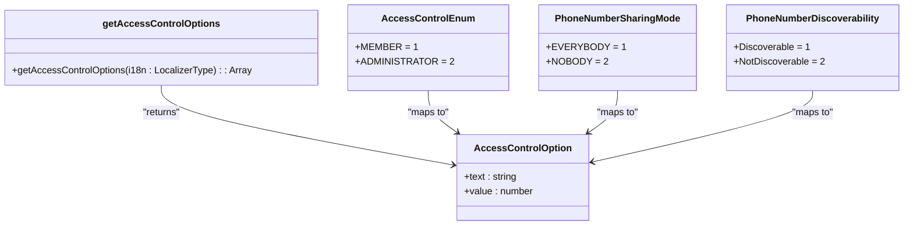
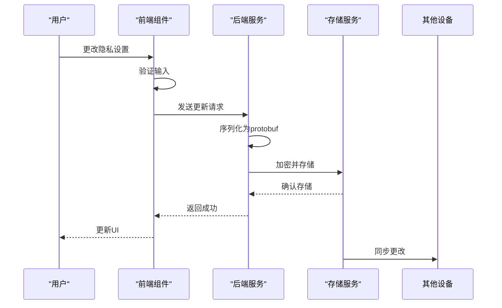

# 隐私设置

<cite>
**本文档引用的文件**   
- [privacy.js](file://ts\util\privacy.js)
- [privacy.node.ts](file://ts\util\privacy.node.ts)
- [Preferences.dom.tsx](file://ts\components\Preferences.dom.tsx)
- [getAccessControlOptions.std.ts](file://ts\util\getAccessControlOptions.std.ts)
- [SignalStorage.proto](file://protos\SignalStorage.proto)
- [SignalService.proto](file://protos\SignalService.proto)
</cite>

## 目录
1. [简介](#简介)
2. [核心隐私配置项](#核心隐私配置项)
3. [访问控制机制](#访问控制机制)
4. [存储与传输安全](#存储与传输安全)
5. [数据库模式](#数据库模式)
6. [操作接口与缓存策略](#操作接口与缓存策略)
7. [代码集成示例](#代码集成示例)

## 简介
Signal-Desktop的隐私设置功能为用户提供了一套全面的隐私保护机制，涵盖消息可见性、联系人发现、群组添加权限等核心属性。该系统通过加密存储、安全传输和严格的访问控制来保护用户数据。隐私设置的实现分布在多个组件中，包括前端UI组件、后端服务和协议定义文件。系统使用protobuf定义数据结构，并通过React组件实现用户界面。隐私数据的敏感信息在日志记录和显示时会被自动脱敏处理，确保用户隐私不被泄露。

**Section sources**
- [Preferences.dom.tsx](file://ts\components\Preferences.dom.tsx#L1894-L1898)
- [SignalStorage.proto](file://protos\SignalStorage.proto#L1-L20)

## 核心隐私配置项
Signal-Desktop的隐私设置包含多个核心配置项，每个配置项都有明确的数据类型和默认值策略。消息可见性设置控制消失消息的计时器，数据类型为无符号整数，单位为秒，支持的值包括关闭（0）、3秒、30秒、1分钟、5分钟、30分钟、1小时、6小时和自定义值。联系人发现设置包含两个相关配置：电话号码共享模式（PhoneNumberSharingMode）和电话号码可发现性（PhoneNumberDiscoverability）。前者控制用户的电话号码对谁可见，后者控制谁可以通过电话号码搜索到用户。群组添加权限通过访问控制机制实现，允许管理员或所有成员添加新成员。故事（Stories）隐私设置允许用户控制谁可以查看其故事，支持全部联系人、信号连接（Signal Connections）或自定义列表。所有隐私配置项在用户首次使用时都有明确的默认值，例如消息已读回执和输入指示器默认启用，而电话号码共享默认为所有人可见。

**Section sources**
- [Preferences.dom.tsx](file://ts\components\Preferences.dom.tsx#L1694-L1731)
- [Preferences.dom.tsx](file://ts\components\Preferences.dom.tsx#L2083-L2190)
- [SignalStorage.proto](file://protos\SignalStorage.proto#L266-L267)

## 访问控制机制
Signal-Desktop的访问控制机制基于枚举类型实现，为不同的隐私属性提供标准化的权限选项。核心访问控制逻辑在`getAccessControlOptions`函数中定义，该函数返回一个包含文本标签和数值的选项数组。对于群组访问控制，系统提供两个选项：所有成员（值为1）和仅管理员（值为2），这些值对应于protobuf定义中的`AccessControl.AccessRequired`枚举。电话号码发现的访问控制使用`PhoneNumberDiscoverability`枚举，包含可发现（Discoverable）和不可发现（NotDiscoverable）两种状态。系统在用户尝试更改敏感设置时会显示确认对话框，例如当用户尝试将电话号码可发现性设置为"无人"时，会弹出确认模态框以防止误操作。访问控制的验证逻辑在前端组件中实现，通过条件渲染和禁用状态来确保用户不能选择冲突的设置组合，例如当电话号码共享设置为"所有人"时，电话号码可发现性设置为"无人"的选项会被禁用。



**Diagram sources **
- [getAccessControlOptions.std.ts](file://ts\util\getAccessControlOptions.std.ts#L7-L27)
- [SignalStorage.proto](file://protos\SignalStorage.proto#L186-L190)

**Section sources**
- [getAccessControlOptions.std.ts](file://ts\util\getAccessControlOptions.std.ts#L1-L28)
- [Preferences.dom.tsx](file://ts\components\Preferences.dom.tsx#L2114-L2154)

## 存储与传输安全
Signal-Desktop的隐私设置在存储和传输过程中采用多重安全机制来保护用户数据。存储安全基于protobuf定义的`AccountRecord`消息，该消息包含所有隐私相关字段，如`readReceipts`、`typingIndicators`和`phoneNumberSharingMode`。这些数据在本地数据库中加密存储，并通过Signal的同步服务在设备间安全同步。传输安全通过端到端加密实现，隐私设置的变更作为同步消息发送，使用与普通消息相同的加密协议。系统对敏感信息实施严格的脱敏策略，在日志记录和错误报告中自动红acted电话号码、UUID、群组ID等标识符。`privacy.js`文件定义了多个红acting函数，如`redactPhoneNumbers`、`redactUuids`和`redactGroupIds`，这些函数使用正则表达式模式匹配并替换敏感信息。默认值策略在`AccountRecord`的字段定义中体现，例如`readReceipts`和`typingIndicators`字段的默认值为true，而`phoneNumberSharingMode`的默认值为`EVERYBODY`。系统还实现了路径红acting功能，可以自动识别和红acting日志中的文件路径，防止敏感文件位置信息泄露。



**Diagram sources **
- [SignalStorage.proto](file://protos\SignalStorage.proto#L255-L304)
- [privacy.node.ts](file://ts\util\privacy.node.ts#L19-L31)
- [Preferences.dom.tsx](file://ts\components\Preferences.dom.tsx#L1749-L1762)

**Section sources**
- [SignalStorage.proto](file://protos\SignalStorage.proto#L14-L304)
- [privacy.node.ts](file://ts\util\privacy.node.ts#L1-L244)

## 数据库模式
Signal-Desktop的隐私设置数据库模式基于Protocol Buffers定义，核心结构位于`SignalStorage.proto`文件中的`AccountRecord`消息。该消息包含所有用户级别的隐私配置，每个字段都有明确的数据类型和编号。布尔类型字段如`readReceipts`（字段编号6）、`sealedSenderIndicators`（字段编号7）和`typingIndicators`（字段编号8）用于控制消息功能的启用状态。枚举类型字段`phoneNumberSharingMode`（字段编号12）使用`PhoneNumberSharingMode`枚举，定义了电话号码共享的策略。整数类型字段`universalExpireTimer`（字段编号17）存储消失消息的全局计时器值，单位为秒。系统还支持可选字段，如`backupTier`（字段编号40）使用optional关键字，表示该值可能不存在。数据库模式设计遵循向后兼容原则，通过保留字段编号（reserved）来防止未来版本冲突。`AccountRecord`消息与其他记录类型（如`ContactRecord`和`GroupV2Record`）一起构成完整的存储清单，确保所有用户数据的一致性和完整性。

```mermaid
erDiagram
ACCOUNT_RECORD {
bytes profileKey PK
string givenName
string familyName
string avatarUrlPath
bool noteToSelfArchived
bool readReceipts
bool sealedSenderIndicators
bool typingIndicators
PhoneNumberSharingMode phoneNumberSharingMode
bool unlistedPhoneNumber
uint32 universalExpireTimer
repeated string preferredReactionEmoji
bool storiesDisabled
OptionalBool storyViewReceiptsEnabled
}
CONTACT_RECORD {
string aci PK
string e164
string pni
bytes profileKey
bytes identityKey
IdentityState identityState
string givenName
string familyName
string username
bool blocked
bool whitelisted
bool archived
uint64 mutedUntilTimestamp
}
GROUP_V2_RECORD {
bytes masterKey PK
bool blocked
bool whitelisted
bool archived
uint64 mutedUntilTimestamp
StorySendMode storySendMode
}
ACCOUNT_RECORD ||--o{ CONTACT_RECORD : "拥有"
ACCOUNT_RECORD ||--o{ GROUP_V2_RECORD : "拥有"
```

**Diagram sources **
- [SignalStorage.proto](file://protos\SignalStorage.proto#L255-L304)
- [SignalStorage.proto](file://protos\SignalStorage.proto#L109-L147)
- [SignalStorage.proto](file://protos\SignalStorage.proto#L159-L177)

**Section sources**
- [SignalStorage.proto](file://protos\SignalStorage.proto#L1-L406)

## 操作接口与缓存策略
Signal-Desktop的隐私设置提供了一套完整的增删改查操作接口和高效的缓存更新策略。主要操作接口在`Preferences.dom.tsx`组件中实现，通过事件处理器函数处理用户交互。例如，`onUniversalExpireTimerChange`函数处理消失消息计时器的更新，`onWhoCanSeeMeChange`函数处理电话号码共享模式的更改。这些函数在更新本地状态后，会触发相应的服务调用以持久化更改。系统采用观察者模式实现缓存更新，当隐私设置发生变化时，会通知所有依赖该设置的组件进行重新渲染。性能优化方面，系统对频繁访问的隐私设置进行内存缓存，避免重复的数据库查询。对于复杂的隐私规则验证，系统在用户界面层面实现即时反馈，例如当用户选择冲突的隐私选项时，相关控件会立即变为禁用状态。业务约束通过条件逻辑在前端强制执行，如当电话号码共享设置为"所有人"时，电话号码可发现性不能设置为"无人"。系统还实现了防抖（debounce）机制，对于可能频繁触发的设置更改（如媒体自动下载选项），会合并多次更改请求以减少网络和存储开销。

**Section sources**
- [Preferences.dom.tsx](file://ts\components\Preferences.dom.tsx#L1715-L1725)
- [Preferences.dom.tsx](file://ts\components\Preferences.dom.tsx#L2096-L2108)
- [Preferences.dom.tsx](file://ts\components\Preferences.dom.tsx#L1910-L1913)

## 代码集成示例
Signal-Desktop的隐私设置功能通过多个代码模块协同工作，展示了完整的集成方式。前端UI组件`Preferences.dom.tsx`负责渲染隐私设置界面，使用`SettingsRow`和`Checkbox`等UI组件构建用户界面。当用户更改设置时，事件处理器会调用相应的服务方法。例如，更改消失消息计时器会触发`onUniversalExpireTimerChange`函数，该函数最终会更新`AccountRecord`中的`universalExpireTimer`字段。隐私验证逻辑分散在多个文件中：`privacy.js`提供通用的敏感信息脱敏功能，`getAccessControlOptions.std.ts`提供访问控制选项的本地化文本，而具体的业务规则则在组件的渲染逻辑中实现。与其他安全功能的集成通过共享状态和服务实现，例如内容保护（Content Protection）设置与应用级别的安全策略集成，而联系人发现设置与Signal的联系人同步服务集成。系统使用`i18n`函数实现多语言支持，确保隐私设置的文本标签能够根据用户语言环境正确显示。整个隐私设置系统体现了Signal-Desktop对用户隐私的高度重视，通过分层设计和严格的安全措施，为用户提供了一个既强大又易用的隐私控制界面。

**Section sources**
- [Preferences.dom.tsx](file://ts\components\Preferences.dom.tsx#L1894-L1898)
- [privacy.node.ts](file://ts\util\privacy.node.ts#L1-L244)
- [getAccessControlOptions.std.ts](file://ts\util\getAccessControlOptions.std.ts#L1-L28)