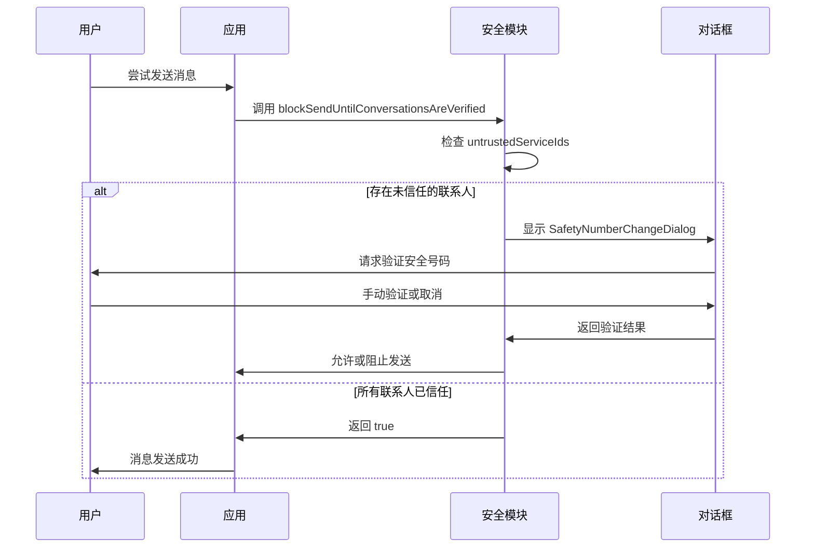
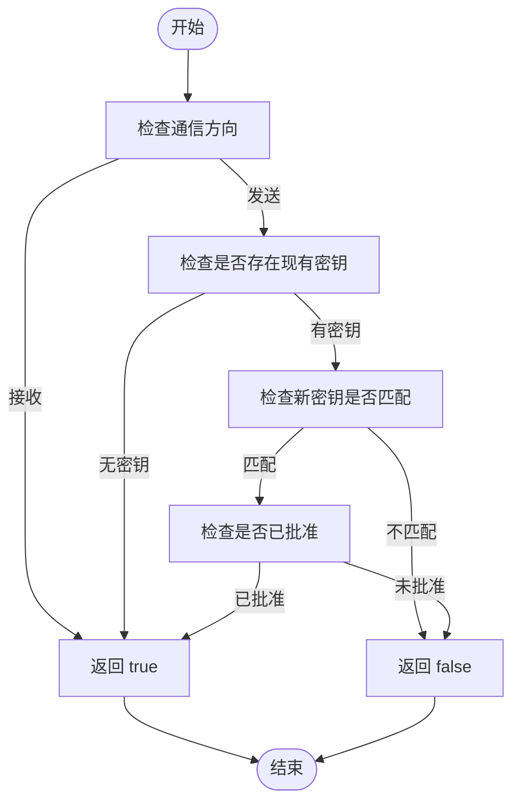
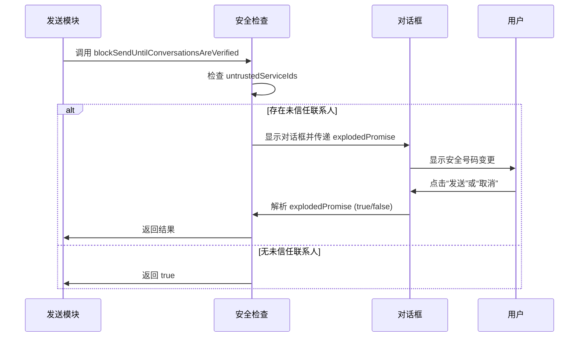
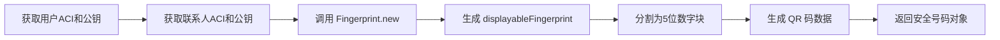

# 信任状态

<cite>
**本文档引用的文件**  
- [SafetyNumberViewer.dom.tsx](file://ts/components/SafetyNumberViewer.dom.tsx)
- [SafetyNumberChangeDialog.dom.tsx](file://ts/components/SafetyNumberChangeDialog.dom.tsx)
- [safetyNumber.preload.ts](file://ts/state/ducks/safetyNumber.preload.ts)
- [conversations.preload.ts](file://ts/models/conversations.preload.ts)
- [SignalProtocolStore.preload.ts](file://ts/SignalProtocolStore.preload.ts)
- [safetyNumber.preload.ts](file://ts/util/safetyNumber.preload.ts)
- [contactVerification.dom.ts](file://ts/shims/contactVerification.dom.ts)
- [blockSendUntilConversationsAreVerified.dom.ts](file://ts/util/blockSendUntilConversationsAreVerified.dom.ts)
- [contactSpoofing.std.ts](file://ts/util/contactSpoofing.std.ts)
- [SendAnywayDialog.preload.tsx](file://ts/state/smart/SendAnywayDialog.preload.tsx)
</cite>

## 目录
1. [引言](#引言)
2. [信任状态定义与分类](#信任状态定义与分类)
3. [信任状态管理机制](#信任状态管理机制)
4. [信任状态对消息显示与功能的影响](#信任状态对消息显示与功能的影响)
5. [自动评估算法](#自动评估算法)
6. [用户手动确认流程](#用户手动确认流程)
7. [跨设备同步策略](#跨设备同步策略)
8. [防欺骗机制与联系人验证](#防欺骗机制与联系人验证)
9. [风险评估模型](#风险评估模型)
10. [信任状态变更检测与通知](#信任状态变更检测与通知)
11. [信任状态计算与应用](#信任状态计算与应用)
12. [结论](#结论)

## 引言
Signal-Desktop 的信任状态系统是其端到端加密通信安全性的核心。该系统通过“安全号码”（Safety Number）和“信任验证”机制，确保用户与联系人之间的通信链路未被中间人攻击。当联系人的加密密钥发生变化时，系统会检测到潜在风险，并通过对话框提示用户进行验证。本文档将深入解析信任状态的实现机制，包括其定义、分类、管理流程以及对用户体验的影响。

## 信任状态定义与分类
Signal-Desktop 的信任状态主要分为两种：**已验证**（Verified）和**未验证**（Unverified）。一个联系人的信任状态由其公钥的验证情况决定。当用户手动确认了联系人的安全号码后，该联系人即被标记为“已验证”。系统还通过 `isUntrusted` 方法来判断联系人是否处于不信任状态，这通常发生在密钥发生变化且未被用户确认时。

**Section sources**
- [conversations.preload.ts](file://ts/models/conversations.preload.ts#L3147-L3179)
- [SafetyNumberViewer.dom.tsx](file://ts/components/SafetyNumberViewer.dom.tsx#L109-L118)

## 信任状态管理机制
信任状态的管理通过 Redux 状态管理器实现。`safetyNumber` 模块维护了一个包含所有联系人信任状态的全局状态。该状态包含每个联系人的安全号码、是否发生变化以及验证是否被禁用等信息。状态的更新通过一系列 action 触发，如 `TOGGLE_VERIFIED_PENDING` 和 `TOGGLE_VERIFIED_FULFILLED`，这些 action 会更新 Redux store 中的相应数据。

```mermaid
classDiagram
class SafetyNumberStateType {
contacts : { [key : string] : SafetyNumberContactType }
}
class SafetyNumberContactType {
safetyNumber : SafetyNumberType
safetyNumberChanged? : boolean
verificationDisabled : boolean
}
class SafetyNumberActionType {
<<enumeration>>
CLEAR_SAFETY_NUMBER
GENERATE_FULFILLED
TOGGLE_VERIFIED_FULFILLED
TOGGLE_VERIFIED_PENDING
}
SafetyNumberStateType --> SafetyNumberContactType : "包含"
SafetyNumberStateType --> SafetyNumberActionType : "响应"
```

**Diagram sources**
- [safetyNumber.preload.ts](file://ts/state/ducks/safetyNumber.preload.ts#L31-L78)

**Section sources**
- [safetyNumber.preload.ts](file://ts/state/ducks/safetyNumber.preload.ts#L31-L253)

## 信任状态对消息显示与功能的影响
信任状态直接影响消息的发送和功能的可用性。当系统检测到一个或多个联系人的密钥已更改且未被验证时，会阻止消息的发送，并弹出 `SafetyNumberChangeDialog` 对话框。用户必须手动审查这些更改，否则无法继续发送消息。此机制确保了在潜在安全风险存在时，用户不会无意中发送敏感信息。



**Diagram sources**
- [blockSendUntilConversationsAreVerified.dom.ts](file://ts/util/blockSendUntilConversationsAreVerified.dom.ts#L36-L48)
- [SafetyNumberChangeDialog.dom.tsx](file://ts/components/SafetyNumberChangeDialog.dom.tsx#L85-L200)

## 自动评估算法
系统的自动评估算法基于 Signal 协议的加密原理。当接收到新消息时，`SignalProtocolStore` 会调用 `isTrustedIdentity` 方法来验证发送方的身份。该方法根据通信方向（发送或接收）和本地存储的公钥记录来判断信任状态。对于接收方向，系统总是信任；对于发送方向，系统会检查公钥是否匹配且已被用户批准。



**Diagram sources**
- [SignalProtocolStore.preload.ts](file://ts/SignalProtocolStore.preload.ts#L1935-L1977)

## 用户手动确认流程
用户手动确认流程通过 `SafetyNumberViewer` 组件实现。用户可以在此界面查看联系人的安全号码（以数字块形式显示），并与对方通过其他安全渠道（如面对面）核对。核对无误后，用户点击“验证”按钮，触发 `toggleVerified` 操作，将联系人标记为已验证。

**Section sources**
- [SafetyNumberViewer.dom.tsx](file://ts/components/SafetyNumberViewer.dom.tsx#L110-L118)
- [contactVerification.dom.ts](file://ts/shims/contactVerification.dom.ts#L4-L8)

## 跨设备同步策略
信任状态的同步依赖于 Signal 的账户系统。用户的验证状态存储在本地数据库中，并通过账户的 ACI（Account Identifier）进行关联。当用户在新设备上登录时，其联系人列表和部分元数据会被同步，但信任状态（如安全号码的验证）通常需要用户在新设备上重新确认，以确保安全性。

## 防欺骗机制与联系人验证
系统包含防联系人欺骗（Contact Spoofing）机制。当检测到多个联系人具有相同名称时，会触发 `ContactSpoofingReviewDialog`，提示用户审查这些联系人，防止恶意用户通过相似名称进行伪装。此机制通过 `ContactSpoofingType` 枚举定义了不同类型的欺骗场景。

**Section sources**
- [contactSpoofing.std.ts](file://ts/util/contactSpoofing.std.ts#L4-L7)
- [ContactSpoofingReviewDialog.dom.tsx](file://ts/components/conversation/ContactSpoofingReviewDialog.dom.tsx#L76-L247)

## 风险评估模型
风险评估模型的核心是 `isUntrusted` 方法。该方法不仅检查密钥是否变化，还允许传入一个时间戳阈值，用于判断在特定时间范围内是否发生过不信任的变更。这为系统提供了更细粒度的风险控制能力，例如在批量发送消息前进行安全检查。

**Section sources**
- [conversations.preload.ts](file://ts/models/conversations.preload.ts#L3157-L3179)

## 信任状态变更检测与通知
信任状态的变更检测由 `blockSendUntilConversationsAreVerified` 函数触发。当检测到未信任的联系人时，该函数会创建一个 `explodedPromise` 并显示 `SafetyNumberChangeDialog`。用户与对话框的交互（确认或取消）会解析这个 promise，从而决定消息是否继续发送。这种机制实现了阻塞式的安全检查。



**Diagram sources**
- [blockSendUntilConversationsAreVerified.dom.ts](file://ts/util/blockSendUntilConversationsAreVerified.dom.ts#L36-L48)
- [SendAnywayDialog.preload.tsx](file://ts/state/smart/SendAnywayDialog.preload.tsx#L23-L99)

## 信任状态计算与应用
信任状态的计算始于 `generateSafetyNumber` 工具函数。该函数使用 LibSignal-Client 库，结合用户自身和联系人的 ACI（账户标识符）及公钥，生成一个唯一的指纹（Fingerprint）。这个指纹被格式化为可读的数字块和 QR 码，供用户验证。一旦验证完成，`toggleVerified` 操作会更新本地存储中的信任状态。



**Diagram sources**
- [safetyNumber.preload.ts](file://ts/util/safetyNumber.preload.ts#L23-L74)

**Section sources**
- [safetyNumber.preload.ts](file://ts/util/safetyNumber.preload.ts#L23-L74)
- [conversations.preload.ts](file://ts/models/conversations.preload.ts#L3128-L3145)

## 结论
Signal-Desktop 的信任状态系统是一个多层次、深度集成的安全框架。它结合了自动化的加密密钥验证和用户手动的安全号码核对，为端到端加密通信提供了强大的安全保障。通过 Redux 状态管理和阻塞式对话框，系统确保了在任何潜在风险下，用户都能被及时告知并做出知情决策。该设计体现了 Signal 在安全性和用户体验之间取得的精妙平衡。