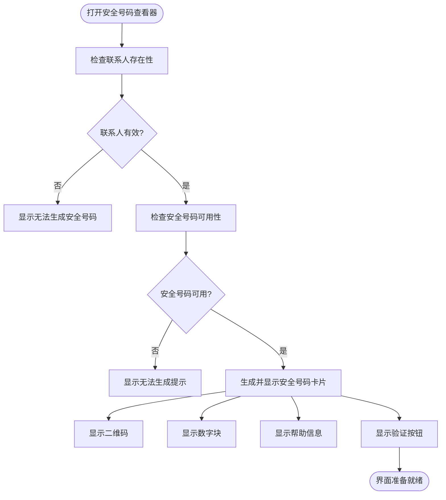
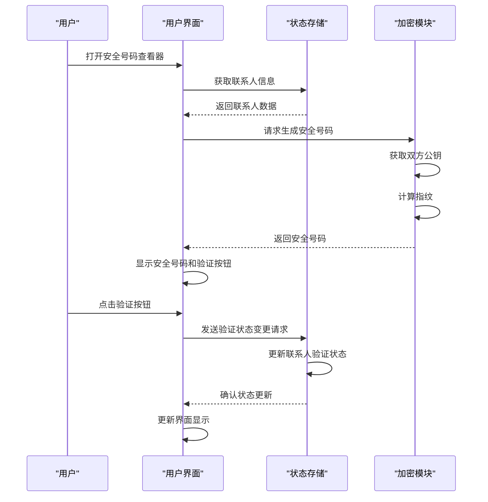
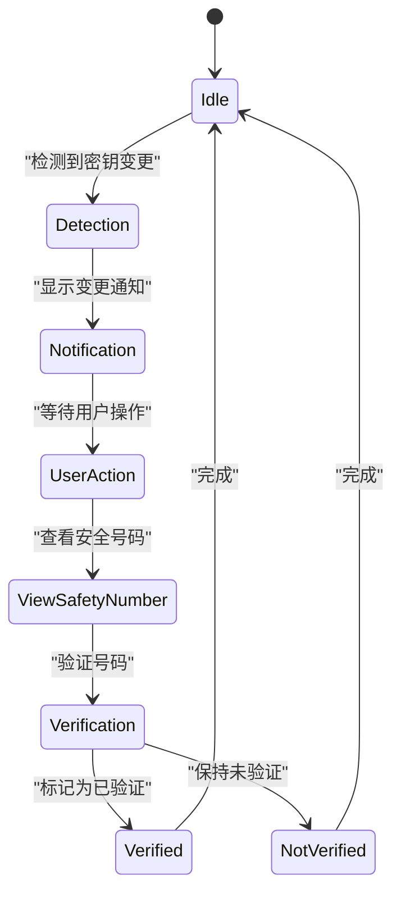
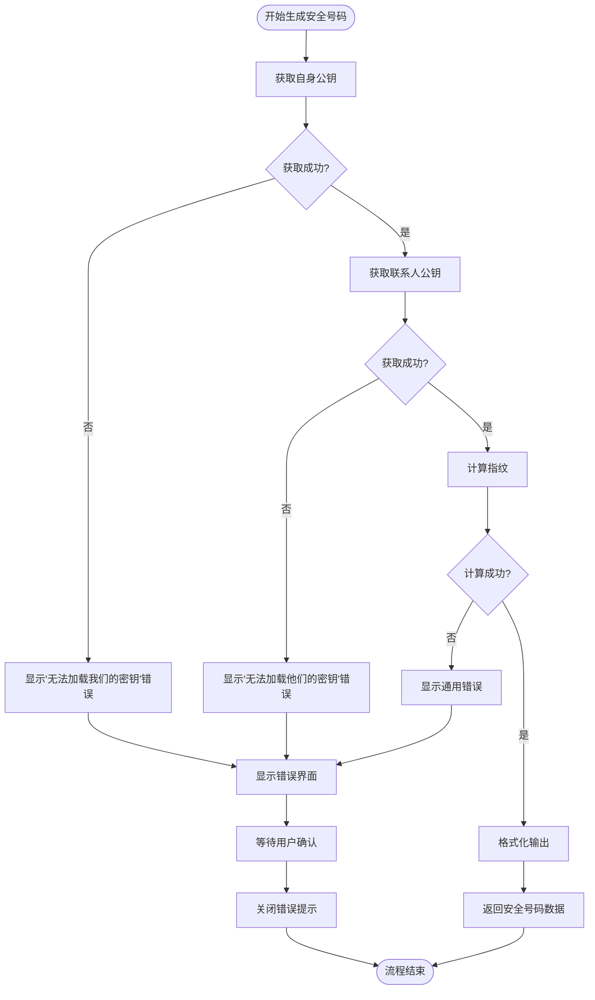
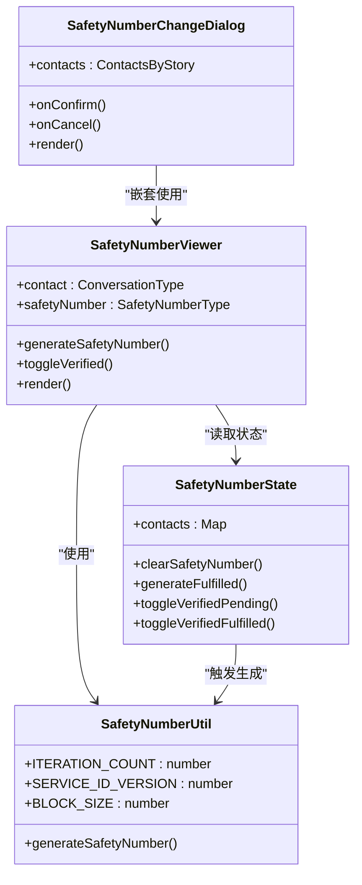

# 安全号码

<cite>
**本文档中引用的文件**  
- [SafetyNumberViewer.dom.tsx](file://ts/components/SafetyNumberViewer.dom.tsx)
- [safetyNumber.preload.ts](file://ts/state/ducks/safetyNumber.preload.ts)
- [safetyNumber.preload.ts](file://ts/util/safetyNumber.preload.ts)
- [SafetyNumberChangeDialog.dom.tsx](file://ts/components/SafetyNumberChangeDialog.dom.tsx)
- [SafetyNumberChangeSource.std.ts](file://ts/types/SafetyNumberChangeSource.std.ts)
- [isSafetyNumberNotAvailable.std.ts](file://ts/util/isSafetyNumberNotAvailable.std.ts)
- [safetyNumber.std.ts](file://ts/types/safetyNumber.std.ts)
- [SafetyNumberViewer.preload.tsx](file://ts/state/smart/SafetyNumberViewer.preload.tsx)
- [conversation/SafetyNumberNotification.dom.tsx](file://ts/components/conversation/SafetyNumberNotification.dom.tsx)
- [messages.json](file://_locales/zh-CN/messages.json)
</cite>

## 目录
1. [简介](#简介)
2. [安全号码生成算法](#安全号码生成算法)
3. [显示格式与用户界面](#显示格式与用户界面)
4. [验证机制与身份确认](#验证机制与身份确认)
5. [变更检测与通知流程](#变更检测与通知流程)
6. [本地存储与跨设备同步](#本地存储与跨设备同步)
7. [隐私保护措施](#隐私保护措施)
8. [错误处理与恢复流程](#错误处理与恢复流程)
9. [代码实现分析](#代码实现分析)

## 简介
安全号码是Signal应用中用于验证联系人身份和端到端加密密钥一致性的关键安全功能。它通过生成一个唯一的数字指纹，允许用户通过比较安全号码来确认通信双方的加密密钥是否匹配，从而防止中间人攻击。本文档详细说明了安全号码的生成、显示、验证、存储和变更处理机制。

**Section sources**
- [SafetyNumberViewer.dom.tsx](file://ts/components/SafetyNumberViewer.dom.tsx#L41-L122)
- [messages.json](file://_locales/zh-CN/messages.json#L1489-L1531)

## 安全号码生成算法
安全号码基于Signal协议的加密原理生成，使用双棘轮算法和指纹协议来创建一个唯一的数字指纹。生成过程涉及以下核心步骤：

1. **密钥获取**：从本地协议存储中获取当前用户和联系人的身份公钥
2. **指纹计算**：使用libsignal-client库中的Fingerprint类，结合双方的ACI（账户标识符）、公钥和服务ID版本进行计算
3. **迭代处理**：采用5200次迭代的密钥派生过程增强安全性
4. **格式化输出**：将生成的指纹转换为可读的数字块序列和二维码数据

生成算法确保了即使攻击者能够拦截通信，也无法伪造有效的安全号码，因为这需要访问双方的私钥。

**Section sources**
- [safetyNumber.preload.ts](file://ts/util/safetyNumber.preload.ts#L1-L74)
- [safetyNumber.std.ts](file://ts/types/safetyNumber.std.ts#L1-L8)

## 显示格式与用户界面
安全号码在用户界面中以两种形式展示：数字块和二维码。

### 数字块格式
- 安全号码被分割为12个5位数字块
- 每个块之间用空格分隔，便于用户口头核对
- 例如：`12345 67890 12345 67890 ...`

### 二维码格式
- 包含完整的可扫描指纹数据
- 允许用户通过摄像头扫描快速验证

### 用户界面组件
- **安全号码查看器**：显示联系人的安全号码和验证状态
- **验证按钮**：允许用户标记联系人为已验证或清除验证状态
- **帮助链接**：提供关于安全号码的详细说明文档链接

**Diagram sources**
- [SafetyNumberViewer.dom.tsx](file://ts/components/SafetyNumberViewer.dom.tsx#L41-L122)

**Section sources**
- [SafetyNumberViewer.dom.tsx](file://ts/components/SafetyNumberViewer.dom.tsx#L41-L122)
- [messages.json](file://_locales/zh-CN/messages.json#L1489-L1531)

## 验证机制与身份确认
安全号码的验证机制允许用户确认通信对方的身份真实性。

### 验证流程
1. 用户打开联系人的安全号码查看器
2. 通过安全通道（如面对面或语音通话）比较双方显示的安全号码
3. 如果号码匹配，点击"标记为已验证"按钮
4. 系统将联系人标记为已验证状态，并在界面中显示验证标识

### 反向验证
当用户验证联系人时，系统会自动触发一个安全事件，通知对方他们已被验证。这有助于建立双向信任关系。

### 验证状态管理
- 已验证：显示绿色验证标识
- 未验证：显示中性状态
- 验证已清除：恢复到未验证状态

**Diagram sources**
- [safetyNumber.preload.ts](file://ts/state/ducks/safetyNumber.preload.ts#L34-L83)
- [SafetyNumberViewer.preload.tsx](file://ts/state/smart/SafetyNumberViewer.preload.tsx#L1-L39)

**Section sources**
- [safetyNumber.preload.ts](file://ts/state/ducks/safetyNumber.preload.ts#L34-L83)
- [SafetyNumberViewer.preload.tsx](file://ts/state/smart/SafetyNumberViewer.preload.tsx#L1-L39)

## 变更检测与通知流程
当联系人的加密密钥发生变化时，系统会检测到安全号码变更并通知用户。

### 变更检测源
根据`SafetyNumberChangeSource`枚举，安全号码变更可能由以下操作触发：
- 发起通话 (InitiateCall)
- 加入通话 (JoinCall)
- 发送消息 (MessageSend)
- 查看故事 (Story)

### 通知流程
1. 系统检测到联系人的身份密钥发生变化
2. 在消息列表中显示安全号码变更通知
3. 用户点击通知后，打开安全号码查看器进行验证
4. 对于批量变更，显示安全号码变更对话框，允许用户逐一验证

### 用户确认流程
- 单个联系人变更：直接显示变更通知
- 多个联系人变更：进入审查模式，用户需要逐一确认
- 超过5个联系人变更：需要显式审查模式，防止批量确认风险

**Diagram sources**
- [SafetyNumberChangeDialog.dom.tsx](file://ts/components/SafetyNumberChangeDialog.dom.tsx#L30-L35)
- [conversation/SafetyNumberNotification.dom.tsx](file://ts/components/conversation/SafetyNumberNotification.dom.tsx#L52-L76)

**Section sources**
- [SafetyNumberChangeSource.std.ts](file://ts/types/SafetyNumberChangeSource.std.ts#L1-L9)
- [SafetyNumberChangeDialog.dom.tsx](file://ts/components/SafetyNumberChangeDialog.dom.tsx#L30-L35)
- [conversation/SafetyNumberNotification.dom.tsx](file://ts/components/conversation/SafetyNumberNotification.dom.tsx#L52-L76)

## 本地存储与跨设备同步
安全号码相关数据在本地设备上安全存储，并通过Signal的同步机制在用户设备间保持一致。

### 本地存储策略
- 安全号码本身不直接存储，而是按需从加密密钥重新计算
- 验证状态存储在本地数据库中，与联系人记录关联
- 使用加密存储保护敏感信息

### 同步机制
- 验证状态通过Signal的存储服务在设备间同步
- 每个设备独立计算安全号码，确保一致性
- 同步过程使用端到端加密保护

### 存储位置
- 联系人验证状态：本地数据库
- 身份密钥：加密密钥库
- 临时安全号码数据：内存中按需生成

**Section sources**
- [safetyNumber.preload.ts](file://ts/state/ducks/safetyNumber.preload.ts#L137-L192)
- [shims/storage.preload.ts](file://ts/shims/storage.preload.ts#L1-L17)

## 隐私保护措施
安全号码系统设计了多项隐私保护措施，确保用户信息安全。

### 条件性可用性
- 安全号码仅在联系人具有有效ACI（账户标识符）时可用
- 使用`isSafetyNumberNotAvailable`函数检查可用性
- 防止对无效或不完整联系人生成安全号码

### 数据最小化
- 仅在需要时生成安全号码
- 不存储原始指纹数据
- 内存中的敏感数据及时清理

### 访问控制
- 安全号码查看需要用户主动触发
- 验证状态变更需要明确的用户操作
- 敏感操作都有明确的用户确认

**Section sources**
- [isSafetyNumberNotAvailable.std.ts](file://ts/util/isSafetyNumberNotAvailable.std.ts#L1-L17)
- [safetyNumber.preload.ts](file://ts/util/safetyNumber.preload.ts#L7-L13)

## 错误处理与恢复流程
系统实现了完善的错误处理机制，确保安全号码功能的可靠性和用户体验。

### 常见错误场景
- 无法获取自身密钥
- 无法获取联系人密钥
- 联系人信息不完整
- 加密计算失败

### 错误处理策略
- 显示用户友好的错误消息
- 提供"确定"按钮关闭错误提示
- 记录详细错误日志用于调试
- 允许用户重试操作

### 恢复流程
1. 检测到错误条件
2. 显示适当的错误界面
3. 用户确认后关闭错误提示
4. 用户可重新尝试生成安全号码

**Diagram sources**
- [safetyNumber.preload.ts](file://ts/util/safetyNumber.preload.ts#L42-L48)
- [SafetyNumberViewer.dom.tsx](file://ts/components/SafetyNumberViewer.dom.tsx#L48-L63)

**Section sources**
- [safetyNumber.preload.ts](file://ts/util/safetyNumber.preload.ts#L42-L48)
- [SafetyNumberViewer.dom.tsx](file://ts/components/SafetyNumberViewer.dom.tsx#L48-L63)

## 代码实现分析
本节分析安全号码功能的核心代码实现，展示关键组件之间的交互关系。

### 核心组件关系

**Diagram sources**
- [SafetyNumberViewer.dom.tsx](file://ts/components/SafetyNumberViewer.dom.tsx)
- [SafetyNumberChangeDialog.dom.tsx](file://ts/components/SafetyNumberChangeDialog.dom.tsx)
- [safetyNumber.preload.ts](file://ts/util/safetyNumber.preload.ts)
- [safetyNumber.preload.ts](file://ts/state/ducks/safetyNumber.preload.ts)

**Section sources**
- [SafetyNumberViewer.dom.tsx](file://ts/components/SafetyNumberViewer.dom.tsx)
- [SafetyNumberChangeDialog.dom.tsx](file://ts/components/SafetyNumberChangeDialog.dom.tsx)
- [safetyNumber.preload.ts](file://ts/util/safetyNumber.preload.ts)
- [safetyNumber.preload.ts](file://ts/state/ducks/safetyNumber.preload.ts)