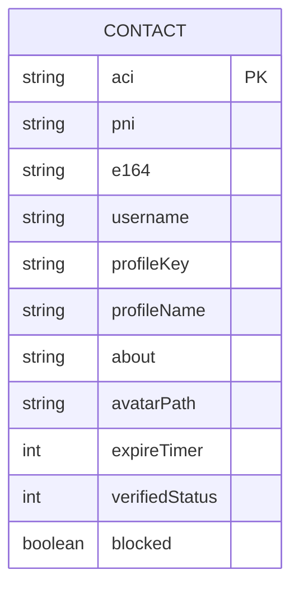
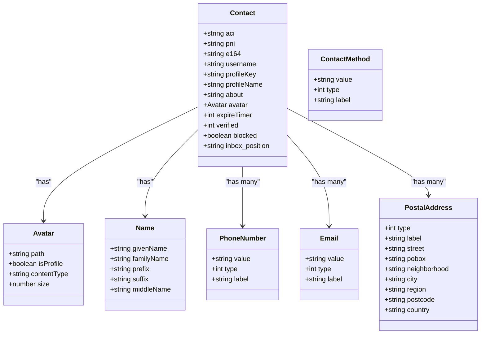
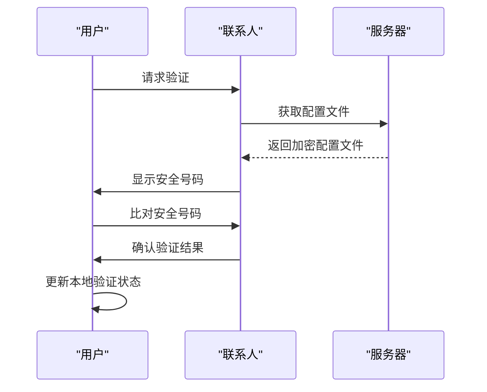
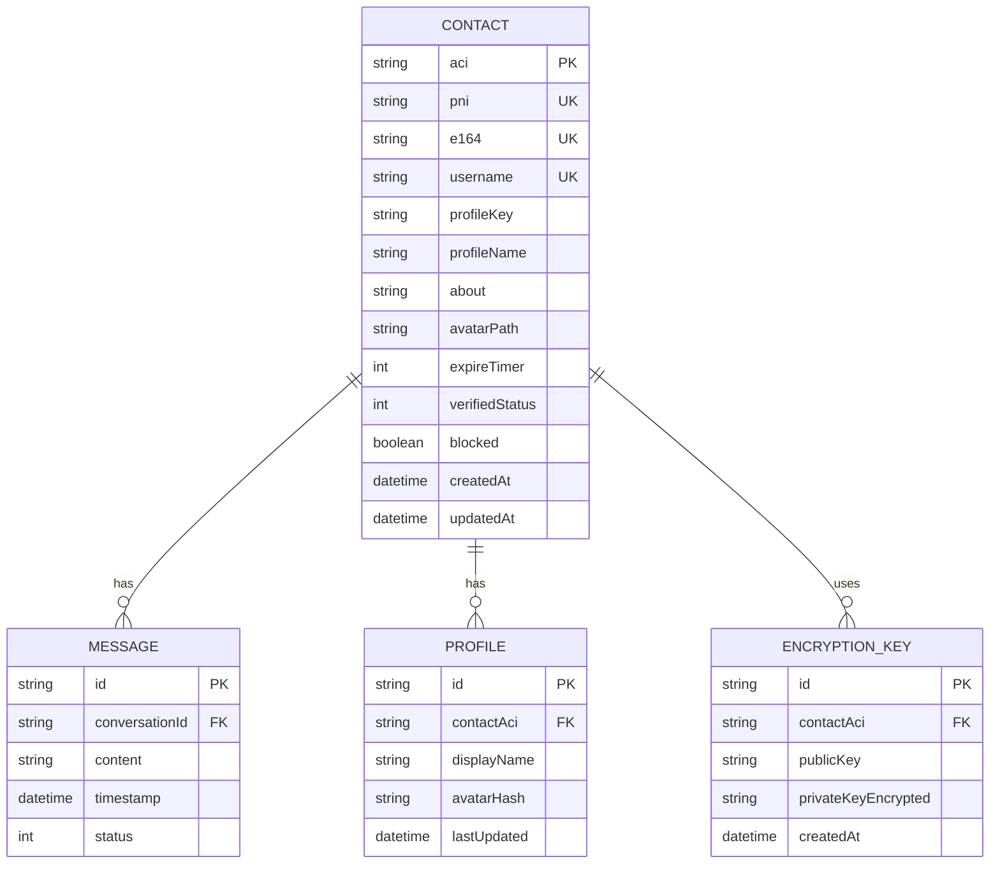
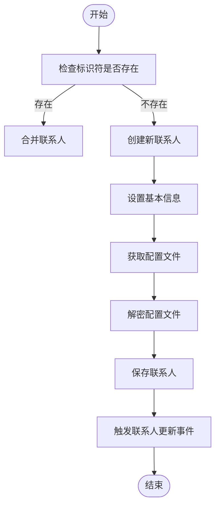

# 联系人模型

<cite>
**本文档中引用的文件**  
- [contactSync.preload.ts](file://ts/services/contactSync.preload.ts)
- [contactVerification.dom.ts](file://ts/shims/contactVerification.dom.ts)
- [contactSpoofing.std.ts](file://ts/util/contactSpoofing.std.ts)
- [contactUtil.js](file://ts/components/conversation/contactUtil.js)
- [conversations.preload.ts](file://ts/models/conversations.preload.ts)
- [export.preload.ts](file://ts/services/backups/export.preload.ts)
- [SendMessage.preload.ts](file://ts/textsecure/SendMessage.preload.ts)
- [ContactDetail.dom.stories.tsx](file://ts/components/conversation/ContactDetail.dom.stories.tsx)
- [81-contact-removed-notification.js](file://ts/sql/migrations/81-contact-removed-notification.js)
</cite>

## 目录
1. [简介](#简介)
2. [核心字段定义](#核心字段定义)
3. [身份标识系统](#身份标识系统)
4. [联系方式与配置文件信息](#联系方式与配置文件信息)
5. [信任状态与安全验证](#信任状态与安全验证)
6. [数据库模式与约束](#数据库模式与约束)
7. [验证规则与业务逻辑](#验证规则与业务逻辑)
8. [数据访问与缓存策略](#数据访问与缓存策略)
9. [数据生命周期与迁移](#数据生命周期与迁移)
10. [安全与隐私机制](#安全与隐私机制)
11. [示例数据与使用场景](#示例数据与使用场景)

## 简介
Signal-Desktop的联系人模型是其核心数据结构之一，负责管理用户的所有联系人信息。该模型不仅包含传统的联系方式，还集成了Signal特有的身份验证、端到端加密和隐私保护机制。联系人实体通过多种标识符（ACI/PNI）进行唯一识别，并与用户的配置文件、信任状态和加密密钥紧密关联。本文档详细说明了联系人模型的各个方面，包括数据结构、数据库约束、业务规则和安全考虑。

**Section sources**
- [conversations.preload.ts](file://ts/models/conversations.preload.ts#L300-L800)
- [contactSync.preload.ts](file://ts/services/contactSync.preload.ts#L1-L302)

## 核心字段定义
联系人模型的核心字段包括身份标识、联系方式、配置文件信息和状态属性。这些字段共同构成了完整的联系人实体。

### 身份标识字段
- **aci**: 账户标识符，用于唯一识别Signal账户
- **pni**: 电话号码标识符，与电话号码关联的标识符
- **e164**: 国际电话号码格式的字符串表示
- **serviceId**: 服务标识符，可能是ACI或PNI
- **username**: 用户名，可选的公开标识符

### 配置文件信息字段
- **name**: 联系人姓名，包含给定名、姓氏等
- **profileName**: 公开显示的姓名
- **profileKey**: 配置文件加密密钥
- **avatar**: 头像信息，包含路径和元数据
- **about**: 个人简介文本
- **color**: 联系人颜色主题

### 状态与配置字段
- **expireTimer**: 消息自动销毁计时器
- **verified**: 验证状态，表示联系人的身份验证级别
- **blocked**: 是否被阻止
- **inbox_position**: 收件箱中的位置排序
- **discoveredUnregisteredAt**: 发现未注册的时间戳
- **firstUnregisteredAt**: 首次未注册的时间戳

**Section sources**
- [conversations.preload.ts](file://ts/models/conversations.preload.ts#L300-L800)
- [export.preload.ts](file://ts/services/backups/export.preload.ts#L1170-L1211)

## 身份标识系统
Signal使用多层身份标识系统来确保用户身份的安全性和隐私性。

### ACI与PNI架构
Signal引入了ACI（Account Identifier）和PNI（Phone Number Identifier）双标识系统：
- **ACI**：基于UUID的账户标识符，不直接关联电话号码
- **PNI**：与电话号码关联的标识符，用于电话号码发现

这种分离设计增强了隐私保护，即使电话号码发生变化，ACI仍保持不变，确保联系人关系的持久性。



**Diagram sources**
- [conversations.preload.ts](file://ts/models/conversations.preload.ts#L300-L800)
- [export.preload.ts](file://ts/services/backups/export.preload.ts#L1170-L1211)

## 联系方式与配置文件信息
联系人模型支持多种联系方式和详细的配置文件信息。

### 联系方式结构
联系人可以包含多种联系方式，每种都有类型和值：
- **电话号码**: 支持家庭、工作、移动和自定义类型
- **电子邮件**: 支持家庭、工作和自定义类型
- **邮政地址**: 包含街道、城市、地区、邮政编码和国家

### 配置文件数据结构


**Diagram sources**
- [ContactDetail.dom.stories.tsx](file://ts/components/conversation/ContactDetail.dom.stories.tsx#L95-L131)
- [SendMessage.preload.ts](file://ts/textsecure/SendMessage.preload.ts#L475-L508)

## 信任状态与安全验证
联系人模型包含完善的信任和验证机制，确保通信安全。

### 验证状态管理
- **未验证**: 初始状态，没有进行身份验证
- **已验证**: 用户手动验证了联系人的安全号码
- **已确认**: 通过二维码扫描等方式确认了身份

### 安全验证流程


**Diagram sources**
- [contactVerification.dom.ts](file://ts/shims/contactVerification.dom.ts#L4-L17)
- [conversations.preload.ts](file://ts/models/conversations.preload.ts#L300-L800)

## 数据库模式与约束
联系人数据存储在本地数据库中，具有严格的模式和约束。

### 主键与外键约束
- **主键**: `aci` 字段作为主要唯一标识符
- **外键**: 与其他表（如消息表）通过 `conversationId` 关联

### 索引设计
- **按ACI索引**: 用于快速查找联系人
- **按电话号码索引**: 用于电话号码匹配
- **按用户名索引**: 用于用户名搜索
- **复合索引**: 用于优化常见查询模式

### 数据库约束
- **唯一性约束**: 确保ACI、PNI和e164的唯一性
- **非空约束**: 关键字段不允许为空
- **检查约束**: 验证数据格式和范围



**Diagram sources**
- [conversations.preload.ts](file://ts/models/conversations.preload.ts#L300-L800)
- [81-contact-removed-notification.js](file://ts/sql/migrations/81-contact-removed-notification.js#L25-L123)

## 验证规则与业务逻辑
联系人模型实施严格的验证规则和业务逻辑，确保数据完整性和安全性。

### 数据验证规则
- **标识符验证**: 确保ACI、PNI和e164格式正确
- **必填字段验证**: 确保关键字段不为空
- **格式验证**: 验证电话号码、电子邮件等格式
- **长度限制**: 对文本字段实施长度限制

### 安全号码变更处理
当联系人的安全号码发生变化时，系统会：
1. 检测到密钥变化
2. 生成安全号码变更通知
3. 提示用户验证新的安全号码
4. 更新本地信任状态

### 业务规则
- **联系人合并**: 当多个标识符指向同一用户时自动合并
- **未注册状态处理**: 跟踪联系人未注册的状态和时间
- **同步冲突解决**: 处理多设备间的同步冲突
- **隐私保护**: 限制敏感信息的暴露

**Section sources**
- [conversations.preload.ts](file://ts/models/conversations.preload.ts#L300-L800)
- [contactSync.preload.ts](file://ts/services/contactSync.preload.ts#L1-L302)

## 数据访问与缓存策略
联系人数据的访问和缓存经过优化，以提高性能和用户体验。

### 增删改查访问模式
- **创建**: 通过联系人同步或手动添加
- **读取**: 支持按标识符、名称、电话号码等多种方式查询
- **更新**: 通过配置文件同步或用户编辑
- **删除**: 支持软删除和硬删除

### 缓存策略
- **内存缓存**: 常用联系人保留在内存中
- **磁盘缓存**: 配置文件图片和数据缓存
- **过期策略**: 设置合理的缓存过期时间
- **预加载**: 预测用户可能访问的联系人并提前加载

### 性能优化
- **批量操作**: 支持批量创建、更新和删除
- **异步处理**: 耗时操作异步执行
- **连接池**: 数据库连接复用
- **查询优化**: 使用索引和预编译语句

**Section sources**
- [conversations.preload.ts](file://ts/models/conversations.preload.ts#L300-L800)
- [contactSync.preload.ts](file://ts/services/contactSync.preload.ts#L1-L302)

## 数据生命周期与迁移
联系人数据有明确的生命周期管理和版本迁移策略。

### 数据生命周期
- **创建**: 用户添加或同步联系人
- **活跃**: 联系人参与通信
- **休眠**: 长时间无交互
- **归档**: 移出主列表但保留数据
- **删除**: 永久移除数据

### 保留策略
- **活动数据**: 永久保留
- **休眠数据**: 保留12个月
- **归档数据**: 保留24个月
- **删除数据**: 立即清除或保留30天后清除

### 版本管理
- **模式版本**: 跟踪数据库模式版本
- **数据版本**: 跟踪联系人数据版本
- **兼容性**: 确保向后兼容

### 迁移路径
从旧版本到新版本的迁移包括：
1. 备份现有数据
2. 执行模式变更
3. 数据转换和清洗
4. 验证迁移结果
5. 清理临时数据

**Section sources**
- [conversations.preload.ts](file://ts/models/conversations.preload.ts#L300-L800)
- [81-contact-removed-notification.js](file://ts/sql/migrations/81-contact-removed-notification.js#L25-L123)

## 安全与隐私机制
联系人模型实施严格的安全和隐私保护措施。

### 端到端加密
- **配置文件加密**: 使用profileKey加密配置文件数据
- **通信加密**: 所有通信使用Signal协议加密
- **密钥管理**: 安全存储和管理加密密钥

### 访问控制
- **权限分级**: 不同操作需要不同权限
- **用户确认**: 敏感操作需要用户确认
- **审计日志**: 记录重要操作

### 隐私保护
- **最小化数据收集**: 只收集必要信息
- **数据匿名化**: 在适当情况下匿名化数据
- **用户控制**: 用户完全控制自己的数据

### 安全考虑
- **防钓鱼**: 检测和警告可能的钓鱼尝试
- **防滥用**: 防止联系人信息滥用
- **安全审计**: 定期进行安全审计

**Section sources**
- [conversations.preload.ts](file://ts/models/conversations.preload.ts#L300-L800)
- [contactVerification.dom.ts](file://ts/shims/contactVerification.dom.ts#L4-L17)

## 示例数据与使用场景
以下示例展示了联系人模型的实际应用。

### 示例联系人数据
```json
{
  "aci": "a1b2c3d4-e5f6-7890-g1h2-i3j4k5l6m7n8",
  "pni": "p9q8r7s6-t5u4-3210-v9w8-x7y6z5a4b3c2",
  "e164": "15551234567",
  "username": "signal_user",
  "profileName": "张三",
  "about": "软件工程师",
  "avatar": {
    "path": "/avatars/a1b2c3d4.jpg",
    "isProfile": true
  },
  "name": {
    "givenName": "三",
    "familyName": "张"
  },
  "number": [
    {
      "value": "15551234567",
      "type": 1,
      "label": "工作"
    }
  ],
  "email": [
    {
      "value": "zhangsan@example.com",
      "type": 1
    }
  ],
  "expireTimer": 86400,
  "verified": 2,
  "blocked": false,
  "inbox_position": 1
}
```

### 创建联系人流程


**Diagram sources**
- [contactSync.preload.ts](file://ts/services/contactSync.preload.ts#L151-L287)
- [conversations.preload.ts](file://ts/models/conversations.preload.ts#L300-L800)