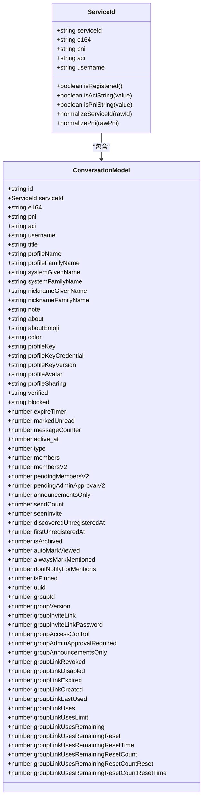
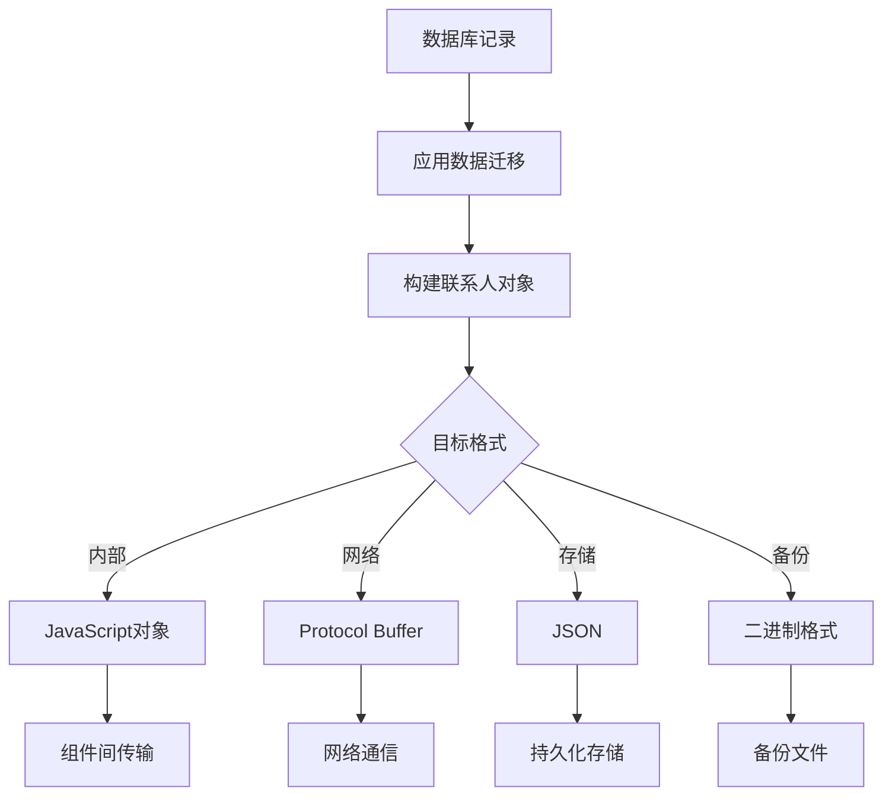
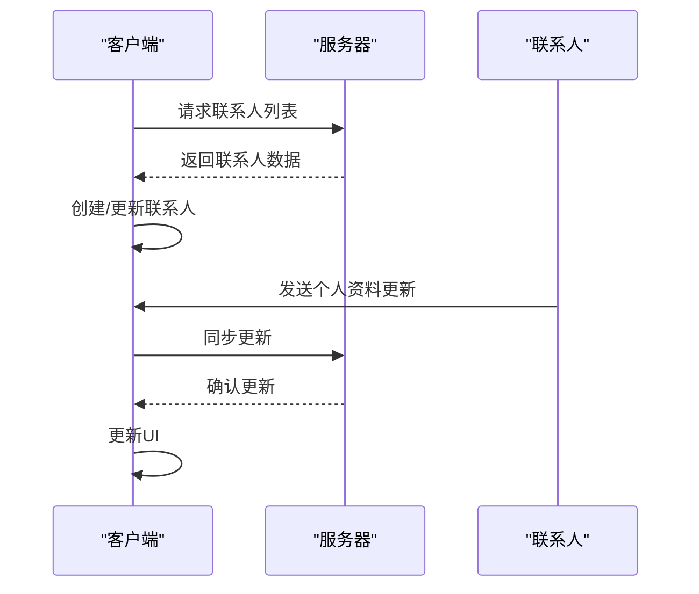
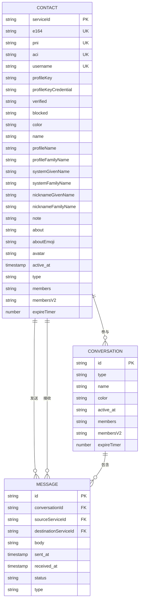

# 联系人结构

<cite>
**本文档中引用的文件**  
- [ContactDetail.dom.tsx](file://ts/components/conversation/ContactDetail.dom.tsx)
- [conversations.preload.ts](file://ts/models/conversations.preload.ts)
- [types/ServiceId.std.ts](file://ts/types/ServiceId.std.ts)
- [backups/export.preload.ts](file://ts/services/backups/export.preload.ts)
- [textsecure/SendMessage.preload.ts](file://ts/textsecure/SendMessage.preload.ts)
- [Colors.std.ts](file://ts/types/Colors.std.ts)
- [util/combineNames.std.ts](file://ts/util/combineNames.std.ts)
- [conversationJobQueue.preload.ts](file://ts/jobs/conversationJobQueue.preload.ts)
- [conversationJobQueue.preload.ts](file://ts/jobs/conversationJobQueue.preload.ts)
- [conversationJobQueue.preload.ts](file://ts/jobs/conversationJobQueue.preload.ts)
</cite>

## 目录
1. [简介](#简介)
2. [联系人实体字段定义](#联系人实体字段定义)
3. [身份标识系统](#身份标识系统)
4. [数据库结构与约束](#数据库结构与约束)
5. [序列化与反序列化](#序列化与反序列化)
6. [生命周期管理](#生命周期管理)
7. [与其他数据模型的关系](#与其他数据模型的关系)
8. [数据一致性问题与解决方案](#数据一致性问题与解决方案)

## 简介
Signal-Desktop中的联系人结构是整个通信系统的核心组成部分，负责管理用户的所有联系人信息。联系人实体不仅包含基本的个人识别信息，还包含丰富的元数据和状态信息，支持Signal的安全通信特性。本文档详细说明了联系人结构的各个方面，包括字段定义、数据类型、数据库约束、序列化格式以及与其他系统组件的交互。

**Section sources**
- [ContactDetail.dom.tsx](file://ts/components/conversation/ContactDetail.dom.tsx#L172-L221)
- [conversations.preload.ts](file://ts/models/conversations.preload.ts#L300-L800)

## 联系人实体字段定义
联系人实体包含多个核心属性，这些属性共同定义了联系人的完整信息。

### 身份标识与联系方式
联系人实体包含多种身份标识和联系方式：

- **ACI/PNI**: 账户标识符，ACI（Account Identifier）是主要账户标识，PNI（Phone Number Identifier）是电话号码标识
- **e164**: E.164格式的电话号码
- **username**: 用户名，可选的唯一标识符
- **number**: 电话号码数组，包含家庭、工作、移动等类型
- **email**: 电子邮件地址数组，支持多种类型和自定义标签

### 个人资料信息
联系人包含丰富的个人资料信息：

- **name**: 姓名对象，包含givenName（名）、familyName（姓）、prefix（前缀）、suffix（后缀）、middleName（中间名）
- **organization**: 组织名称
- **avatar**: 头像信息，包含附件数据和是否为个人资料图片的标志
- **color**: 颜色标识，用于视觉区分
- **about**: 个人简介文本

### 状态与元数据
联系人还包含多种状态和元数据：

- **blocked**: 是否被阻止
- **profileKey**: 个人资料密钥，用于加密个人资料
- **profileKeyCredential**: 个人资料密钥凭证
- **isVerified**: 验证状态
- **isUntrusted**: 信任状态
- **discoveredUnregisteredAt**: 发现未注册的时间戳
- **firstUnregisteredAt**: 首次未注册时间戳

**Section sources**
- [backups/export.preload.ts](file://ts/services/backups/export.preload.ts#L1170-L1211)
- [ContactDetail.dom.stories.tsx](file://ts/components/conversation/ContactDetail.dom.stories.tsx#L95-L131)
- [SendMessage.preload.ts](file://ts/textsecure/SendMessage.preload.ts#L475-L508)

## 身份标识系统
Signal使用多层身份标识系统来确保通信的安全性和隐私性。

### ACI与PNI系统
Signal引入了ACI（Account Identifier）和PNI（Phone Number Identifier）双标识系统：

- **ACI**: 主要账户标识符，与用户的Signal账户永久关联
- **PNI**: 电话号码标识符，与用户的电话号码关联，支持号码变更

这种设计允许用户更改电话号码而不影响其主要身份，同时保持向后兼容性。当用户更改电话号码时，他们的ACI保持不变，而PNI会更新为新的号码标识。

### 服务ID处理
服务ID在系统中以特定格式存储和处理：

- ACI格式: UUID字符串
- PNI格式: "PNI:"前缀 + UUID字符串
- 系统提供标准化函数来处理服务ID的规范化和验证

**Diagram sources**
- [types/ServiceId.std.ts](file://ts/types/ServiceId.std.ts#L1-L194)
- [conversations.preload.ts](file://ts/models/conversations.preload.ts#L300-L800)

## 数据库结构与约束
联系人数据在数据库中以结构化方式存储，具有严格的约束和索引。

### 表结构
联系人数据主要存储在conversations表中，该表包含以下核心字段：

- **id**: 唯一标识符
- **serviceId**: 服务ID（ACI/PNI）
- **e164**: E.164格式电话号码
- **pni**: PNI标识符
- **aci**: ACI标识符
- **username**: 用户名
- **profileKey**: 个人资料密钥
- **profileKeyCredential**: 个人资料密钥凭证
- **verified**: 验证状态
- **blocked**: 阻止状态
- **color**: 颜色
- **name**: 姓名
- **profileName**: 个人资料姓名
- **profileFamilyName**: 个人资料姓氏
- **systemGivenName**: 系统给定姓名
- **systemFamilyName**: 系统姓氏
- **nicknameGivenName**: 昵称给定姓名
- **nicknameFamilyName**: 昵称姓氏
- **note**: 备注
- **about**: 关于
- **aboutEmoji**: 关于表情符号
- **avatar**: 头像
- **active_at**: 活跃时间
- **type**: 类型（私聊、群组等）
- **members**: 成员
- **membersV2**: V2成员
- **expireTimer**: 消失计时器

### 约束与默认值
数据库表具有以下约束和默认值：

- **主键约束**: id字段为主键
- **唯一约束**: serviceId、e164、username等字段具有唯一性约束
- **外键约束**: 与其他表（如消息表）的关联约束
- **默认值**: 许多状态字段具有默认值，如blocked默认为false，verified默认为0（未验证）

**Section sources**
- [conversations.preload.ts](file://ts/models/conversations.preload.ts#L300-L800)
- [81-contact-removed-notification.std.ts](file://ts/sql/migrations/81-contact-removed-notification.std.ts#L1-L103)

## 序列化与反序列化
联系人数据在不同系统组件间传输时需要进行序列化和反序列化。

### 传输格式
联系人数据在不同场景下的序列化格式：

- **内部传输**: 使用JavaScript对象格式
- **网络传输**: 使用Protocol Buffer格式
- **存储**: 使用JSON格式
- **备份**: 使用自定义二进制格式

### 序列化过程
序列化过程包括以下步骤：

1. 从数据库读取原始数据
2. 应用数据迁移和转换
3. 构建完整的联系人对象
4. 根据目标格式进行序列化

**Diagram sources**
- [SendMessage.preload.ts](file://ts/textsecure/SendMessage.preload.ts#L475-L508)
- [backups/export.preload.ts](file://ts/services/backups/export.preload.ts#L1170-L1211)

## 生命周期管理
联系人实体具有完整的创建、更新和删除生命周期。

### 创建过程
联系人创建过程包括：

1. 通过电话号码、用户名或二维码发现联系人
2. 验证联系人身份
3. 创建本地联系人记录
4. 同步联系人信息
5. 更新用户界面

### 更新过程
联系人更新通过以下机制实现：

- **主动同步**: 定期从服务器获取更新
- **被动通知**: 接收来自其他用户的更新通知
- **用户手动更新**: 用户直接编辑联系人信息

**Diagram sources**
- [conversations.preload.ts](file://ts/models/conversations.preload.ts#L300-L800)
- [conversationJobQueue.preload.ts](file://ts/jobs/conversationJobQueue.preload.ts#L1-L20)

## 与其他数据模型的关系
联系人实体与多个其他数据模型存在紧密关系。

### 与消息模型的关系
联系人与消息模型的关系：

- 每条消息都关联到一个发送者联系人
- 消息的显示依赖于联系人信息（如姓名、头像）
- 消息的加密依赖于联系人的安全信息（如公钥）

### 与会话模型的关系
联系人与会话模型的关系：

- 每个私聊会话对应一个联系人
- 群组会话包含多个联系人成员
- 会话的显示信息（如标题、头像）基于联系人信息

### 与安全模型的关系
联系人与安全模型的关系：

- 联系人的验证状态影响消息的安全显示
- 联系人的公钥用于端到端加密
- 联系人的信任状态影响安全警告

**Diagram sources**
- [conversations.preload.ts](file://ts/models/conversations.preload.ts#L300-L800)
- [SendMessage.preload.ts](file://ts/textsecure/SendMessage.preload.ts#L475-L508)

## 数据一致性问题与解决方案
联系人数据管理面临多种一致性挑战，系统采用多种机制来确保数据一致性。

### 常见一致性问题
主要的数据一致性问题包括：

- **多设备同步**: 不同设备间的联系人数据同步
- **网络分区**: 网络中断导致的数据不一致
- **并发更新**: 多个来源同时更新同一联系人
- **数据迁移**: 版本升级导致的数据结构变化

### 解决方案
系统采用以下解决方案：

- **冲突解决策略**: 使用时间戳和版本号解决并发更新冲突
- **数据验证**: 在存储和传输前验证数据完整性
- **事务处理**: 使用数据库事务确保操作的原子性
- **定期同步**: 定期与服务器同步以解决长期不一致问题

**Section sources**
- [conversations.preload.ts](file://ts/models/conversations.preload.ts#L300-L800)
- [conversationJobQueue.preload.ts](file://ts/jobs/conversationJobQueue.preload.ts#L1-L20)