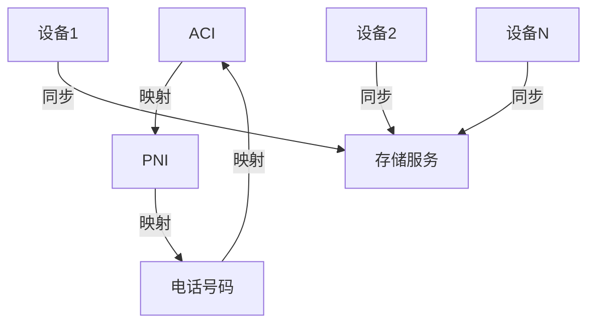
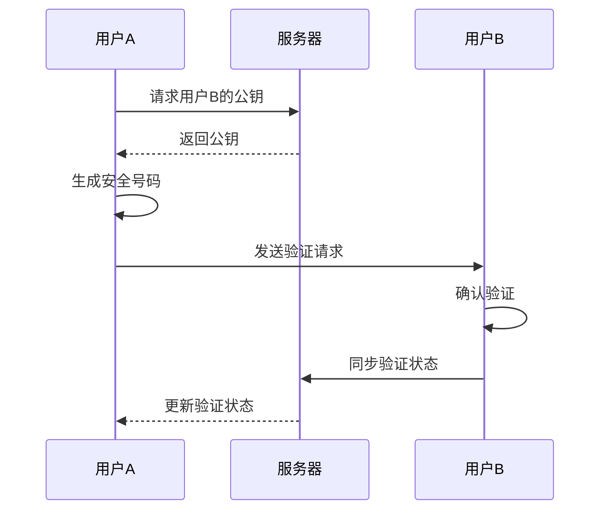
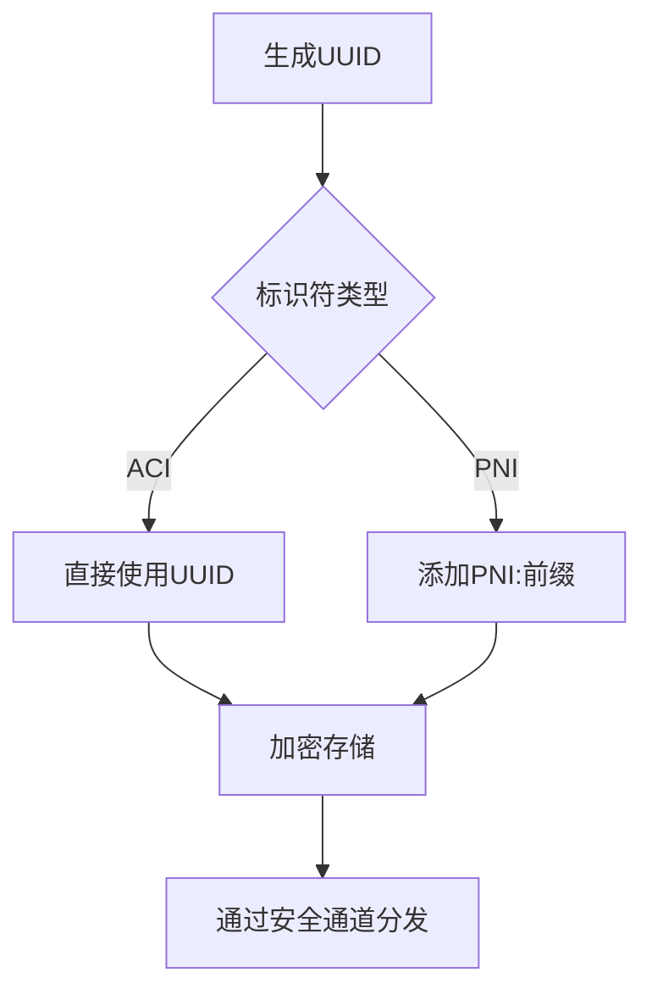
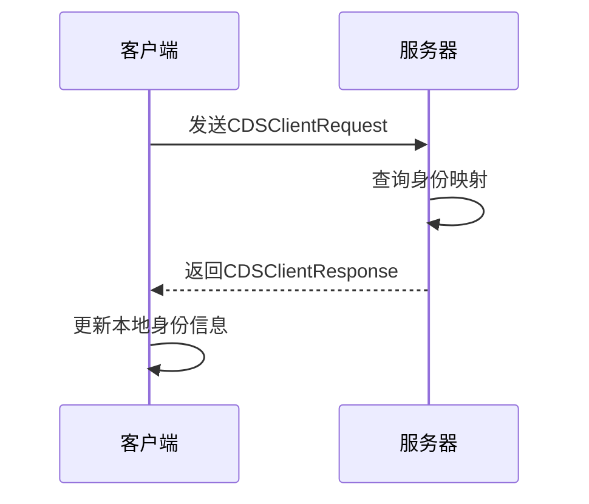
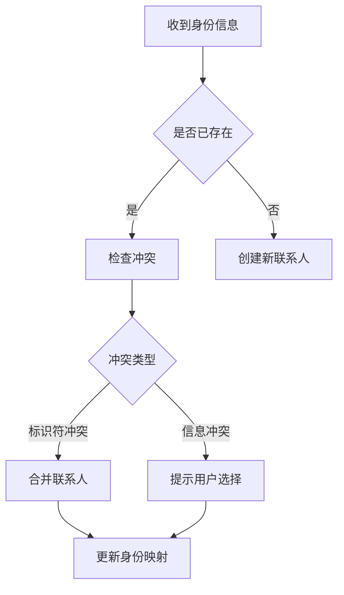

# 身份管理

<cite>
**本文档引用的文件**   
- [ServiceId.std.ts](file://ts/types/ServiceId.std.ts)
- [conversations.preload.ts](file://ts/models/conversations.preload.ts)
- [SignalProtocolStore.preload.ts](file://ts/SignalProtocolStore.preload.ts)
- [SendMessage.preload.ts](file://ts/textsecure/SendMessage.preload.ts)
- [storage.preload.ts](file://ts/services/storage.preload.ts)
- [ContactDiscovery.proto](file://protos/ContactDiscovery.proto)
- [ConversationController.preload.ts](file://ts/ConversationController.preload.ts)
</cite>

## 目录
1. [简介](#简介)
2. [身份标识体系](#身份标识体系)
3. [身份映射与同步机制](#身份映射与同步机制)
4. [身份验证流程](#身份验证流程)
5. [身份生成与分发策略](#身份生成与分发策略)
6. [消息路由与加密中的应用](#消息路由与加密中的应用)
7. [身份同步协议](#身份同步协议)
8. [身份变更处理机制](#身份变更处理机制)
9. [身份解析与冲突解决](#身份解析与冲突解决)
10. [结论](#结论)

## 简介
Signal-Desktop的身份管理系统采用三重标识体系，包括账户标识符（ACI）、电话号码标识符（PNI）和传统电话号码。该系统确保用户身份的唯一性、安全性和隐私性，同时支持跨设备同步和身份验证。本文档详细说明了这一身份管理系统的各个方面。

## 身份标识体系
Signal-Desktop使用三种主要的身份标识符来管理用户身份：

- **ACI（账户标识符）**：全局唯一的账户标识符，基于UUID生成，用于标识用户的主账户身份。
- **PNI（电话号码标识符）**：与电话号码关联的标识符，也基于UUID生成，但以"PNI:"前缀标识。
- **传统电话号码**：用户的E164格式电话号码，作为传统标识方式。

这些标识符共同构成了Signal的身份管理基础，确保了用户身份的多重验证和安全通信。

**Section sources**
- [ServiceId.std.ts](file://ts/types/ServiceId.std.ts#L15-L19)

## 身份映射与同步机制
身份映射和同步机制确保了不同标识符之间的正确关联和跨设备一致性。系统通过以下方式实现：

1. **标识符规范化**：所有服务标识符（ServiceId）在存储和使用前都会经过规范化处理，确保格式一致性。
2. **双向映射**：ACI、PNI和电话号码之间建立了双向映射关系，允许通过任一标识符查找用户。
3. **跨设备同步**：通过存储服务（Storage Service）实现身份信息的跨设备同步，确保所有设备上的身份信息保持一致。

**Diagram sources**
- [ServiceId.std.ts](file://ts/types/ServiceId.std.ts#L64-L99)
- [storage.preload.ts](file://ts/services/storage.preload.ts#L1164-L1202)

## 身份验证流程
身份验证流程确保了通信双方身份的真实性和安全性。主要步骤包括：

1. **初始验证**：当用户首次添加联系人时，系统会获取其公钥并生成安全号码。
2. **验证状态管理**：每个联系人的验证状态（已验证、未验证、默认）被记录和管理。
3. **同步验证状态**：验证状态通过同步消息在用户的所有设备间同步。

**Diagram sources**
- [conversations.preload.ts](file://ts/models/conversations.preload.ts#L2981-L3037)
- [SendMessage.preload.ts](file://ts/textsecure/SendMessage.preload.ts#L2106-L2146)

## 身份生成与分发策略
身份标识的生成和分发遵循严格的安全策略：

- **ACI生成**：使用UUID生成全局唯一的账户标识符。
- **PNI生成**：在UUID前添加"PNI:"前缀生成电话号码标识符。
- **安全分发**：通过加密通道分发身份信息，确保传输过程中的安全性。

**Diagram sources**
- [ServiceId.std.ts](file://ts/types/ServiceId.std.ts#L136-L142)
- [SignalProtocolStore.preload.ts](file://ts/SignalProtocolStore.preload.ts#L2382-L2441)

## 消息路由与加密中的应用
身份标识在消息路由和加密中发挥关键作用：

- **消息路由**：使用ACI作为主要路由标识符，确保消息准确送达目标用户。
- **端到端加密**：基于接收方的公钥进行加密，确保只有目标用户能解密消息。
- **匿名发送**：支持通过PNI实现匿名消息发送，保护用户隐私。

**Section sources**
- [SendMessage.preload.ts](file://ts/textsecure/SendMessage.preload.ts#L1575-L1617)
- [conversations.preload.ts](file://ts/models/conversations.preload.ts#L3039-L3068)

## 身份同步协议
身份同步协议定义了从服务器获取联系人身份信息的流程：

1. **请求构建**：客户端构建包含ACI/UAK对和电话号码的请求。
2. **服务器查询**：服务器查询并返回相应的ACI、PNI和电话号码三元组。
3. **本地更新**：客户端根据服务器响应更新本地身份映射。

**Diagram sources**
- [ContactDiscovery.proto](file://protos/ContactDiscovery.proto#L6-L54)
- [storage.preload.ts](file://ts/services/storage.preload.ts#L2185-L2203)

## 身份变更处理机制
系统提供了完善的身份变更处理机制：

- **变更检测**：监控用户身份信息的变化，如电话号码变更。
- **自动合并**：当检测到同一用户的不同身份标识时，自动合并为单一联系人。
- **冲突解决**：提供明确的冲突解决策略，确保数据一致性。

**Section sources**
- [ConversationController.preload.ts](file://ts/ConversationController.preload.ts#L85-L133)
- [conversations.preload.ts](file://ts/models/conversations.preload.ts#L2924-L2962)

## 身份解析与冲突解决
身份解析和冲突解决是确保系统稳定性的关键：

- **解析优先级**：ACI具有最高优先级，其次是PNI，最后是电话号码。
- **冲突检测**：检测同一标识符对应多个联系人的情况。
- **解决策略**：提供自动和手动两种冲突解决方式。

**Diagram sources**
- [ServiceId.std.ts](file://ts/types/ServiceId.std.ts#L26-L30)
- [conversations.preload.ts](file://ts/models/conversations.preload.ts#L2981-L3037)

## 结论
Signal-Desktop的身份管理系统通过ACI、PNI和电话号码的三重标识体系，实现了安全、隐私和易用性的平衡。该系统不仅确保了用户身份的唯一性和真实性，还支持跨设备同步和无缝的身份变更处理，为用户提供可靠的安全通信体验。