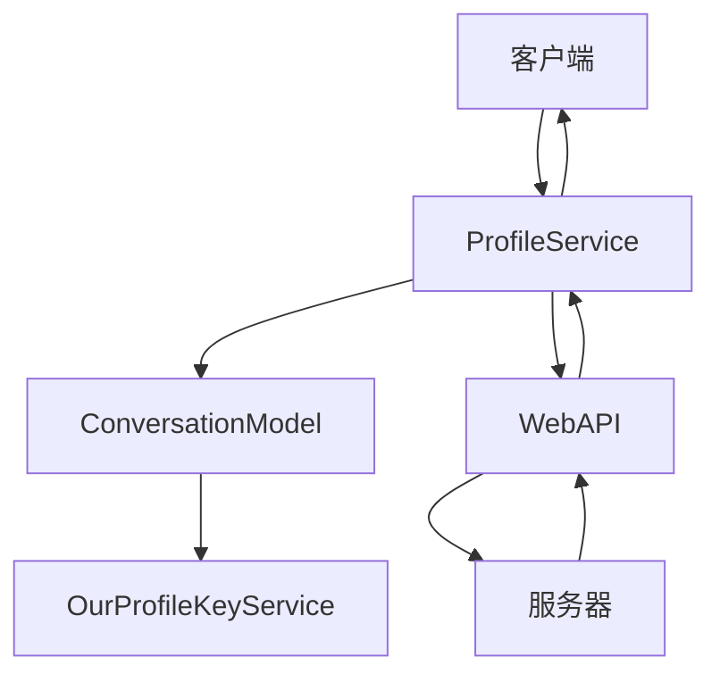
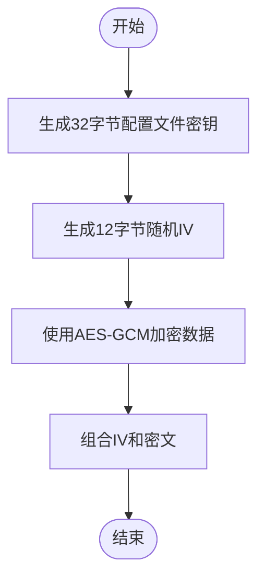
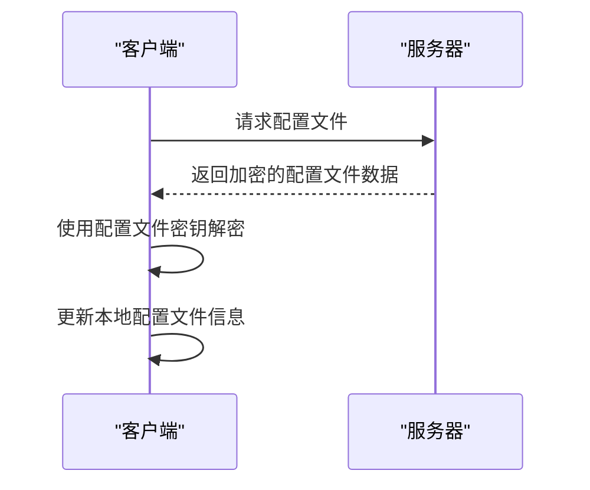
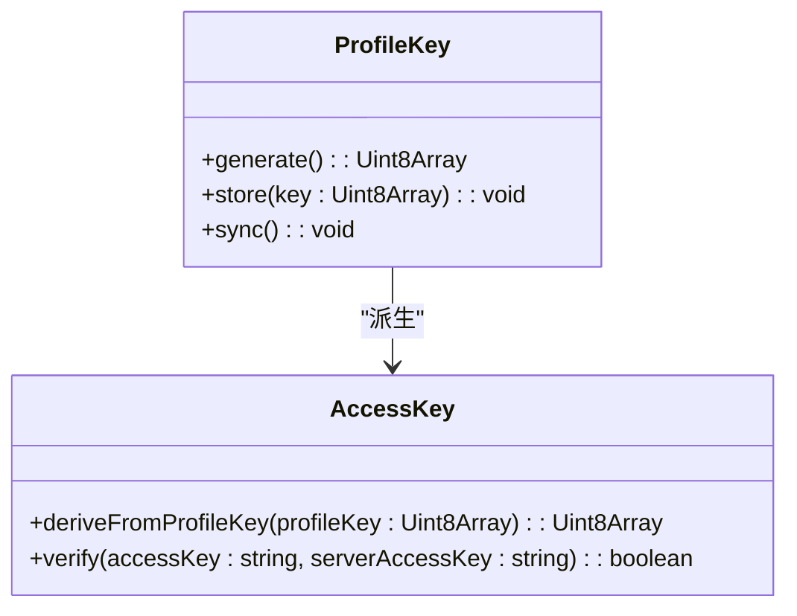
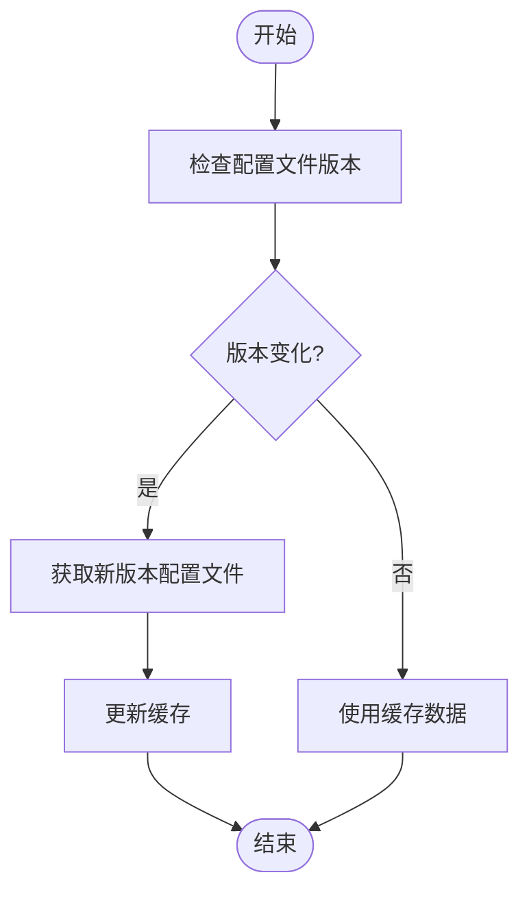
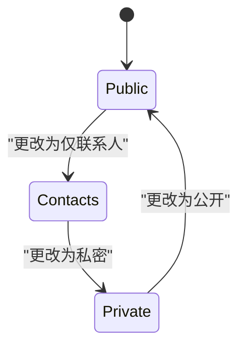
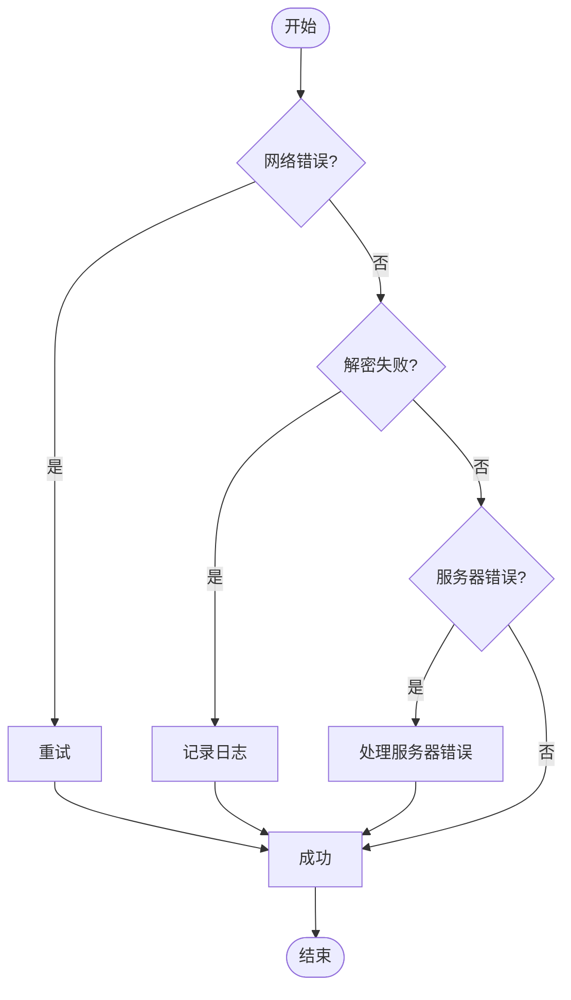
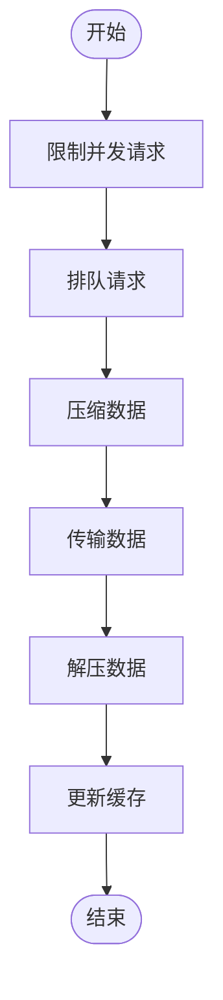
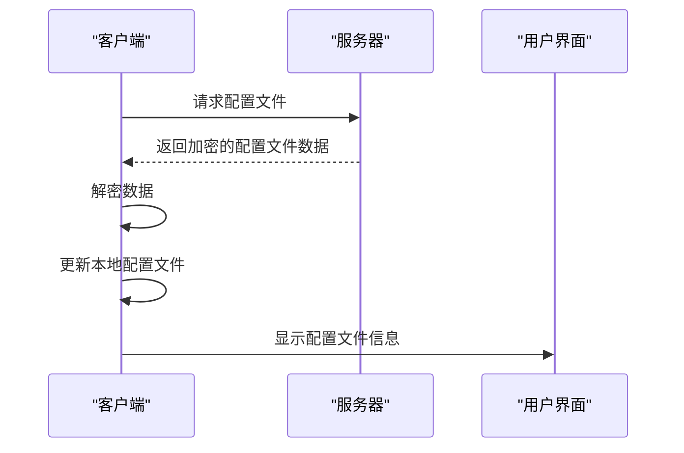

# 配置文件同步

<cite>
**本文档引用的文件**   
- [profiles.preload.ts](file://ts/services/profiles.preload.ts)
- [conversations.preload.ts](file://ts/models/conversations.preload.ts)
- [ourProfileKey.std.ts](file://ts/services/ourProfileKey.std.ts)
- [storageRecordOps.preload.ts](file://ts/services/storageRecordOps.preload.ts)
- [Crypto.node.ts](file://ts/Crypto.node.ts)
- [writeProfile.preload.ts](file://ts/services/writeProfile.preload.ts)
</cite>

## 目录
1. [简介](#简介)
2. [配置文件同步架构](#配置文件同步架构)
3. [配置文件加密与解密](#配置文件加密与解密)
4. [配置文件上传与下载流程](#配置文件上传与下载流程)
5. [端到端加密系统集成](#端到端加密系统集成)
6. [配置文件版本管理与缓存策略](#配置文件版本管理与缓存策略)
7. [配置文件权限控制与隐私设置](#配置文件权限控制与隐私设置)
8. [错误处理与冲突解决](#错误处理与冲突解决)
9. [性能优化](#性能优化)
10. [配置文件获取与显示](#配置文件获取与显示)

## 简介
Signal-Desktop的配置文件同步机制确保用户联系人的配置文件信息（包括名称、头像、关于信息等）在不同设备间安全、可靠地同步。该机制通过端到端加密保护用户隐私，同时提供高效的缓存和更新检测策略。本文档详细说明了配置文件同步的各个方面，包括加密、上传、下载、版本管理、权限控制、错误处理和性能优化。

## 配置文件同步架构
Signal-Desktop的配置文件同步架构基于客户端-服务器模型，通过一系列服务和组件协同工作来实现配置文件的同步。核心组件包括`ProfileService`、`ConversationModel`和`OurProfileKeyService`，它们分别负责配置文件的获取、存储和密钥管理。

**图表来源**
- [profiles.preload.ts](file://ts/services/profiles.preload.ts#L91-L254)
- [conversations.preload.ts](file://ts/models/conversations.preload.ts#L5007-L5025)
- [ourProfileKey.std.ts](file://ts/services/ourProfileKey.std.ts#L11-L88)

## 配置文件加密与解密
配置文件的加密和解密是确保用户隐私的关键环节。Signal-Desktop使用AES-GCM算法对配置文件数据进行加密，并通过`Crypto.node.ts`中的`encryptProfile`和`decryptProfile`函数实现。

### 加密过程
1. 生成32字节的配置文件密钥（profile key）。
2. 使用配置文件密钥和随机IV（初始化向量）对配置文件数据进行AES-GCM加密。
3. 将加密后的数据和IV组合成最终的加密数据。

### 解密过程
1. 从服务器获取加密的配置文件数据。
2. 提取IV和密文。
3. 使用配置文件密钥和IV对密文进行AES-GCM解密。
4. 验证解密结果的完整性。

**图表来源**
- [Crypto.node.ts](file://ts/Crypto.node.ts#L556-L576)
- [profiles.preload.ts](file://ts/services/profiles.preload.ts#L460-L466)

## 配置文件上传与下载流程
配置文件的上传和下载流程涉及多个步骤，确保数据的安全传输和正确处理。

### 上传流程
1. 客户端生成配置文件数据。
2. 使用配置文件密钥加密配置文件数据。
3. 将加密后的数据发送到服务器。
4. 服务器验证并存储配置文件数据。

### 下载流程
1. 客户端向服务器请求配置文件。
2. 服务器返回加密的配置文件数据。
3. 客户端使用配置文件密钥解密数据。
4. 客户端更新本地配置文件信息。

**图表来源**
- [writeProfile.preload.ts](file://ts/services/writeProfile.preload.ts#L72-L121)
- [profiles.preload.ts](file://ts/services/profiles.preload.ts#L492-L891)

## 端到端加密系统集成
配置文件同步机制与Signal的端到端加密系统紧密集成，确保数据在传输过程中的安全性。配置文件密钥（profile key）用于加密和解密配置文件数据，而访问密钥（access key）用于验证客户端的身份。

### 配置文件密钥管理
- **生成**：客户端生成32字节的配置文件密钥。
- **存储**：配置文件密钥存储在本地安全存储中。
- **同步**：配置文件密钥通过存储服务同步到其他设备。

### 访问密钥验证
- **生成**：从配置文件密钥派生访问密钥。
- **验证**：服务器使用访问密钥验证客户端的身份。

**图表来源**
- [ourProfileKey.std.ts](file://ts/services/ourProfileKey.std.ts#L43-L55)
- [conversations.preload.ts](file://ts/models/conversations.preload.ts#L5121-L5213)

## 配置文件版本管理与缓存策略
为了提高性能和减少网络请求，Signal-Desktop实现了配置文件版本管理和缓存策略。

### 版本管理
- **版本号**：每个配置文件都有一个版本号，用于标识其版本。
- **更新检测**：客户端通过比较版本号来检测配置文件是否需要更新。

### 缓存策略
- **本地缓存**：配置文件数据在本地缓存，减少重复下载。
- **过期机制**：缓存数据有过期时间，确保数据的时效性。

**图表来源**
- [conversations.preload.ts](file://ts/models/conversations.preload.ts#L5284-L5310)
- [profiles.preload.ts](file://ts/services/profiles.preload.ts#L842-L854)

## 配置文件权限控制与隐私设置
Signal-Desktop提供了灵活的配置文件权限控制和隐私设置，允许用户自定义谁可以查看他们的配置文件信息。

### 权限控制
- **公开**：任何人都可以查看配置文件。
- **联系人**：只有联系人可以查看配置文件。
- **私密**：只有自己可以查看配置文件。

### 隐私设置
- **名称**：用户可以选择是否显示全名或仅显示名字。
- **头像**：用户可以选择是否显示头像。
- **关于信息**：用户可以自定义关于信息的可见性。

**图表来源**
- [profiles.preload.ts](file://ts/services/profiles.preload.ts#L668-L703)
- [conversations.preload.ts](file://ts/models/conversations.preload.ts#L5027-L5062)

## 错误处理与冲突解决
在配置文件同步过程中，可能会遇到各种错误和冲突。Signal-Desktop通过一系列机制来处理这些问题，确保系统的稳定性和数据的一致性。

### 错误处理
- **网络错误**：重试机制和超时处理。
- **解密失败**：记录日志并提示用户。
- **服务器错误**：根据HTTP状态码进行相应的处理。

### 冲突解决
- **版本冲突**：选择最新版本的配置文件。
- **数据冲突**：合并不同来源的数据。

**图表来源**
- [profiles.preload.ts](file://ts/services/profiles.preload.ts#L549-L610)
- [conversations.preload.ts](file://ts/models/conversations.preload.ts#L5042-L5062)

## 性能优化
为了提高配置文件同步的性能，Signal-Desktop采取了多种优化措施。

### 并发控制
- **并发限制**：限制同时进行的配置文件请求数量，避免服务器过载。
- **队列管理**：使用优先级队列管理配置文件请求。

### 数据压缩
- **压缩传输**：对配置文件数据进行压缩，减少传输时间。
- **缓存压缩**：对缓存数据进行压缩，节省存储空间。

**图表来源**
- [profiles.preload.ts](file://ts/services/profiles.preload.ts#L89-L103)
- [Crypto.node.ts](file://ts/Crypto.node.ts#L556-L576)

## 配置文件获取与显示
配置文件的获取和显示是用户交互的重要部分。Signal-Desktop通过一系列组件和方法来实现配置文件的获取和显示。

### 获取流程
1. 客户端向服务器请求配置文件。
2. 服务器返回加密的配置文件数据。
3. 客户端解密数据并更新本地配置文件。

### 显示流程
1. 从本地缓存或服务器获取配置文件数据。
2. 解析配置文件数据。
3. 在用户界面中显示配置文件信息。

**图表来源**
- [profiles.preload.ts](file://ts/services/profiles.preload.ts#L492-L891)
- [conversations.preload.ts](file://ts/models/conversations.preload.ts#L5064-L5119)

**本节来源**
- [profiles.preload.ts](file://ts/services/profiles.preload.ts#L492-L891)
- [conversations.preload.ts](file://ts/models/conversations.preload.ts#L5064-L5119)