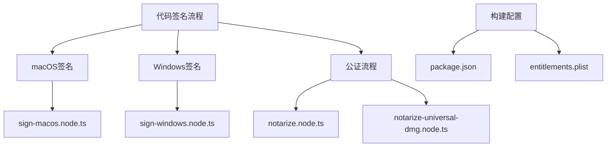
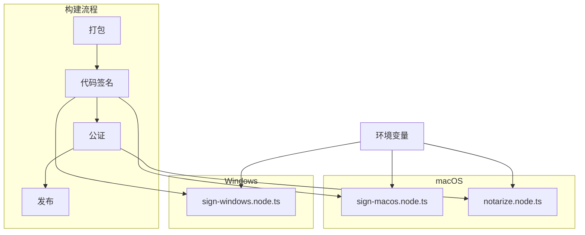
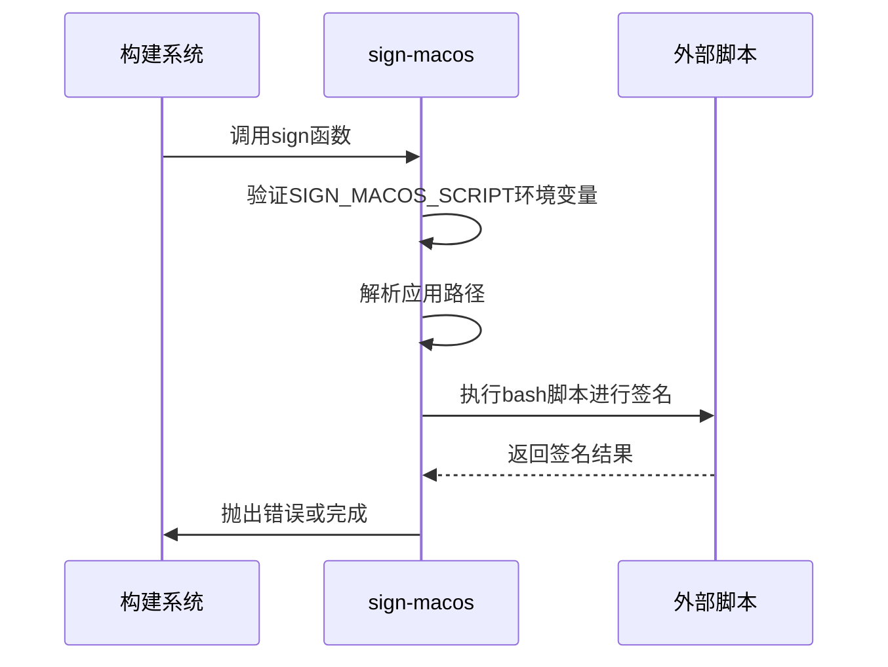
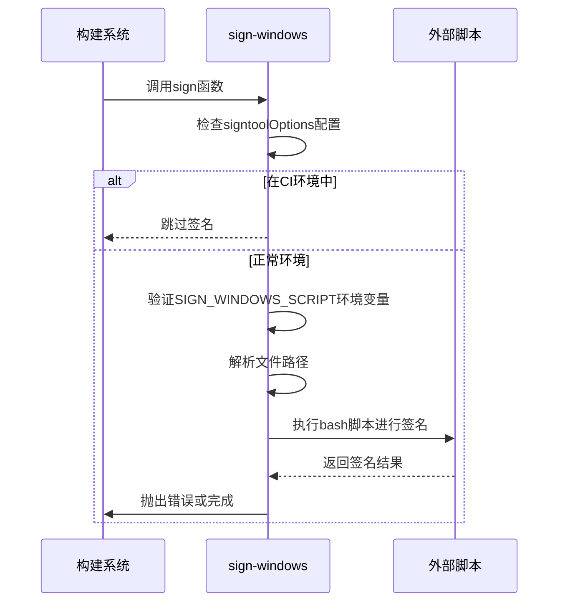
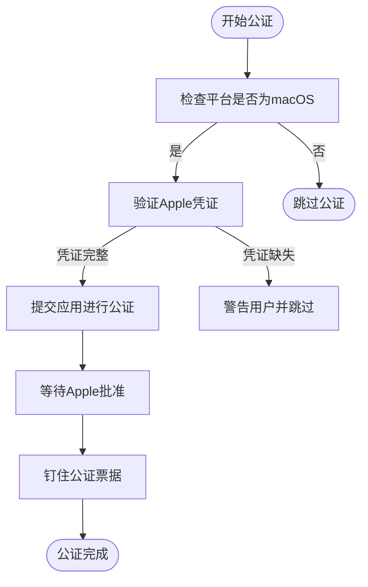

# 代码签名

<cite>
**本文档中引用的文件**  
- [sign-macos.node.ts](file://ts/scripts/sign-macos.node.ts)
- [sign-windows.node.ts](file://ts/scripts/sign-windows.node.ts)
- [after-sign.node.ts](file://ts/scripts/after-sign.node.ts)
- [notarize.node.ts](file://ts/scripts/notarize.node.ts)
- [notarize-universal-dmg.node.ts](file://ts/scripts/notarize-universal-dmg.node.ts)
- [package.json](file://package.json)
- [entitlements.mac.inherit.plist](file://build/entitlements.mac.inherit.plist)
- [entitlements.mas.inherit.plist](file://build/entitlements.mas.inherit.plist)
</cite>

## 目录
1. [简介](#简介)
2. [项目结构](#项目结构)
3. [核心组件](#核心组件)
4. [架构概述](#架构概述)
5. [详细组件分析](#详细组件分析)
6. [依赖分析](#依赖分析)
7. [性能考虑](#性能考虑)
8. [故障排除指南](#故障排除指南)
9. [结论](#结论)

## 简介
本文档详细说明Signal-Desktop项目的代码签名流程，重点介绍macOS和Windows平台的实现机制。文档涵盖证书管理、签名工具链、签名验证过程、安全考虑、证书轮换策略和时间戳处理等关键方面。通过分析实际代码库中的`sign-macos.node.ts`和`sign-windows.node.ts`文件，提供具体的实现细节和最佳实践。

## 项目结构
Signal-Desktop的代码签名相关文件主要分布在`ts/scripts/`目录下，包括macOS和Windows平台的签名脚本、公证（notarization）脚本以及相关的构建配置文件。签名流程与Electron构建系统紧密集成，通过`package.json`中的构建配置进行协调。



**图表来源**  
- [sign-macos.node.ts](file://ts/scripts/sign-macos.node.ts)
- [sign-windows.node.ts](file://ts/scripts/sign-windows.node.ts)
- [notarize.node.ts](file://ts/scripts/notarize.node.ts)
- [package.json](file://package.json)

**章节来源**  
- [ts/scripts/sign-macos.node.ts](file://ts/scripts/sign-macos.node.ts)
- [ts/scripts/sign-windows.node.ts](file://ts/scripts/sign-windows.node.ts)
- [package.json](file://package.json)

## 核心组件
Signal-Desktop的代码签名流程由多个核心组件构成，包括平台特定的签名脚本、公证服务集成和构建后处理钩子。这些组件协同工作，确保应用程序在发布前经过正确的签名和验证。

**章节来源**  
- [sign-macos.node.ts](file://ts/scripts/sign-macos.node.ts#L1-L31)
- [sign-windows.node.ts](file://ts/scripts/sign-windows.node.ts#L1-L41)
- [after-sign.node.ts](file://ts/scripts/after-sign.node.ts#L1-L13)

## 架构概述
Signal-Desktop的代码签名架构采用分层设计，将平台特定的签名逻辑与通用的构建流程分离。签名过程通过环境变量配置，确保灵活性和安全性。macOS平台采用Apple的代码签名和公证机制，而Windows平台使用Authenticode签名。



**图表来源**  
- [sign-macos.node.ts](file://ts/scripts/sign-macos.node.ts)
- [sign-windows.node.ts](file://ts/scripts/sign-windows.node.ts)
- [notarize.node.ts](file://ts/scripts/notarize.node.ts)

## 详细组件分析

### macOS代码签名分析
Signal-Desktop的macOS代码签名通过`sign-macos.node.ts`文件实现，该脚本调用外部bash脚本进行实际的签名操作。签名过程依赖于环境变量`SIGN_MACOS_SCRIPT`来指定签名脚本的路径，确保签名密钥的安全性。



**图表来源**  
- [sign-macos.node.ts](file://ts/scripts/sign-macos.node.ts#L1-L31)

**章节来源**  
- [sign-macos.node.ts](file://ts/scripts/sign-macos.node.ts#L1-L31)

### Windows代码签名分析
Windows平台的代码签名在`sign-windows.node.ts`中实现，同样通过调用外部bash脚本来完成签名。签名配置从`package.json`中读取，包括证书SHA1指纹等关键信息。在CI环境中，通过移除证书信息来禁用签名。



**图表来源**  
- [sign-windows.node.ts](file://ts/scripts/sign-windows.node.ts#L1-L41)

**章节来源**  
- [sign-windows.node.ts](file://ts/scripts/sign-windows.node.ts#L1-L41)

### 公证流程分析
macOS平台的公证流程由`notarize.node.ts`和`notarize-universal-dmg.node.ts`两个文件实现。公证是Apple安全模型的重要组成部分，确保应用程序未被篡改且不包含恶意内容。



**图表来源**  
- [notarize.node.ts](file://ts/scripts/notarize.node.ts#L1-L69)
- [notarize-universal-dmg.node.ts](file://ts/scripts/notarize-universal-dmg.node.ts#L1-L77)

**章节来源**  
- [notarize.node.ts](file://ts/scripts/notarize.node.ts#L1-L69)
- [notarize-universal-dmg.node.ts](file://ts/scripts/notarize-universal-dmg.node.ts#L1-L77)

## 依赖分析
代码签名流程依赖于多个外部工具和库，包括Electron Builder、@electron/notarize等。这些依赖通过`package.json`进行管理，确保版本一致性和安全性。

```mermaid
graph LR
A[代码签名] --> B[Electron Builder]
A --> C[@electron/notarize]
A --> D[外部签名脚本]
B --> E[Node.js]
C --> E
D --> F[Bash环境]
```

**图表来源**  
- [package.json](file://package.json#L237-L238)
- [sign-macos.node.ts](file://ts/scripts/sign-macos.node.ts)
- [sign-windows.node.ts](file://ts/scripts/sign-windows.node.ts)

**章节来源**  
- [package.json](file://package.json#L237-L238)

## 性能考虑
代码签名和公证过程可能成为构建流水线的瓶颈，特别是公证需要与Apple服务器通信。Signal-Desktop通过异步执行公证流程来优化构建时间，允许在公证进行的同时继续其他构建任务。

## 故障排除指南
代码签名过程中常见的问题包括证书过期、签名工具链兼容性和签名验证失败。以下是一些常见问题及其解决方案：

**章节来源**  
- [sign-macos.node.ts](file://ts/scripts/sign-macos.node.ts#L14-L17)
- [sign-windows.node.ts](file://ts/scripts/sign-windows.node.ts#L16-L19)
- [notarize.node.ts](file://ts/scripts/notarize.node.ts#L32-L54)

### 证书过期
当证书过期时，签名将失败。解决方案是更新证书并确保所有开发和CI环境都使用最新的证书。

### 签名工具链兼容性
不同版本的签名工具可能存在兼容性问题。确保所有环境使用相同版本的工具链。

### 签名验证失败
签名验证失败可能是由于文件损坏或签名过程不完整。重新执行签名过程通常可以解决问题。

## 结论
Signal-Desktop的代码签名流程设计合理，通过将签名逻辑与构建流程分离，提高了安全性和灵活性。macOS和Windows平台的实现都遵循各自平台的最佳实践，确保应用程序的安全分发。建议定期轮换证书，监控签名流程的性能，并建立完善的故障排除机制。