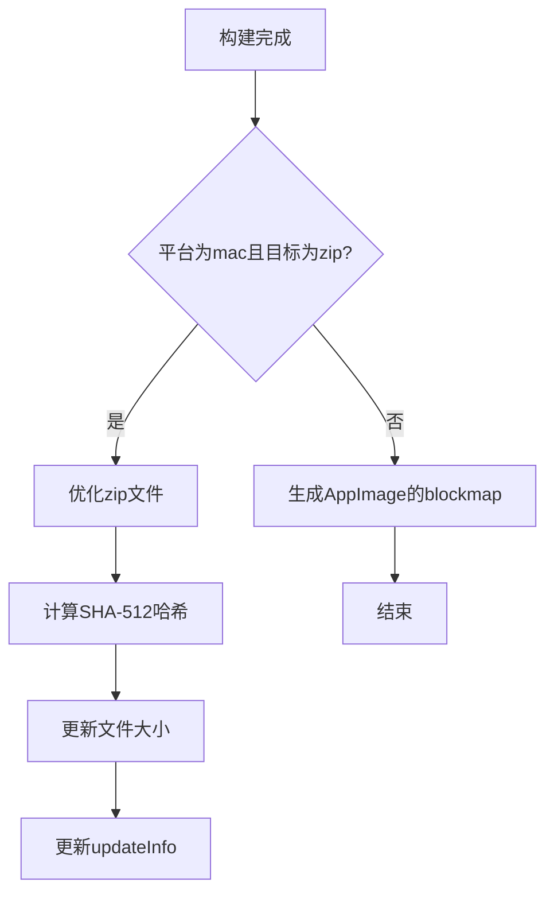
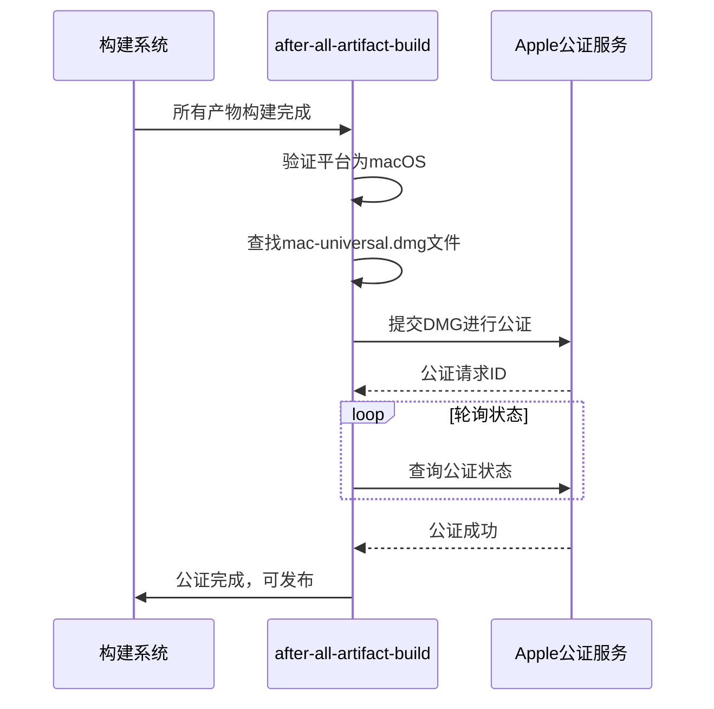

# 发布验证

<cite>
**本文档中引用的文件**  
- [artifact-build-completed.node.ts](file://ts/scripts/artifact-build-completed.node.ts)
- [after-all-artifact-build.node.ts](file://ts/scripts/after-all-artifact-build.node.ts)
- [notarize-universal-dmg.node.ts](file://ts/scripts/notarize-universal-dmg.node.ts)
- [notarize.node.ts](file://ts/scripts/notarize.node.ts)
- [test-release.node.ts](file://ts/scripts/test-release.node.ts)
- [dd-installer-size.node.ts](file://ts/scripts/dd-installer-size.node.ts)
- [package.json](file://package.json)
- [config/production.json](file://config/production.json)
</cite>

## 目录
1. [简介](#简介)
2. [构建产物完整性检查](#构建产物完整性检查)
3. [签名验证流程](#签名验证流程)
4. [功能验证](#功能验证)
5. [安全扫描与合规性检查](#安全扫描与合规性检查)
6. [发布后通知机制与报告生成](#发布后通知机制与报告生成)
7. [质量标准与通过/失败阈值](#质量标准与通过/失败阈值)
8. [问题上报流程](#问题上报流程)
9. [常见验证问题及解决方案](#常见验证问题及解决方案)
10. [结论](#结论)

## 简介
Signal-Desktop 的发布验证流程是一套严格的自动化机制，确保每次发布的构建产物在完整性、安全性、功能性和合规性方面均达到高标准。该流程涵盖从构建完成到最终发布的多个验证阶段，包括构建产物的完整性校验、数字签名验证、功能测试、安全扫描以及发布后的监控与通知。本文档详细说明这些流程，并结合代码库中的具体实现（如 `artifact-build-completed.node.ts` 和 `after-all-artifact-build.node.ts`）进行解析。

**Section sources**
- [artifact-build-completed.node.ts](file://ts/scripts/artifact-build-completed.node.ts#L1-L68)
- [after-all-artifact-build.node.ts](file://ts/scripts/after-all-artifact-build.node.ts#L1-L13)

## 构建产物完整性检查
在构建过程完成后，系统会立即对生成的产物进行完整性检查，以确保文件未被损坏或篡改。

### 哈希值与大小更新
`artifact-build-completed.node.ts` 文件中的 `artifactBuildCompleted` 函数负责在构建完成后生成并更新每个产物的 SHA-512 哈希值和文件大小。此信息将被注入到更新元数据（`updateInfo`）中，供客户端在下载时进行验证。

**Diagram sources**
- [artifact-build-completed.node.ts](file://ts/scripts/artifact-build-completed.node.ts#L14-L67)

### 块映射（BlockMap）生成
对于 Linux 平台的 AppImage 文件，系统会生成一个 `.blockmap` 文件。该文件包含文件的块级哈希信息，支持增量更新，允许客户端仅下载发生变化的部分，从而提高更新效率。

**Section sources**
- [artifact-build-completed.node.ts](file://ts/scripts/artifact-build-completed.node.ts#L20-L26)

## 签名验证流程
签名验证是确保软件来源可信和未被篡改的关键步骤。Signal-Desktop 针对不同平台实施了相应的签名策略。

### macOS 通用 DMG 的公证（Notarization）
`after-all-artifact-build.node.ts` 脚本在所有构建产物生成后被调用。它会触发 `notarize-universal-dmg.node.ts` 中的逻辑，对 macOS 的通用 DMG 文件进行苹果官方的公证。

**Diagram sources**
- [after-all-artifact-build.node.ts](file://ts/scripts/after-all-artifact-build.node.ts#L7-L11)
- [notarize-universal-dmg.node.ts](file://ts/scripts/notarize-universal-dmg.node.ts#L10-L76)

### 环境变量依赖
公证过程依赖于三个关键的环境变量：`APPLE_USERNAME`、`APPLE_PASSWORD` 和 `APPLE_TEAM_ID`。如果这些变量未设置，流程将发出警告并跳过公证步骤。

**Section sources**
- [notarize-universal-dmg.node.ts](file://ts/scripts/notarize-universal-dmg.node.ts#L34-L56)

## 功能验证
在发布前，系统会执行一系列功能测试，以确保核心功能正常工作。

### 自动化端到端测试
`test-release.node.ts` 脚本模拟了用户启动应用的场景。它会：
1. 复制构建产物到临时目录。
2. 使用 Electron 测试框架启动应用。
3. 等待主窗口打开。
4. 验证窗口标题是否正确。

此测试确保了应用能够成功启动并加载主界面。

**Section sources**
- [test-release.node.ts](file://ts/scripts/test-release.node.ts#L63-L93)

## 安全扫描与合规性检查
除了签名，系统还集成了多种安全和合规性检查。

### 安装包大小监控
`dd-installer-size.node.ts` 脚本在构建完成后，会将不同平台安装包的大小作为指标发送到 Datadog 监控系统。这有助于跟踪安装包大小的趋势，防止因代码膨胀导致用户体验下降。

**Section sources**
- [dd-installer-size.node.ts](file://ts/scripts/dd-installer-size.node.ts#L19-L95)

### 服务器参数验证
在 `config/production.json` 文件中，包含了 Signal 服务器的公钥参数（`serverPublicParams`）和信任根（`serverTrustRoots`）。这些硬编码的值是客户端验证服务器身份的基础，确保通信的安全性。

**Section sources**
- [config/production.json](file://config/production.json#L14-L18)

## 发布后通知机制与报告生成
当前代码库中未直接体现发布完成后的通知机制（如邮件、Slack 通知）或详细的验证报告生成逻辑。这些功能可能由外部 CI/CD 系统（如 GitHub Actions）处理。然而，`dd-installer-size.node.ts` 将指标发送到 Datadog 的行为，可以视为一种自动化的报告生成，为团队提供了可量化的发布数据。

## 质量标准与通过/失败阈值
虽然代码中未明确定义具体的数值阈值，但可以从实现中推断出质量标准：

- **完整性**：所有构建产物必须成功生成 SHA-512 哈希。
- **功能性**：应用必须能成功启动并显示正确的主窗口。
- **安全性**：macOS 应用必须通过苹果的公证流程。
- **合规性**：安装包大小需在合理范围内，且趋势稳定。

任何步骤中的异常（如哈希计算失败、应用启动失败、公证失败）都将导致发布流程中断。

**Section sources**
- [artifact-build-completed.node.ts](file://ts/scripts/artifact-build-completed.node.ts#L60-L66)
- [test-release.node.ts](file://ts/scripts/test-release.node.ts#L89-L90)

## 问题上报流程
代码库中未包含明确的问题上报流程。通常，此类流程会集成在 CI/CD 系统中：
1. **自动捕获**：构建或测试脚本的非零退出码会被 CI 系统捕获。
2. **通知**：CI 系统会通过预设渠道（如邮件、Slack）通知相关开发人员。
3. **日志分析**：开发者需检查详细的构建日志来定位问题。
4. **修复与重试**：修复问题后，重新触发发布流程。

## 常见验证问题及解决方案

### 验证工具链故障
**问题**：`@electron/notarize` 工具无法连接到苹果服务器。
**解决方案**：
- 检查网络连接和防火墙设置。
- 确认 `APPLE_USERNAME` 和 `APPLE_PASSWORD` 是有效的 App-Specific Password。
- 查看 `@electron/notarize` 的最新文档和已知问题。

### 验证标准不一致
**问题**：不同开发环境或 CI 节点上的构建产物哈希值不一致。
**解决方案**：
- 确保所有环境使用完全相同的 Node.js、Electron 和依赖库版本。
- 检查构建脚本是否引入了时间戳或随机数等非确定性因素。
- 实施可重现的构建（Reproducible Builds），如 `reproducible-builds` 目录所示。

### 验证结果误报
**问题**：功能测试因环境问题（如无头模式下的图形渲染问题）而失败。
**解决方案**：
- 增加测试的健壮性，例如使用更长的超时时间。
- 在测试脚本中加入重试机制。
- 确保测试环境尽可能接近生产环境。

## 结论
Signal-Desktop 的发布验证流程是一个多层次、自动化的质量保障体系。它通过代码级别的完整性检查、平台特定的签名验证、自动化功能测试和外部监控，确保了发布的软件是安全、可靠且功能完整的。尽管部分高级功能（如详细的报告生成和问题上报）可能由外部系统处理，但核心的验证逻辑已在代码库中得到充分体现，为维护 Signal 的高安全标准提供了坚实的基础。