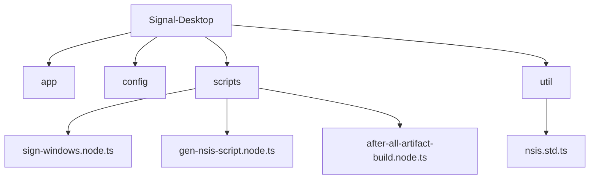
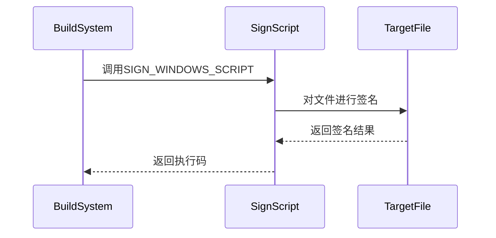
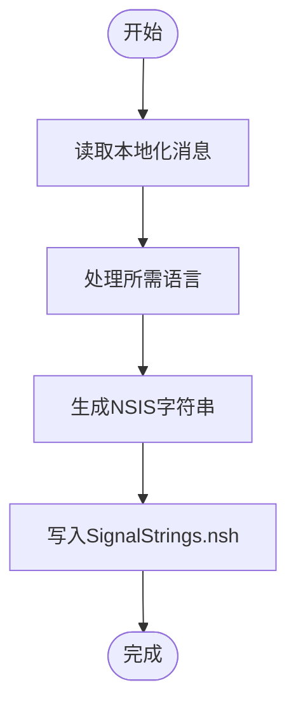
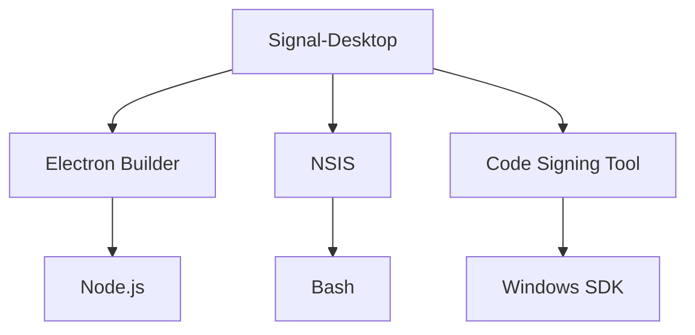

# Windows发布

<cite>
**本文档中引用的文件**  
- [sign-windows.node.ts](file://ts/scripts/sign-windows.node.ts)
- [gen-nsis-script.node.ts](file://ts/scripts/gen-nsis-script.node.ts)
- [after-all-artifact-build.node.ts](file://ts/scripts/after-all-artifact-build.node.ts)
- [nsis.std.ts](file://ts/util/nsis.std.ts)
- [app-builder-lib.patch](file://patches/app-builder-lib.patch)
- [package.json](file://package.json)
</cite>

## 目录
1. [介绍](#介绍)
2. [项目结构](#项目结构)
3. [核心组件](#核心组件)
4. [架构概述](#架构概述)
5. [详细组件分析](#详细组件分析)
6. [依赖分析](#依赖分析)
7. [性能考虑](#性能考虑)
8. [故障排除指南](#故障排除指南)
9. [结论](#结论)

## 介绍
Signal-Desktop在Windows平台的发布流程涉及多个关键步骤，包括代码签名、安装程序生成和后处理。本文件详细说明了这些流程，重点描述了代码签名机制、NSIS安装脚本生成逻辑以及Windows平台特定的后处理步骤。

## 项目结构
Signal-Desktop项目采用模块化结构，主要组件包括应用代码、配置文件、脚本和资源文件。Windows发布相关的脚本位于`ts/scripts`目录下，而NSIS相关配置位于`ts/util`目录。

**Diagram sources**
- [sign-windows.node.ts](file://ts/scripts/sign-windows.node.ts)
- [gen-nsis-script.node.ts](file://ts/scripts/gen-nsis-script.node.ts)
- [after-all-artifact-build.node.ts](file://ts/scripts/after-all-artifact-build.node.ts)
- [nsis.std.ts](file://ts/util/nsis.std.ts)

**Section sources**
- [sign-windows.node.ts](file://ts/scripts/sign-windows.node.ts)
- [gen-nsis-script.node.ts](file://ts/scripts/gen-nsis-script.node.ts)
- [after-all-artifact-build.node.ts](file://ts/scripts/after-all-artifact-build.node.ts)

## 核心组件
Signal-Desktop的Windows发布流程包含三个核心组件：代码签名、安装程序生成和后处理。这些组件协同工作，确保发布的应用程序安全、可靠且符合Windows平台的要求。

**Section sources**
- [sign-windows.node.ts](file://ts/scripts/sign-windows.node.ts)
- [gen-nsis-script.node.ts](file://ts/scripts/gen-nsis-script.node.ts)
- [after-all-artifact-build.node.ts](file://ts/scripts/after-all-artifact-build.node.ts)

## 架构概述
Signal-Desktop的Windows发布架构基于Electron Builder，并通过自定义脚本扩展其功能。代码签名使用外部脚本执行，安装程序生成基于NSIS，后处理步骤确保所有工件都经过适当的处理。

**Diagram sources**
- [sign-windows.node.ts](file://ts/scripts/sign-windows.node.ts)
- [gen-nsis-script.node.ts](file://ts/scripts/gen-nsis-script.node.ts)
- [after-all-artifact-build.node.ts](file://ts/scripts/after-all-artifact-build.node.ts)

## 详细组件分析

### 代码签名分析
Signal-Desktop的代码签名流程通过`sign-windows.node.ts`实现。该脚本使用环境变量`SIGN_WINDOWS_SCRIPT`指定的外部脚本执行签名操作。

**Diagram sources**
- [sign-windows.node.ts](file://ts/scripts/sign-windows.node.ts#L12-L40)

#### 证书管理
代码签名使用SHA-1指纹为`8D5E3CD800736C5E1FE459A1F5AA48287D4F6EC6`的证书，主体名称为"Signal Messenger, LLC"。在CI环境中，为了禁用签名，会从package.json中移除证书信息。

**Section sources**
- [package.json](file://package.json#L474-L476)
- [sign-windows.node.ts](file://ts/scripts/sign-windows.node.ts#L16-L21)

### 安装程序生成分析
NSIS安装脚本的生成逻辑在`gen-nsis-script.node.ts`中实现。该脚本生成多语言支持的NSIS字符串文件。

**Diagram sources**
- [gen-nsis-script.node.ts](file://ts/scripts/gen-nsis-script.node.ts#L35-L112)

#### 多语言支持
安装程序支持多种语言，包括英语、德语、法语、西班牙语、中文（简体和繁体）、日语、韩语等。每种语言都有对应的LCID代码，用于NSIS安装程序中的语言识别。

**Section sources**
- [nsis.std.ts](file://ts/util/nsis.std.ts#L5-L32)

### 后处理步骤分析
Windows平台特定的后处理步骤在`after-all-artifact-build.node.ts`中定义。目前主要处理macOS平台的通用DMG公证，但为Windows平台预留了扩展接口。

**Section sources**
- [after-all-artifact-build.node.ts](file://ts/scripts/after-all-artifact-build.node.ts#L7-L12)

## 依赖分析
Signal-Desktop的Windows发布流程依赖于多个外部工具和库，包括Electron Builder、NSIS和代码签名工具。

**Diagram sources**
- [package.json](file://package.json)
- [sign-windows.node.ts](file://ts/scripts/sign-windows.node.ts)
- [gen-nsis-script.node.ts](file://ts/scripts/gen-nsis-script.node.ts)

**Section sources**
- [package.json](file://package.json)
- [sign-windows.node.ts](file://ts/scripts/sign-windows.node.ts)
- [gen-nsis-script.node.ts](file://ts/scripts/gen-nsis-script.node.ts)

## 性能考虑
Windows发布流程的性能主要受代码签名和安装程序生成的影响。使用外部脚本执行签名操作可以提高灵活性，但可能增加构建时间。NSIS脚本的生成是轻量级操作，对整体性能影响较小。

## 故障排除指南
常见问题包括签名证书过期、安装程序被杀毒软件误报、Windows Defender拦截等。解决方案包括更新证书、与杀毒软件厂商合作添加白名单、优化UAC提示等。

**Section sources**
- [sign-windows.node.ts](file://ts/scripts/sign-windows.node.ts)
- [package.json](file://package.json)

## 结论
Signal-Desktop的Windows发布流程设计合理，通过模块化的方式实现了代码签名、安装程序生成和后处理。该流程确保了应用程序的安全性和可靠性，同时提供了足够的灵活性以适应不同的发布需求。