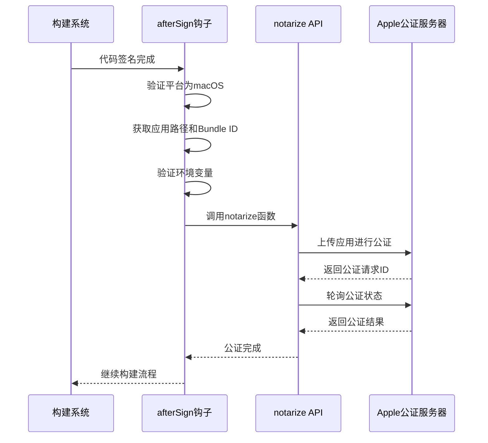
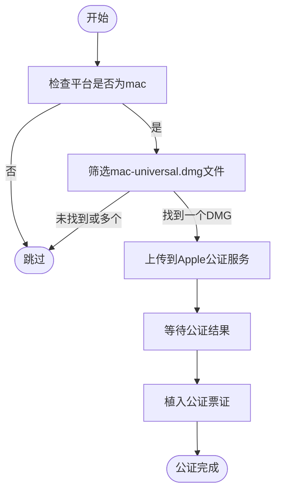

# macOS发布

<cite>
**本文档中引用的文件**  
- [notarize.node.ts](file://ts/scripts/notarize.node.ts)
- [notarize-universal-dmg.node.ts](file://ts/scripts/notarize-universal-dmg.node.ts)
- [artifact-build-completed.node.ts](file://ts/scripts/artifact-build-completed.node.ts)
- [after-sign.node.ts](file://ts/scripts/after-sign.node.ts)
- [after-all-artifact-build.node.ts](file://ts/scripts/after-all-artifact-build.node.ts)
- [sign-macos.node.ts](file://ts/scripts/sign-macos.node.ts)
- [builder-debug.yml](file://release/builder-debug.yml)
</cite>

## 目录
1. [引言](#引言)
2. [macOS发布流程概览](#macos发布流程概览)
3. [公证机制详解](#公证机制详解)
4. [公证API调用流程](#公证api调用流程)
5. [DMG打包与后处理逻辑](#dmg打包与后处理逻辑)
6. [错误处理与重试策略](#错误处理与重试策略)
7. [安全要求与合规性](#安全要求与合规性)
8. [常见问题与解决方案](#常见问题与解决方案)
9. [调试与验证工具](#调试与验证工具)
10. [结论](#结论)

## 引言
Signal-Desktop在macOS平台的发布流程遵循严格的代码签名和公证机制，以确保应用程序的安全性和用户信任。本文档详细说明了从构建到发布的完整流程，重点描述了公证（notarization）机制的实现细节。

## macOS发布流程概览
Signal-Desktop使用Electron框架构建macOS应用程序，发布流程包括代码签名、公证、DMG打包等关键步骤。整个流程通过Electron Builder配置和自定义脚本实现自动化。

**Section sources**
- [builder-debug.yml](file://release/builder-debug.yml)

## 公证机制详解
macOS公证机制是Apple安全体系的重要组成部分，要求所有分发的应用程序必须经过公证才能在Gatekeeper保护下正常运行。Signal-Desktop通过`@electron/notarize`库实现自动化公证流程。

公证流程包括：
- 上传构建产物到Apple服务器
- Apple自动扫描恶意软件
- 返回公证结果
- 植入公证票证（stapling）

## 公证API调用流程
### 公证API实现
`notarize.node.ts`文件实现了核心的公证API调用逻辑。该脚本在代码签名后触发，负责将应用程序上传到Apple的公证服务。



**Diagram sources**
- [notarize.node.ts](file://ts/scripts/notarize.node.ts)
- [after-sign.node.ts](file://ts/scripts/after-sign.node.ts)

**Section sources**
- [notarize.node.ts](file://ts/scripts/notarize.node.ts)
- [after-sign.node.ts](file://ts/scripts/after-sign.node.ts)

### 公证参数配置
公证API调用需要以下关键参数：
- `appBundleId`: 应用程序的Bundle ID，从package.json中读取
- `appPath`: 应用程序的文件路径
- `appleId`: Apple开发者账号
- `appleIdPassword`: Apple开发者账号密码或应用专用密码
- `teamId`: Apple开发者团队ID

这些参数通过环境变量和package.json配置文件提供，确保了敏感信息的安全性。

**Section sources**
- [notarize.node.ts](file://ts/scripts/notarize.node.ts)

## DMG打包与后处理逻辑
### DMG公证流程
`notarize-universal-dmg.node.ts`文件处理通用DMG镜像的公证流程。该脚本在所有构建产物生成后执行，专门针对macOS通用二进制的DMG文件进行公证。



**Diagram sources**
- [notarize-universal-dmg.node.ts](file://ts/scripts/notarize-universal-dmg.node.ts)
- [after-all-artifact-build.node.ts](file://ts/scripts/after-all-artifact-build.node.ts)

**Section sources**
- [notarize-universal-dmg.node.ts](file://ts/scripts/notarize-universal-dmg.node.ts)
- [after-all-artifact-build.node.ts](file://ts/scripts/after-all-artifact-build.node.ts)

### 后处理逻辑
`artifact-build-completed.node.ts`文件实现了macOS相关的后处理逻辑，包括：

1. **ZIP文件优化**：对macOS平台的ZIP构建产物进行优化，提高解压性能
2. **哈希值更新**：重新计算优化后文件的SHA512哈希值
3. **文件大小更新**：更新构建信息中的文件大小

该脚本还为Linux平台的AppImage文件生成blockmap，但macOS相关的处理主要集中在ZIP文件优化上。

**Section sources**
- [artifact-build-completed.node.ts](file://ts/scripts/artifact-build-completed.node.ts)

## 错误处理与重试策略
### 公证失败处理
公证流程中实现了完善的错误处理机制：

- **环境变量验证**：检查必要的Apple开发者凭据是否提供
- **平台验证**：确保只在macOS平台上执行公证
- **输入验证**：验证应用Bundle ID和文件路径的有效性

当关键环境变量缺失时，脚本会发出警告并跳过公证流程，而不是直接失败，这为开发和测试环境提供了灵活性。

### 重试机制
虽然当前代码中没有显式的重试循环，但通过Electron Builder的构建系统特性，可以实现：

1. **构建重试**：整个构建流程可以重新执行
2. **状态轮询**：`@electron/notarize`库内部会轮询公证状态
3. **错误恢复**：网络问题导致的临时失败可以通过重新构建解决

**Section sources**
- [notarize.node.ts](file://ts/scripts/notarize.node.ts)
- [notarize-universal-dmg.node.ts](file://ts/scripts/notarize-universal-dmg.node.ts)

## 安全要求与合规性
### 代码签名要求
Signal-Desktop遵循严格的代码签名实践：

- 使用Apple开发者证书进行代码签名
- 签名过程由外部脚本`sign-macos.node.ts`处理
- 签名脚本路径通过环境变量`SIGN_MACOS_SCRIPT`指定

### App Store合规性
尽管Signal-Desktop可能不通过App Store分发，但仍遵循App Store的安全要求：

- 最低操作系统版本检查
- Gatekeeper兼容性
- 恶意软件防护
- 用户隐私保护

### 用户信任建立
通过以下措施建立用户信任：

- 透明的发布流程
- 严格的代码审查
- 公开的公证状态
- 清晰的安全文档

**Section sources**
- [sign-macos.node.ts](file://ts/scripts/sign-macos.node.ts)

## 常见问题与解决方案
### 公证延迟
**问题**：Apple公证服务可能需要几分钟到几小时才能完成。

**解决方案**：
- 在CI/CD流程中预留足够时间
- 实现状态轮询机制
- 提供进度反馈

### 硬编码路径问题
**问题**：硬编码路径可能导致不同环境下的验证失败。

**解决方案**：
- 使用相对路径
- 通过环境变量配置路径
- 在运行时解析路径

### Gatekeeper警告
**问题**：首次运行时可能出现"无法验证开发者"的警告。

**解决方案**：
- 确保公证流程成功完成
- 正确植入公证票证
- 用户可以通过右键"打开"绕过警告

**Section sources**
- [notarize.node.ts](file://ts/scripts/notarize.node.ts)
- [notarize-universal-dmg.node.ts](file://ts/scripts/notarize-universal-dmg.node.ts)

## 调试与验证工具
### 本地验证
使用以下命令验证公证状态：

```bash
xcrun stapler validate /path/to/Signal.app
xcrun notarytool history --keychain-profile "ac-signing" --asc-provider "XXX" --output-format json
```

### 日志分析
公证流程生成详细的日志输出，包括：
- 公证请求ID
- 上传进度
- 状态检查结果
- 错误信息

### 自动化测试
通过CI/CD管道集成自动化测试，确保每次发布都经过完整的公证流程验证。

## 结论
Signal-Desktop在macOS平台的发布流程体现了对安全性和用户信任的高度重视。通过自动化公证机制、严格的代码签名和完善的错误处理，确保了应用程序的安全分发。建议持续关注Apple的安全要求更新，及时调整发布流程以符合最新的合规性标准。