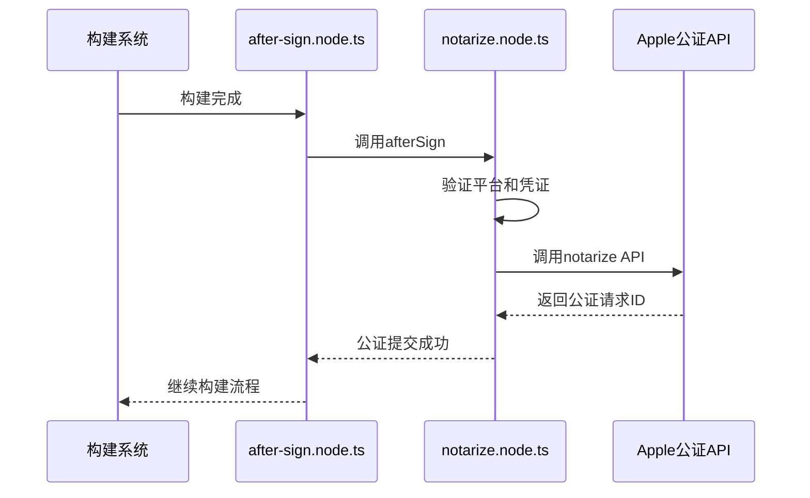
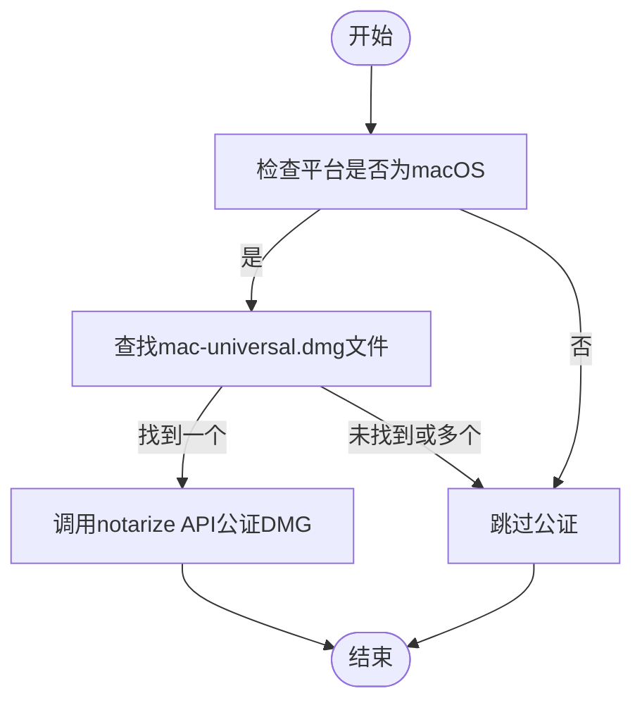
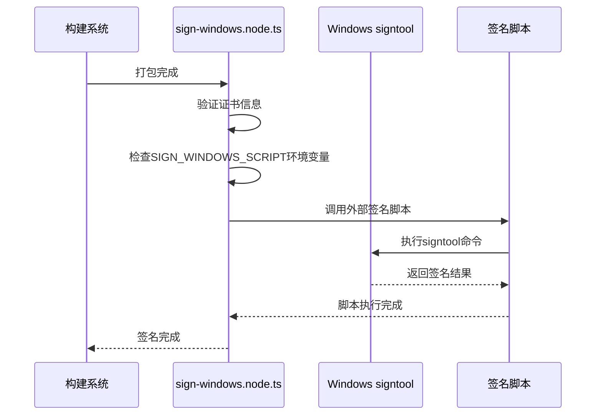

# 平台特定发布

<cite>
**本文档中引用的文件**  
- [package.json](file://package.json)
- [notarize.node.ts](file://ts/scripts/notarize.node.ts)
- [notarize-universal-dmg.node.ts](file://ts/scripts/notarize-universal-dmg.node.ts)
- [after-all-artifact-build.node.ts](file://ts/scripts/after-all-artifact-build.node.ts)
- [after-sign.node.ts](file://ts/scripts/after-sign.node.ts)
- [sign-macos.node.ts](file://ts/scripts/sign-macos.node.ts)
- [sign-windows.node.ts](file://ts/scripts/sign-windows.node.ts)
- [entitlements.mac.inherit.plist](file://build/entitlements.mac.inherit.plist)
- [entitlements.mas.inherit.plist](file://build/entitlements.mas.inherit.plist)
- [builder-debug.yml](file://release/builder-debug.yml)
</cite>

## 目录
1. [引言](#引言)
2. [macOS发布流程](#macos发布流程)
3. [Windows发布流程](#windows发布流程)
4. [平台特定安全与合规要求](#平台特定安全与合规要求)
5. [常见发布问题与解决方案](#常见发布问题与解决方案)
6. [结论](#结论)

## 引言
Signal-Desktop 是一个跨平台的桌面应用程序，其在 macOS 和 Windows 平台上的发布流程涉及特定的安全机制和合规要求。本文件详细说明了这两个平台的发布流程，重点关注 macOS 的公证（notarization）流程和 Windows 的签名与验证步骤。通过分析实际代码库中的实现，本文档提供了对平台特定后处理逻辑、安全考虑和用户信任建立机制的深入理解。

## macOS发布流程

Signal-Desktop 的 macOS 发布流程包括代码签名、公证和加签（stapling）等关键步骤。这些步骤通过 Electron 构建工具链和自定义脚本实现，确保应用程序符合 Apple 的安全要求。

### 公证流程实现
macOS 公证流程在构建完成后自动触发，主要通过 `notarize.node.ts` 和 `notarize-universal-dmg.node.ts` 脚本实现。该流程包括以下关键步骤：

1. **环境验证**：脚本首先检查是否在 macOS 平台上运行，如果不是则跳过公证。
2. **凭证验证**：检查必要的环境变量（`APPLE_USERNAME`、`APPLE_PASSWORD` 和 `APPLE_TEAM_ID`）是否已设置。
3. **应用程序标识**：从 `package.json` 中获取应用程序的 bundle ID。
4. **公证API调用**：使用 `@electron/notarize` 库调用 Apple 的公证服务 API。



**Diagram sources**
- [after-sign.node.ts](file://ts/scripts/after-sign.node.ts#L1-L13)
- [notarize.node.ts](file://ts/scripts/notarize.node.ts#L1-L69)

### 通用DMG公证
对于通用（universal）DMG 安装包，Signal-Desktop 使用专门的 `notarize-universal-dmg.node.ts` 脚本来处理公证。该脚本在所有构建产物生成后执行，专门针对 macOS 平台的通用 DMG 文件进行公证。



**Diagram sources**
- [after-all-artifact-build.node.ts](file://ts/scripts/after-all-artifact-build.node.ts#L1-L13)
- [notarize-universal-dmg.node.ts](file://ts/scripts/notarize-universal-dmg.node.ts#L1-L77)

### 公证状态检查与结果处理
在提交公证请求后，系统会自动监控公证状态。`@electron/notarize` 库负责轮询 Apple 服务器以获取公证结果。如果公证成功，系统会自动执行加签操作，将公证信息嵌入到 DMG 文件中。如果公证失败，构建流程会记录错误并可能中断发布。

**Section sources**
- [notarize.node.ts](file://ts/scripts/notarize.node.ts#L1-L69)
- [notarize-universal-dmg.node.ts](file://ts/scripts/notarize-universal-dmg.node.ts#L1-L77)

## Windows发布流程

Windows 平台的发布流程侧重于代码签名和安装程序验证，确保应用程序在 Windows 安全机制下被信任。

### 代码签名实现
Windows 代码签名通过 `sign-windows.node.ts` 脚本实现。该脚本作为 Electron 构建过程的一部分，在打包后执行签名操作。



**Diagram sources**
- [sign-windows.node.ts](file://ts/scripts/sign-windows.node.ts#L1-L41)

### 安装程序特定要求
Signal-Desktop 使用 NSIS（Nullsoft Scriptable Install System）作为 Windows 安装程序。在 `package.json` 中配置了特定的 NSIS 选项：

- **自定义NSIS二进制文件**：使用 Signal 特定版本的 NSIS 二进制文件，通过 `customNsisBinary` 配置项指定。
- **资源文件**：使用自定义的 NSIS 资源文件，确保安装程序的外观和行为符合 Signal 的品牌要求。
- **差分更新**：启用 `differentialPackage` 选项，支持增量更新，减少更新包的大小。
- **卸载清理**：配置 `deleteAppDataOnUninstall` 选项，允许用户在卸载时选择是否删除应用数据。

**Section sources**
- [package.json](file://package.json#L508-L521)
- [patches/app-builder-lib.patch](file://patches/app-builder-lib.patch#L79-L142)

### 验证步骤
Windows 发布的验证步骤包括：

1. **签名验证**：使用 `signtool verify` 命令验证所有可执行文件和 DLL 的数字签名。
2. **病毒扫描**：在发布前通过多个反病毒引擎扫描安装程序。
3. **兼容性测试**：在不同版本的 Windows 系统上测试安装和运行。
4. **SmartScreen验证**：监控 Microsoft SmartScreen 的报告，确保新版本不会被标记为潜在有害软件。

## 平台特定安全与合规要求

### macOS安全机制
macOS 平台的安全机制通过以下方式实现：

#### 硬化运行时（Hardened Runtime）
在 `package.json` 中启用了 `hardenedRuntime` 选项，这启用了 Apple 的一系列安全保护措施，包括：

- 代码签名验证
- 运行时代码注入防护
- Mach-O API 限制

#### 权限配置（Entitlements）
Signal-Desktop 使用两个权限配置文件：

- `entitlements.mac.plist`：主权限配置文件
- `entitlements.mac.inherit.plist`：继承的权限配置文件

其中，`entitlements.mac.inherit.plist` 包含了 `com.apple.security.cs.allow-jit` 权限，这是 Electron 应用程序正常运行所必需的。

```xml
<?xml version="1.0" encoding="UTF-8"?>
<!DOCTYPE plist PUBLIC "-//Apple//DTD PLIST 1.0//EN" "http://www.apple.com/DTDs/PropertyList-1.0.dtd">
<plist version="1.0">
  <dict>
    <!-- https://github.com/electron/notarize#prerequisites -->
    <key>com.apple.security.cs.allow-jit</key>
    <true/>
  </dict>
</plist>
```

**Section sources**
- [entitlements.mac.inherit.plist](file://build/entitlements.mac.inherit.plist#L1-L13)
- [entitlements.mas.inherit.plist](file://build/entitlements.mas.inherit.plist#L1-L13)
- [package.json](file://package.json#L436-L439)

### Windows安全机制
Windows 平台的安全机制包括：

#### 代码签名
使用 SHA-256 哈希算法进行代码签名，确保证书的现代性和安全性。签名不仅应用于主可执行文件，还应用于所有 DLL 和 Node.js 原生模块（`.node` 文件）。

#### 安装程序安全
NSIS 安装程序经过特殊配置，以符合 Windows 安全最佳实践：

- 清理旧的更新器目录，防止潜在的安全风险
- 使用自定义的 NSIS 资源，确保安装过程的可控性
- 支持静默安装和自定义安装选项

## 常见发布问题与解决方案

### 公证延迟
**问题**：Apple 公证服务可能需要几分钟到几小时才能完成公证过程。

**解决方案**：
- 在 CI/CD 管道中设置合理的超时时间
- 实现重试机制，定期检查公证状态
- 提供详细的日志输出，便于调试

### 平台审核失败
**问题**：公证可能因各种原因失败，如恶意软件检测、不正确的权限配置或代码签名问题。

**解决方案**：
- 仔细检查 `entitlements` 文件中的权限设置
- 确保所有第三方库都来自可信来源
- 使用 `spctl` 命令在本地测试公证状态
- 分析 Apple 提供的公证日志，定位具体问题

### 安装程序兼容性问题
**问题**：NSIS 安装程序可能在某些 Windows 系统上出现兼容性问题。

**解决方案**：
- 在多种 Windows 版本和架构上进行全面测试
- 使用最新的 NSIS 版本，确保兼容性
- 实现详细的错误日志记录，便于用户报告问题
- 提供备用安装方法，如便携版

### 环境变量配置
**问题**：公证和签名脚本依赖于环境变量，配置不当会导致构建失败。

**解决方案**：
- 在文档中明确列出所有必需的环境变量
- 在脚本中添加详细的错误消息，指导用户正确配置
- 使用 CI/CD 系统的密钥管理功能安全存储敏感信息

**Section sources**
- [notarize.node.ts](file://ts/scripts/notarize.node.ts#L31-L55)
- [sign-windows.node.ts](file://ts/scripts/sign-windows.node.ts#L22-L28)
- [sign-macos.node.ts](file://ts/scripts/sign-macos.node.ts#L12-L17)

## 结论
Signal-Desktop 的平台特定发布流程体现了对安全性和用户信任的高度重视。通过精心设计的自动化脚本和严格的合规检查，Signal 确保了其应用程序在 macOS 和 Windows 平台上的安全发布。macOS 的公证流程和 Windows 的代码签名机制共同构成了一个强大的安全框架，保护用户免受恶意软件的侵害。持续监控和改进发布流程，对于维护 Signal 的安全声誉至关重要。