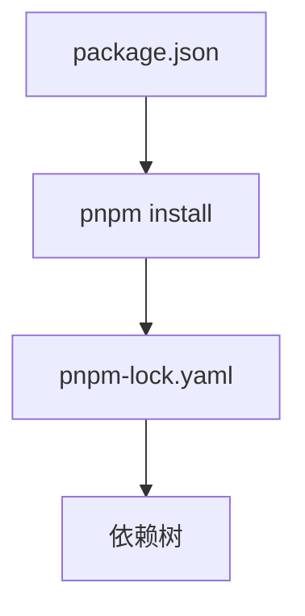
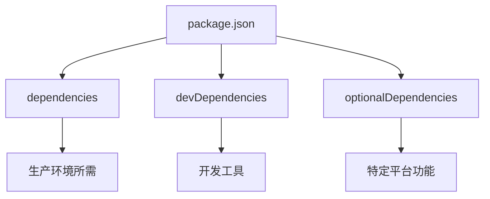
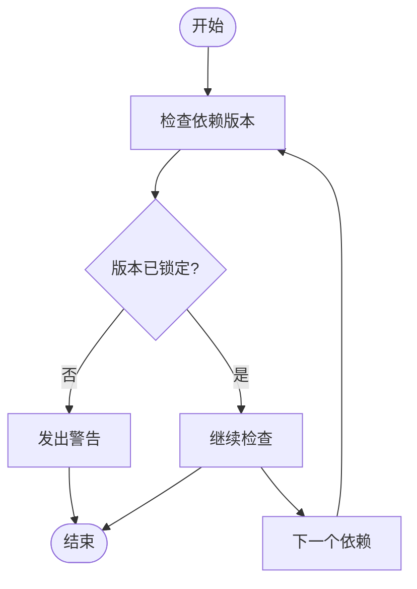
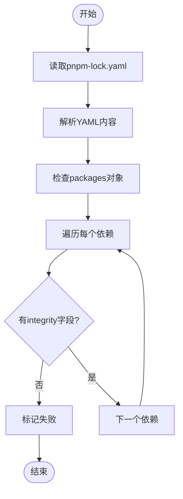
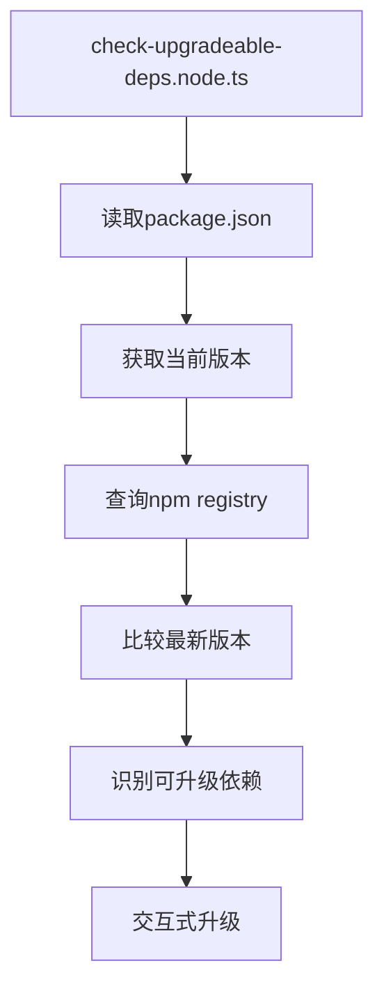

# 依赖管理

<cite>
**本文档中引用的文件**  
- [package.json](file://package.json)
- [pnpm-workspace.yaml](file://pnpm-workspace.yaml)
- [pnpm-lock.yaml](file://pnpm-lock.yaml)
- [danger/rules/packageJsonVersionsShouldBePinned.ts](file://danger/rules/packageJsonVersionsShouldBePinned.ts)
- [danger/rules/pnpmLockDepsShouldHaveIntegrity.ts](file://danger/rules/pnpmLockDepsShouldHaveIntegrity.ts)
- [danger/rules.ts](file://danger/rules.ts)
- [packages/mute-state-change/package.json](file://packages/mute-state-change/package.json)
- [ts/scripts/check-upgradeable-deps.node.ts](file://ts/scripts/check-upgradeable-deps.node.ts)
</cite>

## 目录
1. [简介](#简介)
2. [pnpm工作区配置](#pnpm工作区配置)
3. [依赖锁定机制](#依赖锁定机制)
4. [package.json中的依赖组织](#packagejson中的依赖组织)
5. [依赖完整性检查](#依赖完整性检查)
6. [依赖管理最佳实践](#依赖管理最佳实践)
7. [常见问题与解决方案](#常见问题与解决方案)
8. [结论](#结论)

## 简介

Signal-Desktop项目采用pnpm作为其包管理器，通过精心设计的依赖管理系统确保了版本一致性和构建的可重复性。该项目利用pnpm的工作区功能、依赖锁定机制和完整性检查来维护一个稳定可靠的开发环境。本文档详细说明了Signal-Desktop的依赖管理系统，包括pnpm工作区配置、依赖锁定机制、package.json中依赖项的组织方式、依赖完整性检查机制以及依赖管理的最佳实践。

**Section sources**
- [package.json](file://package.json#L1-L714)
- [pnpm-workspace.yaml](file://pnpm-workspace.yaml#L1-L3)

## pnpm工作区配置

Signal-Desktop项目使用pnpm工作区来管理多个包的依赖关系。在根目录下的`pnpm-workspace.yaml`文件中定义了工作区配置，指定了包含所有工作区包的目录模式。

```mermaid
graph TD
A[pnpm-workspace.yaml] --> B[packages/*]
B --> C[@signalapp/mute-state-change]
```

**Diagram sources**
- [pnpm-workspace.yaml](file://pnpm-workspace.yaml#L1-L3)
- [packages/mute-state-change/package.json](file://packages/mute-state-change/package.json#L1-L42)

工作区配置允许项目中的不同包共享依赖，减少重复安装，并确保版本一致性。例如，`@signalapp/mute-state-change`包位于`packages/mute-state-change`目录下，被声明为工作区的一部分，可以在主项目中通过`workspace:`协议引用。

**Section sources**
- [pnpm-workspace.yaml](file://pnpm-workspace.yaml#L1-L3)
- [packages/mute-state-change/package.json](file://packages/mute-state-change/package.json#L1-L42)

## 依赖锁定机制

Signal-Desktop项目使用`pnpm-lock.yaml`文件来锁定依赖版本，确保每次安装都获得完全相同的依赖树。该文件由pnpm自动生成和维护，记录了每个依赖的确切版本、解析路径和完整性哈希。



**Diagram sources**
- [package.json](file://package.json#L1-L714)
- [pnpm-lock.yaml](file://pnpm-lock.yaml#L1-L800)

`pnpm-lock.yaml`文件中的`importers`部分列出了项目根目录及其依赖，每个依赖都有明确的版本号和完整性校验。这种锁定机制防止了由于依赖版本漂移导致的构建不一致问题，保证了开发、测试和生产环境之间的一致性。

**Section sources**
- [pnpm-lock.yaml](file://pnpm-lock.yaml#L1-L800)
- [package.json](file://package.json#L3-L714)

## package.json中的依赖组织

在`package.json`文件中，依赖项被清晰地划分为生产依赖、开发依赖和可选依赖，便于管理和理解。



**Diagram sources**
- [package.json](file://package.json#L115-L395)

### 生产依赖

生产依赖（`dependencies`）包含了应用程序运行所必需的库，如React、Redux、Electron等。这些依赖在打包和部署时都会包含在内。

### 开发依赖

开发依赖（`devDependencies`）包含了构建、测试和开发过程中使用的工具，如TypeScript、ESLint、Storybook等。这些依赖不会被打包到最终的应用程序中。

### 可选依赖

可选依赖（`optionalDependencies`）用于提供特定平台或环境下的额外功能。Signal-Desktop中只有一个可选依赖`fs-xattr`，用于文件系统扩展属性操作。

**Section sources**
- [package.json](file://package.json#L115-L395)

## 依赖完整性检查

Signal-Desktop项目通过Danger规则对依赖完整性进行严格检查，确保所有依赖都有完整的完整性校验信息。

### 版本锁定检查

`packageJsonVersionsShouldBePinned.ts`规则检查所有package.json文件中的依赖版本是否被锁定到特定版本，而不是使用版本范围。



**Diagram sources**
- [danger/rules/packageJsonVersionsShouldBePinned.ts](file://danger/rules/packageJsonVersionsShouldBePinned.ts#L1-L84)

### 完整性校验检查

`pnpmLockDepsShouldHaveIntegrity.ts`规则验证`pnpm-lock.yaml`文件中每个依赖的解析都有完整性字段，确保依赖下载的完整性和安全性。



**Diagram sources**
- [danger/rules/pnpmLockDepsShouldHaveIntegrity.ts](file://danger/rules/pnpmLockDepsShouldHaveIntegrity.ts#L1-L64)

这些检查在CI/CD流程中自动执行，阻止不符合要求的更改被合并，从而维护了依赖系统的完整性和安全性。

**Section sources**
- [danger/rules/packageJsonVersionsShouldBePinned.ts](file://danger/rules/packageJsonVersionsShouldBePinned.ts#L1-L84)
- [danger/rules/pnpmLockDepsShouldHaveIntegrity.ts](file://danger/rules/pnpmLockDepsShouldHaveIntegrity.ts#L1-L64)
- [danger/rules.ts](file://danger/rules.ts#L1-L32)

## 依赖管理最佳实践

Signal-Desktop项目展示了多种依赖管理的最佳实践，包括版本锁定、依赖树优化和安全漏洞检测。

### 版本锁定

项目强制要求所有依赖版本都必须锁定到具体版本号，避免使用`^`或`~`等版本范围操作符。这通过`packageJsonVersionsShouldBePinned`规则强制执行，确保了依赖版本的确定性。

### 依赖树优化

通过pnpm的硬链接和符号链接机制，Signal-Desktop实现了高效的依赖树优化。pnpm的`node_modules`结构避免了依赖的重复安装，减少了磁盘空间占用，并加快了安装速度。

### 安全漏洞检测

虽然没有直接的代码示例，但项目通过定期更新依赖和使用`check-upgradeable-deps.node.ts`脚本来识别可升级的依赖，间接实现了安全漏洞的预防和修复。



**Diagram sources**
- [ts/scripts/check-upgradeable-deps.node.ts](file://ts/scripts/check-upgradeable-deps.node.ts#L1-L337)

该脚本不仅识别过时的依赖，还提供了交互式界面让用户选择要升级的依赖，并自动执行升级过程，包括运行必要的构建脚本和提交更改。

**Section sources**
- [ts/scripts/check-upgradeable-deps.node.ts](file://ts/scripts/check-upgradeable-deps.node.ts#L1-L337)

## 常见问题与解决方案

在依赖管理过程中，可能会遇到依赖冲突、版本不一致和安全漏洞等问题。Signal-Desktop项目通过一系列机制来解决这些问题。

### 依赖冲突

通过使用pnpm的工作区和精确版本锁定，Signal-Desktop有效避免了依赖冲突。当多个包需要同一依赖的不同版本时，pnpm能够正确解析并安装兼容的版本。

### 版本不一致

`pnpm-lock.yaml`文件确保了所有开发者和CI环境使用完全相同的依赖版本，消除了"在我机器上能运行"的问题。每次依赖变更都会更新锁定文件，保证版本一致性。

### 安全漏洞修复

项目通过定期运行`check-upgradeable-deps.node.ts`脚本来识别和升级存在安全漏洞的依赖。该脚本结合了自动化和人工审核，确保升级过程的安全性和可靠性。

**Section sources**
- [pnpm-lock.yaml](file://pnpm-lock.yaml#L1-L800)
- [ts/scripts/check-upgradeable-deps.node.ts](file://ts/scripts/check-upgradeable-deps.node.ts#L1-L337)

## 结论

Signal-Desktop项目的依赖管理系统是一个精心设计的体系，结合了pnpm工作区、依赖锁定、完整性检查和自动化工具，确保了项目的稳定性和可维护性。通过强制版本锁定、完整性验证和定期依赖更新，项目有效地管理了复杂的依赖关系，预防了常见的依赖问题。这套系统不仅保证了构建的可重复性，还提高了开发效率和安全性，为大型JavaScript项目的依赖管理提供了优秀的实践范例。