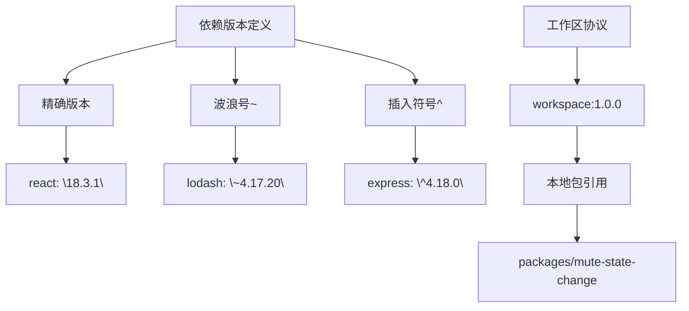
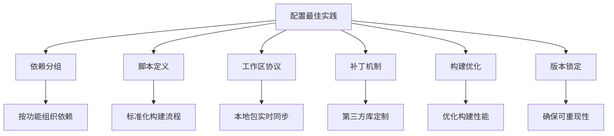

# 依赖配置

<cite>
**本文档中引用的文件**  
- [package.json](file://package.json)
- [pnpm-workspace.yaml](file://pnpm-workspace.yaml)
- [packages/mute-state-change/package.json](file://packages/mute-state-change/package.json)
- [sticker-creator/package.json](file://sticker-creator/package.json)
- [danger/package.json](file://danger/package.json)
</cite>

## 目录
1. [项目结构与工作区配置](#项目结构与工作区配置)
2. [依赖分类与管理策略](#依赖分类与管理策略)
3. [版本范围定义与工作区协议](#版本范围定义与工作区协议)
4. [peerDependencies配置与插件系统](#peerdependencies配置与插件系统)
5. [配置最佳实践](#配置最佳实践)

## 项目结构与工作区配置

Signal-Desktop项目采用pnpm工作区（workspace）模式管理多包项目结构。通过`pnpm-workspace.yaml`文件中的`packages`字段配置子包发现机制，指定`packages/*`路径来包含所有位于`packages`目录下的子包。

项目根目录下的`package.json`文件定义了主应用的配置，同时通过`packageManager`字段明确指定使用`pnpm@10.18.1`作为包管理器。工作区配置允许在多个子包之间共享依赖，避免重复安装，提高构建效率。

`sticker-creator`子包作为独立的前端应用，拥有自己的`package.json`配置，实现了独立的构建和开发流程。这种多包架构支持模块化开发，使不同功能模块可以独立演进。

```mermaid
graph TD
A[项目根目录] --> B[package.json]
A --> C[pnpm-workspace.yaml]
A --> D[packages/*]
D --> E[@signalapp/mute-state-change]
D --> F[sticker-creator]
B --> G[依赖管理]
C --> H[工作区配置]
E --> I[本地原生模块]
F --> J[独立前端应用]
```

**Diagram sources**  
- [pnpm-workspace.yaml](file://pnpm-workspace.yaml#L1-L2)
- [package.json](file://package.json#L3-L4)
- [packages/mute-state-change/package.json](file://packages/mute-state-change/package.json#L1-L4)
- [sticker-creator/package.json](file://sticker-creator/package.json#L1-L4)

**Section sources**  
- [pnpm-workspace.yaml](file://pnpm-workspace.yaml#L1-L3)
- [package.json](file://package.json#L1-L714)

## 依赖分类与管理策略

Signal-Desktop项目将依赖分为生产依赖、开发依赖和可选依赖三类，每类依赖都有明确的使用场景和加载策略。

生产依赖（`dependencies`）包含应用运行所必需的库，如`@signalapp/libsignal-client`、`@signalapp/ringrtc`等核心通信组件。这些依赖在所有环境中都会被安装和加载。

开发依赖（`devDependencies`）包含构建、测试和开发工具，如`typescript`、`eslint`、`storybook`等。这些依赖仅在开发和构建环境中使用，不会包含在生产包中。

可选依赖（`optionalDependencies`）用于处理特定平台或可选功能的依赖，如`fs-xattr`文件系统扩展属性支持。这些依赖在安装时如果失败不会导致整个安装过程失败，提供了更好的跨平台兼容性。

```mermaid
classDiagram
class Dependencies {
+@signalapp/libsignal-client
+@signalapp/ringrtc
+@signalapp/sqlcipher
+react
+react-dom
}
class DevDependencies {
+typescript
+eslint
+storybook
+vitest
+prettier
}
class OptionalDependencies {
+fs-xattr
+growing-file
}
Dependencies --> "生产环境" : 加载
DevDependencies --> "开发环境" : 加载
OptionalDependencies --> "特定平台" : 条件加载
```

**Diagram sources**  
- [package.json](file://package.json#L118-L225)
- [package.json](file://package.json#L227-L373)
- [package.json](file://package.json#L115-L117)

**Section sources**  
- [package.json](file://package.json#L115-L225)

## 版本范围定义与工作区协议

Signal-Desktop项目严格遵循依赖版本锁定策略，所有依赖版本都使用精确版本号而非版本范围。这种做法确保了构建的可重现性和稳定性。

在`package.json`中，依赖版本采用精确版本格式，如`"react": "18.3.1"`。项目通过`danger`规则`packageJsonVersionsShouldBePinned`强制执行此策略，确保所有依赖版本都被锁定。

对于工作区内的本地包，使用`workspace:`协议进行引用。例如，主项目通过`"@signalapp/mute-state-change": "workspace:1.0.0"`引用`packages/mute-state-change`子包。这种工作区协议允许在开发过程中实时同步本地包的更改，无需发布到npm仓库。



**Diagram sources**  
- [package.json](file://package.json#L138)
- [danger/rules/packageJsonVersionsShouldBePinned.ts](file://danger/rules/packageJsonVersionsShouldBePinned.ts#L7-L17)

**Section sources**  
- [package.json](file://package.json#L119-L225)
- [danger/rules/packageJsonVersionsShouldBePinned.ts](file://danger/rules/packageJsonVersionsShouldBePinned.ts#L1-L83)

## peerDependencies配置与插件系统

虽然当前项目中未显式定义`peerDependencies`，但其配置原则在插件系统中具有重要作用。`peerDependencies`用于声明一个包与宿主应用之间的依赖关系，确保插件使用与宿主应用兼容的依赖版本。

在Signal-Desktop的架构中，`@signalapp/mute-state-change`模块作为本地原生插件，通过`bindings`机制与主应用集成。这种设计模式体现了`peerDependencies`的核心思想：插件依赖的库版本应与主应用保持一致，避免版本冲突。

`peerDependencies`的典型使用场景包括：
- UI组件库依赖特定版本的React
- Babel插件依赖特定版本的Babel核心
- Webpack加载器依赖特定版本的Webpack

通过`peerDependencies`，可以确保插件与宿主应用共享同一版本的依赖，减少包体积并避免运行时错误。

```mermaid
graph LR
A[主应用] --> B[React@18.3.1]
A --> C[Redux@5.0.1]
D[插件A] --> E[peerDependencies]
E --> F[React@^18.0.0]
E --> G[Redux@^5.0.0]
D --> H[共享依赖]
H --> B
H --> C
```

**Diagram sources**  
- [packages/mute-state-change/index.mjs](file://packages/mute-state-change/index.mjs#L4-L31)
- [packages/mute-state-change/package.json](file://packages/mute-state-change/package.json#L29-L32)

**Section sources**  
- [packages/mute-state-change/index.mjs](file://packages/mute-state-change/index.mjs#L1-L48)

## 配置最佳实践

Signal-Desktop项目的依赖配置体现了多项最佳实践：

1. **依赖分组**：将相关依赖按功能分组，如UI组件、工具库、构建工具等，便于管理和维护。

2. **脚本定义**：通过`scripts`字段定义标准化的构建、测试和开发流程，如`generate`、`build`、`test`等复合脚本。

3. **工作区协议**：使用`workspace:`协议管理本地包依赖，实现无缝的本地开发和测试。

4. **补丁机制**：通过`patchedDependencies`配置对第三方依赖进行补丁处理，如`fabric`、`protobufjs`等库的定制化修改。

5. **构建优化**：使用`onlyBuiltDependencies`和`ignoredBuiltDependencies`优化构建过程，只构建必要的原生模块。

6. **版本锁定**：通过`pnpm-lock.yaml`和完整性校验确保依赖安装的可重现性。

这些最佳实践共同确保了项目的稳定性、可维护性和开发效率。



**Diagram sources**  
- [package.json](file://package.json#L374-L424)
- [package.json](file://package.json#L17-L114)
- [pnpm-lock.yaml](file://pnpm-lock.yaml#L1-L70)

**Section sources**  
- [package.json](file://package.json#L374-L424)
- [pnpm-lock.yaml](file://pnpm-lock.yaml#L1-L70)
- [danger/package.json](file://danger/package.json#L7-L11)