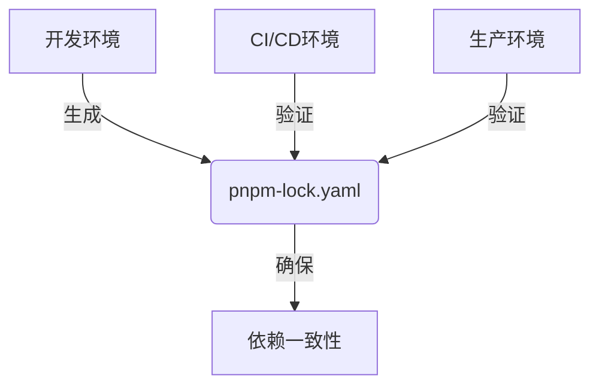
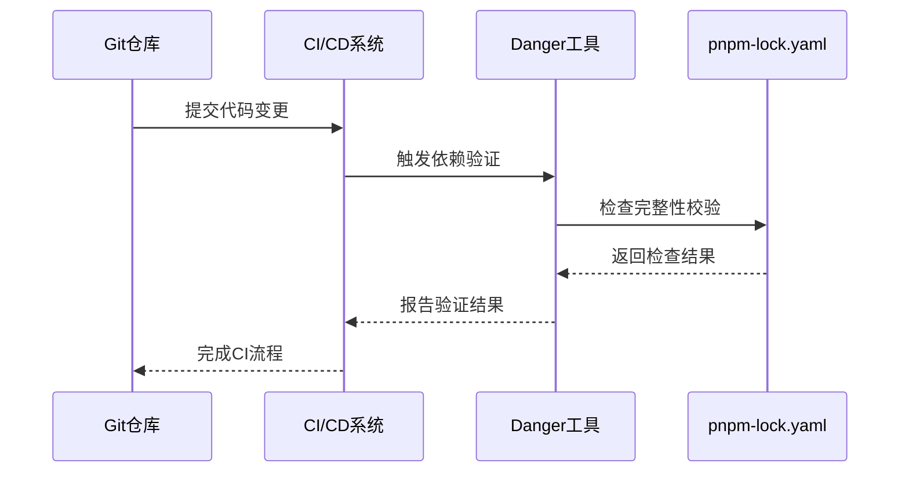
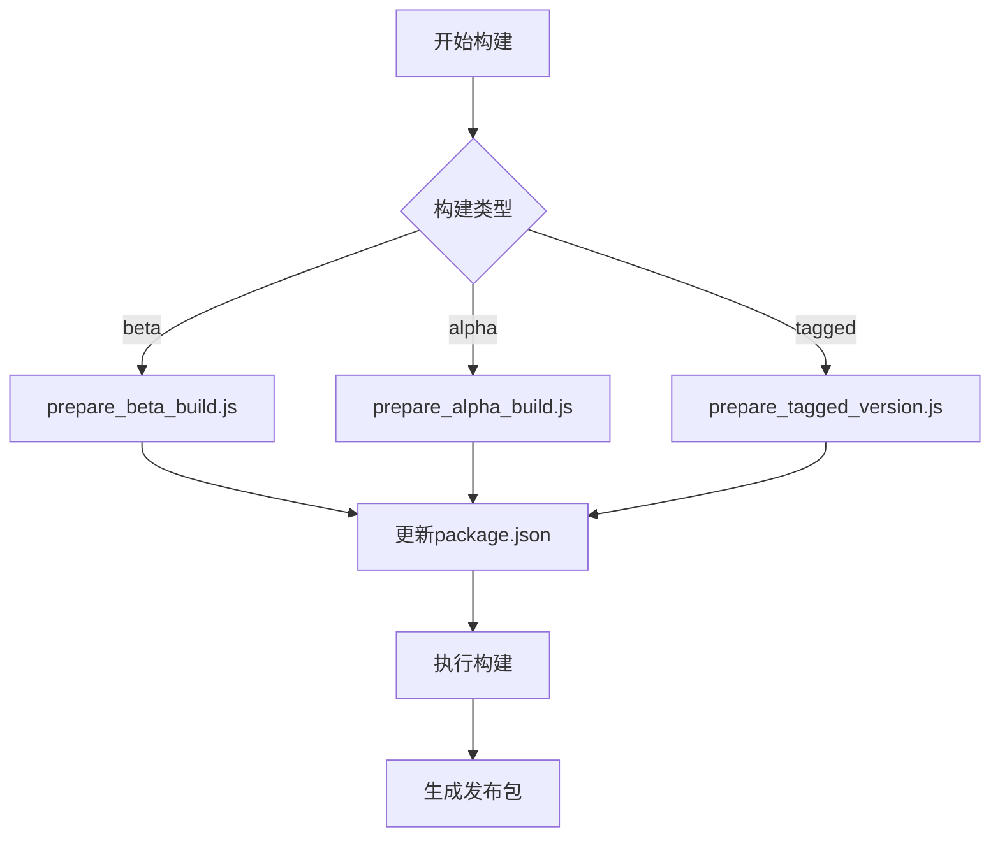

# 依赖锁定

<cite>
**本文档引用的文件**   
- [pnpm-lock.yaml](file://pnpm-lock.yaml)
- [package.json](file://package.json)
- [danger/rules/pnpmLockDepsShouldHaveIntegrity.ts](file://danger/rules/pnpmLockDepsShouldHaveIntegrity.ts)
- [danger/rules.ts](file://danger/rules.ts)
- [scripts/prepare_tagged_version.js](file://scripts/prepare_tagged_version.js)
- [scripts/prepare_beta_build.js](file://scripts/prepare_beta_build.js)
- [scripts/prepare_alpha_build.js](file://scripts/prepare_alpha_build.js)
- [danger/danger.sh](file://danger/danger.sh)
- [pnpm-workspace.yaml](file://pnpm-workspace.yaml)
- [ts/util/version.std.ts](file://ts/util/version.std.ts)
- [reproducible-builds/build.sh](file://reproducible-builds/build.sh)
- [reproducible-builds/docker-entrypoint.sh](file://reproducible-builds/docker-entrypoint.sh)
</cite>

## 目录
1. [引言](#引言)
2. [依赖锁定机制](#依赖锁定机制)
3. [pnpm-lock.yaml文件结构](#pnpm-lockyaml文件结构)
4. [CI/CD流程中的依赖验证](#cicd流程中的依赖验证)
5. [构建脚本与版本发布](#构建脚本与版本发布)
6. [依赖锁定维护策略](#依赖锁定维护策略)
7. [常见问题与解决方案](#常见问题与解决方案)
8. [结论](#结论)

## 引言
Signal-Desktop项目采用pnpm作为包管理器，通过pnpm-lock.yaml文件实现依赖锁定机制。该机制确保了跨环境和跨团队的依赖一致性，防止因依赖版本漂移导致的构建差异。本文档深入分析Signal-Desktop的依赖锁定机制，重点解析pnpm-lock.yaml文件的结构和作用，描述CI/CD流程中依赖锁定的验证机制，并通过实际构建脚本展示依赖锁定与版本发布的协同工作流程。

## 依赖锁定机制
Signal-Desktop项目使用pnpm的依赖锁定机制来确保构建的可重现性和一致性。该机制通过pnpm-lock.yaml文件记录所有依赖包的确切版本和完整性校验信息，确保在不同环境中安装的依赖完全一致。

**Diagram sources**
- [pnpm-lock.yaml](file://pnpm-lock.yaml)

**Section sources**
- [pnpm-lock.yaml](file://pnpm-lock.yaml)
- [package.json](file://package.json)

## pnpm-lock.yaml文件结构
pnpm-lock.yaml文件是Signal-Desktop项目依赖锁定的核心文件，其结构包含多个关键部分：

1. **lockfileVersion**: 锁定文件的版本号，当前为'9.0'
2. **settings**: 配置设置，包括autoInstallPeers和excludeLinksFromLockfile
3. **overrides**: 依赖版本覆盖规则
4. **patchedDependencies**: 补丁依赖项及其哈希值
5. **importers**: 项目导入器，包含dependencies和devDependencies
6. **packages**: 所有依赖包的详细信息，包括版本、解析和完整性校验

该文件通过记录每个依赖包的完整信息，包括版本、解析路径和完整性校验，确保了依赖安装的可重现性。

**Section sources**
- [pnpm-lock.yaml](file://pnpm-lock.yaml)

## CI/CD流程中的依赖验证
Signal-Desktop项目在CI/CD流程中通过Danger工具验证依赖锁定的完整性。该验证机制确保所有依赖项都具有完整性校验字段，防止潜在的安全风险。

**Diagram sources**
- [danger/rules/pnpmLockDepsShouldHaveIntegrity.ts](file://danger/rules/pnpmLockDepsShouldHaveIntegrity.ts)
- [danger/rules.ts](file://danger/rules.ts)

**Section sources**
- [danger/rules/pnpmLockDepsShouldHaveIntegrity.ts](file://danger/rules/pnpmLockDepsShouldHaveIntegrity.ts)
- [danger/rules.ts](file://danger/rules.ts)

## 构建脚本与版本发布
Signal-Desktop项目的构建脚本与版本发布流程紧密集成，通过一系列脚本实现版本管理和构建准备。这些脚本确保在发布前正确更新版本信息和构建配置。

**Diagram sources**
- [scripts/prepare_tagged_version.js](file://scripts/prepare_tagged_version.js)
- [scripts/prepare_beta_build.js](file://scripts/prepare_beta_build.js)
- [scripts/prepare_alpha_build.js](file://scripts/prepare_alpha_build.js)

**Section sources**
- [scripts/prepare_tagged_version.js](file://scripts/prepare_tagged_version.js)
- [scripts/prepare_beta_build.js](file://scripts/prepare_beta_build.js)
- [scripts/prepare_alpha_build.js](file://scripts/prepare_alpha_build.js)
- [ts/util/version.std.ts](file://ts/util/version.std.ts)

## 依赖锁定维护策略
Signal-Desktop项目采用以下策略维护依赖锁定：

1. **定期更新**: 通过自动化脚本定期检查和更新依赖项
2. **安全补丁应用**: 及时应用安全补丁，确保项目安全性
3. **依赖树优化**: 定期优化依赖树，减少不必要的依赖
4. **完整性校验**: 确保所有依赖项都具有完整性校验信息

这些策略确保了项目依赖的稳定性和安全性，同时保持了项目的可维护性。

**Section sources**
- [pnpm-lock.yaml](file://pnpm-lock.yaml)
- [package.json](file://package.json)

## 常见问题与解决方案
在使用依赖锁定机制时，可能会遇到以下常见问题：

1. **合并冲突**: 当多个开发者同时修改依赖时，可能会产生合并冲突。解决方案是使用pnpm的合并工具或手动解决冲突。
2. **性能优化**: 大型项目中依赖锁定文件可能较大，影响性能。解决方案是优化依赖树，减少不必要的依赖。
3. **完整性校验失败**: 依赖包的完整性校验可能失败。解决方案是重新生成锁定文件或检查网络连接。

通过这些解决方案，可以有效应对依赖锁定机制中的常见问题，确保项目的稳定运行。

**Section sources**
- [pnpm-lock.yaml](file://pnpm-lock.yaml)
- [danger/danger.sh](file://danger/danger.sh)

## 结论
Signal-Desktop项目通过pnpm-lock.yaml文件实现了强大的依赖锁定机制，确保了跨环境和跨团队的依赖一致性。该机制通过CI/CD流程中的验证、构建脚本的协同工作以及有效的维护策略，防止了因依赖版本漂移导致的构建差异。通过深入理解这一机制，开发者可以更好地管理和维护项目依赖，确保项目的稳定性和安全性。