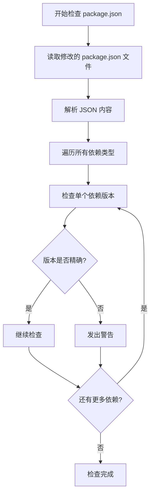
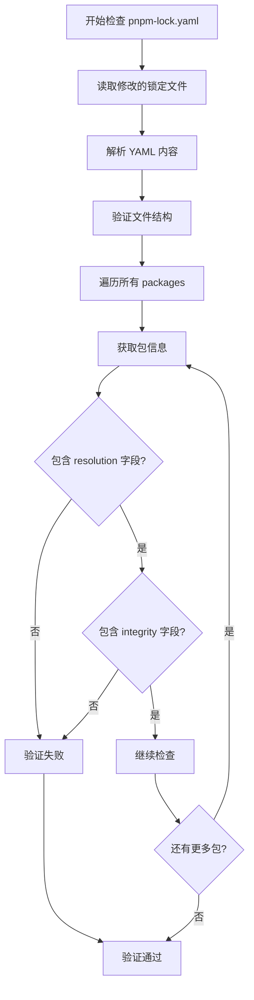
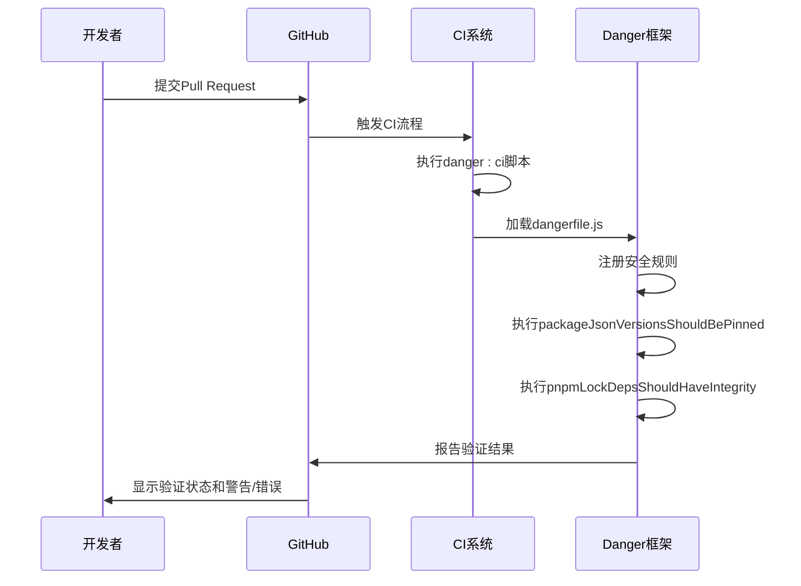

# 安全验证

<cite>
**本文档引用的文件**  
- [packageJsonVersionsShouldBePinned.ts](file://danger/rules/packageJsonVersionsShouldBePinned.ts)
- [pnpmLockDepsShouldHaveIntegrity.ts](file://danger/rules/pnpmLockDepsShouldHaveIntegrity.ts)
- [rules.ts](file://danger/rules.ts)
- [dangerfile.js](file://dangerfile.js)
- [danger.sh](file://danger/danger.sh)
- [package.json](file://package.json)
- [pnpm-lock.yaml](file://pnpm-lock.yaml)
</cite>

## 目录
1. [引言](#引言)
2. [依赖安全验证体系概述](#依赖安全验证体系概述)
3. [精确版本依赖检查机制](#精确版本依赖检查机制)
4. [依赖完整性校验机制](#依赖完整性校验机制)
5. [安全规则执行流程](#安全规则执行流程)
6. [安全验证最佳实践](#安全验证最佳实践)
7. [结论](#结论)

## 引言
Signal-Desktop作为一款注重隐私和安全的通信应用，建立了严格的依赖安全验证体系。该体系通过Danger框架实现，重点关注依赖项的版本精确性和完整性校验，确保软件供应链的安全。本文档将深入分析Signal-Desktop的依赖安全验证机制，重点阐述`packageJsonVersionsShouldBePinned`和`pnpmLockDepsShouldHaveIntegrity`两项核心安全规则的实现原理和执行流程。

## 依赖安全验证体系概述
Signal-Desktop采用基于Danger框架的自动化安全验证体系，该体系在Pull Request审查阶段自动执行，确保所有依赖变更符合安全规范。整个验证体系由多个组件协同工作：`dangerfile.js`作为入口点，`rules.ts`注册具体的安全规则，`danger.sh`提供执行脚本，而具体的验证逻辑则由独立的规则文件实现。

该体系的核心目标是防止依赖项的意外升级和篡改，通过强制要求精确版本依赖和验证锁定文件中的完整性哈希值，确保每次构建的可重现性和安全性。这种预防性安全措施有效降低了供应链攻击的风险，保证了Signal-Desktop的代码质量和用户安全。

**Section sources**
- [dangerfile.js](file://dangerfile.js#L1-L9)
- [rules.ts](file://danger/rules.ts#L1-L32)
- [danger.sh](file://danger/danger.sh#L1-L15)

## 精确版本依赖检查机制

### 规则实现原理
`packageJsonVersionsShouldBePinned`规则强制要求所有`package.json`文件中的依赖版本必须精确指定，防止使用版本范围（如^或~）导致的意外升级。该规则通过`isPinnedVersion`函数判断版本规范是否为精确版本。

**Diagram sources**
- [packageJsonVersionsShouldBePinned.ts](file://danger/rules/packageJsonVersionsShouldBePinned.ts#L7-L18)

### 版本精确性判断逻辑
规则通过以下逻辑判断版本是否精确：

1. 对于以`https:`开头的URL依赖，检查是否包含`#`符号（指向特定提交）
2. 对于以`workspace:`开头的工作区依赖，提取版本部分进行验证
3. 使用`semver.valid()`函数验证版本字符串是否为有效的精确版本

这种多层次的判断逻辑确保了各种依赖来源（npm包、GitHub仓库、本地工作区）都能被正确验证，防止任何可能的版本漂移。

**Section sources**
- [packageJsonVersionsShouldBePinned.ts](file://danger/rules/packageJsonVersionsShouldBePinned.ts#L7-L18)

## 依赖完整性校验机制

### 完整性哈希验证
`pnpmLockDepsShouldHaveIntegrity`规则确保`pnpm-lock.yaml`文件中每个依赖包都包含完整性哈希值（integrity field）。该哈希值用于验证下载的包是否与锁定文件中指定的版本完全一致，防止中间人攻击或包仓库被篡改。

**Diagram sources**
- [pnpmLockDepsShouldHaveIntegrity.ts](file://danger/rules/pnpmLockDepsShouldHaveIntegrity.ts#L23-L63)

### 验证流程分析
规则的验证流程包括：

1. 解析`pnpm-lock.yaml`文件为JavaScript对象
2. 验证文件结构是否包含`packages`字段且为对象类型
3. 遍历`packages`对象中的每个依赖包
4. 验证每个包的`resolution`字段是否存在且为对象
5. 检查`resolution`对象是否包含`integrity`字段

如果任何包缺少完整性哈希值，规则将使用`context.fail()`方法使验证失败，阻止PR合并，直到问题被修复。

**Section sources**
- [pnpmLockDepsShouldHaveIntegrity.ts](file://danger/rules/pnpmLockDepsShouldHaveIntegrity.ts#L23-L63)

## 安全规则执行流程

### PR审查集成
安全验证规则在Pull Request审查流程中自动执行，通过`package.json`中定义的脚本触发：

**Diagram sources**
- [dangerfile.js](file://dangerfile.js#L1-L9)
- [package.json](file://package.json#L64-L65)

### 失败处理策略
当安全规则验证失败时，系统采用严格的处理策略：

- `packageJsonVersionsShouldBePinned`：发现非精确版本依赖时发出警告（`context.warn`），提醒开发者修正
- `pnpmLockDepsShouldHaveIntegrity`：发现缺少完整性哈希的依赖时直接失败（`context.fail`），阻止PR合并

这种分级的失败处理策略既保证了关键安全要求的强制执行，又为非关键问题提供了改进机会。开发者必须修正所有失败的验证才能合并代码，确保了代码库的安全性。

**Section sources**
- [packageJsonVersionsShouldBePinned.ts](file://danger/rules/packageJsonVersionsShouldBePinned.ts#L64-L77)
- [pnpmLockDepsShouldHaveIntegrity.ts](file://danger/rules/pnpmLockDepsShouldHaveIntegrity.ts#L57-L58)

## 安全验证最佳实践

### 依赖审计与监控
基于Signal-Desktop的安全验证体系，推荐以下最佳实践：

1. **定期审计依赖**：定期审查项目依赖，移除不再使用的包，减少攻击面
2. **监控已知漏洞**：使用工具监控依赖中的已知安全漏洞，及时更新受影响的包
3. **建立应急响应流程**：制定依赖安全事件的应急响应计划，包括漏洞披露、修复和通知流程

### 自动化安全验证
1. **集成到CI/CD**：将依赖安全验证集成到持续集成流程中，确保每次代码变更都经过安全检查
2. **多层验证**：实施多层次的验证策略，包括版本精确性、完整性校验、许可证合规性等
3. **自动化修复**：对于可自动修复的问题（如生成缺失的完整性哈希），提供自动化修复工具

这些最佳实践有助于建立健壮的依赖安全管理机制，确保软件供应链的安全性和可靠性。

## 结论
Signal-Desktop的依赖安全验证体系通过`packageJsonVersionsShouldBePinned`和`pnpmLockDepsShouldHaveIntegrity`两项核心规则，有效保障了依赖项的精确性和完整性。该体系在Pull Request审查阶段自动执行，采用严格的失败处理策略，确保了代码库的安全性。通过精确版本依赖检查防止意外升级，通过完整性哈希验证防止依赖篡改，这种预防性安全措施为Signal-Desktop的安全性提供了坚实保障。建议其他项目借鉴这一安全验证体系，建立完善的依赖安全管理机制。