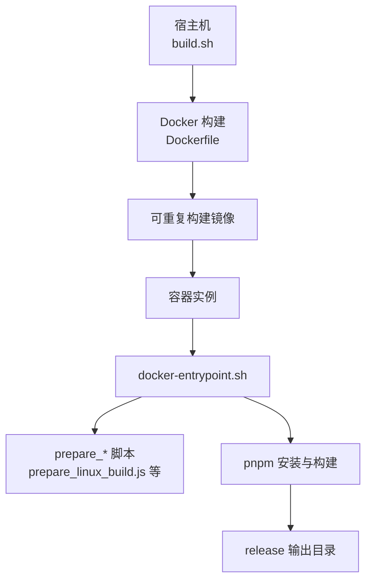
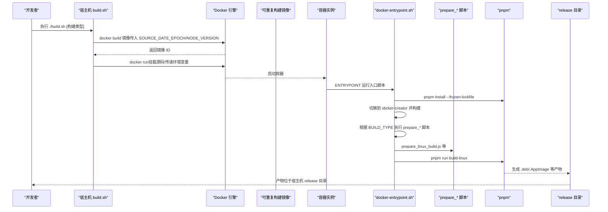
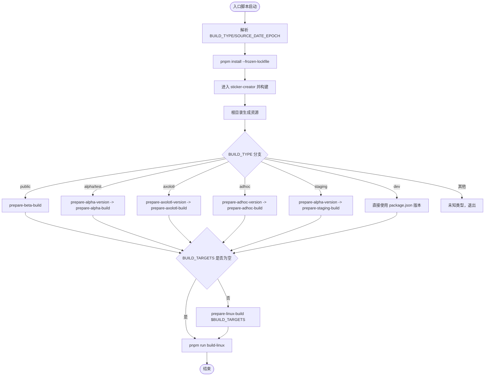
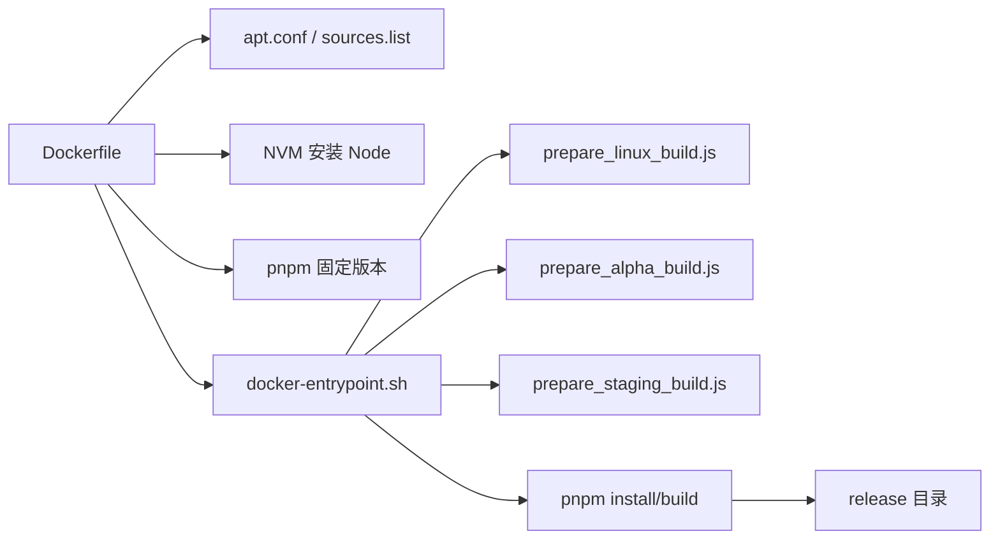

# Docker配置

<cite>
**本文引用的文件**
- [Dockerfile](file://reproducible-builds/Dockerfile)
- [docker-entrypoint.sh](file://reproducible-builds/docker-entrypoint.sh)
- [build.sh](file://reproducible-builds/build.sh)
- [README.md](file://reproducible-builds/README.md)
- [apt.conf](file://reproducible-builds/docker/apt.conf)
- [sources.list](file://reproducible-builds/docker/sources.list)
- [package.json](file://package.json)
- [prepare_linux_build.js](file://scripts/prepare_linux_build.js)
- [prepare_alpha_build.js](file://scripts/prepare_alpha_build.js)
- [prepare_staging_build.js](file://scripts/prepare_staging_build.js)
</cite>

## 目录
1. [简介](#简介)
2. [项目结构](#项目结构)
3. [核心组件](#核心组件)
4. [架构总览](#架构总览)
5. [详细组件分析](#详细组件分析)
6. [依赖关系分析](#依赖关系分析)
7. [性能考量](#性能考量)
8. [故障排查指南](#故障排查指南)
9. [结论](#结论)
10. [附录](#附录)

## 简介
本文件聚焦Signal-Desktop可重复构建系统中的Docker配置，系统性解析Dockerfile各层指令、docker-entrypoint.sh的执行逻辑、以及构建脚本如何在容器中完成一致性的Linux包构建。文档还提供安全加固建议（最小权限运行、网络隔离、文件系统保护）与镜像优化策略（减小体积、提升构建速度），并给出跨平台兼容性实践路径。

## 项目结构
reproducible-builds目录提供了完整的可重复构建环境：
- Dockerfile：定义容器基础镜像、环境变量、依赖安装与构建工具链
- docker-entrypoint.sh：容器入口脚本，负责根据构建类型执行相应准备与打包流程
- build.sh：宿主机侧构建脚本，负责镜像构建与容器运行参数传递
- docker/：包含APT配置与固定快照源，确保依赖来源可重现
- README.md：使用说明与验证流程

图表来源
- [Dockerfile](file://reproducible-builds/Dockerfile#L1-L71)
- [docker-entrypoint.sh](file://reproducible-builds/docker-entrypoint.sh#L1-L74)
- [build.sh](file://reproducible-builds/build.sh#L1-L58)
- [prepare_linux_build.js](file://scripts/prepare_linux_build.js#L1-L31)
- [prepare_alpha_build.js](file://scripts/prepare_alpha_build.js#L1-L82)

章节来源
- [Dockerfile](file://reproducible-builds/Dockerfile#L1-L71)
- [docker-entrypoint.sh](file://reproducible-builds/docker-entrypoint.sh#L1-L74)
- [build.sh](file://reproducible-builds/build.sh#L1-L58)
- [README.md](file://reproducible-builds/README.md#L1-L115)

## 核心组件
- 可重现基础镜像与APT固定源：通过固定Ubuntu版本与快照源，确保依赖来源稳定
- 环境变量与时间戳控制：SOURCE_DATE_EPOCH统一构建时间，保证包内时间戳可重现
- Node与包管理器：NVM安装指定Node版本，pnpm固定版本，配合frozen-lockfile确保依赖锁定
- 入口脚本：按构建类型分支执行准备脚本与最终打包命令
- 容器运行参数：挂载源码、传递环境变量、以当前用户运行，避免权限问题

章节来源
- [Dockerfile](file://reproducible-builds/Dockerfile#L1-L71)
- [docker-entrypoint.sh](file://reproducible-builds/docker-entrypoint.sh#L1-L74)
- [build.sh](file://reproducible-builds/build.sh#L1-L58)

## 架构总览
下图展示了从宿主机到容器再到构建产物的整体流程。

图表来源
- [build.sh](file://reproducible-builds/build.sh#L1-L58)
- [Dockerfile](file://reproducible-builds/Dockerfile#L1-L71)
- [docker-entrypoint.sh](file://reproducible-builds/docker-entrypoint.sh#L1-L74)
- [prepare_linux_build.js](file://scripts/prepare_linux_build.js#L1-L31)
- [prepare_alpha_build.js](file://scripts/prepare_alpha_build.js#L1-L82)

## 详细组件分析

### Dockerfile 层级解析
- 基础镜像与固定快照源
  - 使用带特定镜像摘要的基础镜像，确保镜像层完全可重现
  - 复制docker/apt.conf与docker/sources.list，启用快照源与禁用语言包等，减少无关内容
- 环境变量与时间戳控制
  - 设置SOURCE_DATE_EPOCH为固定值，使打包工具的时间戳可重现
  - 通过ARG接收外部传入的NODE_VERSION，结合NVM安装指定Node版本
  - 设置SIGNAL_ENV=production，影响后续构建脚本行为
- 依赖安装与构建工具链
  - 安装git、curl、g++/gcc、make、python3、tar、xz-utils等编译依赖
  - 临时关闭证书校验以安装ca-certificates，再恢复校验，确保后续包管理器可用
- Node与包管理器
  - 使用NVM安装指定Node版本，并将Node二进制加入PATH
  - 全局安装固定版本的pnpm，确保包管理器一致性
  - 配置git全局safe.directory，避免容器内git报错
- 入口与缓存
  - 复制并赋予入口脚本执行权限
  - 创建并开放/.cache目录权限，避免权限问题导致的不可重现
  - 设置ENTRYPOINT与默认CMD（构建类型）

章节来源
- [Dockerfile](file://reproducible-builds/Dockerfile#L1-L71)
- [apt.conf](file://reproducible-builds/docker/apt.conf#L1-L6)
- [sources.list](file://reproducible-builds/docker/sources.list#L1-L3)

### docker-entrypoint.sh 执行逻辑
- 参数与环境
  - 支持通过命令行参数或环境变量传递BUILD_TYPE；默认dev
  - 读取SOURCE_DATE_EPOCH并打印，便于调试
- 依赖与预处理
  - 在容器内执行pnpm install --frozen-lockfile，确保依赖完全锁定
  - 清理与生成阶段：清理转译、进入sticker-creator子项目安装并构建，回到根目录生成资源
- 构建类型分支
  - public：执行prepare-beta-build
  - alpha/test：先prepare-alpha-version，再prepare-alpha-build
  - axolotl：先prepare-axolotl-version，再prepare-axolotl-build
  - adhoc：先prepare-adhoc-version，再prepare-adhoc-build
  - staging：先prepare-alpha-version，再prepare-staging-build
  - dev：直接使用package.json版本，不修改名称
  - 其他：未知类型则退出
- 目标覆盖
  - 若BUILD_TARGETS非空，则执行prepare-linux-build并传入目标列表（如deb、appimage）
- 最终打包
  - 执行build-linux，生成Linux包

图表来源
- [docker-entrypoint.sh](file://reproducible-builds/docker-entrypoint.sh#L1-L74)
- [prepare_linux_build.js](file://scripts/prepare_linux_build.js#L1-L31)
- [prepare_alpha_build.js](file://scripts/prepare_alpha_build.js#L1-L82)
- [prepare_staging_build.js](file://scripts/prepare_staging_build.js#L69-L94)

章节来源
- [docker-entrypoint.sh](file://reproducible-builds/docker-entrypoint.sh#L1-L74)

### build.sh 宿主机构建脚本
- 镜像构建
  - 默认调用docker build创建镜像，传入SOURCE_DATE_EPOCH=1与从.nvmrc读取的NODE_VERSION
  - 支持SKIP_DOCKER_BUILD跳过镜像构建以利用缓存
- 时间戳准备
  - 优先使用环境变量SOURCE_DATE_EPOCH；否则回退到最近一次git提交时间戳
- 容器运行
  - 挂载当前工作目录至/project，设置工作目录为/project
  - 以当前宿主用户运行，避免文件权限问题
  - 传递NPM_CONFIG_CACHE、PNPM_HOME、SOURCE_DATE_EPOCH、BUILD_TARGETS等环境变量
  - 将构建类型作为参数传给容器入口脚本

章节来源
- [build.sh](file://reproducible-builds/build.sh#L1-L58)

### prepare_* 脚本与构建目标
- prepare_linux_build.js
  - 校验并设置Linux目标列表（deb、appimage），写回package.json
- prepare_alpha_build.js
  - 将生产版配置切换为alpha版（名称、产品名、appId、桌面文件名、可执行名等），并写回package.json
- prepare_staging_build.js
  - 类似alpha，但针对staging通道进行版本与元数据替换，并更新生产配置

章节来源
- [prepare_linux_build.js](file://scripts/prepare_linux_build.js#L1-L31)
- [prepare_alpha_build.js](file://scripts/prepare_alpha_build.js#L1-L82)
- [prepare_staging_build.js](file://scripts/prepare_staging_build.js#L69-L94)

## 依赖关系分析
- 镜像构建依赖
  - 固定基础镜像摘要与快照源，确保APT仓库可重现
  - NVM安装指定Node版本，pnpm固定版本，配合package.json中的packageManager字段
- 运行时依赖
  - pnpm --frozen-lockfile确保锁文件完整性
  - git配置safe.directory避免容器内git报错
- 构建目标依赖
  - prepare_linux_build.js根据BUILD_TARGETS动态设置electron-builder目标
  - 不同构建类型对应不同的prepare_*脚本，最终统一走build-linux

图表来源
- [Dockerfile](file://reproducible-builds/Dockerfile#L1-L71)
- [apt.conf](file://reproducible-builds/docker/apt.conf#L1-L6)
- [sources.list](file://reproducible-builds/docker/sources.list#L1-L3)
- [docker-entrypoint.sh](file://reproducible-builds/docker-entrypoint.sh#L1-L74)
- [prepare_linux_build.js](file://scripts/prepare_linux_build.js#L1-L31)
- [prepare_alpha_build.js](file://scripts/prepare_alpha_build.js#L1-L82)
- [prepare_staging_build.js](file://scripts/prepare_staging_build.js#L69-L94)

章节来源
- [Dockerfile](file://reproducible-builds/Dockerfile#L1-L71)
- [docker-entrypoint.sh](file://reproducible-builds/docker-entrypoint.sh#L1-L74)
- [prepare_linux_build.js](file://scripts/prepare_linux_build.js#L1-L31)

## 性能考量
- 镜像体积优化
  - 使用快照源与禁用语言包、推荐安装等，减少APT包体积
  - 固定Node与pnpm版本，避免重复下载与安装
  - 仅复制必要文件（docker-entrypoint.sh、APT配置），减少层大小
- 构建速度优化
  - 使用--frozen-lockfile避免网络查询与依赖变更
  - 在宿主机使用SKIP_DOCKER_BUILD跳过镜像重建，充分利用缓存
  - 通过BUILD_TARGETS只构建所需目标（如仅deb），缩短构建时间
- 可重现性与缓存平衡
  - 固定SOURCE_DATE_EPOCH与快照源，确保结果一致
  - 保持NPM_CONFIG_CACHE/PNPM_HOME在/tmp，避免宿主权限问题

章节来源
- [Dockerfile](file://reproducible-builds/Dockerfile#L1-L71)
- [build.sh](file://reproducible-builds/build.sh#L1-L58)
- [apt.conf](file://reproducible-builds/docker/apt.conf#L1-L6)
- [sources.list](file://reproducible-builds/docker/sources.list#L1-L3)

## 故障排查指南
- 依赖安装失败（APT证书校验）
  - 症状：安装ca-certificates时报SSL错误
  - 解决：Dockerfile中已临时关闭校验以安装证书，随后恢复校验；若仍失败，请检查网络代理与防火墙
- 权限问题（宿主机与容器）
  - 症状：release目录或缓存目录写入失败
  - 解决：build.sh以当前用户运行容器；Dockerfile中对/.cache开放权限；将NPM_CONFIG_CACHE/PNPM_HOME指向/tmp
- 锁文件不一致
  - 症状：pnpm install失败或依赖版本不匹配
  - 解决：确保使用--frozen-lockfile；核对.pnpm-lock.yaml与package.json版本
- 构建目标无效
  - 症状：prepare_linux_build.js报错“无效目标”
  - 解决：BUILD_TARGETS仅允许deb、appimage；多个目标以逗号分隔
- 构建类型未知
  - 症状：docker-entrypoint.sh输出未知类型并退出
  - 解决：确认传入的构建类型为dev/public/alpha/test/axolotl/adhoc/staging之一

章节来源
- [Dockerfile](file://reproducible-builds/Dockerfile#L1-L71)
- [build.sh](file://reproducible-builds/build.sh#L1-L58)
- [docker-entrypoint.sh](file://reproducible-builds/docker-entrypoint.sh#L1-L74)
- [prepare_linux_build.js](file://scripts/prepare_linux_build.js#L1-L31)

## 结论
该Docker配置通过固定基础镜像、快照源、Node与pnpm版本，以及严格的SOURCE_DATE_EPOCH控制，实现了Linux包的可重复构建。入口脚本按构建类型自动选择准备脚本与目标，配合宿主机脚本的缓存与参数传递，既保证了可重现性，也兼顾了构建效率。建议在CI中启用SKIP_DOCKER_BUILD以复用缓存，并在生产环境中严格限制容器能力与网络访问，进一步强化安全性。

## 附录

### 安全配置建议
- 最小权限运行
  - 使用宿主机当前UID/GID运行容器，避免写入宿主机文件时产生root权限问题
  - 仅授予容器运行所需的最低权限（如无需sudo）
- 网络隔离
  - 在CI中使用受限网络策略，禁止容器访问外部网络（除必要的包管理器）
  - 对于需要网络的步骤，尽量使用离线镜像与本地缓存
- 文件系统保护
  - 仅挂载必要目录（源码目录）至容器，避免暴露宿主机敏感路径
  - 使用只读根文件系统（如可行），并将release输出目录映射到受控位置
- 供应链安全
  - 固定所有依赖版本（基础镜像、Node、pnpm、系统包）
  - 使用快照源与apt.conf禁用不必要组件，降低攻击面

章节来源
- [build.sh](file://reproducible-builds/build.sh#L1-L58)
- [Dockerfile](file://reproducible-builds/Dockerfile#L1-L71)
- [apt.conf](file://reproducible-builds/docker/apt.conf#L1-L6)

### 跨平台兼容性实践
- Linux包构建
  - 使用prepare_linux_build.js设置目标（deb、appimage），满足不同发行版需求
  - 在容器内完成打包，避免宿主机差异导致的不可重现
- 版本与命名策略
  - 不同构建类型（public/alpha/staging/dev）通过prepare_*脚本调整名称与版本后缀，确保产物可区分且符合渠道规范
- 验证流程
  - README.md提供了官方包下载与SHA-256比对方法，建议在相同版本与相同构建类型下进行对比

章节来源
- [prepare_linux_build.js](file://scripts/prepare_linux_build.js#L1-L31)
- [prepare_alpha_build.js](file://scripts/prepare_alpha_build.js#L1-L82)
- [prepare_staging_build.js](file://scripts/prepare_staging_build.js#L69-L94)
- [README.md](file://reproducible-builds/README.md#L1-L115)